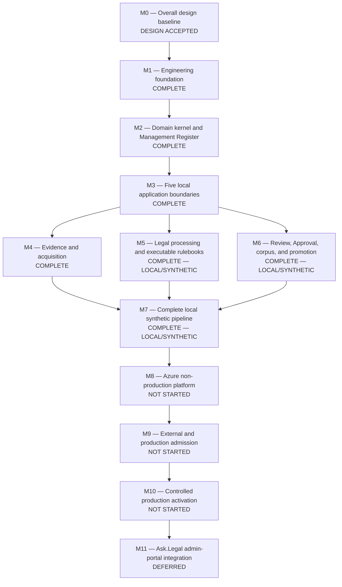

# AskLegal Legal Database Pipeline — Delivery Roadmap

Updated: 2026-09-08

## 2026-09-02 two-family V1 acceleration — APPROVED / IN PROGRESS

The user superseded the former three-family V1 scope. V1 now requires only all
three accepted Hong Kong Legislation release scopes and post-1-July-1997
binding-court Case propositions. Azure models, embeddings, Pinecone, retained
local human Approval, promotion, rollback, and continuous local operation stay
in scope. HKEX Regulatory Materials is preserved as post-V1 work and cannot
block or enter the current proposal or target.

Tasks 1–4 are complete locally. Task 5's two terminal breaker findings were
fixed and independently accepted during Task 6. Task 6 reached its five-round
breaker after implementing typed current-list/RSS discovery, durable
relationship accounting, immutable judgment bundles, strict complete-manifest
admission, the corrected Cases register/package, canonical cutoff validation,
and exact redirect provenance. Its last controller gate passes 1,191 tests and
all static/composition gates.

The three carried Task 6 findings and one Phase A global-runner-result
regression are independently accepted. Missing dates fail closed, the complete
deterministic retained prefix makes page364 the first new request, provisional
work is immediate but not admitted before reconciliation, and global or
unattributed runner stops remain fail-visible.

Task 7 Fix Round 3 is independently accepted (`C0/I0`), specification-
compliant, and quality-approved.
Prepared batches now bind both an embedded canonical-body fingerprint and raw
storage digest, and their exact ordered evidence refs must equal the admitted
acquisition refs. Reporting preserves the authoritative Cases producer's
unsorted judgment-bundle order and duplicate/order semantics for discrepancies.
Shared hash-only semantic receipt minting fails closed; legal processing and
promotion issue MODEL/EMBEDDING evidence only from their own live loader-issued
profile authority. The freezer still rereads authoritative heads, requires one
Cases plus three Legislation scopes, excludes HKEX and Principles, and invokes
no provider.

Task 8 is independently accepted after Round 5 at `C0/I0/M0`. Its fresh exact
gate passed `386` tests; adversarial checks proved exact token and backup-
request drift reaches neither provider nor backup writers, and a two-process
Approval race retains exactly one winner. Task 9 is independently accepted and
Task 10 is active.
The repaired
proposal-to-target composition admits only Cases and Legislation desired
records and rejects current HKEX while preserving historical exclusion
vocabulary. Loader-issued immutable profiles govern the exact Azure semantic,
embedding, and single Pinecone replacement-target composition; tokenizer and
budget checks precede Approval, provider usage must equal the exact count,
target/read-back/query and independent backup verification remain mandatory,
and deletion stays separately unauthorized. The local Review surface shows all
four scope dispositions, limitations, zero retryables, model/retrieval
evaluations, profile identities, target, backups, rollback, and proposal
fingerprint; drift invalidates it and Approval remains named and single-use.
Fix Round 3 replaces the synthetic default Review base with an explicit
canonical local package and a promotion-owned reader for the same retained
Approval. Approval-time bytes survive restart, valid artifact drift and missing
old-ledger bytes fail closed, and failed persistence cannot become an in-memory
replay. Exact manifest-action equality plus effect-time consumption gates guard
the real Azure/Pinecone adapters; a concrete canonical retained-intent reader
and application backup composition remove the remaining test-double-only
ports. The executable fixture itself now contains the four Hong Kong scopes,
the exact Case/Legislation member scopes, and two explicit zero-record scopes.
Task 8 (`386`), Task 7 (`400`), architecture (`50`), and its static/boundary
gates are green. Task 9 is independently accepted at `C0/I0/M0`; its final
composed affected gate passed `635` tests and its scoped static, renderer, and
boundary gates are green. The fresh complete-repository run remains deferred to
the Task 10 final acceptance boundary under the resumable-verification policy.

The approved source-acquisition correction replaces repeated serial family
restarts with a durable hash-chained journal, stable work IDs, exact reuse of
verified HKeL and Judiciary evidence, and at most four concurrent read-only
requests per official host. Retryable item failures retain progress and remain
visible; only complete or proved no-change cycles advance.

The written design is
`docs/superpowers/specs/2026-09-02-two-family-resumable-acquisition-design.md`.
The implementation plan is
`docs/superpowers/plans/2026-09-02-two-family-resumable-v1.md`. Its dependency
order is: two-family scope reconciliation; shared journal/worker/import;
Legislation; Cases; two-family processing/proposal; Azure/model/embedding/
Pinecone/Approval; continuous operation and acceptance. Existing Plan 5 HKEX
work and dormant Authority 808 are not resumed.

Task 3 reached the ordinary five-round review limit with two Important pacing
findings. On 2026-09-03 the user explicitly authorized one additional bounded
RED-to-GREEN repair and independent rereview for those two findings only. Tasks
4–10 remain gated until Task 3 is accepted.

That extra round fixed the two authorized findings but terminal rereview found
two further Important defects entirely within compact pre-schema journal
migration. Task 3 is stopped and Tasks 4–10 remain gated. The recommended
plan-level correction is to remove unused compact-journal migration support and
accept only the modern journal schema; Task 4 continues to import the actually
retained HKeL/Judiciary source evidence explicitly. The user approved this
bounded simplification on 2026-09-03. A read-only inventory found no
`acquisition-journals/` path under `var`; compact-format dependencies are only
new implementation/tests and documentation, not retained source evidence.

## 2026-09-02 HKEX Authority 806 — FROZEN CONTRACT STOP / PARSER FIX IN REVIEW

Authority 806 and fresh role-aware attempt `hkex-live-role-aware-20260902a`
are terminal and immutable. The attempt captured all 20 registered static
endpoints as HTTP 200, then stopped before dynamic I/O at the complete-section
identity barrier. Public replay is byte-exact and zero-effect; its full
21-file snapshot is unchanged at
`sha256:3e2bcdc77a6dc9036c614f7264c2d0515ca40b155212f28db05383681ef1d7b3`.

The authentic cause is a narrow DOM selector mismatch: current pages carry a
marketing breadcrumb `div` as well as the one authoritative breadcrumb `nav`.
The TDD correction selects the semantic `nav`, rejects duplicate authoritative
navs, and leaves all other section-identity checks closed. Focused parser and
executor gates are green, and the frozen bodies now derive the complete static
plan (six bindings, 493 associations, 536 occurrences, 17 Forms requests, 247
update-PDF requests). Independent review is the active gate. After a clean
verdict, continuation must use a new Authority 807, attempt ID, and root; 806
must never be rerun or overwritten.

Independent review is now clean (`C0/I0/M0`, Spec Yes, Quality Approved,
Ready). Authority 807 has been created exactly once and preflighted at cutoff
`2026-09-02T10:03:57+08:00`; its canonical fingerprint is
`sha256:054f2b679e5c133dc4950f57b6d1cadd01c0d3df76cbdbc2b3fb9d52e1dcc4f3`
and current execution binding is
`sha256:a3870eabfbb3dd791c8d2ee27a0e2cd15a37ce8d6aa6fc9e5ba2d9e862380133`.
The fresh root is absent and retained state is empty. The active operation is
one bounded first-use attempt `hkex-live-role-aware-20260902b`; no predecessor,
806 reuse, or whole-history restart is permitted.

That Authority-807 attempt is now terminal and frozen. It passed the repaired
static barrier, then stopped on the first Forms node because the urllib
confining-handler `HTTPError` conversion dropped the already-received HTTP
`Location`. Its 658,407-byte schema-2 report is raw SHA-256
`0ba08e5868921fc7da0685187fd75d5246d062932cd2369ad0836ac7da6d2686`;
zero-effect replay leaves the complete 22-file snapshot unchanged at
`sha256:50da9ecb8a5fd456abf42796768840252174535a55fefeaa68ad5248cc92fd66`.

The TDD transport correction preserves that value through the pre-existing
bounded raw-header reader; all URL, origin, hop, event, pacing, and report
rules remain unchanged and no HTML redirect fallback exists. Literal,
policy-bound historical pins now close both 806's old-parser stop and 807's
normal partial-plan stop while retaining A/B/C. Affected gates are green, but
the expanded independent review is terminal `C0/I2/M0`, Spec No, Quality Not
Approved, Not Ready. Duplicate `Location` fields must fail closed instead of
collapsing to the first value, and the Authority-806-only old-parser exception
must be bound inside the public replay boundary rather than accepted as a bare
boolean. Both strict REDs are now GREEN. The transport exposes a Location reader
only for one exact field; public replay derives the 806 exception internally
from the complete exact pin and accepts no caller flag. Exact/public/redirect
replay 9, parser+history 105, admission 58, TLS 36, affected executor 61, and
focused regression 4 tests pass; Ruff/format, Pyright `0/0/0`, boundary
`350/161`, architecture/boundary 20, and diff check are clean. Fresh rereview
is terminal `C0/I0/M0`, Spec Yes, Quality Approved, Ready, with 15 focused
redirect/replay tests and 9 additional signature/pin probes green. Authority
808 and its output root do not exist; the next controlled step is to create a
new exact successor and run it once without reusing 806/807.

## 2026-09-02 HKEX role-aware implementation — TASKS 1–8 GREEN / AUTHORITY NEXT

Literal A/B/C history, the common DOM layer, and separate Fees, Forms, and
positional Updates parsers are implemented. The parser bundle passes 98 tests
with scoped Ruff/format/Pyright clean. Read-only Attempt-C reconciliation
retains 536 occurrences and derives 262 same-host plus 14 unfetched external
parent associations and 247 unique same-host targets. The Git fixture stays
compact rather than duplicating the retained object corpus.

Task 6 is complete without activating the register. The closed
`HKEX_ROLE_AWARE_2.0.0` policy, candidate authorization, phased capture,
bounded redirect evidence, schema-2 report/replay, and conservative due adapter
pass the plan-prescribed HKEX selection: `111 passed, 556 deselected in
21.60s`. The executor covers all closed partial/complete states, root policy
overflow, exact object/plan/membership replay, response reclassification,
zero-URL over-limit replay, and pacing/event/start bounds. Scoped Ruff/format
and strict Pyright are clean; Python boundary checking passes 349 files / 161
exact exceptions and its 15 tests pass.

Task 7 activated the current register exactly once to `2026-09-01.2` /
`sha256:9af7fb460f3556d82b93620ba171cf7391480ad288268afce24ac03e8b7bbbb6`;
focused register/admission/due coverage is 97 passed and frozen A/B/C remains
byte-exact. Task-8 fail-fast then repaired test-shim signature drift and an
unrelated-register authorization interaction. Current Judiciary execution now
requires exact equality with its complete current endpoint URL set before any
transport; the genuine S→T continuation passes in 588.51s. Remaining order is
the complete Task-8 parser/executor/dependent/static/full offline gates, unused
code cleanup, final review, and a dormant fresh-authority handoff. No live
source or authority action is part of this implementation.

Task 8's complete focused bundle is GREEN at 1103 tests, with repository
Pyright, Ruff/format, Python boundary, architecture/composition, diff, and
immutable lock/evidence checks clean. The first offline shipping run found
only four stale generated/expected locks after concurrent repository work:
three HK regulatory attestation bindings and one Cases package fingerprint.
Those are refreshed and their focused 19-test gate is GREEN; the final full
offline rerun is GREEN at `5598 passed, 5 skipped` in `4171.62s`. Generated
test basetemp was removed, immutable lock/manifests and frozen A/B/C report
hashes remain exact, and no retained evidence or authority was mutated. The
next separate operation is a create-only fresh HKEX authority bound to current
`.2`; a live attempt remains separately controlled.

## 2026-09-02 Plan 6 Task 2C promotion accounting — READY / OFFLINE ONLY

Promotion no longer treats UTF-8 bytes as tokens. A provider-neutral exact
counter is injected at the worker boundary; tokenizer identity and exact count
are checked before Approval consumption or any embedding effect. Provider usage
is mandatory and internally consistent, and the worker independently checks
every returned receipt count before target upsert. Independent rereview after a
two-Important/one-Minor fix round is C0/I0/M0, Spec Yes, Quality Approved,
Ready.

Final affected verification is 292 tests plus clean Ruff/format, Pyright,
boundary 350/161, architecture/boundary/composition 27, contracts, and diff
checks. The full offline suite produced 5,602 passes and 5 skips; its only four
failures were sandbox `socket.socket()` denials, and those exact four passed
with local socket permission in 3.93 seconds. No external effect occurred.
Task 6 remains the separately authorized provider/target admission boundary.

## 2026-09-01 storage cleanup — COMPLETE / RECOVERABLE ARCHIVE

User-directed SSD cleanup removed the 6.4 GiB reproducible source-executor
pytest basetemp and about 590 MiB of generated image-build/test/cache output.
The superseded 2,892,419,379-byte HKeL root was moved only after recursive byte
comparison and metadata verification to
`/media/docpro/f2f0929b-eea4-42a4-b9cf-871c0e9da32a/AskLegal-Archive/hk-v1/source-admission/hkel-superseded-20260828`;
its metadata-manifest SHA-256 is
`81fd96d07f5e8b2fe16e73902ded667e5e64a598a944fcaf40dca4e81b8e71d9`.
The active `hkel-attempt-b`, Judiciary replay chain, and HKEX A/B/C roots remain
on the primary SSD. Primary free space is about 328 GB. The user explicitly
approved the corrected HKEX role-aware design direction for an in-place
document rewrite. The rewrite and fresh independent review are now complete;
implementation and any new authority/live run remain separate actions.

## 2026-09-02 HKEX role-aware parser design — REVIEWED READY

Independent design review is `C0/I7/M1`, `Spec NO`, `Plan executable NO`, and
`Ready NO`; every finding has been checked against current code and frozen
Authority-805 structure. The Updates complete sections are positional nested
lists corresponding to the root `22/80` Main and `22/74` GEM hierarchies, not
per-page identity/associated-PDF blocks. Same-entry alias/raw PDF twins and
cross-host artifacts require an exact occurrence/association classification.
The design also lacks failed-identity redirect evidence, a physical-start/
pacing/elapsed policy, safe executor-before-register ordering, a possible
Forms shared-target test, current-HKEX policy binding, and the complete set of
dependent register locks.

The user explicitly approved the recommended correction on 2026-09-01:
reconcile update ownership by exact root/
section position, retain every raw artifact occurrence, canonicalize only one
association per parent/target, leave cross-host references unfetched and
fail-visible pending separate authority, and remove redundant dynamic fetches
of update container/page HTML. Forms keeps its bounded two-tier traversal.
Current HKEX reports gain exact transport/redirect and physical-budget facts;
executor compatibility lands before register activation; A/B/C remain literal
zero-effect history. The existing design and plan were rewritten in place and
passed terminal independent review: `C0/I0/M0`, `Spec YES`, `Plan executable
YES`, and `Ready for implementation YES`.

The final text-free frozen-evidence audit removed the remaining structural and
budget ambiguity. Root and complete-section child-count vectors match exactly
for all 22 Main containers (`80` entries) and all 22 GEM containers (`74`
entries). The two sections contain 536 raw PDF occurrences, deterministically
projecting to 262 same-host parent associations, 14 external-reference parent
associations, and 247 unique same-host capture URLs. Current authentic shape
therefore needs at most 318 physical starts under the recommended plan; the
closed future-safe policy maximum is 3,680. One leading-newline href and one
duplicate-slash href require narrow, evidence-recorded same-host
canonicalization; all security-relevant URL drift remains rejected.

The final design SHA-256 is
`510406045547cbb6197c0fa2a356f33ba352cda2469ce4e57e1a96c3e13ae217`; the
final eight-task plan SHA-256 is
`8ab7a8148bce069581a7dbc20f5257eddd6dbf8041ee8e7853555bebf100318b`.
The final review also closed truthful semantic-only hierarchy disposition and
bounded redirect evidence: 8,192 admitted Location octets, an 8,193-octet
retained prefix, and one discarded lookahead octet with byte 8,195 forbidden.
Implementation remains a separate turn, with executor/report/replay/due
compatibility before register activation and no implied successor authority or
live traversal.

## 2026-09-01 HKEX stale-locator contract repair — REVIEWED READY

The bounded current contract now replaces only endpoints 317/318 with the
exact official `Update_154_Attachment.pdf` and `Update_87_Attachment.pdf`
locators linked by the retained `/entiresection/2` and `/entiresection/49`
pages. Regulatory register `2026-09-01.1` has canonical fingerprint
`sha256:bd153183d740b809f9ccdd611dfe44abeeb824f42d696e232f4aac819d4b23c3`
and raw SHA-256
`fb5aebdec039a999bc589eab368633c3b612757ad5d18926b57e1468a4c010bd`;
Rule Updates and both affected endpoints are version `1.0.1`.

Strict TDD first made the fake return 404 for unknown PDFs and reproduced the
fabricated-locator outage, then proved missing, cross-host, query, traversal,
and non-PDF amendment membership incorrectly completed. The minimal validator
now makes all five cases `SOURCE_CONTRACT_CHANGED`, while exact linked PDFs
complete and existing PDF-magic/404 behavior remains fail-visible. Focused
connector/register/admission tests pass 82; HKEX executor tests pass 19; due
register/package tests pass 329; targeted Pyright is 0/0/0 and Python boundary
checking passes 341 files / 143 exceptions. Fresh independent review is **Spec
YES; Quality Approved; C0/I0/M0**. No full executor, network,
authority/evidence mutation, commit, push, release, or deployment was part of
that review.

Independent review Fix Round 1 additionally closed pre-`urljoin` normalization
of raw relative `../`, `/./`, leading-space absolute, and TAB/LF/CR-bearing
locators. Both frozen HKEX attempts now have exact replay-only closure under
their old register and authority/report/attempt pins. Public replay used
exploding transport/clock/sleeper and full small-root metadata snapshots;
both preserved the original `SOURCE_OUTAGE` reports without evidence mutation.
The new focused RED was six unsafe-link acceptances plus two unavailable frozen
replays; the repaired slice is `10 passed`, the HKEX/replay slice is `39
passed`, and full connector/register/admission is `82 passed`. The final
independent verdict is C0/I0/M0 with no open finding.

## 2026-09-01 Authority 805 current-HKEX retry checkpoint — TERMINAL / FROZEN

The controller explicitly authorized a create-only successor while independent
review of the current stale-locator repair remains separately pending. `804`
was the unique maximum numeric authority and `805` was absent. Authority 805
was then exclusively created at
`var/hk-v1/source-admission/authority-user-attested-live-2026-09-01-hkex-baseline-c.json`:
regular no-follow mode `0600`, 40,762 bytes, raw SHA-256
`cc3636368037bb018bb2d4ad0f2f6e73a1d20616f49f26aef2646b5301754c70`,
canonical fingerprint
`sha256:68c20b7eae6611e991e4a3b984749a68c58f8c178a04974e00d159510982fc77`,
and execution binding
`sha256:d01f762173c1c97726aa5f0b97ca4d256d1c6bee19e48f76df308255efa8a213`.
It preserves the fixed September 1 window, accepted permission/terms facts,
five HKEX roles, and all 18 current endpoints while binding corrected
Regulatory register `2026-09-01.1` /
`sha256:bd153183d740b809f9ccdd611dfe44abeeb824f42d696e232f4aac819d4b23c3`.

Attempt `hkex-live-baseline-20260901c` is now terminally frozen with no
predecessor. Its canonical current-HKEX report is a regular non-symlink
mode-`0664` file, 9,548 bytes, raw SHA-256
`74b8cfa325b6bfcc98c652d3ec413761a0792aebdf8d564bbe506719be294f75`.
It honestly reports `SOURCE_CONTRACT_CHANGED/FIRST_OBSERVATION`, with exactly
17 `CAPTURED` endpoints and endpoint `303` alone
`SOURCE_CONTRACT_CHANGED`: HTTP `200`, 223,601 bytes, body
`sha256:43372da94b8da68e7a8707674c6bc95c7ab48bbf0b9667bce569aa017185f338`.
Both corrected update endpoints are captured: endpoint `317` is the exact
303,811-byte `Update_154_Attachment.pdf` at
`sha256:df042a2edda696a688a8fa8f96e83fee27bda2559e27b12f5ab1e32fbf40d629`;
endpoint `318` is the exact 253,046-byte `Update_87_Attachment.pdf` at
`sha256:56d2e49d3b86d908b721273de61be90af36e40cdef8b3e6ac90afed510cb4dec`.

The report is the last regular file. Exact closure is four directories / 19
regular files / 11,808,339 file bytes, comprising one report and 18 unique
objects / 11,798,791 object bytes, all files mode `0664`, with no missing,
extra, symlink, or other entry. The complete sorted
path/type/SHA-256/length/mode/mtime-ns canonical-JSON digest is
`sha256:848bfc3e01022a2d9a3f6918eec7f1ebcd4f15d8725d7fe0a9b51e26a42b80b3`.
Public replay with explicit current authorization and exploding transport,
clock, and sleeper returned the byte-exact report with effect calls `0/0/0`
and left the full snapshot identical. No evidence mutation/deletion,
successor, network call, commit, push, release, or deployment occurred in the
freeze/replay audit. Focused read-only endpoint-303 diagnosis is the next
boundary.

## 2026-09-01 Attempt W and exclusive-attempt checkpoint — FROZEN / READY

Attempt W continued only V's retained prefix and terminated honestly at a
transport-then-HTTP-502 source outage, not parser or contract drift. Its
canonical schema-`1.2.0` report is mode `0664`, 3,781,110 bytes, raw SHA-256
`83c98ee3b139d61b8c790772b7b4408fa5aac63dc891fc1bda3572085c84b92a`,
with 5,590 captured logical endpoints and one outage. W's segment is exactly
14 logical endpoints / 17 physical starts / 1,130,781 retained bytes /
`111.96038959897123` seconds; cumulative accounting is 5,624 starts /
484,340,359 retained bytes / `26311.230654565617` seconds, with zero rejected
bytes and no stop. Authority 802, predecessor V, fixed cutoff, current Cases
`.14`, policy `1.2`, form `1.0.13`, and result `1.0.12` all verify.

The closed W→V→U→T→S→R→Q→P graph equals the whole root exactly: 5,602 regular
files / 516,559,713 bytes / 5,594 unique objects, all mode `0664`, with no
symlink, missing, or extra file. Its complete path/hash/length/mode/mtime
digest is
`sha256:c726997938a3adf2ff5873bca20f89c92652d50e3a76d04e69fc1cd61f48d5e2`.
Exploding-effect public replay returned the exact report with zero transport
calls and left the snapshot identical.

A separate live CLI invocation exited `2` with generic
`SOURCE_EVIDENCE_INTEGRITY_FAILURE` and `source_attempted=true`. The coherent
W artifact remains valid; code inspection shows this generic projection is
also produced when a losing publisher finds different immutable report bytes
already present. A duplicate-launch race is the leading but not artifact-
provable explanation because the CLI suppresses the underlying failure
location. Pre-effect exclusive attempt ownership is now implemented: one
canonical root/attempt claim is held by the OS before authorization, replay
probing, clocks, sleep, or transport; contention is fail-closed and source-
unattempted. The pinned `/tmp` runtime boundary rejects unsafe aliases,
permissions, overlap, hostile entries, and noncanonical `TMPDIR` without
evidence mutation. Independent rereview is C0/I0/M0, Spec Yes, Quality
Approved, Ready. The settled complete executor is GREEN at `506 passed in
3139.68s`; admission `58`, architecture/composition `12`, Pyright `0/0/0`,
boundary `341/143`, Ruff/format, and diff checks are also green. Authority 803
then ran once as recorded below; no Judiciary successor may run concurrently.

## 2026-09-01 Authority 804 authentic-HKEX retry checkpoint — TERMINAL / FROZEN

Authority ID `804` was verified as the next unique numeric ID after `803`, then
created exactly once as a canonical no-follow mode-`0600` manifest at
`var/hk-v1/source-admission/authority-user-attested-live-2026-09-01-hkex-baseline-b.json`.
It is 40,851 bytes at raw SHA-256
`968398c93f2cdcefa139c95b1248b4adaa14c9bae986b6716dc512b0ac9ff482`,
canonical fingerprint
`sha256:5c59de5a7e9acb6ea8ef727af59aeab86ed41b9cee821852901a777b56f9e8a7`,
and execution binding
`sha256:db0232aa00c940b82b02b450ecce816184340b2d62bf6c727732e17f5f0b046e`.
It preserves the exact September 1 observation window, accepted permission and
terms facts, five HKEX source roles, 18 current endpoints, and Regulatory
register `2026-08-27.2` /
`sha256:23afbd17a44764a8acf98fece0287100ae4204e136be706c6d65e189addd6e0d`.
Attempt `hkex-live-baseline-20260901b` is now terminally frozen with no
predecessor. Its canonical current-HKEX report is a regular non-symlink
mode-`0664` file, 9,650 bytes, raw SHA-256
`0e24ae06367796bfc8a8581f4538c3d8c16f9fdc7b169dd6c45e4544194b186e`.
It honestly reports `SOURCE_OUTAGE/FIRST_OBSERVATION`, with exactly 16
`CAPTURED` and two `OUTAGE` endpoints. The outages are HTTP `404` at endpoint
`317` Main Board `amend_mb.pdf` and endpoint `318` GEM `amend_gem.pdf`; they
share the exact 2,756-byte `text/html` object
`sha256:43630f0e0c38193d0e8ab13c03a9f15c23a3536f60017d28a345e1c672db11ec`.

The report is the last regular file. The closed root is exactly four
directories / 18 regular files / 11,254,370 file bytes, containing one report
and 17 unique objects / 11,244,720 object bytes, all files mode `0664`, with no
missing, extra, symlink, or other entry. Its complete sorted
path/type/SHA-256/length/mode/mtime-ns canonical-JSON digest is
`sha256:d1849bcc4131c72a3969a23f38c47b79cf6fdb20a325a6ef6581640a31ce0727`.
Public replay with explicit current authorization and exploding transport,
clock, and sleeper returned the byte-exact report with `0/0/0` effect calls and
left the full snapshot identical. Authority 804 and this attempt are terminal;
no relaunch, evidence rewrite/deletion, or successor was authorized.

## 2026-09-01 Authority 803 authentic-HKEX checkpoint — OUTAGE PRESERVED / TLS FIX READY

Authority 803 is a new regular mode-`0600`, 40,851-byte manifest at raw
SHA-256
`ee59c31903439c0abd0dbdee66c380859fbfc83f1030c9f7d2d5fb31c234d3c8`
and canonical fingerprint
`sha256:42b82ac6eb6e148a435d32e6a0c90b81a92e80949ebde52392d5fe2c2f329341`.
It binds the exact `2026-09-01T00:00:00+08:00` through
`2026-09-01T15:33:35+08:00` observation window, the accepted five HKEX roles,
all 18 current endpoints, Regulatory register `2026-08-27.2` /
`sha256:23afbd17a44764a8acf98fece0287100ae4204e136be706c6d65e189addd6e0d`,
and current execution binding
`sha256:4a25566e2edc3ef54f51e9c4b817c3571f90e6ea3f9ccaac5c7eed531e6ded61`.
Ordinary preflight has only the five known operational-attestation codes.

The old shared HKEX root cannot be used for a new current attempt because its
legacy `hkex-live-first` report lacks current binding fields and is rejected
pre-effect as `PREDECESSOR_REPORT_MALFORMED`. It remains untouched. A fresh
HKEX-scoped output root, `var/hk-v1/source-admission/hkex/authentic-baseline-20260901a`,
ran exactly once. Its regular mode-`0664`, 9,738-byte report is read-back
verified at SHA-256
`d04259b54ce71e5d7fec2f26de667006cfcb55a93e2d2b78617637a7604e966c` and
records `SOURCE_OUTAGE/FIRST_OBSERVATION`: 18 authorized endpoints, all
normalized status zero, zero bytes, and one exact empty object. It is preserved
and must not be relaunched or overwritten.

Diagnosis proved sandbox DNS denial and a second authentic transport issue:
`en-rules.hkex.com.hk` sends its leaf twice while omitting the Sectigo OV R36
intermediate. Default urllib verification correctly fails closed. The exact
AIA intermediate was independently fingerprinted and verified to the locked
public roots; adding only that exact 2,244-byte PEM to the host-scoped SSL
context preserves hostname checking and `CERT_REQUIRED` and returns HTTP 200.
The bounded TDD correction is independently Ready. No insecure context, global
trust loosening, dynamic AIA retrieval, or Authority-803 retry is allowed.
Authority 804 now binds the separate retry, which remains dormant pending its
controller-owned live/network operation.

## 2026-09-01 Plan 6 Task 2B exact-tokenizer checkpoint — READY / OFFLINE ONLY

The exact `tiktoken==0.12.0` CPython-3.14 Linux wheel, licence metadata,
distribution code tree, and checked-in `o200k_base.tiktoken` resource are now
fingerprint-bound. The counter parses the 3,613,922-byte resource directly and
cannot use registry, cache, socket, provider, or model access. Requirements,
all 61 wheelhouse entries, and all five application installed trees are
verified before image construction; two offline builds produced identical
trees. After two fix rounds, independent review is C0/I0/M0, Spec Yes, Quality
Approved, Ready. Final focused evidence is 203 tests plus green wheelhouse,
lock, application-policy, architecture, boundary, contracts, Pyright,
Ruff/format, and diff gates. No provider/model/Pinecone/source or deployment
action occurred. Task 2C promotion token-accounting integration was the next
Plan 6 prerequisite and is now complete in the 2026-09-02 checkpoint above.

## 2026-09-01 Plan 6 Task 2A tokenizer/budget contract checkpoint — READY / OFFLINE ONLY

The versioned semantic-profile contract now binds immutable tokenizer
distribution/resource identities and complete per-profile billing/limit facts.
Pure `preflight_provider_budget` applies exact integer-only quota, token,
expiry, safe-integer, mapping, overflow, and conservative ceiling checks to
already-measured counts. Exact-type validation rejects hostile numeric/string
subclasses before arithmetic. Independent final review is C0/I0/M0, Spec Yes,
Quality Approved. Final gates are 79 focused, 230 broad integration, and 327
HK regulatory tests; contract root
`sha256:62051fd5f1c55fa4e6f86077cf8116dfb37b51cafc105c8d476068710e82ddca`;
Pyright 0; boundary 340/143; Ruff/format; unchanged architecture; composition
12; and clean diff check. This is an offline contract/preflight only: no real
tokenizer is installed or selected, no token measurement or provider call
occurs, and no provider/Pinecone admission follows. Task 2B is Ready as
recorded above; the formerly separate Task 2C repair is now complete as recorded
above.

## 2026-09-01 Attempt V immutable maintenance checkpoint — FROZEN

Attempt V continued only U's retained captured prefix and terminated honestly
at the exact registered publisher-maintenance response; it did not restart
from 1997 and did not encounter parser or contract drift. The canonical
schema-`1.2.0` report is mode `0664`, 3,865,423 bytes, raw SHA-256
`c21bc686475981994952d16c99e36693dbd745ede92bf0670d6fa86cd62dd290`,
with 5,577 captured logical endpoints and one outage. Its segment accounts for
98 logical endpoints / 101 physical starts / 8,411,852 retained bytes /
`553.8714803408366` seconds; cumulative accounting is 5,607 starts /
483,209,578 bytes / `26199.270264966646` seconds, with zero rejected bytes and
no budget stop. Authority 801, the fixed cutoff, predecessor U, current Cases
`.14`, policy `1.2`, form `1.0.13`, and result `1.0.12` bindings all verify.
The closed V→U→T→S→R→Q→P graph is exactly 5,588 regular files / 511,656,480
bytes / 5,581 objects, all mode `0664`, with no symlink, missing, or extra
file; its exact path/hash/length/mode/mtime digest is
`sha256:0ad9191662d0bf07548683adc2879de8b50e8096c5012c716f2da3446cd19886`.
Exploding-effect public replay returned the exact report with zero calls and
left the snapshot identical. The next operation may create a separately bound
continuation and resume only V's final outage request under the fixed cutoff;
it must not restart the Judiciary traversal wholesale.

## 2026-09-01 Attempt U immutable outage checkpoint — FROZEN

Attempt U continued only T's retained captured prefix and terminated honestly
at a source outage; it did not restart from 1997 and did not encounter parser
or contract drift. The canonical schema-`1.2.0` report is mode `0664`,
3,814,455 bytes, raw SHA-256
`20f6413f3879dedbb7be276f82427313e898e5a8be7e6b25405fbf3cfe2d0ca3`,
with 5,480 captured logical endpoints and one outage. Its segment accounts for
107 logical endpoints / 115 physical starts / 9,185,296 retained bytes /
`769.2461095820181` seconds; cumulative accounting is 5,506 starts /
474,797,726 bytes / `25645.39878462581` seconds, with zero rejected bytes and
no budget stop. Authority 800, the fixed cutoff, predecessor T, current Cases
`.14`, policy `1.2`, form `1.0.13`, and result `1.0.12` bindings all verify.
The closed U→T→S→R→Q→P graph is exactly 5,490 regular files / 499,388,201
bytes / 5,484 objects, all mode `0664`, with no symlink, missing, or extra
file; its exact path/hash/length/mode/mtime digest is
`sha256:f6015e807172e3512dd54a2c0e0c158cb3de92988b8ff38f71553fdd288ac530`.
Exploding-effect public replay returned the exact report with zero calls and
left the snapshot identical. The next operation may create a separately bound
continuation and resume only U's final outage request under the fixed cutoff;
it must not restart the Judiciary traversal wholesale.

## 2026-09-01 retained-HKeL index and structural-profile checkpoint — READY / PRE-ADMISSION ONLY

Plan 3 now has two authentic retained-evidence adapters without claiming a
current-law release. The retained archive index proves 56 captured endpoints,
12,858 safe archive members, 3,157 deterministic English/Traditional-Chinese
pairs, and seven exact specification bindings. The streaming structural
profiler emits 3,157 text-free detached records and preserves four publisher
root conflicts as review-required facts (three archive/root-language conflicts
and one bilingual root-kind conflict); all 6,314 roots bind the retained HKLM
namespace/schema-location, and maximum observed depth is 20. It records
`SCHEMA_VALIDATION_NOT_PERFORMED` and `admission_authority=NONE` and cannot emit
canonical language trees, legal identities/status, releases, or Ready state.
Independent review is C0/I0/M0. Final gates include 1,035 Legal Desk tests,
26 profiler tests, repository Ruff/format and Pyright, boundary 338/143, and
unchanged architecture 5/14/80/31. The authentic negative loader remains
byte-exact. Verified/assisted-copy reconciliation, specification
interpretation, GLD event completeness, Gate B, legal identities, bilingual
alignment, release accounting, and package admission remain required before
Plan 3 Task 2 or any positive release claim.

## 2026-09-01 Authority 800/U chained-continuation checkpoint — DORMANT / READY FOR READ-ONLY DERIVATION

Authority 800/U is present as a regular mode-`0600`, 40,851-byte manifest at
raw SHA-256
`4b1478b94402dcc0fdc3ef82ff53495174da6c531b7b9695d34e054ce1753ef0`
and canonical fingerprint
`sha256:da57e5758fa0d1cd180b4063c8074e4f88f87c6b140ca39f234fb09b86e8675d`.
It preserves the fixed P→Q→R→S→T observation window, binds current Cases
`.14`, and passes the separate current Judiciary authority gate at execution
binding
`sha256:55d4b2945f1364a8d141a1be50dd8028f9acc693568da30678b07f36215b58f4`.
The ordinary preflight remains truthfully `NOT_ADMITTED` with only the five
known operational-attestation codes.

U remains dormant. The generic defect is corrected with iterative, memoized
ownership validation for every historical-prefix/current-suffix segment,
per-child semantic writer projection, full recursive bridge rederivation, and
mixed-URL repaired-parser replay. Exact disposable T→U, zero-effect replay,
three-generation chaining, a six-surface hostile matrix, and the broader
continuation selection are GREEN; repository static gates are clean and the
independent semantic rereview is **C0/I0/M0; Spec Yes; Quality Approved**. The
later test-only review found only one **Minor** fixture-hardening follow-up. The historical
S→T creation fixture is frozen to the exact P/Q/R/S attempt allow-list and is
GREEN on final bytes at `1 passed in 603.54s`. The final complete executor is
GREEN at `485 passed in 2719.98s (0:45:19)`. A fresh read-only U derivation is
the remaining controller handoff step. U's attempt/root remain absent; T,
Authority 800, and the retained graph are unchanged. The traversal must never
restart from 1997.

## 2026-09-01 Attempt T immutable outage checkpoint — FROZEN

Attempt T continued only S's retained prefix and terminated honestly at a
source outage; it did not restart from 1997 and did not encounter parser or
contract drift. The canonical schema-`1.2.0` report is mode `0664`, 3,692,305
bytes, raw SHA-256
`32e9ebb809a22688fcab9877022303ee6f02139038dc5d84f81e1e0b9516e2b5`,
with 5,374 captured logical endpoints and one outage. Its segment accounts for
68 starts / 5,569,396 retained bytes / `282.0377975879237` seconds; cumulative
accounting is 5,391 starts / 465,612,430 bytes / `24876.15267504379` seconds,
with zero rejected bytes. Authority 799, the fixed cutoff, predecessor S,
current Cases `.14`, policy `1.2`, form `1.0.13`, and result `1.0.12` bindings
all verify. The closed T→S→R→Q→P graph is exactly 5,383 regular files /
486,397,618 bytes / 5,378 objects, all mode `0664`, with no symlink, missing,
or extra file; its exact path/hash/length/mode/mtime digest is
`sha256:df81bac9c48448b8dfd688b7227024a602b459d6a7787dea45920d469ad4f927`.
Exploding-effect public replay returned the exact report with zero calls and
left the snapshot identical. The next operation may create a separately bound
continuation and resume only T's final outage request under the fixed cutoff;
it must not restart the Judiciary traversal wholesale.

## 2026-09-01 semantic Judiciary continuation checkpoint — READY

The bounded parser-stop bridge is independently reviewed and terminally gated.
Frozen S may be continued only because its sole final logical contract stop has
an exact physical captured HTML object now accepted by current result `1.0.12`
in the complete retained-prefix reconciliation context, while canonical
historical-writer replay independently derives the same failed page-84 tuple.
The child refetches that tuple at the current result version and retains all
existing lineage, bridge-rederivation, and cumulative-budget rules. The
authentic body corrected the sanitized test assumption: an earlier Word path
year is accepted only from 1997 onward when the filename repeats that exact
year; the Word URL remains non-fetchable presentation metadata. Independent
review is **C0/I0/M0; Spec Yes; Quality Approved**. The final executor exited
`0` with `476 passed in 1765.67s (0:29:25)`; full parser and repository static
gates are also green. Authority 799 is dormant, S is unchanged, and no
live/network action occurred. The controller may now perform its separately
controlled exact S→T handoff; the Judiciary traversal must never restart from
1997.

## 2026-09-01 current Judiciary contract/replay checkpoint

Current parser/versioning work selects Cases register `.14`, form `1.0.13`,
and result `1.0.12`; exact retained P/Q/R/S replays remain on Cases `.13`,
form `.12`, and result `.11`. Attempt S is frozen at its semantic contract
stop and must not restart from 1997. The controller's final complete executor
on Fix Round 5 reviewed bytes exited `0` with `466 passed in 810.35s
(0:13:30)`. Independent final rereview is **ADDRESSED; C0/I0/M0; Spec Yes;
Quality Approved; Ready**. The later complete offline shipping gate terminated
`3 failed, 5237 passed, 5 skipped, 4 warnings in 1364.37s` because three
test-only due-cycle expectations still pinned Cases `.13` / `a5e359…c072b`
instead of the verified current `.14` / `f10d866e…648c14`. The bounded lock
correction is green at exact nodes `7 passed in 1.25s`, all three affected
files `329 passed in 32.34s`, scoped Ruff/format clean, and repository Pyright
clean. The controller's corrected complete offline gate then exited `0` with
`5240 passed, 5 skipped, 4` existing multiprocessing `DeprecationWarning`s in
`1365.84s (0:22:45)`. Its pre-gates were Pyright `0/0/0`, Ruff clean, `555`
files formatted, boundary `334/140`, architecture `5/14/80/31` at fingerprint
`sha256:2dbd84feea7e568d2b89291f900e5ef8330a850a8978900c12e37d9b127baf86`,
all schema/catalogue/transitions/inventory/fixtures/package/documentation/
reproducibility checks `PASS`, and package-manifest fingerprint
`sha256:48da77935f5f2c1e5225121c57f27cadebd22963df3ebe51c379852f3bb84be1`.
Create-only Authority 799 is now present as an exact dormant manifest: mode
`0600`, 40,851 bytes, raw SHA-256
`69c5f989d78d9ac412eae2757e46d3de0251775ef4877f16e102dfe1083e7709`,
canonical fingerprint
`sha256:9a9b3a12490341a70b274311cd1492b9d63acca6a1e3a555f0fca8662d7a12ff`,
and current Cases `.14` binding. Preflight returned exactly the five known
operational-attestation codes and direct current Judiciary authorization
passed at execution binding
`sha256:370b3da21a8746ee7428946db6c637a449f58e0b2c0bd56a06b9511c717ad05b`.
The required read-only S→T derivation then stopped pre-effect with
`PREDECESSOR_REPORT_MALFORMED`: continuation eligibility still permits logical
`SOURCE_CONTRACT_CHANGED` plus final physical `CAPTURED` only for maintenance,
whereas S is the exact non-maintenance parser-contract stop now understood by
result `1.0.12`. The next slice is a narrow TDD/review/gate correction followed
by a fresh no-write derivation. T's attempt/root remain absent; no network,
retained-evidence, release, deployment, or production action is authorized by
this checkpoint.

## Purpose

This is the durable overall progress plan for turning the accepted pipeline
design into a locally proved and locally operated V1, with separately gated
later cloud deployment. It tracks delivery state and dependency order; it does
not replace the canonical overall design, ADRs, or the exact current handoff in
`WORKING_STATE.md`.

This roadmap contains no delivery-date estimate and grants no implementation
or operational authorization. Each implementation, external integration,
cloud proof, and production action remains separately gated.

## V1 target — single-Ubuntu-host internal POC

V1 is a **strictly internal POC**, not an Azure-hosted deployment:

- development is shifting to the Ubuntu machine — from 2026-08-18 the user
  expects to do significant parts of development there, without retiring the
  Mac — while all five applications run continuously on one Ubuntu 24.04
  x86-64 PC; the Mac is not a runtime dependency;
- SQL Server 2025 Developer, two Durable Task Scheduler emulator instances,
  two Versity Gateway vault instances, secrets, and monitoring run on Ubuntu;
- hosted Pinecone Cloud in a dedicated isolated POC project supplies the
  replaceable vector-serving copy;
- controlled outbound access to admitted official legal-source endpoints is
  allowed;
- controlled outbound calls to separately admitted hosted model and embedding
  APIs are allowed; and
- Azure application hosting is outside V1.

Products and the local service topology are selected and running. Repository
contracts now bind the host packages, identities, subnets, runtime inputs,
application image inputs, credentials interfaces, and generated units, but the
formal composite gate remains fail-closed because complete provider, target,
release, recovery, and acceptance evidence is not admitted. Azure M8 is
post-V1/deferred. Prior bounded source/provider/Pinecone exercises do not grant
authority for another external mutation, deployment, or production action.

## Superseded three-family Hong Kong local V1 exit checklist — HISTORICAL

This section preserves the dependency-ordered checklist for the user's former
2026-08-25 target. It was superseded on 2026-09-02 by the two-family decision
at the top of this roadmap. HKEX items below are historical/post-V1 work and no
longer block the current V1. Legislation and Cases work remains reusable where
it agrees with the approved two-family design.

The approved written specification is
`docs/design/HK_V1_LIVE_EXECUTION_SPEC.md`. Its complete nine-plan, 61-task
execution map is
`docs/superpowers/plans/2026-08-25-hk-v1-plan-index.md`. Plan 1 is complete;
implementation proceeds with Plan 2 under the dependency and authorization
gates in that index.

The 2026-08-25 documentation reconciliation preserves the broader historical
ADRs and initial design while superseding their V1-only statements through
[the approved live specification](../docs/design/HK_V1_LIVE_EXECUTION_SPEC.md).
For current V1, evaluation is compact, one local human Approval automatically
wakes Promotion, and activation is the Management Register's verified Serving
State transition rather than Ask.Legal routing.

- **Hong Kong Legislation:** the three accepted complete scopes—Ordinances,
  Subsidiary Legislation, and Constitutional and Other Instruments;
- **Hong Kong Cases:** proposition-level coverage for every accounted official
  listing in the accepted binding-court families from 1 July 1997 onward;
- **Hong Kong Regulatory Materials:** current HKEX Main Board and GEM Listing
  Rules, excluding general guidance and policy.

Hong Kong Principles is deliberately deferred until the user supplies the
reference-publication text after V1. Pre-1-July-1997 Cases, full-judgment search,
Ask.Legal query routing, the Ask.Legal admin portal, and Azure application
hosting remain outside V1. The five applications, SQL, schedulers, vault
gateways, Review interface, and monitoring run locally; approved official
sources, Azure model/embedding deployments, and the isolated Pinecone POC target
remain external dependencies. V1 continuously prepares changed proposals,
waits for local human Approval, and automatically promotes a valid Approval.

### HKV1-0 — Freeze scope and source authority — IN PROGRESS

Scope/authority checkpoint `HK-V1-002` now freezes 53 scope/source rows, eight
explicit exclusion codes, three excluded rows, 50 active rows, the inclusive
1 July 1997 Cases boundary, family-specific
cycle-cutoff rules, owners, fact authority, cadence, outage consequence, and
limitation wording under fingerprint
`sha256:551a3cc2dfbaa6d4082076b19b6a74784e93225014654c7af958231c594ac512`.
Both NPC source roles remain stable dormant vocabulary but are exactly excluded
from V1 scheduling and admission; the periodic due sets are `9/11/1/12`.
Gate A remains correctly `NOT_ADMITTED` with
`SOURCE_TECHNICAL_ADMISSION_MISSING` and `SOURCE_RIGHTS_ADMISSION_MISSING`.
This checkpoint does not preserve or admit GLD permission evidence, admit any
source procedure, or satisfy the HKV1-0 exit gate. Plan 1 Tasks 1-5 and the
Task 5/exit fixes are complete: the focused suite passed 213 tests, the exact
shipping gate passed 1725 tests with four intentional skips in 185.52 seconds,
same-object mutation fails `MATRIX_PROVENANCE_INVALID`, a resealed
count-preserving cadence swap fails exact policy validation before due-plan,
client, or worker creation, the system-Python
trampoline is isolated, and the exact Gate A output was byte-identical across
two runs. The whole-plan exit re-review returned **Ready for Plan 2** with no
Critical, Important, or Minor finding; re-fingerprinted same-revision admission
state fails `MATRIX_POLICY_INVALID`. Plan 2 may consume only this exact revision
and fingerprint for source-neutral local work, without source-access authority.

- [x] Historical checkpoint: freeze the former V1 to three included families and defer Principles to a later
  user-supplied-text design.
- [x] Retain direct GLD e-Gazette as V1's originating and earliest official
  Gazette publication source; retain HKeL Gazette as backcapture, recovery,
  reconciliation, and gap-detection evidence.
- [x] Require fully autonomous local-only GLD acquisition. The user reports
  government permission for the required automated use, including locally
  overcoming the public Turnstile gate; no API, allowlist, credential, or
  external solving service is available or selected.
- [ ] Preserve the reported permission evidence and admit one unattended local
  browser/session plus bounded artifact procedure with exact challenge renewal,
  artifact, completeness, no-change, retry, restart, drift, and failure evidence
  for every required Gazette class. Manual import cannot satisfy V1.
- [ ] Prove complete reproducible HKeL inventory coverage for its declared
  recovery/backcapture classes and make every mismatch or missing expected GLD
  artifact a release-blocking gap; do not claim HKeL is the complete current
  Gazette feed.
- [ ] Reconcile ADRs 0025 and 0032, the overall design, source rulebook,
  monitoring cadence, and coverage semantics with the retained GLD primary role
  and HKeL recovery/backcapture role.
- [x] Freeze one explicit baseline cutoff and earliest supported boundary for
  each included material family and Release Scope; Cases begin on 1 July 1997.
- [x] Freeze every deliberate V1 exclusion and the exact report wording that
  prevents the three-family POC label from overstating coverage.

Exit gate: one fingerprinted Hong Kong coverage matrix names every Release
Scope, source role, fact authority, cutoff, owner, admission state, and explicit
exclusion, with an admitted autonomous GLD current-publication path, no assumed
HKeL substitution, the 1 July 1997 Cases boundary, and Principles explicitly
deferred.

### HKV1-1 — Restore trustworthy engineering gates — IN PROGRESS

- [x] Locked Python 3.14.7, Node 24.19.0, uv 0.12.5, workspace packages,
  architecture rules, and ordinary tests exist.
- [x] Current ordinary developer suite passes: 1725 passed, 4 skipped in
  185.52 seconds on 2026-08-25 through the exact complete shipping command.
- [x] Clear strict Pyright without expanding the reviewed exception register:
  current repository-wide result is 0 errors, 0 warnings, and 0 information
  messages. The Python boundary covers 257 files with the unchanged 12 reviewed
  exceptions. The complete tracked tree is included; ignored local runtime state
  under `var/` is explicitly excluded and the exact exclusion is tested.
- [x] Resolve all formatting drift: Ruff reports all 468 formatter-checked files formatted,
  while the dedicated grammar gate proves every documented host entrypoint still
  parses as Python 3.12.
- [x] Make the ordinary shipping command run strict Pyright, Ruff lint, safe
  formatting/grammar checks, architecture/boundary checks, generated-file drift,
  contracts, lock validation, and the full suite. A focused end-to-end invocation
  of this command passed on 2026-08-22 with no pytest arguments.
- [x] Add repository CI for the same locked gates. `azure-pipelines.yml` uses a
  fresh unprivileged Ubuntu 24.04 Microsoft-hosted agent, exact SHA-pinned uv
  0.12.5 and Node 24.19.0 assets, exact Python 3.14.7, clean `npm ci`, and the
  repository shipping command without any Azure/deployment authority. Its
  corrected bootstrap completed from a new directory on 2026-08-22.
- [x] Make `asklegal-local prove --all` fail with the explicit
  `SYNTHETIC_STATE_RESET_REQUIRED` result when prior output exists. The existing
  fresh reset/proof produced all 32 scenarios and a normal second run returned
  that exact result without mutation on 2026-08-22.
- [x] Re-run the dedicated SQL Server, Durable Task emulator, package, and image-
  admission proofs in their intended environments. Package passed 5 tests; SQL
  and Durable Task each passed their real disposable integration; image
  admission passed with exact Docker 29.7.2, BuildKit v0.26.2 image digest, and
  the fresh pinned Grype database. Every disposable proof container/builder was
  removed.
- [ ] Observe one successful remote Azure Pipelines execution from a pushed
  checkpoint. Checkpoint `da90a87` containing the CI definition was pushed on
  2026-08-22, but the hosted execution result has not yet been observed.

Exit gate: a clean checkout passes one documented complete shipping command and
CI reproduces it with no unregistered type, lint, format, contract, architecture,
test, package, or image-admission failure.

### HKV1-2 — Close live source-acquisition defects — NOT READY

Plan 2 source-neutral implementation is in progress. Task 1's strict GLD and
cross-source contracts and Task 2's isolated local GLD session adapter are
independently Ready; Task 2 retains one tracked non-blocking terminal-wait
exception-handling Minor. Task 3's complete HKeL evidence planning/capture is
independently Ready after Fix Round 5: 124 focused tests and all targeted
static/boundary/architecture checks pass, with Critical 0, Important 0, Minor
0. Task 4's post-1-July-1997 Judiciary enumeration contract is complete/Ready
after an independent Fix Round 5 review with Critical 0, Important 0, and Minor
0. Task 5 is complete/Ready after its independent Fix Round 4 rereview
with Critical 0, Important 0, and Minor 2; Task 6 is next.
No endpoint, browser, network, or external source was used by these tasks.

- [x] Exact versioned direct-HTTP endpoint contracts, TLS validation, byte/media
  limits, hostile-content classification, and immutable vault retention exist.
- [x] HKeL Gazette discovery, session establishment, locator construction,
  inert PDF capture, listing manifest, retry, and 2000–2026 archive have live
  evidence.
- [x] Gazette page-limit exhaustion and an empty intermediate page are explicit
  incomplete results; the worker enumerates the complete bounded listing before
  retaining artifacts or writing its manifest.
- [x] Enforce the redirect limit on the publisher-API `exchange` surface and
  prove a same-host loop stops with `REDIRECT_LIMIT_EXCEEDED`.
- [x] Replace weak template substitution with the exact bounded-locator contract
  everywhere publisher data contributes an artifact path.
- [x] Wire the exact registered complete-inventory procedure into a schedulable
  acquisition activity that derives its required member set, retains or isolates
  every response, writes attempt accounting last, and emits policy-bound coverage.
- [x] Wire ADR 0100's reviewed Patchright discovery into a schedulable activity
  that accepts no URL/policy override, retains only a sanitized request map and
  attempt report, and mechanically denies evidence, completeness, no-change,
  coverage-satisfaction, and processing authority.
- [x] Keep the sole `CATALOGUE_DISCOVERY` endpoint disabled with its owning
  official Gazette archive explicitly `OUT_OF_SCOPE_V1`.
- [ ] Wire every required browser-session source-evidence procedure for HKeL
  verified/assisted copies, Editorial Records, publication specifications, and
  GLD Gazette, or explicitly remove the corresponding material from V1. Patchright
  discovery cannot satisfy this item.
- [x] Separate `NOT_PUBLISHED`, source unavailability, contract drift, hostile
  response, and incomplete window in durable acquisition outcomes.
- [x] Retain canonical per-source coverage reports for every HKeL Gazette
  terminal result, and provide complete due-source cycle accounting that blocks
  missing or failed `RELEASE_BLOCKING` roles without upgrading `NONBLOCKING`
  discovery roles.
- [x] Wire the cycle report over every due V1 source activity and carry its exact
  references and release-blocking result into the final Coverage Status Manifest
  and release gate.
- [x] Clear the 40 focused connector/acquisition strict-type failures recorded
  after the second slice; the exact Gazette/acquisition/readiness surface now
  passes strict Pyright with zero errors.
- [x] Complete duplicate-row, moving-`lastPage`, throttling, activity restart,
  lost-acknowledgement, and manifest-adoption proofs. Page 51, redirect-loop,
  bounded-locator, incomplete-window, and partial-publication outcomes are
  already covered.
- [x] Prove source-specific polite rate, retry, timeout, and outage profiles
  against bounded observations without treating an outage as no change.

Exit gate: every enabled endpoint has one schedulable, bounded, evidence-
preserving procedure; every complete-inventory claim detects partial traversal;
and a full source cycle produces exact durable coverage accounting.

### HKV1-3 — Admit the Hong Kong Legislation package — NOT READY

- [x] Three non-overlapping scopes, 33 offline rules, strict package loader, and
  synthetic baseline/current-update fixtures exist.
- [x] Implement deterministic default, fixed-date, appointed-date, conditional,
  and progressive partial-commencement classification at a frozen cutoff. The
  12 exact synthetic cases bind operative-provision/event-evidence fingerprints,
  distinguish operative and Waiting Room locations, and fail closed on missing,
  conflicting, or invalid affected-set evidence. This is conformance proof, not
  real-source admission.
- [x] Implement deterministic whole/partial repeal, revocation, expiry, and
  continuity-proved revival before/after a frozen cutoff. The 14 synthetic cases
  bind exact pre/post operative and ceased sets plus append-only event history,
  preserve future state, and quarantine continuity/evidence/state ambiguity.
  They emit no Official Version, successor identity, or Search Record.
- [x] Implement deterministic operative/future amendment, express correction,
  and HKeL Editorial Record classification. The 16 synthetic cases bind exact
  fact-specific source authority, principal/source-event identities, bilingual
  operation and affected-location maps, effective timing, resulting-bundle
  availability, and append-only history. Matching bundles return to ordinary
  evidence validation; missing consolidation creates a Coverage Gap; no path
  patches text or creates an Official Version or Search Record.
- [x] Implement deterministic Gazette publication/enactment classification.
  Thirteen synthetic cases distinguish ordinary/Extraordinary Legal Supplement
  Nos. 1–3, subsidiary legislation, legal notices, enabling-authority-bound
  Main Gazette notices, other-supplement discovery, bilingual incompleteness,
  post-cutoff facts, and class/evidence conflict. Publication never implies
  commencement, current law, identity, an Official Version, or a Search Record.
- [ ] Complete and admit the exact current/past HKeL inventory/data, verified or
  assisted copy, Editorial Record, publication-specification, Basic Law, Annex
  III, and Instruments & Others evidence paths required by each scope.
- [ ] Complete bilingual XML/PDF identity, language/version matching, structural
  parsing, canonical rendering, official-location splitting, and real tokenizer
  measurement. Package `0.41.0` freezes the source-neutral canonical language-
  tree and bilingual-alignment schemas, supported textual renderer, and recursive
  official-boundary partitioner with all twenty-two byte-locked ADR 0040 cases,
  including the explicit effect-free ADR 0005 release/routing consequence for
  an unsafe new Official Version. The shared ADR 0078 immutable traceability
  lookup builder constructs
  and validates canonical per-scope shards and a root manifest. Authentic HKeL
  XML/XSD interpretation, PDF reconciliation, remaining complex structures,
  legislation-specific traceability entries, and exact
  admitted-tokenizer measurement remain.
- [ ] Bind every publication, commencement, cessation/revival, amendment,
  correction, and editorial-event decision to preserved real evidence.
- [x] Execute all eight ADR 0082 operations transactionally on verified canonical
  authentic-language trees. The executor preserves or replaces exact source-unit
  identities as required, validates complete final inventories and bilingual
  alignment, enforces the frozen renderer contract for OP008, rolls back every
  provisional operation on failure, and emits no Report, artifact, record, or
  effect. This is synthetic conformance, not real-source admission.
- [x] Build and independently re-read the immutable ADR 0085 eleven-member
  artifact and ADR 0084 Execution Report. All eight operations produce complete
  source-unit, structural, bilingual, dependency, derivation, identity, and
  lineage accounting; deletion/replacement explicitly account ended locations.
  PASS requires the exact artifact, BLOCK emits no artifact or record, and
  FALLBACK requires a separate validated selection reference.
- [x] Complete the remaining accepted reconstruction and known-stale analytical
  fallback gates without presenting either as HKeL current official text. The
  13-case decision/challenge semantic gate, 21-case deterministic ADR 0084 Plan
  validator, schema/rule/catalogue/13-case canonical Plan executor, immutable ADR
  0085 artifact, ADR 0084 Report, 12-case exact known-stale fallback selection,
  and 12-case later-HKeL monitoring/reconciliation are complete. These gates are
  source-neutral synthetic conformance and do not admit authentic HKeL formats.
- [ ] Build complete-universe baseline, ordinary update, no-change, quarantine,
  withholding, Waiting Room, identity continuity, disposition, release
  accounting, and Coverage Gap fixtures from adjudicated real reference truth.
- [ ] Freeze source-rulebook, deterministic renderer, semantic profiles/prompts,
  evaluations, owners, attestations, and activation fingerprint.
- [ ] Change all three scopes from `NOT_READY` only after their exact package
  admission checks pass.

Exit gate: all three Hong Kong Legislation Corpus Releases account for every
item at the frozen cutoff, contain only supported operative bilingual records,
and reproduce byte-identically from retained evidence.

### HKV1-4 — Build and admit Hong Kong Cases — IN PROGRESS

- [x] Create a source-neutral executable Hong Kong Cases package. Frozen package
  `0.11.0` preserves the ADR 0046/0048 listing-accounting fixture, seven source
  roles, six evidence-gated scope families, and the executable ADR 0062 Coverage
  Ledger rule with all 20 permanent deterministic structure/ledger cases plus
  the ADR 0060-0063 output rule with all 16 deterministic candidate/evidence/
  renderer/output cases and the final 18 correction/package/security/workflow-
  identity cases. It
  deliberately contains zero concrete court-year scopes, semantic profiles,
  evaluations, or activation authority and remains `NOT_READY`.
- [x] Implement the source-neutral official-listing accounting kernel. It derives
  exact `HK-CASE-{COURT_FAMILY}-{DECISION_YEAR}` ownership for CFA, CA, CFI,
  Competition Tribunal, historical superior-court, and Hong Kong Privy Council
  families; enforces all six ADR 0048 acquisition outcomes; keeps translations,
  duplicates, exclusions, unavailable items, and Quarantine distinct; separates
  inventory, originating-evidence, processing, and zero/one/many-record results;
  and mechanically rejects HKLII as completeness evidence. Its closed seven-
  role source universe separates current inventory, original wording, registry
  fallback, Judiciary Library history, Privy Council history, optional
  translations, and HKLII discovery. Its six-family registry names current and
  historical inventory ownership without inventing concrete year boundaries.
  A separate freeze function generates concrete court-year scopes only from one
  complete sorted six-family evidence-bound set; active ranges must reach the
  cutoff and historical ranges cannot drift beyond 1997. Seventeen synthetic
  cases pass; no real source coverage is claimed.
- [x] Implement the deterministic Case Proposition Coverage Ledger checkpoint.
  It proves exact opinion/unit inventory, primary source coverage and order,
  dependency fingerprints and cross-opinion adoption, one resolution and use
  per unit, candidate accounting, zero-proposition, Quarantine, blocked, and
  invalid outcomes across `HKCASE-PROP-DET-LED-001` through `020`. This completes
  20 of ADR 0064's 132 cases and emits no Search Record or semantic authority.
- [x] Implement the deterministic candidate, evidence, renderer, and output
  checkpoint. All 16 `HKCASE-PROP-DET-OUT-NNN` cases and pairs P022-P025 now
  execute exact candidate arithmetic, required evidence roles, UTF-8 source
  ranges/quotation bytes, traceability, canonical labelled text, six-field
  payloads, zero/one/many inventories, and hard token/byte-limit behavior. The
  first two deterministic checkpoints are 36/132 and remain source-neutral.
- [x] Complete the deterministic correction, package, security, and workflow-
  identity checkpoint. All 18 `HKCASE-PROP-DET-ADM-NNN` cases and pairs
  P026-P030 prove exact unchanged reuse, official/split/merge/new/partial
  correction consequences, immutable impact history, explicit completeness of
  all 132 case IDs, 132 primary coverage cells, and 31 pair roles, packet non-
  leakage, sealed external-artifact matching, two-run reproducibility, denial
  of every forbidden capability, and full workflow fingerprint equality. The
  complete 54-case deterministic universe now executes. An exact match is only
  eligible for a later dual-attested workflow admission; no admission, provider
  call, Search Record, release, deployment, or real-source claim is created.
- [x] Implement the source-neutral ADR 0065/0066 semantic-task preflight. The
  two stable task families and all eight closed request kinds now require exact
  workflow, judgment, opinion/unit, assignment, original-language byte/range,
  dependency, prior-stage, allowed-object, evidence-role, and constraint
  bindings. Eight supplementary schema-validated package fixtures execute and
  reproduce. `VALID_REQUEST` authorizes no provider call, accepts no semantic
  result, creates no record or release, and deliberately counts as zero of the
  78 frozen semantic correctness cases.
- [x] Execute the first frozen semantic checkpoint. All 18 `SEM-MAT` cases use
  separately permissioned model-facing inputs, evaluator-only Reference
  Proposition Maps, adjudicated observations, and a fact-derived comparator
  that never receives the case ID. It proves propositions versus true zeroes,
  familiar application, adopted versus unadopted quotation/submission,
  material obiter, several-issue output, exact non-contiguous support,
  citation/treatment handoffs, and extraction-versus-downstream-zero. Six
  complete within-checkpoint high-risk pairs reject cross-member results; P019
  is completed by `SEM-RSK-016` in the fourth checkpoint. This is synthetic evaluator conformance,
  not a provider run, workflow admission, sealed real evaluation, or release.
- [x] Execute the second frozen semantic checkpoint. All 18 `SEM-CNT` cases use
  the same separated model-facing input, evaluator-only Reference Proposition
  Map, and adjudicated-observation boundary. The fact-derived evaluator checks
  qualifications, exceptions, definitions, burdens, thresholds, minimum
  context, applications, results, exact quotation bytes, smallest ordered
  non-contiguous evidence sets, structured elements, dependencies, complete
  unit accounting, unresolved ambiguity, missing exact locators, quarantined
  broadened paraphrases, and faithful equivalent wording without preferred-
  prose equality or case-ID switching. Pairs P006-P008 reject both cross-member
  observations. Together `SEM-MAT` and `SEM-CNT` execute 36/78 synthetic
  semantic cases. No provider call, workflow admission, authentic
  judgment evidence, Search Record, release, or external effect is created.
- [x] Execute the third frozen semantic checkpoint. All 22 `SEM-BND` cases use
  the same separated model-facing input, evaluator-only Reference Proposition
  Map, and adjudicated-observation boundary. The fact-derived evaluator checks
  cumulative tests versus independent grounds, repetition versus distinct
  branches, issue scope, exact opinion paths, joint and agreement-only opinions,
  concurrence, dissent, obiter, plurality, express adoption, evidence ranges,
  unit accounting, selection, and quarantine. Pairs P009-P015 reject both
  cross-member observations; unsupported plurality reasoning remains separately
  attributed and quarantined rather than becoming a manufactured majority.
  Together `SEM-MAT`, `SEM-CNT`, and `SEM-BND` execute 58/78 synthetic semantic
  cases at this checkpoint. No provider call, workflow
  admission, authentic judgment evidence, Search Record, release, or external
  effect is created.
- [x] Execute the fourth and final frozen semantic checkpoint. All 20 `SEM-RSK`
  cases preserve exact original-language and court authority, auxiliary-only
  translation use, mixed-language and historical formats, complete segment and
  dependency accounting, supported parser structure, honest serving-limit
  split or quarantine, uncertainty quarantine, source-text-as-evidence handling
  for hostile quoted instructions, and immutable corrected-reasons re-
  evaluation. Pairs P016-P018 reject cross-member observations and
  `SEM-RSK-016` completes P019 against `SEM-MAT-017`. All 78 frozen synthetic
  semantic cases now execute. This is still evaluator conformance, not provider
  execution, sealed real-judgment evaluation, workflow admission, or release.
- [x] Execute the first frozen later-treatment checkpoint. All 13
  `HKCASE-TREAT-SEM-DIS-NNN` whole-judgment discovery cases use strict separated
  model-facing inputs, evaluator-only truth, and post-run observations. They
  prove complete opinion/segment and formal/implicit-lead accounting, material
  candidate discovery, separate majority/dissent attribution, zero-proposition
  independence, unresolved identity, correction comparison, original Chinese
  and mixed-language handling, and P001 complete-context versus silent-
  truncation rejection. This is 13/155 treatment cases and 13/53 treatment
  semantic cases. Discovery makes no substantive treatment class or legal-
  effect decision and authorizes no provider call, relationship, Search Record,
  release, activation, or external effect.
- [ ] Implement and admit the official Judiciary judgment-listing connectors and
  prove complete enumeration from 1 July 1997 for CFA, CA, CFI, and Competition
  Tribunal. Pre-handover superior/Privy Council scopes are outside V1. Strict source-
  access register `2026-08-24.1` now freezes all seven roles, their exact fact/
  completeness/outage authority, and all current admission blockers. The
  provider-neutral scripted enumeration contract is complete/Ready, but the
  register still has zero endpoints and expressly forbids real source access.
- [ ] Preserve every listing, decision, official artifact, correction/reissue,
  alias, proceeding number, language, and official translation with exact
  accounting; use HKLII only as the accepted non-controlling cross-check.
- [ ] Implement deterministic identity, court/opinion structure, citations,
  passages, dossiers, duplicates, translations, and zero-proposition outcomes.
- [ ] Implement the admitted two-pass Case Proposition workflow and the separate
  later-treatment workflow with exact supporting passages, attribution,
  plurality/dissent handling, uncertainty, challenge, and legal review.
- [ ] Build the current-authority treatment graph, authority-note selection,
  exact retirement/reselection behavior, Quarantine, full semantic/output ledger, and
  corpus-wide later-treatment reconciliation.
- [ ] Create the compact fixed V1 golden set, evaluator-only reference maps,
  English/Traditional-Chinese/cross-language retrieval checks, exact workflow
  profiles, a short local report, and one clean repeated run.
- [ ] Build and approve the first complete current-authority baseline; every due
  in-scope official listing must have an acquisition and processing disposition,
  even when it creates no Search Record.

Exit gate: every official listing in every promised court/year scope is
accounted for, every searchable proposition is supported by exact judgment
passages and current treatment evidence, and the Cases package is `READY`.

### HKV1-5 — Build and admit HKEX Regulatory Materials — IN PROGRESS

- [x] Create the executable Hong Kong Regulatory Materials package. Frozen
  package `0.14.0` now contains the accepted Main Board and GEM ownership scopes,
  five-role source universe, the inventory fixture, strict source-neutral ADR
  0071 branch-state contract with 22 frozen cases, strict component-continuity
  contract with 15 frozen cases, strict ADR 0073 English tree/render/partition/
  coverage contract with eight frozen cases, strict immutable record identity/
  traceability contract with eight frozen cases, the complete frozen ADR 0075
  identity universe of 284 permanent cases/cells and all 57 high-risk pairs,
  the complete executable 38-case package-integrity checkpoint and pairs
  P050–P056, the complete executable 62-case Source Fact Authority/membership/
  ownership/language checkpoint and pairs P001–P015, and eleven exact blockers.
  It also contains the complete executable 51-case Applicability-branch
  effective-state/transition checkpoint and pairs P016–P024. Atomic branch truth
  is derived by ADR 0071; the strict wrapper separately preserves component
  summaries, branch sets, record responsibilities, effective-fact ordering,
  ADR 0005 outage consequences, gate denial, and UNKNOWN-repair rejection.
  Package-integrity results are derived from closed virtual-package facts.
  Source-decision results enumerate exact due source roles and compare every
  structured decision field against separately frozen truth; neither evaluator
  selects an answer from case ID. The complete executable 30-case Record
  Boundary, governing-dependency, definition, source-structure, cross-reference,
  and hard-limit checkpoint now preserves complete units, minimum dependency
  closure, exact referring words and both board identities without target text,
  explicit background exclusions, exact quarantine identities, and pairs
  P025–P031. The complete executable 35-case Canonical English rendering,
  table, fee, Regulatory Form, English-only serving, measurement, and
  authority-note checkpoint preserves exact artifact bytes, both measurements,
  source element closure, identity consequences, and P032–P037/P057 while
  rejecting incomplete projections and Chinese serving paths. The complete
  executable 24-case Exact-limit measurement and official-structure partition
  checkpoint executes the accepted ADR 0073 recursive partitioner, preserves
  exact final groups, labels, both measurements, branch isolation, quarantine,
  and Coverage Gap identities, rejects unsupported cuts/context removal, and
  completes P038–P040 without case-ID switching. The complete executable
  20-case English source-unit coverage and per-board readiness checkpoint reuses
  the accepted ADR 0073 coverage proof, binds exact primary/context/presentation
  ownership, source order, board isolation and fidelity, rejects missing,
  duplicate, orphaned, wrong-board and proxy-count substitutions, preserves
  valid zero-output boards, and completes P041–P045 without case-ID switching.
  The final 24-case Search Record identity, lineage, and traceability checkpoint
  reuses the accepted immutable identity and component-continuity decisions,
  distinguishes exact reuse/reselection from every six-field successor,
  validates complete lookup ownership and one-to-one/split/merge lineage, and
  rejects cycles, collisions, drift, or similarity-only continuity. All 284
  permanent cases and all 57 pairs are therefore executable across the complete
  eight-checkpoint source-neutral case universe. Authentic-source evaluation,
  protected reference truth, generic terminal-rule inventory, profiles, both
  real scope admissions, and activation authority remain empty, so the package
  remains `NOT_READY` and cannot claim authentic-source conformance.
- [x] Produce the separate immutable source-neutral Regulatory Rulebook
  Conformance Attestation outside the package. Attestation
  `rba_3934c1b573cb9a346ce131715d23db85981986644d96e389` binds exact package
  `0.14.0`, the 284-case suite and complete result inventory, 39 processing
  source members, dependency lock, isolated runner, contract set, two
  byte-identical clean runs, and the successful architecture report. It grants
  `BUILD_COMPATIBILITY` only; source access, real-source evaluation, release,
  Approval, Pinecone, deployment, and activation remain false.
- [ ] Implement and admit the accepted lean five-role HKEX source register and
  source-specific connectors without broad website crawling.
- [ ] Freeze complete Main Board and GEM Rule Component Inventories covering
  Chapters, rules, notes, appendices, Practice Notes, Regulatory Forms, Fees
  Rules, and explicit exclusions. The first deterministic accounting kernel now
  keeps five-source observations, source-entry membership, component ownership/
  structure, branch-derived state, disposition, processing, and per-board
  candidate readiness separate. It never claims serving readiness.
- [ ] Implement exact branch-level effective state, transitional/future material,
  publication evidence, approval inference, movement/renumbering, structure,
  identity, and component ownership. Deterministic contract `1.0.0` now binds one
  branch, component, board, Legal Location, cutoff, update/current-product
  ranges, finality/approval basis, fixed date or all/any trigger facts,
  transition/cohort, predecessor/successor, uncertainty, source-failure choice,
  rule, and evidence fingerprint. It proves the seven branch states and separate
  disposition/processing results without clock-only promotion, missing-trigger
  inference, disappearance-as-retirement, reconstructed wording, a Search
  Record, or serving authority. A second contract now proves exact identity
  consequences for unchanged, URL move, rename, renumber, structural move,
  correction, replacement, split, merge, board transfer, official withdrawal,
  disappearance, reappearance, and genuinely new components. Register-issued
  identity is never derived from aliases or similarity; new one-to-one, one-to-
  many, many-to-one, and cross-board identities remain unissued until the
  Management Register acts. Authentic source decisions and complete real
  structure/ownership reconciliation remain.
- [ ] Implement deterministic English serving records, controlled authority
  notes, source traceability, scope isolation, Quarantine, and complete release
  accounting. Source-neutral contract `1.0.0` now validates one complete ordered
  prevailing-English tree per exact applicability branch, independent normal
  record roots, transitive minimum governing context, exact source order and
  single-parent partition ownership, cross-reference labels without target-text
  copying, table/fee/Form completeness, NFC/LF canonical six-field rendering,
  independent exact text-token and metadata-byte measurement, minimum-part
  earliest-full official-child partitioning with actual labels, complete
  primary/context/presentation accounting, Waiting Room/history/Quarantine, and
  strict request/result decoding. It explicitly issues no Search Record and
  grants no serving authority. A linked source-neutral identity/traceability
  contract now preserves or reselects exact payloads, requires register-issued
  initial or forward-successor IDs for unseen payloads, forbids backward lineage
  on reselection, and emits a complete material traceability seed without
  allocating an ID or mutating selection. Authentic HKEX trees, exact admitted
  tokenizer, real register allocation/selection, and release accounting remain.
- [ ] Prove Traditional Chinese and cross-language query quality for the selected
  multilingual retrieval/answer workflow even though serving text is English.
- [ ] Freeze evaluations, model/embedding profiles, owners, legal/system
  attestations, and activate both Main Board and GEM scopes.

Exit gate: Main Board and GEM releases each completely account for their frozen
component universe and the Regulatory Materials package is `READY`.

### HKV1-6 — Hong Kong Principles — DEFERRED UNTIL AFTER V1

- [x] Exclude Principles from V1. The user will directly provide reference-
  publication text after the live three-family V1 is complete.
- [ ] After V1, select the exact titles and editions represented by the supplied
  text; no executable package or selected source universe exists today.
- [ ] Obtain and record continuing licence/rights terms, access method, update
  evidence, currency signals, and freeze-on-expiry behavior for each title.
- [ ] Create source registers/connectors and preserve complete publisher editions
  or rolling states with paragraph identity, moves, splits, merges, corrections,
  and edition continuity.
- [ ] Create the executable source rulebook, deterministic source-faithful
  renderer, complete scopes, fixtures, evaluations, owners, attestations, and
  activation package.
- [ ] Keep Principles separate from case-derived propositions and serve only
  publisher-supported `type: principle` records.

Exit gate: not part of V1. A later Principles milestone requires every selected
title to be completely accounted for under its then-admitted rights and source
contract before a Principles package becomes `READY`.

### HKV1-7 — Admit model, embedding, and retrieval profiles — NOT READY

- [x] Azure inference, Azure embedding, and the isolated Pinecone POC endpoints
  have passed bounded connectivity calls.
- [ ] Replace all zero/placeholder prompt, package, profile, serving-payload, and
  text fingerprints with exact immutable admitted values.
- [ ] Route only the accepted task allocations to models: deterministic handling
  by default, with separately admitted Gazette/reconstruction and Cases semantic
  workflows.
- [ ] Freeze exact Azure deployment/model versions, API contracts, prompts,
  schemas, tokenizers, budgets, retries, data handling, region, quota, cost, and
  expiry; reject aliases or runtime drift.
- [ ] Build protected legal-semantic evaluation packages and pass every critical,
  language, material, uncertainty, evidence, and adversarial slice.
- [ ] Measure the exact embedding tokenizer and pass English, Traditional Chinese,
  bilingual, cross-language, case-original-language, HKEX, long-record, split-
  record, and authority-note-aware end-to-end retrieval/answer tests.
- [ ] Admit exact Pinecone project/index geometry, metadata schema, backup,
  namespace/index naming, capacity, cost, and outage profiles.

Exit gate: exact fingerprinted model, embedding, and target profiles are
`ADMITTED`, reproducibly evaluated, and the workers refuse any unapproved drift.

### HKV1-8 — Make the real Review and promotion trust chain executable — COMPLETE

Independent Round 5 acceptance on 2026-09-08: `C0/I0/M0`; exact Task 8 gate
`386 passed`. This proves the retained local trust chain with deterministic
fakes and no live provider, Pinecone, backup, Approval, or Serving-State effect.

- [x] The complete M6 release, Approval, desired-state, backup, routing, rollback,
  and retirement behavior passes with deterministic local fakes.
- [x] Six-field serving metadata is now carried in the current source branch.
- [x] Build the exact shared ADR 0078 Record Traceability Lookup revision from
  one Desired-State Inventory. It creates one canonical NDJSON shard per scope,
  including zero-entry shards, and proves every record/profile/identity/
  evidence/authority-note/scope/release/count/fingerprint binding before a
  canonical root manifest is frozen.
- [x] Replace the flattened synthetic `RECORD_TRACEABILITY` proposal member with
  the exact lookup-root and shard inventory, then make Control, Review, and
  Promotion independently read back and validate every declared immutable shard.
  A root digest alone must not substitute for transitive byte verification.
- [x] Remove the direct control-plane path that promotes an arbitrary model
  decision or `INSUFFICIENT_EVIDENCE` result.
- [ ] Require immutable Corpus Releases, complete Desired-State Inventory,
  Coverage Status Manifest, Promotion Manifest, named-human Review decision, and
  one exact unconsumed Approval before any embedding or target write. Proposal
  packages now have a restart-safe manifest-last Primary Vault receipt and exact
  full-package read-back. Control registers only a fully reread receipt through
  the atomic command protocol; the dedicated Review/promotion SQL projection and
  fail-closed V1 Review reader verify canonical bytes, exact identities, all 11
  roles, immutable versions, locations, sizes, and fingerprints. The
  `PROMOTION_MANIFEST` member now contains its canonical executable body; its
  byte fingerprint is the runtime manifest fingerprint, and registration
  recovers and checks the exact ID, base/candidate states, validity window, and
  versioned invalidation predicates. Review now re-reads that complete package,
  displays the real member inventory, and records a schema-valid named-human
  approve/reject event through the generic atomic register command with no
  effect intent. Migration `000004` projects that decision to Review and
  Promotion with direct fact-table access denied. Promotion now reconstructs
  the exact approved candidate after restart, independently rereads all twelve
  fixed proposal objects plus every declared traceability shard, and revalidates
  the executable manifest, decision,
  historical/current authority evidence, predicates, base state, command
  window, and one exact execution lineage. Migration `000005` gives only the
  Promotion role one specialized atomic single-use consumption procedure,
  records one no-effect `APPROVAL_CONSUMED` lifecycle event, resolves exact
  replay, rejects competing consumption, and denies Promotion the generic
  command writer. Migration `000006` adds named-human Review revocation and
  objective Promotion invalidation as mutually exclusive no-effect terminal
  events under the same Approval lock/winner. Exact replay, later-consumption
  denial, app-specific procedure permissions, changed-authority/predicate
  invalidation, and a real concurrent revoke/invalidate single-winner race pass.
  Migration `000007` now creates the Promotion-only no-effect
  `EXECUTION_PLANNED -> EXECUTION_AUTHORIZED` transition only after independently
  matching the exact consumed proposal, decision, manifest, `exe_` lineage,
  worker identity, and validation evidence. Migration `000008` adds the
  Promotion-only atomic `EXECUTION_AUTHORIZED -> EXECUTION_RUNNING` transition
  and first exact Effect Intent. It binds the authorized lineage, approved
  first-action bytes, exact capability-profile reference, and current
  capability-evidence reference. Migration `000009` adds exact owner-scoped
  readback of a currently fenced claim. The disabled first-intent handler
  validates the canonical claimed intent and current action/capability
  authority, renews the fence, records one sanitized attempt, reconciles a prior
  unreceipted attempt instead of repeating it, and records only a strict terminal
  receipt through an injected fake. Migrations `000003` through `000009` pass a
  fresh disposable SQL Server proof. No handler is registered and no provider
  effect is performed.
  Restart reconstruction, exact replay, competing decision, consumption, or
  terminal transition, role removal, stale version, manifest drift, and decision
  tamper fail closed. A shared semantic contract now validates all eleven
  canonical members and their release, desired-state, coverage, traceability,
  validation, recovery, cost, report, serving-state, and executable-manifest
  bindings; both the shared Control/Promotion reader and Review's independent
  reader reject correctly hashed placeholders or cross-member drift. Real
  current-authority/current-state adapters, live service composition, and
  provider-effect execution are not yet wired.
- [ ] Install command-bound write authority for the approved manifest. The
  retired `PROMOTION_WRITE_AUTHORIZED=true` deployment flag is now inert and the
  real service registers no effect handler. Durable no-effect authorization is
  now proved. Promotion Manifest action contract `1.0.0` has replaced opaque
  action IDs and the global capability boolean with an ordered, exact per-action
  effect type, owner, checkpoint, immutable inputs, effect-command fingerprint,
  capability-profile reference, destination class, idempotency key, retry/deadline/
  stop policy, remote precondition, success postcondition, and explicit
  compensation. Control/Promotion and Review independently reject extra,
  missing, misbound, stale-profile, or broadened action authority. The guarded
  `BEGIN` service now resolves current exact capability evidence and migration
  `000008` atomically appends version 2 plus the first Effect Intent. Restart,
  exact replay, lost acknowledgement, stale/missing/misbound capability,
  changed action, command tamper, and competing `BEGIN` fail closed. Real
  capability-evidence composition and the proved first-intent handler remain
  unwired and disabled. Migration `000009` keeps claim readback behind exact
  owner and fencing-token checks; stale authority cancels before an attempt,
  missing authority cannot invent a receipt, and a prior unreceipted attempt is
  reconciled rather than repeated.
- [ ] Carry and compare approved serving/text/profile fingerprints across every
  durable hop. The dormant serving-payload mapper now compares its received
  claim, but the complete approved durable chain is not implemented.
- [x] Validate the exact provider upsert acknowledgement, enumerate the complete
  target, and compare every ID, vector value, and fingerprinted six-field
  metadata payload. This is offline adapter/orchestrator proof; no Pinecone
  target was accessed or admitted.
- [x] Reconcile ambiguous, malformed, missing, or wrong-count upsert
  acknowledgements as `OutcomeUnknown`, then accept only exact full-batch
  read-back or fail as `LOST_ACK_UNRECONCILED`.
- [ ] Create and independently verify provider-native and separate recovery
  backups before cutover; keep the predecessor protected.
- [ ] Make Review client authentication, current-role validation, revocation,
  approval invalidation, coverage retrieval/cache, cutover, reverse-swap, and
  exact retirement work against the real local services. A pinned-key Entra v2
  access-token verifier now passes synthetic RS256 signature, issuer, tenant,
  audience, client, scope, lifetime, stable-object-identity, role, app-token,
  header, and key-drift proofs with no discovery/network fallback. V1 composition
  stays fail-closed until exact tenant/client/scope/key and current-authority
  evidence are admitted.

Exit gate: an unapproved payload cannot call embeddings or mutate Pinecone; one
exact approved complete Hong Kong manifest builds a byte/fingerprint-equal
replacement target, verifies backup, records the local Serving State once, and
rolls back exactly. No Ask.Legal routing mutation is required for V1.

### HKV1-9 — Continuous-operation implementation — ACCEPTED; LIVE APPLY PENDING TASK 10

Task 9's repository implementation passed final independent rereview at
`C0/I0/M0`. Five exact disabled timers, crash-safe Matrix-bound schedule state,
real two-family child composition, journal-derived progress, truthful local
maintenance, persistent runtime inputs, fail-closed live admission, and the
operator runbook are implemented. The following live-host proofs remain Task
10 operations and require their exact authority; none was implied by Task 9
acceptance.

- [x] `asklegal.target`, fourteen services, ten identities, SQL, two schedulers,
  two vault gateways, three egress proxies, and the five applications run under
  systemd on the intended Ubuntu host.
- [ ] Stop and account for `acq-batch` and `cp-test`; no pipeline process may run
  outside the declared supervisor.
- [ ] Rebuild and deliberately deploy all five current application images by
  immutable admitted identifiers; all five running image IDs currently differ
  from the current tags.
- [ ] Rotate every credential exposed through plaintext `var/run/` staging,
  verify sealed/current delivery, remove obsolete duplicates, and prove old
  values fail.
- [ ] Install the five intended timers with exact cadence, overlap, catch-up,
  shutdown, and missed-run behavior; no AskLegal timer exists today.
- [ ] Emit application metrics/traces/audit events, deploy the selected local
  monitoring views and alerts, and prove useful source/provider/workflow/coverage
  failure visibility.
- [ ] Enforce or explicitly accept the residual V1 network risks: proxy bypass,
  broad `asklegal-register` east-west access, shared vault credentials, mutable
  local tags, and Docker-socket authority.
- [ ] Prove local Review authentication, resource ceilings, disk growth,
  retention, vault restore, SQL backup/restore, scheduler replacement, reboot
  survival, clock/time sync, and no-secret logging.
- [ ] Replace the static admission snapshot with evidence that represents the
  live identities, units, images, source profiles, providers, target, and real
  acceptance results.

Exit gate: a reboot returns one current, supervised, observable, scheduled stack
with no orphan process, stale image, plaintext credential duplicate, failed unit,
unexplained admission blocker, or untested recovery path.

### HKV1-10 — Build, approve, and prove the complete baseline — ACTIVE

- [ ] Freeze one common Hong Kong baseline cutoff and complete source observations
  for every due scope and source role.
- [ ] Preserve exact Primary and Recovery evidence manifests before processing.
- [ ] Build all three Legislation scopes and the Cases scope into Corpus
  Releases; resolve or explicitly disposition every item, zero-record result,
  Quarantine, Waiting Room entry, and Coverage Gap.
- [ ] Compose one complete Hong Kong Desired-State Inventory and traceability map
  with the exact six-field payload and embedding fingerprint for every record.
- [ ] Pass deterministic/legal-semantic validation and the compact fixed English,
  Traditional Chinese, bilingual, cross-language, stale-law, Case-treatment,
  and HKEX retrieval acceptance set.
- [ ] Review and approve the exact frozen proposal through the named-human Review
  path; any changed input must invalidate it.
- [ ] Build, fully read back, back up, and record one replacement Hong Kong
  Pinecone generation as the current local Serving State; no Ask.Legal answer
  path or routing mutation is required.
- [ ] Prove reverse-swap rollback, restore, lost-ack reconciliation, duplicate,
  restart, source outage, model outage, Pinecone outage, hostile input, and
  partial-scope failure without false success.
- [ ] Run one scheduled no-change cycle and one scheduled controlled-change cycle
  end to end after a reboot.
- [ ] Reconcile README, topology, ADRs, admission files, runbooks, continuity
  files, dependency inventory, credentials, and operator commands to the proved
  system.

Exit gate — working live Hong Kong V1: the formal gate says `V1_ADMITTED`; every
promised scope has complete current coverage or an exact visible non-overstating
limitation; the local stack autonomously observes, processes, and prepares
reports; a later valid local Approval automatically promotes the exact complete
index; and an independently verified rollback can restore the predecessor
without data loss or broad deletion.

## Honest progress summary

The project is **advanced in design with the local synthetic platform complete
and the first real-package source-access checkpoint implemented, but external
admission and platform operation incomplete**. The architecture and Hong Kong legal-policy model
are extensive. The normative
cross-cutting contract package plus the Python contract, type, durability,
package, synthetic image-admission, and architecture boundaries are locally
proved. M2 is complete: its domain kernel, typed Management Register boundary,
deterministic fake, and complete common SQL substrate are proved, including on
a fresh real local SQL Server. M3 is complete with five independently runnable
local boundaries and fail-closed local adapters. M4 is complete with exact
evidence/acquisition contracts, synthetic connectors, two local vault fakes,
and explicit observation outcomes. M5 is complete for the executable package
engine, local lifecycle, bounded semantic boundary, processing worker, and one
reserved synthetic package. A frozen Hong Kong Legislation package now records
all three scopes and their exact blockers and proves the ordered offline
`HKLEG-BASE-OBS-001` → `HKLEG-BASE-INV-001` → `HKLEG-BASE-EVID-001` →
`HKLEG-BASE-STATE-001` → `HKLEG-BASE-LIMIT-001` → `HKLEG-BASE-ID-001` →
`HKLEG-BASE-DISP-001` → `HKLEG-BASE-REC-001` → `HKLEG-BASE-REL-001` path,
the bounded `REVIEW-001` → `HIST-001` branch, and the orthogonal
`CHANGE-001` cutoff guard, the three ordinary current-observation outcomes,
four ordinary evidence rules, two observable-difference rules, and two
evidence-bound cause rules against 97 exact synthetic cases without
fabricated real-source proof;
every real scope remains `NOT_READY`. The repository now also has a strict
fourteen-role official-source register and bounded HTTPS connector. The legal
team has cleared all fourteen roles. Current executable `main` records five
configured roles, five partially configured, one blocked, and three outside V1;
GLD remains one of the partial roles because it is retained for V1 but its
Turnstile-gated acquisition procedure is not technically admitted. Legal
clearance has not been converted into false technical readiness.
M6 is complete with local corpus/proposal construction, Review-backed Approval,
and a fully checked fake replacement-target promotion and rollback. M7 is
complete: all 32 accepted offline scenarios connect the real local boundaries
through one stable CLI and produce a byte-identical report in two path-distinct
runs. There is no Azure environment and no production activation. The other
four are no longer hypothetical: on 2026-08-19 and 2026-08-20 real Hong Kong
sources, the Azure inference and embedding deployments, and Pinecone writes were
each exercised from inside their owning worker through its own egress proxy, and
one document ran the whole chain to a verified record in `testing-index-1`. None
of that is admission. The composite gate still reports `V1_POC_NOT_ADMITTED`,
and a working call is not a deployment profile or an evaluation.

| Area | Current state | Evidence or remaining gap |
|---|---|---|
| Overall design and architecture | **DESIGN ACCEPTED** | Architecture and implementation-facing design are accepted through ADR 0099, including all six M2–M7 protocols |
| Hong Kong legal-policy design | Complete ordinary offline path and expanding official-source boundary implemented; real scopes `NOT_READY` | The package binds 14 source roles and all three scopes; 39 offline rules cover first-baseline, ordinary current update through complete release accounting, missing-consolidation routing, exact publication/enactment, commencement, cessation/revival, amendment/express-correction/editorial-event routing, the bounded Reconstruction Plan decision/challenge semantic gate, complete deterministic Plan validation, canonical effect-free Plan execution, the immutable eleven-member reconstruction artifact, the complete success/no-output Execution Report, exact known-stale fallback selection, later-HKeL monitoring/reconciliation, and all 22 source-neutral recursive bilingual serving-partition conditions in 277 synthetic cases. The readiness contract is generated from the complete frozen rule/fixture inventory. The strict source register binds 79 endpoints and records legal-team clearance for all roles; five roles are configured, five partially configured, one is technically blocked, and three are outside V1 scope. Technical reporting accounts for all roles, item URL binding is implemented, bilingual inventories are atomic, and bounded direct plus isolated Patchright discovery is proved. Real evidence, authentic-format and remaining Schedule/Form support, adjudicated evaluation, complete-universe proof, and activation remain. |
| Normative machine contracts | Foundation through M6 contracts complete | Repository-owned Draft 2020-12 package 1.5.0 covers 74 shared objects and 27 cross-cutting fixtures, adding proposal-package and exact embedding profile/request/receipt contracts |
| Python and Management Register foundations | All seven M1 checkpoints complete | Python 3.14.7 contract/type/package/architecture gates, synthetic image admission, the independent Node oracle, and separate real SQL Server and Durable Task emulator proofs pass |
| Domain kernel and Management Register | **M2 COMPLETE** | Five lifecycle machines, operation objects, re-entry, typed store/fake, exact SQL prefix, procedures, ledger, recovery, and conformance proofs pass |
| Five applications and shared runtime packages | **M3 COMPLETE** | Two strict independent FastAPI APIs, one replaceable Review client, three no-ingress workers, and one framework-free application-runtime package pass local boundary proofs; all external effects remain disabled |
| Evidence and acquisition | **M4 COMPLETE** | Deterministic Registered Source/endpoint, Watcher, Scraper, hostile-input, coverage-accounting, manifest-last primary/recovery vault, exact receipt, corruption, retention, restart, and acquisition-outcome proofs pass using synthetic bytes only |
| Legal processing and executable packages | **M5 COMPLETE (LOCAL/SYNTHETIC); HK READINESS IN PROGRESS** | The loader now admits honest non-executable `NOT_READY` inventories; the frozen HK Legislation checkpoint selects Ordinances first while all real scopes remain blocked and no real jurisdiction or model is admitted |
| Review, Approval, corpus, and promotion | **M6 COMPLETE (LOCAL/SYNTHETIC)** | Exact releases/desired state/coverage/proposals, real local Review governance, single-use Approval, replacement target, embedding, backup, routing, rollback, coverage cache, and retirement-denial proofs pass; all remote adapters remain disabled |
| Local end-to-end pipeline | **M7 COMPLETE (LOCAL/SYNTHETIC)** | Stable reset/named/all CLI; 32 expected-result scenarios; golden acquisition-to-recovery flow; failure/retry/restart/hostility/Approval/promotion/recovery/deletion proofs; network denial; and path-distinct reproducibility pass |
| V1 operating environment | **RUNNING UNDER SYSTEMD ON THE TARGET HOST; ADMISSION NOT READY** | Fourteen services are running, all five application logs report ready, ten host identities and the owned storage paths exist, and installed generated units match the repository. The five running application images are older than the current local tags/source; `acq-batch` and `cp-test` run outside systemd; no recurring timers are installed; application telemetry and Prometheus/Grafana are absent; and the composite gate still reports `V1_POC_NOT_ADMITTED`. Its 14 blockers are a fail-closed static baseline and do not yet model the live host/provider evidence. |
| Azure infrastructure and delivery | Post-V1/deferred unless separately restored to V1 scope | Azure SQL, Container Apps, Scheduler, Blob, ACR, Application Gateway, deployment pipelines, and Azure Monitor remain accepted future architecture. One unprivileged Azure Pipelines source-validation definition now exists; no Bicep, deployment pipeline, service connection, or cloud resource exists. |
| Real-source, model, embedding, and Pinecone operation | **ALL FOUR PATHS EXERCISED LIVE; FORMAL ADMISSION NOT STARTED** | Legal admission is clear for all 14 roles. The current source report accounts for 79 endpoints, 56 enabled, with five roles configured, five partially configured, one blocked, and three outside V1 scope. Azure embeddings, Azure `gpt-5.4` inference, Pinecone writes to `testing-index-1`, and live Hong Kong source capture have each been exercised, and 7,274 gazette PDFs for 2000–2026 are retained under Object Lock. `MODEL_AND_EMBEDDING_ADMISSION` and `PINECONE_ADMISSION` remain `NOT_STARTED` in the static admission gate because deployment profiles, evaluation, exact approval/read-back, recovery, and rollback evidence are missing. No production activation occurred. |
| Production admission and activation | Not started | Security, recovery, quality, operational, and human-approval proofs remain |
| Ask.Legal admin-portal integration | Intentionally deferred | M7 now satisfies the complete-pipeline prerequisite, but integration remains deferred by explicit direction |

Numerical percentage is deliberately omitted: counting accepted documents and
implemented production capabilities as equivalent units would overstate
progress.

Publisher and archive enquiries are deferred by user direction and are not a
V1 prerequisite. Any source that cannot be completed through independently
verified official interfaces remains an explicit coverage limitation rather
than blocking unrelated V1 construction.

## Status legend

- **COMPLETE** — required artifact and its stated validation exist.
- **IN PROGRESS** — at least one required implementation checkpoint is complete
  but the milestone exit gate is not.
- **DESIGN CLOSURE IN REVIEW** — a complete proposal exists, but material
  choices or final acceptance remain with the user.
- **DESIGN ACCEPTED** — direction is settled, but implementation proof does not
  yet exist.
- **NOT STARTED** — no authorized implementation checkpoint is complete.
- **DEFERRED** — intentionally paused by an explicit decision.
- **BLOCKED** — cannot advance because a required external choice or artifact
  is unavailable. No milestone is currently classified as blocked.

## Delivery map

The diagram shows proof dependencies, not a promise that all work must be
serial. Executable legal packages, exact policy values, and local adapters may
advance in parallel once their own prerequisites and authorization gates are
met.

For the M5-to-M7 dependency, M7 requires the Legal Desk package mechanism and
one closed test-only synthetic package, not completion of every production
Hong Kong package. Production packages remain `NOT_READY` until their own
complete source, rulebook, fixture, evaluation, owner, and attestation gates
pass. Their external admission evidence is tracked under M9 and exact package
gates. An M7 success therefore proves that the local platform works; it does
not mark an unfinished real legal package complete.

## Milestones and exit gates

### M0 — Overall design baseline — DESIGN ACCEPTED

Delivered:

- greenfield modular-monorepo and five separately permissioned applications;
- evidence, Management Register, corpus, Approval, replacement-serving-target,
  recovery, and audit boundaries;
- detailed Hong Kong legislation, reconstruction, case proposition, case
  treatment, and HKEX Regulatory design-level rules and catalogues; and
- accepted production stack through ADR 0098.

Exit gate:

- accepted system-wide design exists and unresolved matters are explicitly
  listed instead of receiving implied defaults.

The 2026-08-16 full M2–M7 build-readiness audit is closed by accepted ADR 0099
and six accepted protocols:
Domain/Register, Application interfaces, Acquisition/Evidence, executable
Legal Desk, Review/Promotion, and end-to-end conformance. All seven material
decisions, including Decision 7's bounded semantic-decision authority, are
settled and the user explicitly accepted the reconciled package.

After design acceptance, exact source registers/rulebooks, deployed model
profiles, regions, capacity, security assignments, recovery/retention/service-
level values, budgets, and evaluations remain implementation artifacts or
admission evidence. Their absence keeps capabilities disabled.

### M1 — Engineering foundation — COMPLETE

Delivered:

- implementation-neutral normative `contracts/` package and validator; and
- completed Python 3.14.7 contract-boundary spike under `packages/contracts/`;
  and
- completed repository-wide type-boundary spike using official Pyright strict,
  automatic source discovery, a closed exception register, and 15 focused
  synthetic policy tests; and
- completed narrow Management Register spike with exact migrations, typed
  `mssql-python` adapter, stored procedures, least privilege, ledger,
  concurrency, retry, and lost-ack recovery proofs on real local SQL Server;
  and
- completed local durability spike with the standalone Microsoft Python SDK,
  deterministic fresh-worker replay, buffered stale and duplicate human
  events, fake-register reconstruction, and one effect across a lost-ack retry
  on both the always-on SDK backend and digest-pinned Docker emulator; and
- completed package spike with complete workspace-member coverage, two
  byte-identical offline wheel builds, member-specific clean locked installs,
  independent import isolation, and byte-identical container-input bundles;
  and
- completed local image-admission spike with two reproducible network-disabled
  OCI builds, normalized SPDX/provenance/scanner evidence, fail-closed
  vulnerability and licence policy, exact ORAS graph copy and recovery,
  isolated test-only signing, and locked-down runtime proof; and
- completed local architecture policy covering all five applications,
  14 shared packages, exact direct dependencies, internal imports, cycles,
  declarations, and exclusive capability ownership, followed by the complete
  offline package proof for the expanded 19-member workspace.

Next checkpoints, in recommended order:

1. **Type-boundary spike — COMPLETE** — reject unapproved `Any`, unknown types,
   unparameterized collections, unchecked casts, ignored errors,
   infrastructure imports, and framework leakage.
2. **Management Register spike — COMPLETE** — real SQL Server proves exact migrations,
   least-privilege procedures, JCS bytes, idempotency, concurrency, outbox and
   inbox behavior, ledger checks, deadlock handling, and ambiguous commits.
3. **Durability spike — COMPLETE** — prove deterministic restart, duplicated human events,
   stale fingerprints, idempotent activities, and fake-register recovery.
4. **Package spike — COMPLETE** — exact network-disabled installation,
   independent imports, reproducible wheels, and reproducible container inputs.
5. **Image-admission spike — COMPLETE** — prove reproducible synthetic
   OCI graphs, SBOM, provenance, vulnerability and licence policies, test
   signing, exact graph copy, and fail-closed rejection without Azure.
6. **Architecture spike — COMPLETE** — enforce allowed application/package
   imports and capability surfaces.

Exit gate:

- all seven local proofs, including the completed contract spike, pass from
  exact locks with synthetic inputs and local fakes;
- architecture tests enforce the monorepo dependency and capability rules; and
- no external service is required for the ordinary test suite.

M1 through M7 are complete locally. M8 is the next separately authorized
capability milestone. The disposable SQL Server and Durable
Task emulator containers have been removed; their digest-pinned images may
remain cached.

### M2 — Domain kernel and Management Register — COMPLETE

Delivered:

- the framework-free immutable lifecycle kernel for Pipeline Runs, Work Items,
  Source Contract Reviews, Coverage Gaps, and Quarantines: 37 closed states,
  61 contract-authoritative transitions, optimistic-version rejection,
  runtime-exact primitive validation, recurrence identities, exhaustive
  allowed/forbidden tests, independent contract-to-code equivalence, and one
  exact ordinary developer bootstrap/test command; and
- contract package 1.2.0 plus framework-free immutable Command Envelope,
  Command Result, Effect Intent, and Effect Receipt objects, with closed
  submission resolution, owner/capability/destination bindings, strict runtime
  validation, 27 independent fixtures, and contract-to-code equivalence; and
- explicit quarantine release-to-new-linked-Work-Item re-entry; and
- a typed framework-free `ManagementRegisterStore` port and deterministic
  thread-safe fake covering exact replay/conflict, versions, winners, events,
  effect intents, leases, fencing, attempts, receipts, policy states,
  projections, digest failure, and recovery replay; and
- the narrow local Management Register adapter and exact two-migration prefix,
  including the nine-batch common M2 SQL substrate, five procedure-only
  application roles, recovery views, and real SQL Server conformance proof.

Design prerequisite: **ACCEPTED** in
`docs/design/M2_DOMAIN_AND_REGISTER_PROTOCOL.md`.

Implemented:

- framework-free immutable domain objects, IDs, fingerprints, state machines,
  commands, events, effect intents, results, and policy states;
- typed `ManagementRegisterStore` port and fake implementation;
- exact forward-only SQL Server migration packages and narrow runner;
- command procedures, least-privilege views and roles, event/inbox/outbox
  persistence, projections, ledger verification, and recovery exports; and
- property, concurrency, replay, failure, and migration tests.

Exit gate:

- every normative lifecycle has executable transition tests;
- duplicate, concurrent, stale, and ambiguous operations reach one exact
  result; and
- a fresh local SQL Server can be built and verified only from fingerprinted
  migrations.

Exit result: **PASS**. Every M2 transition is tested exhaustively; replay,
conflict, stale, concurrency, expiry, fencing, deadlock, ambiguous commit,
lost acknowledgement, projection rebuild, digest failure, recovery, overlap,
cancellation, recurrence, and re-entry have explicit proof. The fresh SQL
Server proof applied only the exact `000001`/`000002` prefix and verified its
ledger. Azure recovery operations and production settings remain M8–M10
admission work rather than an unfinished M2 implementation default.

### M3 — Five local application boundaries — COMPLETE

Delivered:

- independently startable control-plane and Review FastAPI applications with
  distinct `/api/v1` OpenAPI, audiences, origins, routes, health checks, exact
  raw-body boundaries, errors, ETags, idempotency, and optimistic versions;
- snapshot/filter/sort/caller/expiry-bound Review pagination, exact manifest
  decisions, audited evidence streaming, and a replaceable PKCE browser client
  that keeps bearer tokens in memory only;
- independently startable acquisition, legal-processing, and promotion
  workers with no HTTP ingress, exact revision configuration, separate local
  task hubs, generation fencing, cooperative shutdown, and fail-closed effect
  adapters;
- a framework-free application-runtime package holding exact configuration,
  local identity, register, pagination, projection, task, lease, and disabled-
  effect adapters; and
- evolved architecture and package policies for 5 applications, 14 packages,
  80 internal edges, 31 capability ports, and exclusive control-plane proposal
  preparation.

Design prerequisite: **ACCEPTED and implemented** in
`docs/design/M3_APPLICATION_INTERFACE_PROTOCOL.md`.

Exit gate:

- each application starts and tests independently;
- forbidden imports and capabilities fail automatically;
- workers have no accidental HTTP, UI, Approval, or production credentials;
  and
- later admin-portal integration depends only on the versioned Review API.

Exit gate: **PASS**. M3 performs no source, model, embedding, serving, backup,
routing, recovery, Azure, deployment, or production effect.

### M4 — Evidence and acquisition — COMPLETE

Design prerequisite: **ACCEPTED** in
`docs/design/M4_ACQUISITION_AND_EVIDENCE_PROTOCOL.md`.

Delivered:

- source registry, watcher, scraper, source-snapshot, evidence-vault, recovery-
  copy, content-addressing, hostile-content isolation, and coverage-accounting
  packages;
- deterministic synthetic source connectors and complete failure cases; and
- local primary/recovery vault fakes with conditional-create, exact-version,
  read-back, manifest, retention, and recovery tests.

Contract package 1.3.0 now governs Connector Request, Watcher Result, Scraper
Result, Vault Object Receipt, Evidence Object, Evidence Package, and
Acquisition Outcome. The acquisition worker uses a two-phase boundary: it can
commit primary evidence, but only an independently supplied exact recovery
receipt can make a Source Snapshot `PRESERVED` and legal-processing eligible.
Recovery copying remains owned by the promotion-worker boundary.

Exit gate:

- every registered synthetic source observation has one explicit outcome;
- complete evidence is preserved before processing;
- missing, changed, contradictory, or hostile inputs fail closed or enter the
  exact Quarantine/Source Contract Review path; and
- no change signal can silently create model, embedding, or promotion work.

Exit gate: **PASS** using only synthetic responses and filesystem-backed local
vaults. Missing/unavailable work creates Coverage Gap, source-contract drift
creates Source Contract Review, hostile content creates Quarantine, stable
full capture creates one preserved Source Snapshot, and admitted no-change
authorizes no downstream work. No real source, Azure, model, embedding,
serving, backup, routing, deployment, or production effect was performed.

### M5 — Legal processing and executable rulebooks — COMPLETE (LOCAL/SYNTHETIC)

Design prerequisite: **ACCEPTED** in
`docs/design/M5_EXECUTABLE_LEGAL_DESK_PACKAGE_PROTOCOL.md`. The M7 platform
proof uses one test-only synthetic package and satisfies no production Hong
Kong package gate.

Delivered locally:

- contract package 1.4.0 for executable package roots, exact scope activation,
  Rule Execution Results, bounded Semantic Task Request/Decision, and candidate
  artifacts;
- a canonical-layout loader that rejects missing/extra files, drift, path or
  code violations, contract mismatch, overlapping scopes, incomplete sources,
  leakage, floating or expired profiles, stale activation, and environment
  misuse;
- a deterministic closed rule engine that blocks zero matches as
  `RULEBOOK_NON_TOTAL`, blocks multiple matches as `RULEBOOK_AMBIGUOUS`, and
  emits byte-identical evidence-bound outcomes and candidate bytes;
- the sole provider-neutral semantic gate with a contract-equal twelve-stage
  catalogue, six exact primary/secondary pairings, distinct profiles/prompts,
  evidence budgets, preserved-reference validation, expiry, and deterministic
  reconciliation; only an exact local fake is implemented and the default
  runner is disabled; and
- reserved package `ZZZ` / `LOCAL_SYNTHETIC` / `TEST_LEGAL_MATERIAL`, rejected
  in every other environment and carrying no real locator, credential, legal
  authority, or production scope.

Real package admission remains outstanding for the accepted Hong Kong
families:

- executable Hong Kong Legislation Source Rulebook, schemas, exact fixtures,
  current-baseline/update behavior, and reconstruction capability;
- executable Hong Kong Cases source register, proposition coverage ledger,
  treatment graph, renderers, exact fixtures, evaluation packages, and
  workflow-admission profiles;
- executable HKEX Regulatory source inventory, rules, schemas, complete
  conformance artifacts, and multilingual retrieval/answer admission; and
- Principles and any additional jurisdiction/material package only after its
  own source, rights, coverage, and rulebook decisions exist.

The first eleven local Hong Kong package checkpoints are complete. The frozen Hong
Kong Legislation package records all 14 accepted stable source roles and all
three non-overlapping scopes, selects `HK-LEG-ORDINANCES` as the current target,
and executes only the offline ordered `HKLEG-BASE-OBS-001` →
`HKLEG-BASE-INV-001` → `HKLEG-BASE-EVID-001` → `HKLEG-BASE-STATE-001` →
`HKLEG-BASE-LIMIT-001` → `HKLEG-BASE-ID-001` → `HKLEG-BASE-DISP-001` →
`HKLEG-BASE-REC-001` → `HKLEG-BASE-REL-001` conformance path. Five observation fixtures cover frozen,
missing-source, mixed-cutoff, lock-drift, and post-cutoff-change branches; four
inventory fixtures cover accounted, unaccounted, duplicate-owned, and
misassigned branches. Five evidence fixtures cover verified and assisted
bilingual success, missing-language blocking, conflict quarantine, and
forbidden historical substitution. Seven state fixtures cover clear operative success, missing
signals, partial-status ambiguity, source conflict, unknown semantics, unproved
operative effect, and missing rulebook support. Five limit fixtures cover a
present-state-only success and blocks for unsupported historical events,
effective dates, identity or continuity relationships, and complete historical
event chains. Five identity fixtures cover fresh register allocation, legacy
aliases, blocked source/legacy identity reuse, blocked unproved lineage, and
quarantined similarity-based ambiguity. The package still declares
Seven disposition fixtures cover all five primary dispositions, a visible
operative-event consolidation gap, and rejection of single-signal shortcuts.
Six record fixtures cover exact candidate creation, non-searchable exclusion,
legacy identity rejection, incomplete bilingual content, non-canonical
rendering, and unapproved authority notes.
Seven release-accounting fixtures cover a complete initial release, missing and
duplicate inventory, inconsistent outputs, a false predecessor, missing
references, and unresolved completeness.
Five targeted-review fixtures cover one bounded investigation and reject no-
question, whole-history, unregistered-source, and fact-scope-mismatch requests.
The package still declares
incomplete rule and fixture universes plus exact source, rights, bytes, evaluation, semantic-
profile, owner, and attestation blockers. It remains non-activatable and
`NOT_READY`; this is progress toward its gate, not satisfaction of it.

Azure OpenAI models sold by Azure through Microsoft Foundry are the selected
service boundary. Exact deployed models remain disabled until their immutable
evaluation/admission profiles pass. This does not block deterministic
contracts, rulebooks, renderers, fakes, or evaluation-package construction.

Exit gate:

- each enabled jurisdiction/material package accounts for its complete frozen
  source universe;
- exact deterministic and semantic gates pass without evaluation leakage;
- uncertainty never becomes guessed legal status or searchable text; and
- only an exact admitted workflow may make a model-assisted proposal.

Exit gate: **PASS for the only enabled package, the reserved local-synthetic
scope.** Its complete invented source universe, deterministic fixtures, sealed
evaluation references, exact local profiles, owner/test attestation, activation,
rule execution, semantic challenge, quarantine, withholding, candidate, and
reproducibility paths pass. No production Hong Kong package is enabled; all
remain `NOT_READY`, so this result makes no Hong Kong legal-readiness claim.

### M6 — Review, Approval, corpus, and promotion — COMPLETE (LOCAL/SYNTHETIC)

Design prerequisite: **ACCEPTED** in
`docs/design/M6_REVIEW_AND_PROMOTION_PROTOCOL.md`.

Delivered locally:

- contract package 1.5.0 adds frozen proposal-package manifests and exact
  embedding profile, request, and receipt objects with independent runtime
  equivalence and schema-conformance proofs;
- deterministic Corpus Release, Desired-State Inventory, complete Coverage
  Status Manifest, Promotion Manifest, and manifest-last Proposal Package
  construction, including exact role, byte, reference, and read-back checks;
- the Review API writes fingerprint-bound comments, decisions, and revocations
  to the named-human `PipelineAdministrator` Approval register with optimistic
  versions, exact command replay, current-role revalidation, and atomic
  single-lineage consumption;
- provider-neutral embedding, replacement-target, backup, routing, coverage,
  rollback, and exact-retirement ports with no-network local fakes; and
- the promotion worker revalidates manifest/profile/cost/base/coverage facts,
  reconciles lost acknowledgements, proves exact vector and metadata inventory,
  verifies retrieval and backup, performs one compare-and-set cutover, and
  reverse-swaps only to the retained predecessor.

Exit gate:

- one human decision binds one exact frozen package and execution lineage;
- any material change invalidates Approval;
- a synthetic replacement serving target exactly matches the desired state
  before simulated cutover;
- exact rollback and recovery are independently verified; and
- broad or inferred deletion is impossible.

Exit gate: **PASS with local synthetic records and fakes only.** The required
stale/revoked/consumed Approval, role removal, invalidation, drift, overlap,
partial batch, lost acknowledgement, vector mismatch, unknown record, cost,
backup, routing, warm-up, post-cutover, rollback, coverage, and retirement
failures are exercised. No model, embedding provider, Pinecone, backup service,
Ask.Legal slot, Azure resource, corpus publication, or production route was
called or changed.

### M7 — Complete local synthetic pipeline — COMPLETE (LOCAL/SYNTHETIC)

Design prerequisite: **ACCEPTED** in
`docs/design/M7_END_TO_END_CONFORMANCE_PLAN.md`.

Delivered locally:

1. schedule and observe a synthetic source;
2. preserve exact evidence;
3. apply one executable Legal Desk rulebook;
4. create candidate records and complete coverage accounting;
5. freeze a Corpus Release, Desired-State Inventory, and Promotion Manifest;
6. inspect and approve through the Review API/client;
7. embed and build a replacement fake serving target;
8. verify, cut over, report, recover, and roll back; and
9. repeat failure, retry, duplicate, restart, stale-approval, overlap, hostile-
   input, and no-change cases.

Exit evidence:

- `uv run --frozen --all-packages asklegal-local reset --exact-test-state`,
  named scenario, and `prove --all` semantics are implemented and documented;
- all 32 scenarios pass twice in clean path-distinct roots with byte-identical
  complete reports and full generated-artifact inventories;
- the golden flow uses the local M3–M6 application/service boundaries from
  source observation through Review HTTP Approval, cutover, rollback, and
  exact recovery;
- every scenario is checked against a frozen expected result/fact/effect entry;
  and
- DNS/socket access is denied while every provider/system remains a local fake.

Exit gate: **PASS.** The report fingerprint from the final stable CLI proof is
`sha256:1371eca6e75e380f8a754e665850e3839aa7e2ff9de4b86e18c5061ae026d8ae`
and its statement is exactly `local synthetic platform proved`. This is the
point at which the local pipeline first genuinely works. No real legal package,
provider, Azure resource, Pinecone target, Ask.Legal route, deployment, or
production effect was accessed or admitted. Admin-portal integration remains
deferred.

### M8 — Azure non-production platform — NOT STARTED

Build under separate authorization:

- repository-owned Bicep, policy, identities, role assignments, networks,
  private DNS, Azure SQL, Container Apps, Scheduler, Blob/Confidential Ledger,
  ACR/Artifact Signing, Application Gateway, Azure Monitor, audit archives,
  and Azure Pipelines/Managed DevOps Pools;
- exact Deployment Change Packages, what-if review, operational approval,
  image admission, migration, deployment, evidence, drift, rollback, and
  retirement jobs; and
- measured configuration values for region, capacity, service levels,
  retention, recovery, security, observability, and cost.

Exit gate:

- a non-production environment is reproducible from reviewed source and exact
  immutable inputs;
- private paths, least privilege, workload federation, policy denial, audit
  sealing, and independent recovery evidence are proved; and
- no reusable Azure deployment credential is present.

### M9 — External and production admission — NOT STARTED

Prove separately authorized real integrations without granting production
mutation merely because an integration works:

- official/publisher source rights, authorization, completeness, rate, outage,
  hostile-input, and change-detection behavior;
- exact Azure OpenAI/Foundry generative and embedding deployment profiles,
  SDK/API, identity, network, data-location, retention, abuse-monitoring,
  quota, cost, outage, evaluation, and admission evidence;
- Pinecone replacement-index, backup, desired-state, search-quality,
  generation-pinning, and rollback behavior;
- Entra, Conditional Access, WAF, audit export, alerting, incident, recovery,
  restore, and regional replacement drills; and
- complete security, privacy, legal, quality, operational, and cost sign-off.

Exit gate:

- every production dependency has current evidence and an admitted exact
  profile;
- source, model, embedding, retrieval, recovery, security, and operational
  gates all pass; and
- a frozen production-candidate package is ready for human approval without
  making any production change.

### M10 — Controlled production activation — NOT STARTED

Perform only under exact operational and legal Promotion approvals:

- deploy the admitted application and infrastructure digests;
- build and verify the complete production-candidate serving state;
- warm and test the separate Ask.Legal production-candidate routing path;
- activate one exact generation, observe it, and preserve all receipts;
- demonstrate bounded rollback and recovery; and
- establish routine reconciliation, quality, security, recovery, cost,
  incident, and audit operations.

Exit gate:

- every question in the canonical design's definition of success can be
  answered from preserved evidence and reports; and
- Ask.Legal serves only the exact verified and approved state.

### M11 — Ask.Legal admin-portal integration — DEFERRED

After M7 proves the pipeline and the Review API contract is stable:

- admit the existing Ask.Legal admin portal as a separate Review API client;
- reproduce reviewer evidence, comparison, rejection, revocation, approval,
  single-role authorization, accessibility, and audit behavior inside the portal;
- retain Review API authorization and Management Register write boundaries;
  and
- retire or retain the standalone browser shell through an explicit product
  decision.

Exit gate:

- portal integration changes only the reviewer experience, not pipeline,
  Approval, evidence, or promotion correctness.

## Cross-cutting gates that apply to every milestone

- **Authorization:** success at one capability never authorizes the next.
- **Contracts:** normative schemas and exact fingerprints lead implementation.
- **Evidence:** preserve inputs and receipts before consequential effects.
- **Least privilege:** each application, job, identity, role, subnet, and
  credential receives only its owned capability.
- **Determinism and idempotency:** retry, duplicate, restart, overlap, and
  ambiguous outcomes have exact tested results.
- **Uncertainty:** block, quarantine, or request review; never guess or skip.
- **Quality:** contract validity does not replace legal, semantic, retrieval,
  security, recovery, or operational admission.
- **Reversibility:** production mutation requires exact recovery evidence and
  independently verified rollback.
- **Handoff:** update `CONTEXT.md`, `DECISIONS.md`, `WORKING_STATE.md`, and this
  roadmap when a milestone status or dependency materially changes.

## Immediate decision and work queue

**2026-08-26 sequencing note:** the user directed that previously identified
external/dependency blockers be recorded and revisited together at the end.
Continue all reversible local, source-neutral, provider-disabled work first.
The deferred ledger includes authentic Task 7 source/publisher/terms/window
facts; positive authentic Plan 3–5 inputs; admitted model/embedding/Pinecone and
recovery profiles; host/timer/reboot/telemetry and credential work; and any
commit, push, publication, deployment, terms acceptance, destructive action,
or production mutation. These entries remain unproved/`NOT_ADMITTED`/
`NOT_READY`; the sequencing note does not waive an exit gate. Independent
review findings and false-success defects remain immediate work.

1. **M1–M7 local platform — COMPLETE:** the engineering foundation, domain and
   register, five application boundaries, acquisition/evidence, executable ZZZ
   processing, Review/Approval/promotion, and all 32 end-to-end scenarios pass.
2. **V1 POC topology — PROVISIONED AND RUNNING; RELEASE SAFETY AND ADMISSION
   OUTSTANDING:** the host, identities, networks, sealed systemd credentials,
   certificates, storage, and fourteen services are present. The current work is
   not routine plumbing: (a) freeze the unsafe direct promotion path; (b) reconcile
   five stale running application images and two orphan containers; (c) rotate
   every credential copied through plaintext staging; (d) install the intended
   timers and observable health/telemetry; and (e) replace the static admission
   snapshot with evidence that represents the live host and provider profiles.
   The egress proxy remains a convention rather than an enforced boundary and the
   composite gate remains `V1_POC_NOT_ADMITTED`. Preserve the exact
   `LOGICALLY_SEPARATE_POC_RECOVERY` limitation.
   The implementation baseline and incremental proof plan are in
   `docs/design/V1_POC_UBUNTU_TOPOLOGY.md`.

2b. **Superseded static-contract summary — STATIC CONTRACTS COMPLETE:** the
   exact disabled service/network/vault/scheduler/authority inventory, complete
   12-artifact-to-16-service mapping, read-only Ubuntu host-facts policy, five-
   image build-input inventory, five-application runtime-input inventory, and
   process-side file credential loader pass locally. The disabled credential-interface
   proof plan also binds all three credential-gated product services to six
   exact steps and seven inspection surfaces. The composite admission gate now
   revalidates all eight static contracts and reports the single authoritative
   verdict `V1_POC_NOT_ADMITTED`: 14 ordered components, eight static contracts
   validated, 14 blockers, and no admission or effect
   authority. Preserve the exact
   `LOGICALLY_SEPARATE_POC_RECOVERY` limitation. Next resolve tested artifact
   and Ubuntu package pins, collision-free private subnets, remaining adapter
   and readiness composition, host credential delivery, SQL Server and vault
   certificate trust, and the file-only SQL/Versity credential-interface gate
   before any service can be enabled.
   The implementation baseline and incremental proof plan are in
   `docs/design/V1_POC_UBUNTU_TOPOLOGY.md`.
3. **Full Hong Kong package work:** execute HKV1-0 through HKV1-10 above in
   dependency order. First admit the retained GLD current-publication path and
   prove the complementary HKeL backcapture/recovery role without treating it
   as an upstream substitute. The stable
   Hong Kong Legislation baseline/current-update checkpoints exist but all three
   scopes remain `NOT_READY`. Hong Kong Cases has a frozen non-activatable
   package foundation but no executable real package; and HKEX Regulatory
   Materials has source-neutral conformance but no executable real package.
   Principles is explicitly deferred until after V1 and is not a V1 blocker.
4. **V1 admission work:** first close the live promotion trust-chain defects and
   enforce the documented type/lint shipping gates. Then admit the exact real
   source package, model and embedding profiles, Pinecone serving target,
   recovery, and application dependencies. Prior successful calls prove
   connectivity only; they do not supply frozen profiles, evaluation, approval,
   full read-back, recovery, or rollback evidence.
5. **Azure M8 — POST-V1/DEFERRED:** retain the accepted cloud design, but do not
   treat Azure resource creation as a V1 prerequisite without a new decision.
6. **External-effect gate:** Pinecone belongs to the POC design, but credentials,
   plan purchase, project/index creation, writes, and routing remain gated until
   explicitly authorized. Azure application hosting, Entra/WAF, and other cloud
   production dependencies remain post-V1.
7. **Admin portal — DEFERRED:** integration may now be planned against the
   stable Review API, but remains after the pipeline proof by explicit user
   direction and is not part of M8 authority.

No completed local gate authorizes external access, Azure creation, deployment,
production mutation, commit, or push.

## Plan 2 Task 7 progress — 2026-08-30

Judiciary Attempts A-F are frozen and replay-only. Attempt F proved that page 1
has zero page controls in each of the two exact later `org_value` POST forms,
while page 2 has one matching page control in each. Result contract `1.0.4`
implements that exact per-page distinction: the exact primary `frm_search` GET
is always first and always contains exactly one enabled hidden current-page
control; exactly two later exact POST forms are required and their controls are
validation-only. All prior hostile form, ownership, ancestry, malformed-close,
incremental-feed, row, temp/link, date, count, and advertised-page guards are
preserved.

Current Cases register `2026-08-30.6` /
`sha256:6b7c4e73...e9df4` selects unchanged form grammar `1.0.5` and maps it to
result `1.0.4`. Current execution traverses advertised pages sequentially and
keeps detail bodies honestly `INCOMPLETE`. Attempt F is exact replay-only under
old Cases `.5` / `sha256:e5bc2d23...ba72`, endpoint-204 form `1.0.4` → result
`1.0.3`, exact attempt/cutoff/no-predecessor, authority/report/allowed-URL
fingerprints, and zero-transport report/invocation mutation guards. A-E remain
unchanged.

Strict TDD evidence is RED `37 failed, 114 deselected` → GREEN `37 passed,
114 deselected` for result `1.0.4`; RED `5 failed, 4 passed` → GREEN `9 passed`
for form/register/mapping/F replay; and RED `1 failed` → GREEN `1 passed` for
current sequential execution. Pre-review validation was green: parser `152`, full
executor `233 in 251.78s`, dependent bundle `468 in 114.15s`, strict Pyright
`0/0/0`, Ruff/format `554`, boundary `334/139`, architecture `5/14/80/31`, and
scoped diff check. Independent review returned **C0/I2/M0; Spec No; Quality Not
Approved; Not Ready**: non-`input` successful controls named `page` evade exact
cardinality, and text normalization depends on arbitrary incremental-feed
boundaries. Both are now closed through RED `18 failed, 152 deselected` → GREEN
`18 passed, 152 deselected`; full parser is `170`. Rereview is **C0/I0/M0;
Spec Yes; Quality Approved; Ready**, including every two-way split across both
authentic fixtures and chunk sizes 1–509. Final post-review gates are green:
parser `170 in 1.87s`, executor `233 in 251.97s`, dependent bundle `468 in
116.16s`, Pyright `0/0/0`, Ruff/format `554`, boundary `334/139`, architecture
`5/14/80/31`, and scoped diff check. No network request, live attempt,
or retained-evidence mutation occurred. The exact final offline repository gate
then exited `0`: every pre-gate green and `4,283 passed, 5 skipped, 4 existing
Python 3.14 local-vault fork warnings in 755.97s`. No commit, push, or deployment
occurred.

Fresh create-only Authority 786 is canonical, mode `0600`, 40,850 bytes, raw
SHA-256 `5da011cb...f357`, fingerprint `sha256:864bb0e6...993a`, and cutoff
`2026-08-30T14:26:56+08:00`. It binds current Cases `.6`, form `1.0.5` →
result `1.0.4`. Offline governance remains `NOT_ADMITTED` on exactly the five
known operational-attestation codes; separate current Judiciary authorization
succeeds for two sources/five URLs at binding `sha256:5bde0583...a626` with
`historical_replay=false`. Authorities 780–785 and A–F evidence/report hashes
were unchanged at this pre-run checkpoint. The Attempt-G root and one-shot
builder were then absent; the command later executed once and is preserved as
historical, never-rerun evidence in `WORKING_STATE.md`.

Attempt G subsequently froze fail-visible at report SHA-256 `853e12c...318c`:
167 objects plus report, all mode `0664`, exact inventory digest
`5d6f5730...e9ec`, `CAPTURED=166` and `SOURCE_CONTRACT_CHANGED=1`, HKLII
`COMPLETE/1`, Judiciary `INCOMPLETE/0`. All 163 result pages were captured and
parse individually. Page 163 is structurally valid at `1627/163` with seven
rows and no next page; it is labelled changed only because final reconciliation
then finds two shared artifact identities at adjacent page boundaries 117/118
and 148/149. There are 1,627 listing rows but 1,625 unique artifacts. Exact
zero-transport replay is byte- and metadata-identical; A–F and authorities are
unchanged. Proposed next contract is result `1.0.5`, form `1.0.6`, Cases `.7`,
strictly admitting only two-occurrence adjacent-boundary artifact-identity
sharing with identical locator and date while counting listing rows and
fetching each artifact once. No code/
test change, network, retry, evidence mutation, commit, push, or deployment
occurred during diagnosis.

The approved aggregate-only fix is now implemented and independently Ready.
Result `1.0.5` retains the full `1.0.4` page grammar; form `1.0.6` maps to it;
Cases is `2026-08-30.7` / `sha256:fc164637...b4324`, with package
`sha256:4b66ea29...00a`. Reconciliation counts all 1,627 listing slots first,
then admits only exact two-occurrence adjacent-boundary identity sharing with
equal locator/date and stable first-seen unique artifact capture. Attempt G is
pinned replay-only under old `.6` / form `1.0.5` / result `1.0.4`. Strict RED
was `4` plus `5` expected failures; current parser `230`, executor `239`,
register/admission `67`, dependent bundle `329`, Pyright/Ruff/format/boundary/
architecture/diff gates are green. Independent review is **C0/I0/M0; Spec Yes;
Quality Approved; Ready**. No network, retry, A–G/authority mutation, full-repo
gate, commit, push, or deployment occurred.

The subsequent exact offline repository gate
`UV_OFFLINE=1 python3 -m tools.dev_test --uv /home/docpro/.local/bin/uv --node
/home/docpro/.local/bin/node` exited `0`: every pre-gate was green and repository
pytest completed `4,349 passed, 5 skipped, 4 existing Python 3.14 local-vault
fork warnings in 759.81s`.

Historical pre-run Judiciary Authority 787 was offline ready for Attempt H. It
is canonical mode `0600`, raw SHA-256 `7931a793...bb08e4`,
fingerprint `sha256:dc0a1011...3f4d97`, cutoff
`2026-08-30T15:33:12+08:00`, and binds current Cases `.7` / form `1.0.6` →
result `1.0.5`. Governance remains honestly `NOT_ADMITTED` on the five known
operational-attestation codes; separate current authorization succeeds at
binding `sha256:d49578e7...f309ec` for two sources/five URLs. Authorities
780–786 and A–G evidence remained exact at that checkpoint; the builder is
absent. Attempt H later ran once and is now frozen; its historical command is
preserved in `WORKING_STATE.md` and must not be rerun.

Attempt H is fail-visible at report SHA-256 `88672a88...f4905e`, with 167
objects plus report, all mode `0664`, object bytes `14,257,597`, and canonical
inventory `7819dee2...fdc93`. It captured all 163 sequential pages and all parse
under result `1.0.5` at `1,627/163`; exact replay makes zero transport/clock/
sleeper calls and changes no bytes or metadata. Reconciliation first rejects
one identical-date/locator duplicate whose occurrences are last row of one page
and second row of the adjacent page; another exact last/first pair is valid.
Both pairs are out-of-scope. G/H share 1,623 exact identity/date/locator rows;
G-only two are out-of-scope and H-only two are in-scope. Because reconciliation
fails before returning a partition, no detail endpoint is requested and page
163 is only the catch-site reclassification.

Proposed result `1.0.6` must retain the full `1.0.5` grammar and cannot merely
widen arbitrary overlap acceptance. The narrow observed extension is one exact
last/second adjacent duplicate with identical date/locator, strictly
out-of-scope duplicate and intervening row, global uniqueness, exact raw count,
and all broader cases rejected. Since scope dates are interleaved, a complete-
inventory claim also needs an explicit predecessor-monotonicity or equivalent
stable-snapshot decision. If approved, form `1.0.7` → result `1.0.6`, Cases
`.8`, and exact H replay pins under old `.7` are the minimum version changes.
No production/test edit, retry, network action, evidence mutation, commit,
push, or deployment occurred during diagnosis.

The approved same-run stable-snapshot design is now implemented locally.
Result `1.0.6` admits only the exact narrow H shifted overlap in addition to
the retained `1.0.5` grammar. Form `1.0.7` maps to it under Cases
`2026-08-30.8` / `sha256:d99f67eb...e36d9`; the Cases package is
`sha256:226751db...abdc3`. The executor captures and independently reconciles
two complete listing chains, then requires equality of the full all-unique
identity/date/canonical-locator map, including cutoff-excluded rows, before
fetching unique in-scope details once in pass-1 order. Attempt H is pinned to
old `.7`/form `1.0.6`/result `1.0.5` replay semantics. Parser `288`, executor
`253`, dependents `338`, Pyright, Ruff/format, boundary, architecture, and
contract/reproducibility gates are green. Independent rereview is
`C0/I0/M0; Spec Yes; Quality Approved; Ready`; no
full repository gate, network, Attempt I, retained-evidence mutation, commit,
push, or deployment is in scope.

The subsequent exact offline full repository gate exited `0` with every
pre-gate green and `4,421 passed, 5 skipped, 4` existing Python 3.14
local-vault fork warnings in `810.81s`. The next bounded operation is a
create-only current Authority 788 for unexecuted Attempt I; this gate does not
itself authorize Attempt I or any external effect.

Authority 788 is now create-only ready for that still-unexecuted Attempt I:
mode `0600`, raw SHA-256 `35db850c...3921a`, fingerprint
`sha256:855e7840...b9f0f`, cutoff `2026-08-30T17:07:10+08:00`, Cases `.8`,
form `1.0.7` → result `1.0.6`, and current binding
`sha256:5444a576...3f243`. Offline governance remains `NOT_ADMITTED` on the
five known codes; separate current Judiciary authorization succeeds. Attempt-I
output remains absent, the exact unexecuted command is preserved in
`WORKING_STATE.md`, and A–H/authorities 780–787 remain unchanged.

Attempt I subsequently ran once and is now frozen fail-visible at report
SHA-256 `c39c7d1...ea76`: 167 objects plus report, all mode `0664`, canonical
inventory `22fa62e1...9cda`, `CAPTURED=166`, and
`SOURCE_CONTRACT_CHANGED=1`. All 163 first-pass pages parse at exact
reported/raw `1,627/1,627`; no verification page or detail was requested.
There are 1,625 unique identities, 789 in-scope and 836 cutoff-excluded. The
first reconciliation exception is an identical-date/locator repeat at page 83
row 9 and page 84 row 1, beyond the result-`1.0.6` enumerated topology; the
other repeat is exact last/first. Exact replay makes zero transport/clock/
sleeper calls and preserves all bytes and metadata.

The settled next implementation is result `1.0.7`, unchanged page grammar,
form `1.0.8`, and Cases `.9`. Each pass keeps exact chain/pages/raw-total
accounting, then deduplicates repeated identities in first-seen order only when
all occurrences have identical nonmissing date and canonical locator, with a
global one-to-one identity/locator relation. The two passes must match on full
unique identity/date/locator maps and per-year totals/pages/raw counts before
unique in-scope details are fetched once. Attempt I will be pinned to exact old
`.8`/form-`1.0.7`/result-`1.0.6` replay semantics. Implementation, strict TDD,
focused gates, and independent review are complete. Result `1.0.7`, form
`1.0.8`, and Cases `2026-08-30.9` are implemented. The register fingerprint is
`sha256:72a07543a191652108d479f73dc4f545a31f453356aafe9767a6ead8c62a0ec1`;
the package fingerprint is
`sha256:20e00695b190524b3a6eb139958211db6de90ec1baa5c2796b7b29b480afc42e`.
Parser `353`, full executor `264`, and dependent locks `472` pass; Ruff,
format, repository-wide Pyright, Python boundaries, architecture, and diff
checks are green. Independent rereview is `C0/I0/M0; Spec Yes; Quality
Approved; Ready` after its canonical-locator boundary finding was reproduced
under RED and fixed. Attempts A-I and Authorities 780-788 remain byte- and
mode-identical. No full repository gate, network, Attempt J, evidence or
authority mutation, commit, push, or deployment occurred.

The subsequent exact offline result-`1.0.7` repository gate exited `0` with
every pre-gate green and `4,497 passed, 5 skipped, 4` existing Python 3.14
local-vault fork warnings in `817.00s`. This proof authorizes only the next
create-only Authority 789 preparation for an unexecuted Attempt J; it does not
authorize network access, Attempt J, evidence mutation, commit, push, or
deployment.

Authority 789 is now create-only ready for still-unexecuted Attempt J: mode
`0600`, raw SHA-256 `6dc7415f...8959`, fingerprint
`sha256:7092606a...0c2d`, cutoff `2026-08-30T18:23:17+08:00`, Cases `.9`,
form `1.0.8` -> result `1.0.7`, and current binding
`sha256:237bd2d9...854e`. Offline governance remains `NOT_ADMITTED` on the
five known codes; separate current Judiciary authorization succeeds for two
sources and five URLs. Attempt-J output and the one-shot builder are absent;
the exact unexecuted command is preserved in `WORKING_STATE.md`. Authorities
780-788 and all report-bound A-I evidence remain exact. No network, Attempt J,
retained-evidence mutation, commit, push, or deployment occurred.

Attempt J subsequently ran once and is frozen fail-visible at report SHA-256
`a8c0be2d...caca3`: 280 objects plus report, all mode `0664`, object bytes
`24,061,847`, canonical inventory `dfdea026...277e`, `CAPTURED=279`, and
`SOURCE_CONTRACT_CHANGED=1`. Exact replay uses zero transport/clock/sleeper and
preserves every byte and metadata field. The 1997 partition completes at
reported/raw `1,627/1,627`, unique `1,619`, in-scope `786`. The 1998 prefix
reports `1,886/189`; pages 1-112 parse, and page 113 first raises the shared
decision-date error at data row 4. The date and paired-link structure are
valid: the exact difference is source-assigned uppercase `TP=RS` rather than
the result-`1.0.7`-only `TP=JU`. Through page 113 there are `1,130` raw slots,
`1,127` unique/in-scope identities, three exact duplicate pairs, and no
identity/locator collision. This is public-locator type-contract drift, not
date, identity, total, page, or raw-count drift.

The approved next implementation is result `1.0.8`, retaining every
result-`1.0.7` invariant while admitting only exact uppercase source-assigned
`JU|RS` and preserving it in the canonical locator. Form `1.0.9` maps to it
under Cases `.10`; Attempt J is pinned to exact old `.9`/form `1.0.8`/result
`1.0.7` replay semantics. Strict TDD, focused/full executor gates, independent
review, and continuity updates are in scope; no full repository gate, network,
Attempt K, evidence mutation, commit, push, or deployment is authorized.

That implementation is now complete and independently Ready. Result `1.0.8`,
form `1.0.9`, and Cases `2026-08-30.10` are current; the register fingerprint
is `sha256:cfb4eb10...00285` and rebuilt Cases-package fingerprint is
`sha256:84ffe527...0d3c1`. Exact RS assignment, canonical-decimal identity,
byte-exact paired anchor starts, flat literal closes, date/cell shape, and
type-preserving canonical locator are enforced; JU and historical contracts
remain unchanged. Final parser `442`, executor `275`, and dependent `468`
tests pass, with all static/boundary/architecture/contract/diff gates green.
Independent rereview is **C0/I0/M0; Spec Yes; Quality Approved; Ready** after
four hostile RED/fix rounds and 59 incremental-feed split checks. Attempt J
remains exact replay-only under old Cases `.9` / form `1.0.8` / result `1.0.7`;
A-I and Authorities 780-789 remain exact. No full repository gate, network,
Attempt K, retained-evidence/authority mutation, commit, push, or deployment
occurred.

The subsequent exact offline result-`1.0.8` repository gate exited `0` with
every pre-gate green and `4,597 passed, 5 skipped, 4` existing Python 3.14
local-vault fork warnings in `813.75s`. Authority 790 is now create-only ready
for still-unexecuted Attempt K: mode `0600`, raw SHA-256
`0b7fb7d0...317db`, fingerprint `sha256:14eac34b...3119`, cutoff
`2026-08-30T20:22:35+08:00`, Cases `.10`, form `1.0.9` -> result `1.0.8`, and
binding `sha256:d15389ee...cd83`. Offline governance remains `NOT_ADMITTED` on
the five known codes; separate current Judiciary authorization succeeds for
two sources and five URLs. Attempt-K output and the one-shot builder are
absent; the exact unexecuted command is preserved in `WORKING_STATE.md`.
Authorities 780-789 and every report-bound A-J evidence object remain exact.
No network, Attempt K, retained-evidence mutation, commit, push, or deployment
occurred during authority preparation.

Attempt K subsequently ran once and is now frozen. Its mode-`0664`,
187,771-byte report has SHA-256
`363aa365f8fdc4cc2ca08b0fcb623a6ddc0e2f67d7f7b8db3388c1163f558d04`
and truthfully records `SOURCE_CONTRACT_CHANGED/FIRST_OBSERVATION`,
`CAPTURED=279`, one contract change, HKLII `COMPLETE/1`, and Judiciary
`INCOMPLETE/0`. All 280 report-bound objects verify with no extras; their bytes
total `24,061,844`, and the report-plus-objects canonical inventory SHA-256 is
`31f480827322b319ff790f13f059660b4355138ca4c2224720ad1daef8640ac1`.
Zero-transport replay returns the identical report without changing the tree.

The exact first exception remains retained 1998 page 113, whose bytes are
identical to Attempt J at SHA-256 `14cc8281...236b`. The data-row-4 RS script,
date, semantic paired links, and flat exact-close topology are valid. Result
`1.0.8` rejects because its href-only raw-start grammar omits two authentic
publisher suffixes: exact quoted `class="searchfont result-caseno"` on
`judpop1`, and exact unquoted `class=searchfont` on `judpop`. Removing only
those suffixes in memory proves the rest of the page grammar. The minimal
unimplemented proposal is result `1.0.9` / form `1.0.10` / Cases `.11`,
admitting only those two complete exact starts while retaining every prior
href, raw-lexeme, class mutation, malformed topology, two-pass, accounting,
deduplication, and full-map rejection. Exact Attempt K must become replay-only
under old Cases `.10` / form `1.0.9` / result `1.0.8`. This read-only diagnosis
made no network request, retry, production/test edit, retained-evidence or
authority mutation, commit, push, or deployment.

That exact proposal is now implemented and independently Ready. Result
`1.0.9` admits only the two complete authentic class-bearing RS starts while
retaining result-`1.0.8` grammar, canonical-locator, identity-deduplication,
two-pass full-map equality, accounting, and fail-visible behavior. Form
`1.0.10` maps to it under Cases `2026-08-30.11`; the register fingerprint is
`sha256:2ff13c0f...9f54` and the mechanically rebuilt Cases-package fingerprint
is `sha256:fc903663...7ceeb`. Attempt K is exact replay-only under old Cases
`.10` / form `1.0.9` / result `1.0.8`, and A-J remain isolated. Strict TDD
recorded parser/form, executor/pin, and register REDs before GREEN. After an
independent Important coverage-only finding, all five inherited page/form
matrices run through `1.0.9` and the full identity/date/locator reconciliation
suite runs across `1.0.8` and `1.0.9`. Final rereview is **C0/I0/M0; Spec Yes;
Quality Approved; Ready**. Fresh post-review parser `555`, executor `283`, and
dependent `468` suites pass; Ruff/format, Pyright, boundary, architecture,
contract, reproducibility, composition, and diff gates are green. No full
repository gate, network, Attempt L, retained-evidence/authority mutation,
commit, push, or deployment occurred.

The subsequent exact offline result-`1.0.9` repository gate exited `0` with
every pre-gate green and `4,718 passed, 5 skipped, 4` existing Python 3.14
local-vault fork warnings in `821.33s`. Authority 791 is now create-only ready
for still-unexecuted Attempt L: mode `0600`, raw SHA-256
`e250866e...3fea7`, fingerprint `sha256:abfc119e...57d27`, cutoff
`2026-08-30T21:55:51+08:00`, Cases `.11`, form `1.0.10` -> result `1.0.9`,
and binding `sha256:b39a497f...6dc8b`. Offline governance remains
`NOT_ADMITTED` on the five known codes; separate current Judiciary
authorization succeeds for two sources and five URLs. Attempt-L output and
the one-shot builder are absent; the exact unexecuted command is preserved in
`WORKING_STATE.md`. Authorities 780-790 and every report-bound A-K evidence
object remain exact. No network, Attempt L, retained-evidence mutation,
commit, push, or deployment occurred during authority preparation.

Attempt L subsequently ran once and is frozen as a source outage, with no
production defect or contract change. Its mode-`0664`, 33,505-byte report has
SHA-256 `9803075a...eab31`, records `SOURCE_OUTAGE/FIRST_OBSERVATION`, 49
captured endpoints and one outage, and binds Authority 791 at
`sha256:b39a497f...6dc8b`. Fifty unique bound objects total `4,086,160` bytes;
the report-plus-objects inventory SHA-256 is `1074e558...81ea`, with no extras.
Page 45 parses under result `1.0.9` and advertises page 46; the page-46 response
is status `0`, terminal `OUTAGE`, and the exact empty object. Zero-effect replay
returns the identical report with no transport/clock/sleeper call or filesystem
change. The latest `4,718`-test full gate therefore remains current.

Authority 792 is create-only ready for still-unexecuted Attempt M against the
unchanged Cases `.11` / form `1.0.10` / result `1.0.9`: mode `0600`, raw
SHA-256 `dc543382...1d872`, fingerprint `sha256:9122149c...782e7`, cutoff
`2026-08-30T22:12:07+08:00`, and binding `sha256:74e80fdf...57332`.
Offline governance remains `NOT_ADMITTED` on the five known codes; separate
current Judiciary authorization succeeds for two sources and five URLs. The
Attempt-M root and one-shot scripts are absent; prior authorities and all A-L
evidence remain exact. The exact unexecuted no-predecessor command is preserved
in `WORKING_STATE.md`. No network, Attempt M, evidence mutation, production or
test edit, commit, push, or deployment occurred.

Attempt M subsequently exited `1` and is frozen as another external source
outage, not a contract or code defect. Its mode-`0664`, 1,116,894-byte report
has SHA-256 `eb382465...b51c0`, exact Authority-792 binding
`sha256:74e80fdf...57332`, and `CAPTURED=1,663` / `OUTAGE=1`. All 1,664 unique
objects total `144,793,341` bytes and exactly match the report; the
report-plus-objects inventory SHA-256 is `6263e92b...4e028`. Zero-effect replay
is byte- and metadata-identical with no transport/clock/sleeper call. Page 370
parses under result `1.0.9`, reports `7,692/770`, and advertises page 371; the
terminal page-371 response is status `0` with the exact empty object. A-L and
Authority 792 remain exact.

An unchanged no-retry Attempt N is not recommended. L failed at request 50 and
M at request 1,664 while still in the first listing pass, only partway through
2002's 770 pages; the remaining years, complete verification pass, and unique
details would expose many more single-point transient-failure opportunities.
The narrow unimplemented proposal is one retry only for the exact normalized
status-`0` empty transport tuple, with one bounded delay, every start charged
to existing request/time limits, and both attempt facts/objects retained in a
versioned report projection. A second failure remains `SOURCE_OUTAGE`; HTTP,
empty-`200`, truncation, redirect, parser, reconciliation, and contract failures
remain non-retryable. Historical reports retain their old replay schema. Plan 2
Task 7 remains in progress because the Judiciary complete traversal proof is
still absent. No retry, new authority, production/test edit, evidence mutation,
commit, push, or deployment occurred during this read-only diagnosis.

The approved retry implementation entered strict TDD on 2026-08-31. Before
production edits, the focused retry-success test failed genuinely (`1 failed
in 1.61s`: current result remained `SOURCE_OUTAGE` after one start), proving
the intended one-attempt break. The Task 7 retry report records this RED and
the remaining behavior/replay gates. No network/live attempt, authority or
retained-evidence mutation, commit, push, or deployment occurred.

The first implementation increment is partial GREEN only: current Judiciary
reports have the physical ledger/policy binding/replay validation and exact
L/M replay pins; focused selection is `63 passed in 19.54s` with scoped Ruff,
Pyright, and diff checks green. The full hostile matrix and complete executor
suite remain required before review/full gate/new authority or authentic
attempt. No remote or retained-evidence action occurred.

**2026-08-31 — Plan 2 Task 7 Retry Fix Round 1: REVIEW_READY.** I1 now binds
ordered finalized physical groups and the sole terminal eligible-first stopped
group to the exact static/dynamic writer traversal, including the fixed dynamic
16,777,216-byte request specification. I2 makes retry eligibility runtime-type
exact. Public zero-effect reviewer-probe REDs (`1 failed`; `7 failed, 1
passed`) are green (`31 passed in 12.86s`), and the terminal executor is `347
passed in 344.28s`; scoped Ruff/format, Pyright, diff, and A–M raw-SHA
preservation pass. Independent re-review remains the next gate; no full
repository gate or external action is authorized.

**2026-08-31 — Plan 2 Task 7 retry is independently Ready; full gate GREEN.**
Fresh rereview returned Spec Yes, Quality Approved, `C0/I0/M0`. The exact
offline shipping gate then exited `0` with every pre-gate green and repository
pytest `4,782 passed, 5 skipped, 4` existing warnings in `848.44s`. Current
Judiciary authorization is policy-bound to schema `1.1.0`; exact historical
A–M replay remains old-schema and byte-pinned. The sequential next operation is
one create-only fresh authority, offline preflight/authorization, then one
bounded authentic Judiciary attempt. No HKEX/GLD advancement, network action,
authority/evidence mutation, commit, push, or deployment occurred in this gate.

**2026-08-31 — Plan 2 Task 7 Authority 793 ready; Attempt N still absent.**
Fresh exclusive-create mode-`0600` Authority 793 is 40,851 bytes at raw SHA-256
`1724f0e4b1ead7d2aa5ef5645ee3671ee8056f02bcbd3f811d662adc92c64b68`,
canonical fingerprint
`sha256:3b5bce2967f2ec8e1e5ed073e6848000044a98d83616a05ba60a145ccee46f5f`,
and cutoff `2026-08-31T02:58:45+08:00`. It binds HK-V1-002, current Cases
`.11`, form `1.0.10` / result `1.0.9`, and current Judiciary retry policy
`sha256:9993c64e7cc62654d773cf1e860699cd9b56737d1cea4c4c17ee016308bf8353`.
Offline preflight returned exactly the five known `NOT_ADMITTED` codes;
separate current authorization succeeded for two sources/five URLs,
`historical_replay=false`, at binding
`sha256:e2f4449a4ffc39ce6098aee090dfcadf6718914767d88f601eca595df69c0b3f`.
The builder is deleted, Attempt-N root remains absent, Authorities 780–792 and
all A–M report/object bytes and modes match their exact pre-create inventories.
The dormant no-predecessor command is recorded in `WORKING_STATE.md` and the
bounded-observation report. No network/live attempt, retained-evidence
mutation, commit, push, or deployment occurred.

**2026-08-31 — Plan 2 Task 7 Attempt-N RV contract implementation locally green.**
Result `1.0.10` now admits only the exact retained `TP=RV` shape and preserves
its canonical locator byte-for-byte; unchanged form grammar advances to
`1.0.11`, and Cases advances to `2026-08-31.12`. Attempt N is exact
policy-bound zero-effect replay under its frozen old `.11` / form `1.0.10` /
result `1.0.9` identity, while A–N hashes remain unchanged. Parser, full
executor, dependents, static, boundary, architecture, and reproducibility
gates are green. Independent read-only review returned **C0/I0/M0, Spec Yes,
Quality Approved, Ready**. The full repository gate remains out of scope, and
no external/live/evidence/authority/commit/push/deploy action occurred.

**2026-08-31 — Plan 2 Task 7 RV contract full repository gate GREEN.** The
fresh exact offline gate on current Cases `.12`, form `1.0.11`, and result
`1.0.10` exited `0`: `4,898 passed, 5 skipped, 4` existing warnings in
`884.36s`. Strict Pyright, Ruff/format, Python boundary `334/140`, architecture
`5/14/80/31`, schema/contract/package/documentation, and reproducibility gates
also passed. No authority or source request occurred in the gate. The next
sequential operation is create-only Authority 794, offline preflight plus
separate current authorization, preservation proof, and then one fresh bounded
Judiciary Attempt O.

**2026-08-31 — Plan 2 Task 7 Authority 794 ready; Attempt O still absent.**
Fresh exclusive-create mode-`0600` Authority 794 is 40,851 bytes at raw
SHA-256 `59d743e02662891d1441f28fdcdb4e97c4ae1e80ffc9b66c6be88e79a93ae529`,
canonical fingerprint
`sha256:fd04e3943ee3d9a2de0b734adc780c515c841c5a66e309a775f9e9a4269cc2ae`,
and cutoff `2026-08-31T06:27:06+08:00`. It binds HK-V1-002, current Cases
`.12`, form `1.0.11` / result `1.0.10`, and current Judiciary retry policy
`sha256:9993c64e7cc62654d773cf1e860699cd9b56737d1cea4c4c17ee016308bf8353`.
Offline preflight returned exactly the five known `NOT_ADMITTED` codes;
separate current authorization succeeded for two sources/five URLs,
`historical_replay=false`, at binding
`sha256:d2e128c79d7ea671e200c19c29d8d723c047b479634b9c3f04950c76dd1914f2`.
Attempt-O root remained absent before and after authority creation and offline
proof. Authorities 780–793 remained exact at digest
`d984e99bec89358b762118333d1b2d5ca866d4d193c4e0e9303c84f0aa9d0511`; retained
Judiciary A–N evidence remained exact at digest
`776a642024293db242313de7928d99509ef2808a53e7f2aaee30b120ac90ef84`; the
expanded Authorities 780–794 inventory is digest
`44a7010376fdeabc844e605ba5ae79ac92cd2633f923ebea4a3cf4b3ea1bbf26`. The
dormant no-predecessor Attempt-O command is now recorded in continuity/report
files. No network/live attempt, retained-evidence mutation, commit, push, or
deployment occurred.

**2026-08-31 — Plan 2 Task 7 Authority 795 ready; Attempt P still absent.**
Fresh exclusive-create mode-`0600` Authority 795 is 40,851 bytes at raw
SHA-256 `26b6417418b05c0d26226a6b7dcdb67de27702f7d4c1826611c851d2ece99064`,
canonical fingerprint
`sha256:66bc570014539cc9ec14ee2b56cb4f64c0b651a27ff8596704810887013ae352`,
and cutoff `2026-08-31T11:05:35+08:00`. It binds HK-V1-002, current Cases
`.13`, form `1.0.12` / result `1.0.11`, and current Judiciary retry policy
`sha256:9993c64e7cc62654d773cf1e860699cd9b56737d1cea4c4c17ee016308bf8353`.
Offline preflight returned exactly the five known `NOT_ADMITTED` codes;
separate current authorization succeeded for two sources/five URLs,
`historical_replay=false`, at binding
`sha256:71cd5fcebc6f283e5bc581eeeea17ece643334ce8cdfdf7845602c5ecd91a1d6`.
Attempt-P root remained absent before and after authority creation and offline
proof. Authorities 780–794 remained exact at digest
`44a7010376fdeabc844e605ba5ae79ac92cd2633f923ebea4a3cf4b3ea1bbf26`; retained
Judiciary A–O evidence remained exact at digest
`f918007df08d633560334fa81d783aedecf339ddc75a320e421d1db8dceeaa7d`; the
expanded Authorities 780–795 inventory is digest
`9b70fa0c97153612861a4f6b447b85e1c66e573ddc1b82c3b60cbf8972d27fde`. The
dormant no-predecessor Attempt-P command is now recorded in continuity/report
files. No network/live attempt, retained-evidence mutation, commit, push, or
deployment occurred.

**2026-08-31 — Plan 2 Task 7 Attempt P frozen; read-only replay verified.**
Retained report
`var/hk-v1/source-admission/judiciary-attempt-p/attempts/judiciary-live-baseline-20260831p/report.json`
is mode `0664`, 5,803,868 bytes, raw SHA-256
`e8cc1c5e11a4c25f7a23e89b8889761c14aca240f5f717dc6f29966a3a96e918`.
It records `SOURCE_CONTRACT_CHANGED/FIRST_OBSERVATION`,
`readback_verified=true`, no predecessor, Authority-795 fingerprint
`sha256:66bc570014539cc9ec14ee2b56cb4f64c0b651a27ff8596704810887013ae352`,
execution binding
`sha256:71cd5fcebc6f283e5bc581eeeea17ece643334ce8cdfdf7845602c5ecd91a1d6`,
and policy fingerprint
`sha256:9993c64e7cc62654d773cf1e860699cd9b56737d1cea4c4c17ee016308bf8353`.
Counts are `CAPTURED=3265` and `SOURCE_CONTRACT_CHANGED=1`; HKLII is
`COMPLETE/1`, Judiciary `INCOMPLETE/0`. The exact changed endpoint is HTTP-200
`judiciary-year-2006-page-259`, result `1.0.11`, object
`39f0a4df3dc88efbd6216caeaa03dc9fd1acbed9e73a477508e86f7e4229594f.bin`
at 255 bytes with media type `text/plain`.

Object/report closure is exact: 3,266 unique bound objects plus the report,
zero missing objects, zero extra objects, 3,267 files total, all mode `0664`,
288,334,729 bytes, inventory digest
`e3bc0650c38ac6b82294c512a4f79a42edf17dc06aa004ccc4bb4c183ad877d0`.
Exact current replay with exploding transport/clock/sleeper returned the
identical report, made zero transport calls, and changed no file byte, hash,
length, mode, or mtime. Authorities 780–794 remained exact at digest
`44a7010376fdeabc844e605ba5ae79ac92cd2633f923ebea4a3cf4b3ea1bbf26`; retained
Judiciary A–O evidence remained exact at digest
`f918007df08d633560334fa81d783aedecf339ddc75a320e421d1db8dceeaa7d`. No code,
evidence, network, retry, commit, push, or deployment action occurred in this
verification.

**2026-08-31 — Plan 2 Task 7 generic Judiciary outage continuation locally GREEN.**
The executor now admits one same-root, exact-predecessor continuation from a
final verified transport outage and emits Judiciary schema `1.2.0`: composed
logical prefix/suffix endpoints, child-only physical attempts/accounting, exact
cumulative accounting, and a closed parent/prefix/next-request/child-authority
binding. Eligibility and next-request derivation are generic across pass 1,
fresh pass 2, and detail traversal; budget-stopped and semantic-failure parents
cannot reset ceilings or bridge. One-child/cycle checks and content-addressed
object verification remain in force.

The disposable exact Attempt-P test independently rereads all 3,265 captured
prefix objects, derives 2006/page 259, proves zero prefix transport, exact child
replay, ten hostile schema mutations, and byte-identical historical P replay
after child append (`1 passed in 212.87s`). Fast synthetic matrices cover all
three phases, suffix retry, inherited ceilings, exhausted request/byte/elapsed
parents, competing children, crash debris, parent report/object/order/parser
tamper, and cutoff drift. Independent review then found and closed nine
Important schema-1.2 replay gaps covering physical objects, later request
ceilings, stopped-child accounting/tuple replay, exact stop payload, and nested
numeric type equivalence in profiles, cumulative totals, parent binding, and
transport sequence/attempt numbers. Terminal rereview is **Spec YES; C0/I0/M0**;
its continuation/P selection is `28 passed, 398 deselected in 251.17s`, with P's
raw report SHA unchanged. Scoped Ruff/format/Pyright, focused admission,
Judiciary connector/reporting/acquisition dependents, and Python boundary are
green. The final complete executor is `426 passed in 647.28s (0:10:47)` on
reviewed bytes. Final production/test SHA-256 values are
`02771c20b78bcb27f1d85708f540daa0ac6ffc82e27868fec951397ae0f90824` and
`6ce93f4d205df72150323e1656f9e6e5ecb05dfb949b324f0fffdf732daed9f6`.
No source network, authority, retained evidence, commit, push, deployment, or
full repository gate occurred.

**2026-08-31 — Plan 2 Task 7 bounded publisher-server retry in verification.**
Attempt Q terminated `SOURCE_OUTAGE` at its first suffix request, exact
2006/page 259, on a retained status-500 response. Its schema-`1.2.0` report is
frozen at SHA-256
`7e5f8d86a289f6ca0581e869a51b6e89831bdf42896b50d822c7c87eec2883c9`
under predecessor P, Authority 796, old policy `1.1.0`, and its original
execution binding. Current policy `1.2.0` adds one delayed retry for only
status `500`, `502`, `503`, or `504` when final URL exactly equals the requested
admitted HTTPS URL and redirect rejection is false. All 4xx, 501/505,
redirect/URL drift, truncation, empty-200, parser/reconciliation, and semantic
failures remain non-retryable; no third attempt is possible.

Strict RED preceded production. Current retry/Q focus is `87 passed, 367
deselected in 106.58s`; Q's exact historical full-tree replay is zero-effect
and preserves the old one-attempt outage bytes. A stale synthetic P→Q fixture
collision was repaired test-only; its exact regression is green. Final complete
executor is `454 passed in 733.10s`; focused admission/connector/reporting/
acquisition dependents are `1,371 passed`; Ruff/format, strict Pyright,
Python-boundary `334/140`, and architecture/boundary `20` are green.
Independent review then found one Critical server-error truncation retry gap.
Strict RED proved that a `max_bytes + 1` response could start twice; current
policy fingerprint
`sha256:6e3f5849e2e7fb60a56b8b5adad35b370c123f017b0cb5854db9e8aeb656590a`
now binds body length to request max, derives `TRUNCATED` before status outage,
and rejects a forged two-attempt public replay before transport. Exact fix
regression is green. A follow-on Important redirect-plus-truncation precedence
mismatch also received exact RED→GREEN and zero-effect self-replay proof. Final
post-fix executor is `456 passed in 734.47s`; focused dependents are `1,371
passed`; Ruff/format, Pyright `0/0/0`, Python boundary `334/140`, architecture/
boundary `20`, and diff check are green. Terminal independent rereview is
**C0/I0/M0 remaining; Spec Yes; Ready**.
There will be no whole-run restart or authority churn; the next separate
operational child resumes Q at 2006/page 259. This slice performs no live
request, new authority, retained-evidence mutation, full-repository gate,
commit, push, or deployment.

**2026-08-31 — Plan 2 Task 7 current-policy full gate GREEN; Authority 797
ready for continuation R.** The exact offline command `UV_OFFLINE=1 python3 -m
tools.dev_test --uv /home/docpro/.local/bin/uv --node
/home/docpro/.local/bin/node` exited `0` with `5,093 passed, 5 skipped, 4`
existing warnings in `1286.85s`. Fresh create-only Authority 797 is mode
`0600`, 40,851 bytes, raw SHA-256
`332de4915b2ac34fac9bd8d8066e780de09cbedf75f250fe69376d3b61c4f03f`,
and canonical fingerprint
`sha256:85360be62646366d8b56eafe6191e776fa8077a7c6390d78760846b1c498f333`.
It preserves P/Q's exact observation cutoff `2026-08-31T11:05:35+08:00`.
Offline preflight has exactly the five known operational-attestation codes;
separate current Judiciary authorization is current-policy `1.2.0`,
`historical_replay=false`, and binding
`sha256:90b367494ae2a7914f6c589f6b939e89aba6e6f7025400740e8420f7fbb54edc`.
Read-only continuation verification binds Q report
`sha256:7e5f8d86a289f6ca0581e869a51b6e89831bdf42896b50d822c7c87eec2883c9`
and independently derives 2006/page 259. P/Q remain frozen; the R child/root
and builder are absent. The exact dormant command is recorded in the Task 7
report and `WORKING_STATE.md`; it was not run. No network, retained-evidence
mutation, commit, push, or deployment occurred.

**2026-08-31 — Plan 2 Task 7 continuation full gate GREEN; Authority 796 ready.**
The reviewed continuation bytes passed the exact offline shipping command with
`5,063 passed, 5 skipped, 4` existing warnings in `1194.71s`. Fresh create-only
Authority 796 is canonical mode `0600`, 40,851 bytes, raw SHA-256
`cbdd28a39fe9ec8f59ea4b482b60e10219d77438db0dfaaa9b1ca9fdd27a70af`, and
canonical fingerprint
`sha256:08c2fb878c11b00cb8b76107cdcdab33f77720aca9dfadb0342fb65e932d31bf`.
It deliberately retains P's exact cutoff `2026-08-31T11:05:35+08:00`; a later
cutoff would be a different observation and is rejected pre-effect.

Offline preflight remains exactly the five known operational-attestation codes.
Separate current Judiciary authorization succeeds for two sources/five URLs
under policy `1.1.0` fingerprint
`sha256:d42d817e27d08896358a0fcf218833b1feaf9b285e5f71fc902731dff136a349`
and binding
`sha256:03d97139806e7cbcf89baaca0a97fdaad60c8781fc662113aded11d229b1a072`.
The read-only continuation proof binds P report
`sha256:e8cc1c5e11a4c25f7a23e89b8889761c14aca240f5f717dc6f29966a3a96e918`,
all 3,265 captured prefix endpoints, prefix fingerprint
`sha256:f1b125a145f26bb5d34cc370228fcfda0717dc5b201820f6966d4624aaa3a484`,
and exact next request 2006/page 259 at result `1.0.11`. P's full 3,267-file
byte/hash/mode/mtime snapshot was unchanged at this pre-Q checkpoint. Q was
absent then and was later executed under the prepared authority; the newer
server-retry checkpoint above supersedes this operational state. No separate Q
root or builder was created.

**2026-08-31 — Plan 2 Task 7 Attempt O frozen; read-only replay verified.**
Retained report
`var/hk-v1/source-admission/judiciary-attempt-o/attempts/judiciary-live-baseline-20260831o/report.json`
is mode `0664`, 5,343,373 bytes, raw SHA-256
`7d61c67d83696af61f78594a69282668c045b744437f31fa40897d3db5fe514d`.
It records `SOURCE_CONTRACT_CHANGED/FIRST_OBSERVATION`,
`readback_verified=true`, no predecessor, Authority-794 fingerprint
`sha256:fd04e3943ee3d9a2de0b734adc780c515c841c5a66e309a775f9e9a4269cc2ae`,
execution binding
`sha256:d2e128c79d7ea671e200c19c29d8d723c047b479634b9c3f04950c76dd1914f2`,
and policy fingerprint
`sha256:9993c64e7cc62654d773cf1e860699cd9b56737d1cea4c4c17ee016308bf8353`.
Counts are `CAPTURED=3006` and `SOURCE_CONTRACT_CHANGED=1`; HKLII is
`COMPLETE/1`, Judiciary `INCOMPLETE/0`. The exact changed endpoint is HTTP-200
`judiciary-year-2005-page-337`, result `1.0.10`, object
`91abd81499d4fbf66d4210ddb82fdbd95d6df707cfcf7b5fd4526eec1982b52d.bin`
at 84,301 bytes.

Object/report closure is exact: 3,007 unique bound objects plus the report,
zero missing objects, zero extra objects, 3,008 files total, all mode `0664`,
267,929,829 bytes, inventory digest
`60fdee3feec99667bb558d6bd2302fec5f81ff5105af220b369f6119c08c100d`.
Exact current replay with exploding transport/clock/sleeper returned the
identical report, made zero transport calls, and changed no file byte, hash,
length, mode, or mtime. Authorities 780–793 remained exact at digest
`d984e99bec89358b762118333d1b2d5ca866d4d193c4e0e9303c84f0aa9d0511`; retained
Judiciary A–N evidence remained exact at digest
`776a642024293db242313de7928d99509ef2808a53e7f2aaee30b120ac90ef84`. No code,
evidence, network, retry, commit, push, or deployment action occurred in this
verification.

**2026-08-31 — Plan 2 Task 7 Attempt-O optional-frame contract locally
GREEN.** Current result `1.0.11` admits only the exact retained zero-or-one
typed third frame on RS/RV rows, preserves the canonical detail locator, and
keeps result `1.0.10` rejecting. Form grammar advances unchanged to `1.0.12`;
Cases advances to `.13`; the cases package advances mechanically to `0.13.0`.
Attempt O is exact policy-bound zero-effect replay under frozen old `.12` /
form `1.0.11` / result `1.0.10`, and A–O raw report hashes remain pinned.
Parser `757`, executor `373`, admission/dependents `468`, Pyright, Ruff/format,
boundary, architecture, and diff gates are green. Independent read-only review
is pending; no network, live attempt, authority/evidence mutation, commit,
push, deployment, or full repository gate occurred.

**2026-08-31 — Attempt-O review correction GREEN.** Initial independent review
correctly found that the first sanitized fixture encoded query separators as
`&amp;`, while the retained raw start tags contain literal `&`. The exact retained
page therefore still rejected despite synthetic GREEN. Corrective RED was `2
failed`; current production/tests now bind literal `&`. Direct read-only proof
parses the retained 2005/page337 object under result `1.0.11` as 3369 results,
337 pages, and 9 rows, preserving its final RS/RV canonical locators; result
`1.0.10` still rejects. Full parser `757`, corrected full executor `373`, and
all static/boundary/architecture gates are green. Stale working-state text that
claimed Attempt O was unexecuted was removed. Independent rereview was pending
at that checkpoint; no evidence, authority, network, live attempt, commit,
push, or deploy occurred.

**2026-08-31 — Attempt-O correction rereview Ready.** Independent read-only
rereview returned **C0/I0/M0, Spec Yes, Quality Approved, Ready** after directly
parsing the retained changed object, recomputing register/package fingerprints,
verifying report/authority hashes and replay pins, and reviewing corrected
continuity. A further read-only whole-year proof parsed and reconciled all 337
retained 2005 pages: 3,369 listing slots, 3,352 unique identities, and canonical
type distribution JU 3,349 / RS 2 / RV 1. No files, evidence, authority,
network, live attempt, commit, push, or deployment were changed by review.

**2026-08-31 — Attempt-O corrected bytes pass the full offline gate.** The
exact repository command `UV_OFFLINE=1 python3 -m tools.dev_test --uv
/home/docpro/.local/bin/uv --node /home/docpro/.local/bin/node` exited `0` with
`5,010 passed, 5 skipped, 4` existing multiprocessing deprecation warnings in
`906.33s`. Strict Pyright, Ruff/format, Python boundary `334/140`, architecture
`5/14/80/31`, schemas, catalogues, transitions, inventory, fixtures, package,
documentation, and reproducibility all passed. The first sandboxed invocation
was pre-test infrastructure-only failure `WORKSPACE_LOCK_INVALID` because the
UV cache was read-only; the identical offline command succeeded with narrowly
granted cache-lock access. A fresh create-only authority and one current
Judiciary observation are next; Attempt O must not be rerun.

**2026-08-31 — Plan 2 Task 7 Judiciary continuation Q frozen and replayed.**
The canonical schema-`1.2.0` Q report is mode `0664`, 2,199,896 bytes, SHA-256
`7e5f8d86a289f6ca0581e869a51b6e89831bdf42896b50d822c7c87eec2883c9`,
and truthfully records `SOURCE_OUTAGE/CHANGED_OBSERVED` after its first and only
suffix request to `judiciary-year-2006-page-259`. The HTTP-500 `text/html`
object is 8,314 bytes at
`sha256:1cbb67dbed1fd0ef4aa6a5132c6a4bf578e88577591062d40e2ead87d6b9a81c`.
Q binds exact P report `sha256:e8cc1c5e...96e918`, its 3,265 captured prefix
and `sha256:f1b125a1...a484` prefix fingerprint, Authority 796, execution binding
`sha256:03d97139...a072`, the unchanged cutoff, and frozen policy `1.1.0`.
Segment accounting is 1 request / 8,314 bytes / 0.0 seconds; cumulative
accounting is 3,267 requests / 282,539,175 bytes / 14647.612606226001 seconds,
with no rejected bytes or stop code.

The exact recursively reachable Q→P graph equals the whole retained root:
3,269 files / 290,542,939 bytes / 3,267 objects, all mode `0664`, no missing,
extra, or temporary files, inventory digest
`c3cb23c7503a64ac3ea47d2d751b40d6c8320c5027364f9465f6af7438d4f9d5`.
P's frozen subset remains exact at digest `e3bc0650...77d0`. Current exact public
historical replay of Q and P with exploding transport/clock/sleeper made zero
calls and left the full path/hash/length/mode/mtime snapshot unchanged at
`b5ce7e6ee2f8c789e7d0533a64f551843c8b765db7b988e5873080c1880e71f5`.
The generic verifier confirms Q is eligible for another exact continuation and
derives the same page-259 tuple while inheriting all cumulative ceilings. No
new authority, network/retry, commit, push, or deployment occurred in the
freeze.

**2026-09-01 — Plan 2 Task 7 Attempt R terminally frozen.** Attempt R is the
canonical current-policy `1.2.0` `SOURCE_OUTAGE`: report mode `0664`, 5,269,836
bytes, SHA-256 `ab67805a5bde97f6f0903e452c38b9e2e95f822516445a36e1ce93d9347016fd`.
It exactly binds Authority 797, Q's report/prefix, the fixed cutoff, and policy
`JUDICIARY_TRANSPORT_ATTEMPTS_1.2.0`. It records 4,988 `CAPTURED` and one
`OUTAGE` logical endpoint, terminally `judiciary-year-2010-page-297`; physical
sequences 1,730 and 1,731 are the exact two 255-byte `text/plain` maintenance
responses at body SHA-256 `39f0a4df3dc88efbd6216caeaa03dc9fd1acbed9e73a477508e86f7e4229594f`.
Cumulative accounting is 4,998 starts / 432,027,337 retained bytes /
`22960.274416314904` seconds, with zero rejected bytes and no stop. The
R→Q→P closure exactly equals the 4,995-file / 445,291,514-byte retained root,
all mode `0664`, inventory
`sha256:99fb637de2bd85fa7f2e21655f0441556ddd957d8c4f9a96a3184badec0f739b`.
Canonical/object read-back and current-authority public zero-transport replay
with exploding transport/clock/sleeper pass, leaving the complete
path/hash/length/mode/mtime snapshot unchanged. R remains terminal and does
not authorize another live attempt, admission, release, deployment, commit, or
push.

**2026-09-01 — Attempt-R replay correction Ready.** The first public R replay
exposed a semantic verifier gap: the final validated physical HTTP-`200`
maintenance `OUTAGE` was rederived as ordinary `CAPTURED` before Judiciary
parsing. A focused public-replay RED reproduced
`PREDECESSOR_REPORT_MALFORMED`; the minimal correction projects any validated
non-`CAPTURED` final physical terminal before semantic replay, while every
`CAPTURED` response still undergoes parser/contract validation. The exact
maintenance regression, exact P/Q/R zero-effect replays, and the broader
maintenance/continuation selection are green (`47 passed, 409 deselected`);
R's 4,995-file snapshot is unchanged. Independent review is C0/I0/M0, Ready.
The next operational slice is Authority 798 and one same-cutoff child S from
R's exact 2010/page-297 cursor; no whole-run restart.

**2026-09-01 — Accepted-V1 completion audit.** The overall goal remains open
beyond Plan 2 source capture. Plan 1 and Plan 2 Tasks 1–6 are locally proved;
authentic HKeL is complete and Judiciary S is now terminally frozen pending
the parser-contract review recorded below. After Judiciary, the
dependency-valid queue is authentic HKEX and GLD plus repeated full due cycles
and Gate B; authentic Plans 3–5 releases and package `READY` states; Plan 6
provider/retrieval/Pinecone admission; Plan 7 local named-human Approval and
automatic promotion/read-back/backup/rollback; Plan 8 autonomous scheduling,
operations, restore, and reboot; then Plan 9 Gates A–G, T1/T2, scheduled
changed/no-change proof, and `V1_ADMITTED`. Current package readiness blockers
and `infrastructure/poc/v1_admission_gate.json` (`DESIGN_ONLY_DISABLED`,
`ready=false`) are authoritative evidence that full V1 is not yet complete.
GLD challenge traversal and later provider/Pinecone/host/reboot/human-Approval
effects retain their explicit authority boundaries.

**2026-09-01 — Plan 2 Task 7 Authority 798 ready for continuation S.** Fresh
create-only S authority is mode `0600`, 40,851 bytes, raw SHA-256
`6444cbc9fed3adf40fc33bff17688706c28e5e503737e6e9c7134f497e9a058d`,
and canonical fingerprint
`sha256:e46f3c393c0e154fb98b821ef8df19f78da0c12c688ae7ef56ef85797ab5c284`.
It retains the exact P/Q/R observation cutoff
`2026-08-31T11:05:35+08:00`. Offline preflight is the exact five known
operational-attestation codes; separate current Judiciary authorization passes
under policy `1.2.0`, `historical_replay=false`, and binding
`sha256:7f8058599b46ad59e553c73f72f1b7b1541056be002b8877441121e2f3586344`.
The no-write lineage verifier binds R report
`sha256:ab67805a5bde97f6f0903e452c38b9e2e95f822516445a36e1ce93d9347016fd`,
its exact 4,988-record prefix at
`sha256:04876cb7d6b4ea52b520e3d1d8d24c2553c5c0751dbef4afef74c82d4a556fe1`,
and derives 2010/page 297 / result `1.0.11`. The retained 4,995-file root and
R report remain unchanged; S's child/root/builder are absent. The dormant
command is recorded in `WORKING_STATE.md` and the Task 7 report. No S live
execution, network, evidence mutation, code edit, commit, push, or deployment
occurred.

**2026-09-01 — Plan 2 Task 7 Attempt S terminally frozen.** S resumed the
verified R prefix at 2010/page 297 and advanced to 2011/page 84 before the
strict result parser truthfully returned `SOURCE_CONTRACT_CHANGED` with exact
code `JUDICIARY_DIS_LOCATOR_INVALID`. Metadata-only structural diagnosis found
one unadmitted DIS-bearing locator shape in result row five; no legal text or
identity was emitted. The canonical schema-`1.2.0` report is mode `0664`,
3,933,127 bytes, SHA-256
`6b9345452d0b75f16b6393e98b91bf61422a5f2f9e4c835a15c275934a1dfe66`,
with 5,310 `CAPTURED` endpoints and one contract change. Cumulative accounting
is 5,323 starts / 460,043,034 retained bytes / `24594.114877455868` seconds,
zero rejected bytes, and no stop. The S→R→Q→P closure exactly equals the
5,319-file / 477,231,852-byte retained root, all mode `0664`, inventory
`sha256:aa2d95fd3b763a0f3701a6da8f41e236a0c93650afffbc1323841207552e0707`.
Exact public replay made zero transport/clock/sleeper calls and left the full
path/hash/length/mode/mtime snapshot unchanged at
`sha256:da7af3e807f2c8f6df31b6791fe1c71572c60684fe86bede65d1b8fff0d5f278`.
This is a semantic contract stop, not an outage continuation: no Authority 799
or child T is authorized. The next Task 7 slice is a focused authentic-shape
RED, narrow parser-contract decision, implementation, independent review, and
verification that preserves the 5,310 captured prefix; no whole-run restart.
No additional network, production/test edit, release, admission, deployment,
commit, or push occurred in the freeze.
