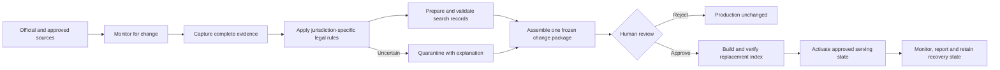

# AskLegal Autonomous Legal Database Pipeline

AskLegal’s legal-database pipeline continuously monitors authoritative legal
sources, preserves the evidence it observes, converts supported changes into
structured search records, and keeps AskLegal’s legal search index aligned with
approved current law.

The pipeline combines automated acquisition and legal-data processing with an
explicit human approval boundary. Every searchable record is traceable to its
source evidence, legal interpretation, validation results, approval, and
serving state. Uncertainty remains visible and is never silently converted into
legal truth.

## How it works

1. **Schedule and monitor.** A source registry defines every approved source,
   its legal role, responsible desk, expected schedule, supported languages and
   formats, and the facts its evidence may prove. Watchers detect additions,
   amendments, corrections, repeals, commencement events, and later case
   treatment.
2. **Capture evidence.** Source-specific acquisition workers retrieve the
   complete changed material and relevant metadata. Exact observations,
   attachments, inventories, and failed attempts are preserved in immutable
   evidence storage.
3. **Apply legal rules.** Jurisdiction-and-material-specific legal desks
   reconcile sources, determine status and effective dates, identify supported
   relationships, and distinguish current, prospective, uncertain, corrected,
   repealed, or superseded material.
4. **Prepare search records.** The processing pipeline parses, structures,
   cleans, distils, and validates evidence-bound legal records. Generative
   models operate only on named semantic tasks with strict schemas and supplied
   evidence; unsupported citations, malformed output, and invented conclusions
   are rejected.
5. **Freeze complete releases.** Each legal scope produces an immutable release
   that accounts for every included, unchanged, withheld, or retired item. The
   coordinator combines those releases into one complete desired-state
   inventory rather than treating a partial update as the whole database.
6. **Review one exact package.** The Review application presents additions,
   replacements, retirements, quarantines, source failures, coverage gaps,
   validation results, expected costs, target identity, and recovery readiness.
   A named reviewer approves or rejects the complete fingerprinted package.
7. **Build and verify.** Promotion creates a complete replacement Pinecone
   index while the existing verified state remains active. It verifies record
   inventory, content fingerprints, embeddings, retrieval quality, backups,
   configuration, and application readiness before cutover.
8. **Activate and observe.** AskLegal switches atomically to the verified
   serving state. The system records the exact activation, monitors search and
   source health, retains the predecessor for recovery, and produces a final
   report of what actually happened.

## Legal-data model

### Legislation

Legislation is represented as current searchable provisions with stable
identity across amendments, renumbering, substitutions, repeals, and source
corrections. Publication and commencement are treated separately: enacted but
uncommenced text remains outside ordinary current-law search until it becomes
operative.

The pipeline preserves bilingual structure, schedules, tables, forms, notes,
images, cross-references, official-version lineage, and amendment evidence.
When an official consolidation lags behind operative amendments, the system
either produces an evidence-bound reconstruction under deterministic rules,
serves explicitly warned latest-applicable official text, or withholds the
material. It never presents an unsupported consolidation as official current
law.

### Case law

Cases are indexed as evidence-backed legal propositions rather than duplicate
whole-judgment summaries. Judgment identity, proposition identity, citations,
court hierarchy, decision dates, corrections, translations, and proceedings
remain linked through stable lineage.

Later treatment is observed from new judgments, not predicted. A later
proposition can follow, apply, distinguish, doubt, disapprove, or overrule an
earlier proposition. The new case remains independently searchable while the
earlier proposition receives the corresponding treatment context; its original
text and history are not rewritten or erased.

### Principles and regulatory materials

Jurisdiction-specific Principles and formally approved Regulatory Materials
use separate source, identity, validity, and coverage rules. They are not
mislabelled as legislation and do not enter a jurisdiction’s search target
without complete source authority, effective-state analysis, and explicit
scope ownership.

## Trust and control boundaries

The system separates three kinds of state:

- the **Management Register** records what the pipeline believes, what it is
  doing, and the lifecycle of every run and serving state;
- the **Evidence Vault** preserves what proves and reproduces those beliefs,
  including source captures, releases, reports, approvals, and recovery
  material; and
- **Pinecone** contains the replaceable, approved serving copy used by
  AskLegal search. It is not the legal archive or source of truth.

Five separately runnable applications enforce capability boundaries:

- the **control plane** schedules work, tracks state, coordinates complete
  packages, and reports health;
- the **acquisition worker** monitors sources and captures immutable evidence;
- the **legal-processing worker** applies legal rules and creates validated
  candidate records;
- the **Review application** presents frozen packages and retains human
  approval, rejection, and revocation; and
- the **promotion worker** performs authorized embeddings, backup, replacement
  target construction, verification, activation, rollback, and exact
  retirement.

Each application has its own identity, credentials, network access, and
permissions. Captured source content cannot access secrets, execute tools, or
grant itself approval. Preparing valid records does not authorize publication,
and approval authorizes only the exact frozen package that was reviewed.

## Failure, uncertainty, and recovery

The pipeline fails visibly:

- an unavailable source is reported as unavailable, never as “no change”;
- incomplete capture cannot become a complete release;
- conflicting or unclear legal evidence is quarantined with an explanation;
- unowned or unexplained records block automatic retirement;
- any material change after approval invalidates that approval;
- failed verification leaves the existing serving state active; and
- post-activation failure invokes the approved rollback to a verified retained
  predecessor.

Every run produces a report, including genuine no-change runs. Reports identify
the sources checked, what changed, exclusions and uncertainty, exact approved
records, actions performed, resulting inventory, coverage gaps, and recovery
references. Preserved evidence allows an independent reviewer to reconstruct
the path from source observation through legal interpretation, approval,
deployment, and final serving state.

The database update is complete only when the approved records exactly match
the serving index, the active AskLegal configuration names that verified state,
retrieval checks pass, known gaps remain visible, the predecessor can be
restored, and every record can be traced to its evidence and approval.
