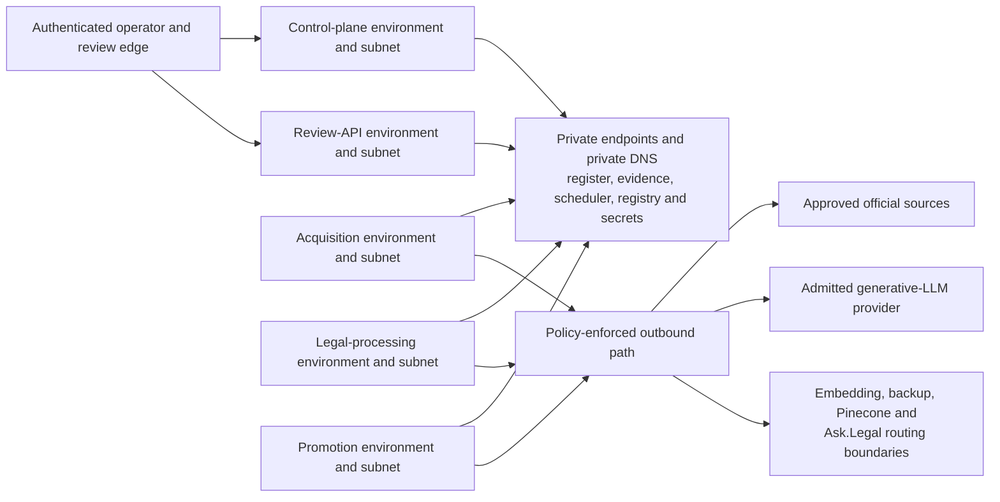

# Host pipeline applications on Azure Container Apps

## Decision

The five production pipeline runtime boundaries use Azure Container Apps:

- the control plane;
- the Review Application API;
- the acquisition worker;
- the legal-processing worker; and
- the promotion worker.

Each boundary is an independently deployed Container App built from its own
minimal OCI image. It has its own Container Apps workload-profiles environment,
delegated subnet, runtime managed identity, database role, secret access,
scaling policy, health policy, deployment identity, and deployment job. Images
are selected by immutable registry digest rather than a floating tag.

The environment type is settled as **workload profiles**, because the required
custom virtual network, user-defined routes, NAT or firewall egress, and
private-endpoint topology must not depend on the limitations of a legacy
consumption-only environment. The exact Consumption or Dedicated workload
profile, CPU and memory, replica limits, zone configuration, region, and
availability target remain measured infrastructure decisions.

This ADR selects a production host, not an Azure-first development loop.
Ordinary development and automated validation still run locally with the same
Python application entry points and container images, synthetic fixtures,
local provider fakes, ignored `var/` adapters, the Durable Task Scheduler
emulator, and local SQL Server Developer. Azure is introduced only in later,
separately authorized proofs of Azure-specific behavior.

## Runtime mapping

| Boundary | Container Apps shape | Production activation rule |
|---|---|---|
| Control plane | Continuously available FastAPI Container App | Internal origin behind ADR 0096's private Application Gateway listener; no public control route; at least one ready replica |
| Review Application API | Continuously available FastAPI Container App | Internal origin behind ADR 0096's public Application Gateway listener; no directly public Container Apps endpoint; at least one ready replica |
| Acquisition worker | Continuously running Container App with ingress disabled | Maintains a Durable Task Scheduler worker connection and processes only acquisition activities admitted to its task hub and register capability |
| Legal-processing worker | Continuously running Container App with ingress disabled | Maintains its worker connection; model-provider egress exists only for admitted named tasks and its separately scoped identity |
| Promotion worker | Continuously running Container App with ingress disabled | Maintains its worker connection; accepts only exact durable work, revalidates the frozen manifest and Approval, and alone receives production embedding, backup, Pinecone, and routing capabilities |

The initial standalone review browser and the later Ask.Legal admin portal are
clients of the Review Application API. They are not sixth pipeline authorities
and this ADR does not select their browser hosting service.

## Why Container Apps wins

Both Container Apps and App Service can run Python containers, use managed
identities, reach private Azure services, route outbound traffic through a
virtual network, expose health checks, and support controlled deployments.
App Service is therefore viable; it is not rejected as incapable.

Container Apps has the stronger complete fit for this particular five-boundary
system:

| Requirement | Azure Container Apps | Azure App Service |
|---|---|---|
| HTTP APIs | Native container apps with HTTP ingress, health probes, revisions, and optional traffic splitting | Excellent mature web hosting with health checks and deployment slots |
| Non-HTTP continuous workers | Native continuously running apps with ingress disabled | Normally continuous WebJobs or an empty host web app with Always On |
| Five independent compute boundaries | Per-app resources and scaling; one environment per boundary gives explicit network isolation | Apps, slots, and WebJobs in one plan share VM resources and plan scaling; strict isolation requires separate plans |
| Worker deployment | The same image and process model runs locally and in Azure | WebJobs introduce an App-Service-specific packaging and lifecycle surface; worker-only custom web apps are less natural |
| Outbound isolation | A dedicated environment subnet can have its own UDR, firewall policy, NAT, and private-DNS path | VNet integration, NSGs, UDRs, NAT, and private endpoints are capable, but each isolated plan needs its own integration and capacity design |
| Scaling | Per-app declarative limits and KEDA rules; scale to zero is available when an exact trigger can safely wake the workload | HTTP automatic scaling has at least one always-ready instance; plan autoscale and shared compute require more coupling analysis |
| Rollout and rollback | Immutable revisions, readiness gates, single-revision zero-downtime replacement, and optional HTTP traffic splitting | Deployment slots provide a particularly mature warm-and-swap model, but share plan capacity and recycle workers during swaps |
| Cost shape | Usage-based app compute and independent sizing; idle or zero-replica savings depend on actual configuration | Dedicated plans charge for allocated VM instances; five isolated plans create a larger fixed compute floor |
| Existing Ask.Legal familiarity | Newer operational surface for this team | Existing backend and AI-service operational familiarity |

App Service's strongest advantage is its existing Ask.Legal familiarity and
mature deployment-slot workflow. Those benefits do not outweigh the extra
worker conventions and the need for separate App Service plans to preserve the
five compute, scaling, and blast-radius boundaries. A hybrid that hosts only
the two APIs on App Service would add a second pipeline hosting, deployment,
networking, and observability model without providing a capability the APIs
require. The five pipeline applications therefore use one hosting model.

## Network topology and capability boundaries

A Container Apps environment is a platform secure boundary, and environment
network policy is shared by the apps inside it. The five applications have
materially different egress and credential risks, so production does not place
them in one environment merely to reduce cost.

The production topology has five VNet-injected workload-profiles environments,
each in a dedicated subnet:

All worker ingress is disabled. The control-plane and Review API environments
are internal; no application receives a public Container Apps endpoint by
default. ADR 0096 selects one Application Gateway WAF_v2 with a public Review
listener and a separate private control listener. Each API uses VNet-scope app
ingress within its internal environment so the hub gateway can reach it; the
environment still has no public virtual IP. Separate Entra resources and API
authorization, listener WAF policies, direct-origin denial, and exact private
operator access preserve the two boundaries.

Outbound traffic from each application subnet follows a user-defined route to
the selected policy-enforcement path. Rules are scoped by source subnet and
permit only the private Azure services and external destinations owned by that
application. Private endpoints and private DNS are used for Azure SQL, the
Evidence Vault, Durable Task Scheduler, container registry, Key Vault, and
other selected services where supported; public network access is disabled
after the private path is proved. A shared hub may host private endpoints,
firewall infrastructure, and DNS, but it does not merge runtime identities,
task hubs, database roles, secrets, or egress rules.

The exact hub-and-spoke layout, CIDRs, firewall product and rules, DNS design,
Application Gateway region and capacity, private operator path, availability
zones, DDoS controls, and cross-region recovery are still open. Consolidating
two runtime environments later requires an explicit security and cost decision
proving that the shared network policy and larger blast radius are acceptable;
co-location is not a silent optimization.

## Identity, deployment, and secrets

Every Container App has one runtime managed identity that is not shared with
another application. Its Entra and Azure RBAC grants must match its database
role and application capability. In particular, only the promotion identity
can receive production embedding, backup, Pinecone, or Ask.Legal routing
permissions.

Each application's deployment identity can update only that application's
image and approved revision-scoped settings. It cannot grant itself runtime
roles, change another environment, or mutate production data. Infrastructure,
role assignment, runtime deployment, migration, and emergency identities are
separate capabilities. Registry-pull identity and runtime identity are also
separated where the admitted Container Apps configuration can prevent the
application process from using the pull identity.

Key Vault holds only third-party or provider secrets that cannot use managed
identity. Vault permissions and secret references are per application. A
shared secret, shared identity, environment-wide production credential, or
deployment-time plaintext credential is forbidden.

## Scaling, health, and restart behavior

Scale-to-zero is not a production default. The Durable Task Scheduler streams
work to connected workers; an acquisition, legal-processing, or promotion
worker at zero replicas has no connection on which to receive work unless a
separate, proved scaler can wake it. The initial production rule is therefore
at least one replica for every durable worker. The two APIs also keep at least
one ready replica unless a later service-level and cold-start proof permits
otherwise. Non-production environments may scale to zero when no shared test
or operator expectation depends on immediate availability.

Exact minimums, maximums, concurrency, CPU, memory, and database pool budgets
come from load and recovery tests. Scaling one application cannot grant a new
capability or overwhelm Azure SQL: the sum of per-process connection pools at
the maximum admitted replicas must remain inside the database connection
budget selected under ADR 0091.

Each API exposes startup, readiness, and liveness probes. Each no-ingress
worker exposes a platform-only health port while public and application ingress
remain disabled. Readiness proves that the process is initialized; liveness
does not restart healthy code merely because a transient provider is down.
Dependency health is reported separately so that source, model, database, or
scheduler failure remains visible without creating a restart storm.

Workers handle termination signals, stop taking new tasks, checkpoint or
complete only within a configured grace period, and release bounded resources.
Every activity remains idempotent and restartable because Azure maintenance,
revision rollout, health replacement, or a crash can terminate a replica.
Correctness never relies on exactly one running replica: Durable Task delivery,
register idempotency, Approval consumption, exact constraints, and promotion
locks remain the authority even when old and new revisions briefly overlap.

## Revision and rollback rule

Each deployment creates an immutable revision from a digest-pinned image and
fingerprinted configuration. Single-revision mode is the initial rule for all
workers and the normal rule for APIs. An HTTP API may later use multiple
revisions and bounded traffic splitting only after session, authentication,
database compatibility, and observability tests prove it safe.

A revision becomes eligible only after startup and readiness checks pass. A
failed deployment leaves the existing ready revision active. Rollback
reactivates an admitted prior revision only when its schema, contracts, and
credentials remain compatible. Container Apps revision history is operational
deployment state, not the authoritative application audit trail; deployments,
configuration fingerprints, capability changes, and rollback evidence remain
in the Management Register and immutable evidence where required.

## Why the promotion worker is not a Container Apps Job

Container Apps Jobs are a natural fit for finite, on-demand work, but the
manual job start operation can replace the execution template, including the
container image, command, arguments, and environment values. Microsoft also
warns that an identity allowed to start a job gains access to the secrets
configured for that job. Giving that action to an approval or coordination
caller would therefore allow it to run caller-chosen code in the boundary that
holds the most dangerous credentials.

The promotion worker is instead a continuously running, no-ingress Container
App. It receives only a small durable command or work item, looks up the exact
frozen package in authoritative stores, and independently revalidates the
Approval, manifest, evidence, target, recovery readiness, fingerprints, and
expected base state immediately before every production action. The control
plane may request work but cannot choose an executable image, command, or
credential set.

A future Container Apps Job may be admitted for a low-privilege utility or a
trusted fixed launcher only after a separate design proves that execution-
template overrides, secret exposure, concurrency, timeout, and audit behavior
cannot enlarge authority. No Job is part of the accepted promotion boundary.

## Cost boundary

There is no honest fixed-price winner without measured workload, region,
availability, retention, firewall, private-endpoint, and recovery inputs.
Container Apps does not automatically mean cheap: all five production apps
initially keep a ready replica, and five isolated environments plus their
networking, logging, firewall, private endpoints, registry, and monitoring
have costs. Dedicated workload profiles create an additional fixed compute
floor if selected.

App Service would also require dedicated paid capacity. Sharing a plan could
lower its bill but would couple compute, scale, worker resource pressure, and
blast radius; preserving the accepted boundaries points toward separate
plans, each charged for allocated VM instances. The later cost model must
compare the complete secure topologies, not one shared App Service plan with
five isolated Container Apps environments.

Cost optimization may tune workload profiles, replica sizes, non-production
scale-to-zero, log retention, and shared hub services after measurement. It
may not merge identities, credentials, networks, task queues, database roles,
or deployment authority without an explicit design change.

## Existing Ask.Legal App Service boundary

ADR 0002 remains unchanged. The downstream Ask.Legal applications continue to
receive active Pinecone index generation names through their Azure App Service
application settings, and their production-candidate slot and swap design
remain a separate open activation decision. Hosting the greenfield pipeline on
Container Apps neither moves Ask.Legal off App Service nor permits the
promotion worker to bypass the exact approved routing configuration contract.

The promotion worker reaches the existing App Service configuration boundary
only through its narrowly scoped routing capability and only for the exact
approved generation. Review-portal integration is likewise an HTTP/API
integration; it does not require the Review Application API to share the
portal's App Service plan, database, identity, or deployment lifecycle.

## Local and Azure-specific proofs

The first implementation proofs remain local and synthetic. The same images
must run as ordinary non-root processes or local containers, and worker
termination, duplicate delivery, stale Approval, revision overlap, and restart
must be testable without Azure credentials.

Before production admission, separately authorized non-production Azure proofs
must establish at least:

- one environment and subnet per application with no unintended cross-boundary
  ingress or egress;
- managed-identity and database-role separation, including negative access
  tests from every wrong application;
- private DNS and private-endpoint connectivity to Azure SQL, Evidence Vault,
  Durable Task Scheduler, registry, and Key Vault with public access disabled;
- default-deny external egress with only the application's admitted
  destinations reachable;
- worker health, termination, checkpoint, revision overlap, rollback, and
  Durable Task reconnection behavior;
- API edge authentication, authorization, request limits, and direct-ingress
  denial;
- maximum-replica connection-budget enforcement and dependency-failure
  behavior;
- zone or platform maintenance and selected recovery behavior;
- OpenTelemetry correlation and alerting without treating platform logs as the
  audit authority; and
- a measured secure-topology cost model and budget alerts.

## Primary evidence

- [Container Apps environments as secure boundaries](https://learn.microsoft.com/en-us/azure/container-apps/environment)
- [Container Apps custom virtual networks and environment types](https://learn.microsoft.com/en-us/azure/container-apps/custom-virtual-networks)
- [Container Apps networking, UDR, NAT, and subnet requirements](https://learn.microsoft.com/en-us/azure/container-apps/networking)
- [Container Apps outbound traffic through user-defined routes](https://learn.microsoft.com/en-us/azure/container-apps/user-defined-routes)
- [Container Apps managed identities](https://learn.microsoft.com/en-us/azure/container-apps/managed-identity)
- [Container Apps scaling and scale-to-zero behavior](https://learn.microsoft.com/en-us/azure/container-apps/scale-app)
- [Container Apps revisions and readiness-gated deployment](https://learn.microsoft.com/en-us/azure/container-apps/revisions)
- [Container Apps health probes](https://learn.microsoft.com/en-us/azure/container-apps/health-probes)
- [Container Apps billing states](https://learn.microsoft.com/en-us/azure/container-apps/billing)
- [Container Apps Jobs, start permissions, and execution overrides](https://learn.microsoft.com/en-us/azure/container-apps/jobs)
- [Durable Task Scheduler connectivity and worker streaming](https://learn.microsoft.com/en-us/azure/durable-task/scheduler/durable-task-scheduler)
- [Durable Task Scheduler private endpoints](https://learn.microsoft.com/en-us/azure/durable-task/scheduler/durable-task-scheduler-private-endpoints)
- [App Service plan resource sharing, scaling, isolation, and billing](https://learn.microsoft.com/en-us/azure/app-service/overview-hosting-plans)
- [App Service virtual-network integration](https://learn.microsoft.com/en-us/azure/app-service/overview-vnet-integration)
- [App Service automatic scaling](https://learn.microsoft.com/en-us/azure/app-service/manage-automatic-scaling)
- [App Service deployment-slot lifecycle](https://learn.microsoft.com/en-us/azure/app-service/deploy-staging-slots)
- [App Service WebJobs](https://learn.microsoft.com/en-us/azure/app-service/webjobs-create)
- [Azure background-job hosting guidance](https://learn.microsoft.com/en-us/azure/architecture/best-practices/background-jobs)

## Alternatives considered

### App Service for all five boundaries

This remains technically possible. The APIs would be ordinary web apps and the
three workers would most naturally be continuous WebJobs or dedicated empty
web apps with Always On. Preserving isolation would require separate plans and
network integrations; WebJobs share compute, configuration, and lifecycle with
their host app, and Microsoft does not recommend them as a general-purpose
background platform for new workloads. The result is more App-Service-specific
worker machinery and a higher fixed capacity floor without a compensating
requirement.

### App Service for APIs and Container Apps for workers

This provides familiar deployment slots for two APIs but makes the pipeline
operate two hosting, deployment, network, health, scaling, and incident models.
Container Apps already satisfies the API requirements, so the additional
platform is not justified. Existing Ask.Legal App Service knowledge remains
useful for the downstream routing boundary without dictating the pipeline
host.

### One shared Container Apps environment

This would reduce environment and subnet count, but the environment is the
network secure boundary. It would force unlike source, model, promotion, and
operator egress policies into one shared blast radius. Separate identities do
not compensate for a merged network boundary. It is rejected for production.

### Container Apps Jobs for every worker

Acquisition and legal processing are durable workers that maintain scheduler
connections rather than one-shot batch containers. Promotion cannot safely
expose the override-capable manual start operation to a less-privileged caller.
Continuously running no-ingress Container Apps match all three workers more
directly.

### AKS

No accepted requirement needs customer-managed Kubernetes control-plane
surface, cluster policy, operators, or node management. AKS would add
operational and security burden without solving a demonstrated gap in
Container Apps.

## Consequences

- All five backend boundaries use one container hosting and deployment model.
- Production infrastructure needs five Container Apps environments and five
  delegated subnets, plus deliberately shared private-endpoint, DNS, firewall,
  registry, monitoring, and recovery services where their policies permit.
- The team accepts a new Container Apps operational surface instead of copying
  the existing App Service host by familiarity alone.
- Production workers and APIs do not assume scale to zero; the cost model must
  include their admitted ready replicas.
- ADR 0093 later selects standalone Python Durable Task workers, separate
  application task hubs, and an isolated promotion Scheduler without changing
  the five Container Apps environment boundaries.
- App Service remains the downstream Ask.Legal routing-configuration boundary
  under ADR 0002, not a pipeline runtime host.
- Exact Application Gateway values, workload profile sizes, capacity, zones,
  region, disaster recovery, firewall rules, DNS, service levels, deployment
  workflow, and observability policies remain independently reviewable.
- Application scaffolding does not start merely because hosting is selected.

## Authorization boundary

This ADR authorizes documentation and design selection only. It does not
authorize application or infrastructure implementation, container build or
execution, dependency installation, Azure resource access or creation,
identity or role assignment, network or DNS changes, database access, external
source access, model or embedding calls, evidence or backup mutation, Pinecone
access, deployment, routing changes, commits, pushes, or any other remote
effect. Every operational capability remains disabled.
