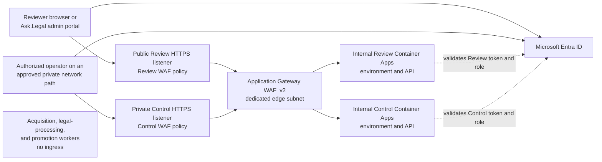

# Use Application Gateway for the split API edge

## 2026-08-16 human-governance amendment

Decision 2 of the ADR 0099 closure review supersedes this ADR's earlier
multi-role and action-specific step-up requirements. Human Review and Control
permissions now use one `PipelineAdministrator` role assignable to multiple
named people. Ordinary production sign-in and MFA remain, but Approval and
revocation have no separate recent-authentication test. Application, worker,
database, deployment, and effect identities remain separated.

## Decision

Use one regional **Azure Application Gateway WAF_v2** as the inbound edge for
the control-plane and Review Application APIs. The gateway is a shared network
service, not a shared application authority. It has two separate HTTPS
frontends and listener families:

| Listener | Reachability | Backend | Purpose |
|---|---|---|---|
| Review API | Public static IP and public DNS | Review Application Container App | Initial standalone review client and later Ask.Legal admin portal |
| Control plane | Private static IP and private DNS only | Control-plane Container App | Authorized operators and separately admitted operator clients on an approved private network path |

The public frontend has no listener, host, path rule, redirect, or backend for
the control plane. The private control listener has no public-DNS record and is
not associated with the public frontend. The two APIs use different hostnames,
listener certificates, backend pools, health probes, routing rules, WAF
policies, Microsoft Entra resource applications, audiences, scopes, roles, and
authorization policy. There is no wildcard or basic catch-all listener.

The three workers remain no-ingress applications. Application Gateway has no
route to them and receives no source, model, evidence-write, Approval,
promotion, backup, Pinecone, or Ask.Legal routing capability.

This is the simplest accepted Azure-only shape that supports the replaceable
standalone review client and later admin-portal integration without exposing
the operational control plane to the internet or adding a second API proxy.

## Inbound topology

The gateway uses one dedicated edge subnet in the shared network hub and
private peering and DNS paths to the separate control and Review Container Apps
spokes. Sharing the gateway accepts one edge availability and configuration
blast radius to avoid two fixed gateways. It does not merge application
identities, database roles, secrets, Container Apps environments, deployment
jobs, WAF policies, or authorization.

## Container Apps origin rule

Both APIs remain in **internal Container Apps environments** whose virtual IP
is private and whose public network access is disabled. To make a hub gateway
able to reach an app in a different environment, each API enables HTTP ingress
at the environment or virtual-network scope. In Azure Container Apps
terminology this is the app's `external` ingress setting inside an *internal*
environment; it does not create a public endpoint because the environment has
only an internal load-balancer address. App-level `internal` ingress would
restrict callers to the same Container Apps environment and would reject the
hub gateway.

The accepted origin controls are:

- Application Gateway resolves each Container Apps environment domain through
  private DNS and reaches its internal load-balancer address through the
  private network;
- the backend pool uses the exact API FQDN, with the correct backend host name
  and Server Name Indication value rather than an unbound IP alias;
- gateway-to-origin traffic uses HTTPS and validates the backend certificate;
- subnet rules and, where proved, Container Apps ingress restrictions admit
  only the Application Gateway subnet to the API ingress path;
- public network access remains disabled and the default Container Apps domain
  does not provide an internet bypass;
- no public DNS name resolves directly to an origin; and
- an origin never treats network reachability or a gateway-added header as
  proof of user identity or authority.

The APIs trust forwarded client, host, and scheme headers only when the
connection arrives from the admitted gateway path. Direct or forged forwarded
headers are ignored or rejected. The public host is preserved for URL and CORS
decisions while the backend host and TLS SNI are set explicitly for Container
Apps routing.

## TLS and certificate boundary

Only HTTPS listeners are admitted. The gateway terminates client TLS and starts
a separately validated HTTPS connection to the origin. Its user-assigned
managed identity can read only the exact listener-certificate secrets from
Key Vault and has no application or data-plane role. Certificate renewal uses
unversioned Key Vault secret references and is monitored; an expired,
unreadable, mismatched, or incomplete certificate disables the affected
listener rather than falling back to HTTP.

The exact public names, certificate authority, TLS policy, cipher set, and
rotation interval remain deployment-time values, but the minimum policy must
reject TLS older than 1.2 and pass current client and security conformance.
HSTS is returned on public Review responses after the hostname is proved. The
private control listener receives an independently managed certificate trusted
by every admitted operator client.

## Microsoft Entra authentication

Application Gateway supplies routing, TLS, WAF, coarse request control, and
origin isolation. It is not the OAuth authorization server and it does not
turn a request into an authenticated Approval. Microsoft Entra ID issues access
tokens and each FastAPI resource server independently validates and authorizes
every protected operation.

The control-plane and Review APIs use separate single-tenant resource app
registrations. A token acquired for one API is invalid for the other. Each API
validates at least:

- signature and the pinned tenant-specific signing metadata;
- exact issuer and tenant;
- its own exact audience;
- token lifetime and permitted clock skew;
- the subject and stable tenant-scoped object identity;
- the actor or client application against an explicit allow-list;
- delegated scopes for user calls or application roles for an expressly
  permitted non-human call; and
- the application role and current Management Register authorization required
  by the exact operation.

Names, email addresses, mutable group names, possession of a valid tenant
token, WAF passage, and private-network location are not authorization. Entra
application roles express Review and Control capabilities. Groups may be
assigned to those roles administratively, but raw group claims are not the
normative API permission contract.

The first standalone browser client has its own Entra client registration and
uses OAuth 2.0 authorization code flow with PKCE through a Microsoft-supported
authentication library. It requests only Review API delegated scopes. The
later Ask.Legal admin portal is admitted as a separate client and calls the
same versioned Review API; it does not inherit a right to call the control API
and does not require either API to share the portal's host, session store,
database, or deployment lifecycle.

The Review API does not accept an ID token as API authorization and does not
accept a browser-supplied client secret. Browser access tokens are sent in the
`Authorization` header, never in a URL. The initial client does not persist
tokens in application-controlled local storage. If later portal integration
uses a server-side session or backend-for-frontend, that component still
obtains an audience-correct access token and does not weaken the API checks.

## Approval and privileged-operation rule

Human Review and Control capabilities use one exact
`PipelineAdministrator` Entra application role. Multiple named people may be
assigned. This deliberate broad human role does not replace operation-level
authorization checks and does not merge application or workload identities.

Approval and revocation are human-only delegated operations:

- an app-only or service-principal token is rejected even if it carries an
  unrelated application role;
- the Review API checks the human's current `PipelineAdministrator` role and
  governance
  authorization, binds the stable Entra tenant and object identity into the
  immutable decision evidence, and applies ADR 0007's manifest and lineage
  checks;
- Microsoft Entra Conditional Access must require multi-factor authentication
  for Review and Control access before production admission;
- the promotion worker still rechecks current reviewer authority, Approval
  single-use state, revocation, and every manifest predicate immediately before
  a production effect.

The exact authentication strength, compliant-device or location conditions,
session lifetime, role-assignment process, and tenant licensing remain
production-admission values. There is no password-only or disabled-policy
default, but no action-specific step-up or authentication-freshness mechanism
is required. Production Approval routes remain disabled until the chosen
ordinary sign-in, MFA, role, and token behavior are tested end to end.

## WAF and request controls

The gateway uses WAF_v2 with separately associated policies for the Review and
Control listeners. A tested current Azure Default Rule Set runs in Prevention
mode in production. Detection mode is permitted only during a bounded tuning
proof and never becomes the production default. Exclusions are exact,
field-scoped, explained, tested, and reviewed; disabling a rule family broadly
to make a client work is forbidden.

Both listener policies enforce:

- exact accepted hostnames, HTTPS, route families, methods, request-body and
  upload limits, and malformed-request rejection;
- coarse anomaly and rate limits suitable for service protection;
- separate limits for sign-in callbacks, reads, comments, decisions, and
  other materially different request classes where evidence supports them;
- no public path to control-plane routes, probes, generated documentation,
  administrative diagnostics, or worker endpoints; and
- log scrubbing for authorization material, cookies, query parameters, and
  named sensitive JSON fields.

Application Gateway rate limiting is deliberately coarse and approximate. It
protects availability but cannot enforce per-reviewer budgets, single-winner
decisions, idempotency, or legal workflow policy. Each API applies exact
identity- and operation-aware limits, bounded raw-body parsing, schema checks,
command idempotency, authorization, and concurrency controls after token
validation.

The Review API uses an exact CORS allow-list for the current standalone client
and later separately admitted portal origins. Wildcard origins, wildcard
headers with credentials, and origin reflection are forbidden. CORS is a
browser control, not authentication. The OAuth redirect URI is likewise exact.
If any later browser design introduces authority-bearing cookies, it requires
a separate CSRF and session-security decision; this ADR authorizes bearer-token
API access only.

Application and WAF access logs contain correlation identifiers, route
templates, result classes, latency, sizes, and security outcomes, not raw
access tokens, legal text, evidence, manifest bodies, Approval comments, or
response bodies. WAF sensitive-data scrubbing is configured and tested, but
the Management Register and immutable evidence remain the audit authorities.

## Health, availability, and recovery

Each backend has one minimal readiness probe reachable only from the gateway
path. It reports only the bounded state required for routing and exposes no
version, dependency, evidence, configuration, or authorization detail. Public
and private listeners do not route the probe path to ordinary clients.
Liveness remains a separate Container Apps concern under ADR 0092.

WAF_v2 uses autoscaling and zone redundancy where the selected region supports
availability zones. The exact minimum and maximum capacity, zone selection,
timeouts, connection draining, health thresholds, service level, and cost are
derived from load and failure evidence. The public frontend receives Azure's
baseline platform DDoS protection; enhanced Azure DDoS Network Protection is a
separate cost-and-threat decision. WAF rate limiting is Layer 7 protection and
must not be represented as enhanced Layer 3 or Layer 4 DDoS protection.

One gateway is an accepted shared edge failure domain: its outage removes both
API paths, although it does not change authoritative register or evidence
state and does not expose workers. Separate gateways become justified only if
measured availability, independent change cadence, regulatory separation, or
blast-radius evidence outweighs the fixed cost and operational duplication.

The gateway is regional and stateless. Its complete Bicep definition, WAF
policies, DNS, certificates, role assignments, private-origin mappings, and
monitoring configuration must be reproducible. No automatic cross-region edge
failover is claimed. Exact secondary-region capacity, DNS failover, recovery
time, certificate readiness, origin selection, and traffic-fencing behavior
remain part of the later regional recovery decision.

There is no emergency public-origin bypass. If Application Gateway, private
DNS, or the approved operator network path is unavailable, the affected API is
unavailable until recovery. In particular, the control API stays private and
unreachable rather than being temporarily exposed. Any break-glass path must
remain private, individually authenticated, time-bounded, logged, and
separately approved.

## Required local and Azure proofs

Local synthetic tests must prove, without Azure credentials:

- rejection of unsigned, expired, wrong-issuer, wrong-tenant, wrong-audience,
  wrong-client, missing-scope, missing-role, and app-only human-decision tokens;
- separate Review and Control audiences and operation policies;
- exact CORS, raw-body, method, media-type, size, idempotency, and error
  behavior;
- Approval and revocation binding to the stable human identity and exact
  manifest, with stale or insufficient authority rejected;
- trusted-proxy handling that rejects forged forwarded headers; and
- log and trace redaction with no sensitive body or bearer-token capture.

Before production, a separately authorized Azure proof must establish:

- the public frontend can route only the Review hostname and the private
  frontend can route only the Control hostname;
- internet, wrong-VNet, wrong-host, wrong-listener, and direct-origin attempts
  cannot reach the control API, Review origin, or any worker;
- private DNS, backend host and SNI, end-to-end TLS, certificate rotation,
  health probes, and Container Apps routing work across the peered topology;
- distinct Entra app registrations, client allow-lists, scopes, the
  `PipelineAdministrator` role, Conditional Access, role removal, and negative service-
  principal tests behave as designed;
- current WAF rules in Prevention mode, exact exclusions, body and upload
  limits, rate limits, and sensitive-data scrubbing pass both attacks and valid
  review payloads;
- zone loss, scale, backend revision replacement, gateway update, certificate
  failure, DNS failure, and recovery behavior meet the selected service level;
  and
- the complete secure topology, including gateway, public IP, WAF, logs,
  private networking, DNS, Key Vault, and any chosen DDoS plan, has a measured
  cost and budget alerts.

## Why not Front Door, API Management, or private-only access

### Azure Front Door Premium

Front Door Premium has a strong public global edge, WAF, and documented Private
Link integration with internal Container Apps. It is the leading later option
if the public Review API needs multi-region origin selection, global latency
optimization, or a globally distributed edge. It does not supply the required
private operator listener for the control plane. Selecting it now would still
require a second private edge or network path and would add a global CDN and
origin-control surface before a multi-region requirement exists.

### Azure API Management

API Management can centralize API policy, validate JWTs, transform requests,
apply subscriptions and quotas, publish a developer portal, and run in an
internal virtual network. It is not a WAF. A public Review API would therefore
normally place Application Gateway or Front Door in front of it, creating two
proxy policy layers. These two private, first-party clients do not need API
product subscriptions, protocol transformation, developer onboarding, or a
second contract authority. FastAPI and repository contracts already own API
versions, validation, authorization, and OpenAPI. APIM can be reconsidered if
the system later gains many independent consumers or a proven gateway-policy
requirement.

### Private-only access for both APIs

This has the smallest public attack surface, but it would force every reviewer
browser and the later admin portal through VPN, a private-access product, or a
new server-side proxy. That couples initial Review delivery to operator-network
integration and makes the intended portal boundary harder without protecting a
capability that is already designed for authenticated remote human use. The
control plane remains private because it has no equivalent browser-integration
need.

### Direct public Container Apps ingress

Direct public ingress would create an origin bypass around WAF, listener
separation, centralized certificate policy, and edge request controls. Built-in
Container Apps authentication or an API token check would not supply the
missing WAF and direct-ingress denial. It is rejected.

### Separate Application Gateways

One gateway per API would isolate edge outage and configuration more strongly,
but doubles the regional gateway, public/private networking, certificate,
policy, monitoring, and recovery surface. Separate listeners, backend pools,
WAF policies, resource applications, and Container Apps origins provide the
required current separation at lower cost. A measured availability or
regulatory requirement can justify a later split.

## Consequences

- Only the Review API is intentionally internet-reachable, and only through
  its public Application Gateway listener.
- The control API requires an approved private operator-network path. Whether
  that path is an existing corporate connection, point-to-site VPN, Entra
  Private Access, or another Azure-supported mechanism remains a separately
  evidenced network decision; no public fallback is allowed.
- The first review client can be replaced by the Ask.Legal admin portal without
  changing Review domain contracts or exposing the Management Register.
- WAF, TLS, coarse rate limiting, and origin isolation are centralized while
  authentication and exact authorization remain inside each API.
- One shared regional edge lowers fixed cost and operations but creates a
  visible common API-availability and configuration blast radius.
- Exact names, regions, capacities, WAF values, Conditional Access policy,
  role assignments, private operator path, enhanced DDoS protection, recovery
  objectives, log retention, and complete cost remain explicit later values;
  none receives an implied default.
- ADR 0097 later resolves the Bicep, deployment-runner, workload-federation,
  environment-promotion, and privilege boundary. Observability and audit export
  are the next separate infrastructure decision.

## Primary evidence

- [Application Gateway listeners, public and private frontends](https://learn.microsoft.com/en-us/azure/application-gateway/configuration-listeners)
- [Application Gateway v2 autoscaling, zone redundancy, Key Vault, and WAF](https://learn.microsoft.com/en-us/azure/application-gateway/overview-v2)
- [Application Gateway request and private-backend routing](https://learn.microsoft.com/en-us/azure/application-gateway/how-application-gateway-works)
- [Application Gateway end-to-end TLS](https://learn.microsoft.com/en-us/azure/application-gateway/ssl-overview)
- [Per-listener WAF policies](https://learn.microsoft.com/en-us/azure/web-application-firewall/ag/per-site-policies)
- [Application Gateway WAF rate limiting](https://learn.microsoft.com/en-us/azure/web-application-firewall/ag/rate-limiting-overview)
- [Application Gateway WAF sensitive-data scrubbing](https://learn.microsoft.com/en-us/azure/web-application-firewall/ag/waf-sensitive-data-protection-configure)
- [Container Apps networking and internal environments](https://learn.microsoft.com/en-us/azure/container-apps/networking)
- [Container Apps private DNS for internal environments](https://learn.microsoft.com/en-us/azure/container-apps/private-endpoints-with-dns)
- [Container Apps virtual-network and Application Gateway integration](https://learn.microsoft.com/en-us/azure/container-apps/custom-virtual-networks)
- [Microsoft Entra access-token validation](https://learn.microsoft.com/en-us/entra/identity-platform/access-tokens)
- [Microsoft Entra security-claim validation](https://learn.microsoft.com/en-us/entra/identity-platform/claims-validation)
- [Microsoft Entra scopes and app roles for protected APIs](https://learn.microsoft.com/en-us/entra/identity-platform/scenario-protected-web-api-verification-scope-app-roles)
- [Microsoft Entra OAuth authorization code flow with PKCE](https://learn.microsoft.com/en-us/entra/identity-platform/v2-oauth2-auth-code-flow)
- [Microsoft Entra Conditional Access authentication context](https://learn.microsoft.com/en-us/entra/identity-platform/developer-guide-conditional-access-authentication-context)
- [Front Door Premium Private Link integration with Container Apps](https://learn.microsoft.com/en-us/azure/container-apps/front-door-custom-virtual-network-private-link)
- [API Management internal virtual-network mode](https://learn.microsoft.com/en-us/azure/api-management/api-management-using-with-internal-vnet)

## Authorization boundary

This ADR authorizes documentation and design selection only. It does not
authorize application or infrastructure implementation, Entra app
registration, Conditional Access or role changes, certificate creation, Azure
resource access or creation, DNS or network changes, Container Apps ingress
changes, deployment, external access, source or provider calls, corpus or
evidence mutation, Pinecone or routing changes, commits, pushes, or any other
remote effect. Every operational capability remains disabled.
