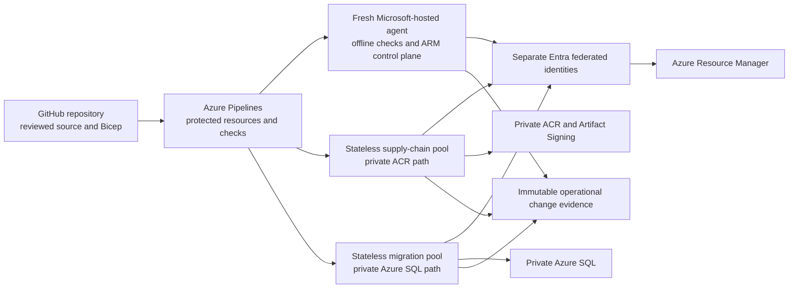

# Use Bicep and Azure Pipelines for infrastructure delivery

## Decision

Use **repository-owned Bicep** as the production infrastructure source and
**Azure Pipelines** as the operational deployment control plane. Keep the Git
repository on GitHub and connect it to Azure Pipelines through the Azure
Pipelines GitHub App. Use **Microsoft Entra workload identity federation** for
every Azure service connection; do not store a client secret, certificate, or
publish profile in GitHub or Azure DevOps.

Use ordinary fresh Microsoft-hosted Azure Pipelines agents for offline checks
and Azure control-plane operations that do not need a private data path. Use
two **stateless Managed DevOps Pools** with customer-controlled Azure virtual-
network connections only for work that must reach private endpoints:

| Private pool | Network reachability | Permitted work | Explicitly absent |
|---|---|---|---|
| Software-supply-chain pool | Private ACR and its DNS; exact Artifact Signing, Entra, timestamp, Azure DevOps, and GitHub outbound allow-list | Per-application build, admission copy, signing, verification, fresh deployment verification, and app deployment | Azure SQL data path, legal corpus, broad Azure administration, another application's identity |
| Migration pool | Private Azure SQL and DNS; read-only access to admitted runner or tool inputs; exact Azure DevOps, GitHub, and Entra outbound allow-list | Validate and apply one exact ADR 0091 migration package | ACR write or signing, application deployment, role assignment, evidence or corpus access |

Both pools provide a fresh agent for every job, begin with zero standby agents,
and have maximum concurrency one unless measured duration and queue evidence
justify more. They use separate delegated subnets, network policies, pool
permissions, and workload identities. A private runner is network placement,
not authority: no pool-level identity receives routine deployment or data
permissions, and every privileged stage must consume its own protected
workload-federated service connection.

Azure Pipelines is selected over the previously proposed GitHub Actions shape
because the current repository is private or may become private and the secure
GitHub-hosted private-network path has a material licensing dependency. Current
GitHub documentation makes Azure private networking for GitHub-hosted runners
an enterprise configuration, while required reviewers for protected
environments in private repositories require GitHub Enterprise Cloud. Azure
Pipelines can instead protect service connections, agent pools, environments,
and repositories with approvals and checks administered outside pipeline YAML,
and Managed DevOps Pools supplies fresh managed agents in delegated Azure
subnets without making this project operate a runner autoscaler.

This decision deliberately accepts an additional Azure DevOps control plane
while leaving GitHub as the code-review and source-of-truth boundary. That
tradeoff and its complete cost were explicitly accepted by the user on
2026-08-16.

## Compatibility with the existing Ask.Legal delivery standard

An explicitly authorized read-only inspection of the local Ask.Legal Core
repositories on 2026-08-15 found a consistent current delivery pattern:

| Existing repository | Checked-in delivery path | Azure authentication visible in workflow |
|---|---|---|
| AskLegal-Admin | GitHub Actions to Azure Static Web Apps | Stored Static Web Apps deployment token |
| Ask.legal-frontend | GitHub Actions to Azure Static Web Apps | Stored Static Web Apps deployment token |
| AskLegal-Backend | GitHub Actions to Azure App Service | Stored App Service publish profile |
| AI-Service | GitHub Actions to Azure App Service | Stored App Service publish profile |

No inspected repository contains Azure Pipelines YAML, Bicep, Terraform,
`azure/login`, an `id-token: write` permission, or another checked-in Entra
workload-federation path. Repository YAML cannot prove whether external Azure
DevOps pipelines, GitHub environment reviewers, or organization-level runner
controls exist, so those remain unverified rather than assumed absent.

ADR 0097 is therefore **not consistent with the existing deployment
orchestrator**. Keeping GitHub as source and deploying to Azure is consistent;
moving from stored deployment credentials to workload federation is a
deliberate security improvement; moving from GitHub Actions to Azure Pipelines
is a deliberate platform deviation. Bicep is a new standard because the
inspected repositories expose no existing infrastructure-as-code standard to
follow.

This evidence raised the acceptance threshold. On 2026-08-16, the user
explicitly selected Azure Pipelines despite the visible GitHub Actions
standard, prioritizing the simpler Azure-managed private-runner and approval
path over a GitHub Enterprise dependency or project ownership of a hardened
ephemeral GitHub runner platform. The private ACR and Azure SQL paths and
external-to-workflow deployment gates remain mandatory. This is a conscious
platform deviation, not a claim that Azure Pipelines matches the existing
codebase.

A focused 2026-08-16 repository check found only standard `ubuntu-latest`
runners and no positive checked-in Enterprise Cloud signal. That weakly favors
the inference that Enterprise Cloud is absent or unused, but cannot establish
the billing plan because runner-network configuration, environment protection,
and enterprise ownership live outside repository YAML.

GitHub Enterprise Cloud is not required for GitHub Actions itself, ordinary
GitHub-hosted public-network jobs, repository-level self-hosted runners, or
Entra OIDC. Ask.Legal could retain GitHub Actions on a lower plan by:

- moving every Azure deployment from reusable publish profiles and deployment
  tokens to exact federated Entra identities;
- keeping only offline and Azure control-plane stages on ordinary GitHub-
  hosted runners;
- operating fresh ephemeral self-hosted runners with network line of sight for
  private ACR build/admission and Azure SQL migration work; and
- supplying an independently administered production-approval mechanism,
  because required-reviewer protection for a private repository is not
  available on GitHub Free, Pro, or Team.

That is a feasible **GitHub Actions alternative**, but it is not the existing
approach unchanged. The current workflows use long-lived deployment secrets,
ordinary public GitHub-hosted runners, and public Azure deployment paths. A
private ACR with public access disabled requires a runner inside the permitted
network, and the private Azure SQL migration path likewise requires private-
network reachability. Opening those services publicly or omitting an
independent approval merely to preserve the existing workflow shape is
forbidden.

## Trust-boundary overview



Azure Pipelines never becomes the legal Approval authority. A pipeline
approval or check is an **Operational Deployment Approval** for one exact
infrastructure, role, migration, image, or application change package. It
cannot approve a Promotion Manifest, create or revoke ADR 0007 Approval, call
an embedding or generative model, mutate Pinecone, change Ask.Legal routing,
or authorize any corpus effect.

## Repository-owned Bicep composition

Bicep source is organized by lifecycle and authority rather than as one
subscription-wide template:

```text
infra/
├── modules/                    repository-owned leaf modules
├── foundations/                subscriptions, resource groups, policy roots
├── platform/
│   ├── hub-edge/               shared hub, DNS, firewall and Application Gateway
│   ├── management-register/    Azure SQL control-plane resources
│   ├── durable-workflow/       Scheduler resources and private endpoints
│   ├── primary-vault/          primary Blob and ledger-digest resources
│   ├── recovery-vault/         recovery-subscription resources
│   └── supply-chain/           ACR, signing and private runner networks
├── applications/
│   ├── control/
│   ├── review/
│   ├── acquisition/
│   ├── legal-processing/
│   └── promotion/
├── access/                     custom roles and exact role assignments
└── environments/               non-secret .bicepparam compositions
```

The names describe the ownership shape, not a commitment to these exact final
paths. The following rules are normative:

- leaf modules create resources and output exact resource IDs; they do not
  grant broad roles to the identity that deployed them;
- each foundation, platform boundary, application, and recovery subscription
  has a separately deployable root composition and deployment identity;
- no root can update all five Container Apps merely because they share one
  repository;
- custom role definitions and role assignments live in `infra/access/` and
  deploy through the separate access path described below;
- non-secret environment values use closed `.bicepparam` files; secret values
  never enter a parameter file, pipeline variable, compiled template, plan,
  log, or artifact;
- every Bicep, Azure CLI, and supporting tool version and trusted agent-image
  version is pinned before a production plan is created;
- production compilation resolves no floating remote Bicep module. The
  baseline uses reviewed repository-owned module source. A future Azure
  Verified Module must be imported through an exact reviewed version and
  fingerprinted dependency package rather than referenced by a floating tag;
- Bicep build, lint, and snapshot checks run without Azure access before any
  live plan; and
- compiled ARM JSON, source Bicep, parameter bytes, tool versions, and their
  SHA-256 fingerprints are preserved together.

This avoids turning a public module registry, mutable tag, runner cache, or
live `restore` result into part of production authority.

## Deployment Change Package

A **Deployment Change Package** is the immutable operational package reviewed
for one Azure change. It is deliberately not a Promotion Manifest. The package
contains at least:

- package identity, schema, creation time, validity window, and SHA-256 root
  fingerprint;
- repository identity, commit, complete source-tree fingerprint, protected
  branch, and pipeline and required-template identities;
- exact Bicep and Azure tool versions, trusted runner-image identity, compiled
  ARM JSON, non-secret parameters, and complete file inventory;
- exact tenant, subscription, resource group or management-group scope,
  deployment name, resource boundary, and environment;
- the planning identity and the separately intended applying identity;
- machine-readable ARM what-if output, diagnostics, ignored or short-circuited
  resources, normalized change list, and present-state observation time;
- every create, modify, replace, detach, delete, role, policy, lock, identity,
  private endpoint, DNS, firewall, WAF, certificate, data-retention, and
  externally reachable change;
- expected cost delta and the complete cost inputs available at that time;
- predecessor configuration, rollback or forward-correction plan, health and
  negative-access checks, and evidence destination; and
- the exact Operational Deployment Approval and its lifecycle after approval.

Unknown, omitted, short-circuited, `Ignore`, or unclassified what-if output is
not a clean plan. The package is ineligible until the uncertainty is resolved
or the exact resource is separately accounted for by an approved exception.

## Validate, plan, approve, and apply

### Offline validation

Pull requests run on a fresh Microsoft-hosted agent with no Azure service
connection, private-pool access, production secret, or production network.
They validate repository policy, Bicep syntax and lint, local snapshot changes,
parameter schema, module boundaries, compiled-template reproducibility,
architecture rules, and synthetic policy fixtures. A pull-request workflow may
not use a production workload identity or private runner.

Third-party Azure Pipelines tasks, GitHub Actions used elsewhere in the
repository, reusable workflow code, build images, and tools are permitted only
from an allow-list and exact immutable version. Repository scripts are
preferred for policy logic. Tokens use the minimum repository permissions and
untrusted fork or pull-request content never reaches a privileged pool.

### Live plan

After protected-branch admission, a dedicated planning service connection runs
ARM what-if with `ProviderNoRbac` validation. The planning identity receives
only read access plus the minimum deployment what-if capability at the exact
target scopes; it receives no resource write, role-assignment, policy-
exemption, or data-plane action.

`ProviderNoRbac` is selected deliberately. Full provider validation normally
requires the same resource-write permissions as deployment, which would turn
the planning job into an applying identity. The read-level plan is therefore a
change preview, not proof that the applying identity can perform the change.
The applying stage must later rerun full provider validation.

Production admission must first prove in Azure that every selected root
composition can run `ProviderNoRbac` what-if through the initial read-only
custom role. If Azure requires a write-capable action for any target, that
planning connection is privileged: it receives its own pre-plan approval and
checks, remains separate from the applying identity, and still receives no
general `Contributor` role merely to make planning convenient. The exception
and its complete permissions become part of the Deployment Change Package.

What-if has documented limits and can fail to evaluate references or nested
resources. The pipeline records diagnostics and fails closed on an unexpanded
or ignored result. It does not filter inconvenient noise out of the reviewed
package merely to make the plan shorter.

### Operational Deployment Approval

Azure Pipelines protects each applying service connection and production
environment with checks configured outside YAML. The baseline requires:

- protected main-branch control and the exact required pipeline template;
- evaluation of the exact Deployment Change Package artifact;
- an approver who did not create or initiate the package;
- no administrator bypass in the ordinary path;
- one exclusive environment lock; and
- expiry and invalidation when the package, target, current state, identity,
  policy, or evidence changes materially.

The approver sees the normalized plan and every privileged or potentially
destructive change. Approval of infrastructure cannot be reused for a role
assignment, schema migration, image admission, another application, another
environment, or a legal Promotion Manifest unless those are separately named
and independently gated packages.

### Fresh plan and apply

After approval, the applying identity reruns what-if with full `Provider`
validation immediately before apply. The stage compares its normalized output,
diagnostics, target, compiled template, parameters, policies, and current-state
fingerprint with the approved package. A material difference stops and
invalidates approval.

The applying identity then deploys the exact compiled ARM JSON and parameter
bytes in **incremental mode** with no interactive override or runtime
substitution. A successful ARM request is not completion: expected resources,
configuration, health, private reachability, negative access, logs, policy,
and final fingerprints must match before the change is recorded as successful.

Complete deployment mode is forbidden. Deployment stacks with automatic
`deleteAll` or `deleteResources` behavior are not the baseline. Removing a
resource from Bicep leaves it physically present and reports drift until a
separate exact retirement package names the resource, proves ownership and no
remaining dependency, establishes recovery, and uses the independently gated
maintenance identity. A later deployment-stack design may use `detachAll` or
deny settings for a bounded resource family, but it cannot introduce inferred
deletion.

## Separate identities and protected service connections

No general `Contributor`, `Owner`, or `User Access Administrator` connection
is available to routine pipelines. At minimum, use the following independent
capabilities:

| Identity or authority | Minimum capability | Must not have |
|---|---|---|
| Bootstrap operator | Time-bounded PIM/JIT creation of the initial subscriptions, federated identities, protected service connections, pools, policy roots, and evidence destination | Routine pipeline execution or permanent broad role |
| Plan identity per environment and boundary | Read and `ProviderNoRbac` what-if at exact target scopes | Resource write, role assignment, data plane |
| Infrastructure apply identity per environment and boundary | Exact resource-type writes and deployments at its named scope | Role assignment, policy exemption, application data, another boundary |
| Role-assignment identity | Assign only the approved role-definition IDs to the approved principal IDs at the approved scopes | General resource deployment, arbitrary principal or role, data plane |
| Policy and lock authority | One exact approved policy, exemption, lock, or deny-setting change | Routine deployment or role assignment |
| Migration identity | Connect to only the named Azure SQL database as ADR 0091 migration executor | Application DML, infrastructure, role assignment, ACR write or signing |
| Per-application build identity | ADR 0095 candidate-repository capability for one application | Release write, sign, deploy, production data |
| Image-admission, signing, and verification identities | Their separate ADR 0095 steps only | Application deployment, role assignment, legal data |
| Per-application deployment identity | Update only the named Container App image and approved revision settings after fresh image verification | Another app, runtime role, infrastructure, registry write, production data |
| Operational-evidence writer | Conditional create in the exact immutable operational-evidence container | Legal corpus read or write, overwrite, delete, retention administration |
| Exact-maintenance identity | Delete or detach only resources in one separately approved retirement package | Prefix, age, tag, discovery, role grant, or ordinary deployment |
| Break-glass operator | Time-bounded human PIM/JIT action for one recorded incident and target | Reusable pipeline connection, skipped evidence, silent broad access |

The role-assignment identity uses Role Based Access Control Administrator only
with Azure conditions restricting exact roles and principals, or a narrower
custom role when Azure proves it sufficient. Its scope is the smallest exact
scope. It never grants itself, the applying identity, or a pipeline principal a
role outside the approved package.

Role definition and assignment changes are separate from ordinary Bicep apply
because `Microsoft.Authorization/roleAssignments/write` is privilege-
granting authority. Entra application registrations, federated credentials,
Conditional Access, PIM, and tenant roles also remain separately governed and
cannot be smuggled into a normal resource deployment.

## Migration and application delivery

The migration pool executes only the closed ADR 0091 migration runner and one
exact package. It first proves the current ordered migration prefix, database
identity, package fingerprint, compatible application range, transaction-safe
classification, and recovery readiness. The database token comes from the
protected workload-federated migration connection and is never stored. A
migration stage cannot deploy application code or Azure infrastructure.

Application deployment follows expand-and-contract compatibility:

1. apply an independently approved compatible expand migration where needed;
2. admit and preserve the exact application image through ADR 0095;
3. deploy one application through its own identity and package;
4. prove readiness, negative access, revision and contract compatibility, and
   absence of the old code before any later contract migration; and
5. retire an obsolete revision or permission only through an exact separately
   gated action.

Promotion-worker deployment does not grant corpus promotion. Its new process
still begins without effect until the runtime receives and independently
validates an exact ADR 0007 Approval and Promotion Manifest.

## Environment promotion

The same reviewed source tree, compiled template bytes, module inventory,
toolchain, and admitted image digest move forward. They are not rebuilt for
production. Environment-specific non-secret parameter packages remain
distinct and receive a fresh live plan and approval against their own current
state.

Development, proof, and production use separate subscriptions or exact scopes,
service connections, managed identities, pools or pool permissions, database
users, storage accounts, Scheduler hubs, ACR repository capabilities, and
evidence. Passing a lower environment proves compatibility; it conveys no
production token or authorization.

## Drift detection and reconciliation

Scheduled read-only jobs run exact Bicep build and snapshot checks plus
`ProviderNoRbac` what-if for every registered root composition. They also
inventory role assignments, policy exemptions, locks, public-network flags,
private endpoints, DNS, Container Apps images, registry permissions, and other
security-critical settings that Bicep what-if cannot completely prove.

Drift produces an immutable finding and blocks an affected apply until it is:

- proved expected and incorporated into a new reviewed Bicep package;
- reverted through a new approved deployment; or
- preserved under an exact time-bounded exception with an owner and expiry.

There is no automatic drift remediation. A discovered extra resource is not
automatically deleted, and a changed permission is not automatically reset
without considering incident preservation and current access.

## Rollback and break-glass

Application rollback uses only a previously admitted, locked release digest
whose signatures, current findings, schema and contract compatibility, and
rollback configuration pass fresh verification. It uses that application's
normal deployment identity and records a new deployment event.

Infrastructure recovery normally applies a new corrective package or, when
still safe and compatible, redeploys the exact preserved predecessor package.
A Git revert, old template, previous pipeline run, or Azure deployment-history
button is not rollback authority. Database recovery follows ADR 0091 point-in-
time restore or a new corrective migration rather than an automated down
migration.

Break-glass is human, private, MFA-protected, time-bounded, PIM/JIT activated,
and independently reviewed. It records the incident, actor, exact target,
commands or package, current and expected state, reason, risk, evidence,
expiry, and restoration plan. It cannot erase evidence, create legal Approval,
use an unadmitted image, infer a deletion target, or leave a permanent broad
service connection.

## Evidence preservation

Each stage preserves the exact source and compiled bytes, package inventory,
plan, diagnostics, checks, approver and initiating identities, workload token
subject, Azure deployment and Activity Log correlation IDs, commands, stdout
and sanitized stderr, resource results, negative tests, cost observations,
rollback basis, and final outcome.

Azure Pipelines run history and artifacts are convenient operational copies,
not the sole audit authority. A narrow writer conditionally creates the exact
package in a dedicated immutable operational-evidence container in the primary
Evidence Vault and cannot read or mutate legal corpus content. ADR 0094's
promotion-owned exact-version copy protocol remains the only writer to the
Recovery Vault. A production change that can affect evidence or recovery must
prove its pre-change package already has a verified Recovery Vault copy; other
changes must at least prove the primary immutable copy before apply and queue
the normal recovery copy immediately.

Initial bootstrap cannot assume that those stores already exist. The bootstrap
operator therefore preserves a signed, hashed, access-controlled package in
the approved pre-bootstrap governance store and imports and verifies it into
both vaults as soon as the vault boundary exists. This is a documented
bootstrap exception, not a permanent alternative evidence path.

The workflow receives no read or mutation role over legal source snapshots,
Corpus Releases, Promotion Manifests, Approvals, Pinecone, provider secrets,
or production application data. Deployment logs must scrub tokens, secret
values, request bodies, legal text, database connection details, and protected
configuration.

## Cost boundary and current comparison

The complete Azure Pipelines cost includes:

- Azure DevOps users beyond the included tier;
- self-hosted parallel-job concurrency beyond the one included job;
- Managed DevOps Pools agent compute, operating-system licence where
  applicable, disks, custom image storage, networking, and egress;
- two delegated subnets, DNS, firewall or proxy processing, NAT where used,
  private endpoints and peering attributable to runner access;
- Azure Compute Gallery or other trusted agent-image construction, storage,
  patching, admission, and recovery;
- Azure Pipelines artifacts, logs, audit export, retention, and immutable
  evidence storage and recovery copying;
- pipeline and GitHub App administration, access reviews, PIM, incident
  response, restore drills, and operator time; and
- queued time and deployment delay caused by the intentionally low initial
  concurrency.

The initial cost shape is zero standby agents, maximum one agent in each pool,
and, when the organization is eligible, one included self-hosted parallel job,
so private jobs serialize. As of 2026-08-15, Microsoft lists the first five
Azure DevOps Basic users and one self-hosted parallel job as included, then USD
6 per additional Basic user per month and USD 15 per additional self-hosted
parallel job per month. Managed DevOps Pools additionally bills its Azure
compute, storage, and egress. These are comparison snapshots, not permanent
policy values; production admission requires confirming the organization's
grant, a regional quote, and budget alerts.

The simplest secure GitHub alternative would use GitHub Enterprise Cloud,
protected environments, OIDC, and two GitHub-hosted larger-runner groups with
Azure private networking. As of the same date, GitHub lists Enterprise Cloud
starting at USD 21 per user per month for the first 12 months, compared with
Team at USD 4, and lists a Linux advanced two-core larger runner at USD 0.006
per minute. Larger-runner minutes are always billed and private-network,
artifact, log, storage, egress, and operator costs remain additional. Exact
enterprise contract pricing may differ.

Owning GitHub self-hosted ephemeral runners would add Azure compute, images,
autoscaling, registration, patching, log forwarding, incident response, and
the current GitHub Actions platform charge for private-repository jobs. It is
not selected merely to avoid an enterprise licence while shifting the same or
greater cost into an unowned security-critical platform.

No pool, plan, environment, SKU, log duration, region, or quote has an implied
production default. Before implementation, the operator must compare the
measured complete Azure Pipelines cost with the then-current GitHub Enterprise
alternative and record any material change to this decision's premise.

## Bootstrap boundary

The pipeline cannot create the trust that authorizes itself. An initial
privileged, human-controlled bootstrap must create or admit:

- the Azure DevOps organization, project, GitHub App connection, protected
  repository and required-template policy;
- the Entra workload identities and their exact federated credentials;
- protected service connections, approvals, checks, exclusive locks, and
  pool permissions;
- the Managed DevOps Pools resources, delegated subnets, private DNS and
  outbound controls;
- the first custom roles, conditional role-assignment delegate, policy roots,
  and PIM or break-glass groups; and
- the initial operational evidence destination and audit-log export.

The bootstrap uses a reviewed immutable command and Bicep package, a time-
bounded privileged identity, two-person review, complete output capture, and
post-bootstrap negative access tests. Its standing privilege is removed after
verification. Routine pipelines cannot update their own federated subject,
protected-resource checks, required template, service-connection permissions,
runner-pool access, approvers, or evidence-retention policy.

## Alternatives considered

| Alternative | Assessment |
|---|---|
| GitHub Actions, OIDC, and GitHub-hosted larger runners with Azure private networking | Strongest one-repository experience and no Azure DevOps control plane. For a private repository, the required protected-environment reviewer and managed Azure-VNet configuration depend on GitHub Enterprise Cloud. Select it instead only if that enterprise capability and complete cost are explicitly accepted. |
| GitHub Actions with Azure self-hosted runners | Avoids the Enterprise-hosted-runner dependency but makes this project own ephemeral provisioning, runner registration, images, patching, scaling, log forwarding, compromise response, and availability. Persistent runners are rejected; ARC would add AKS solely for CI. |
| GitHub Actions with public ACR or SQL exceptions | Conflicts with ADRs 0091, 0092, and 0095. A CI convenience cannot reopen the accepted private service path. |
| Azure Pipelines with Managed DevOps Pools | Selected. Adds Azure DevOps and a GitHub App, but supplies external-to-YAML protected resources, workload federation, fresh managed agents, delegated-subnet access, and a low-concurrency entry cost without operating a runner platform. |
| Azure Pipelines with persistent self-hosted VMs or VM scale sets | More operational ownership and cross-job residue than stateless Managed DevOps Pools. Use only if a proved service limitation cannot be met. |
| Terraform | Strong multi-provider ecosystem and plan model, but adds state storage, locking, provider plugins, and another authority when the accepted infrastructure is Azure-only. Bicep is the narrower platform-native baseline. |
| Azure Deployment Stacks with automatic deletion | Useful ownership and deny controls, but automatic unmanage deletion conflicts with exact, evidence-backed retirement. Not the baseline. |
| Portal, CLI, or ad hoc scripts | Cannot supply reproducible composition, complete reviewed plans, deterministic identities, drift evidence, or enforceable separation. Break-glass commands remain exceptional evidence, not routine delivery. |

## Consequences

- GitHub remains the reviewed source repository, while Azure DevOps becomes a
  separately administered operational deployment control plane.
- Bicep is selected without implying one all-powerful subscription template or
  one all-powerful applying identity.
- Live planning can remain read-level through `ProviderNoRbac`; full provider
  permission validation occurs only after exact operational approval.
- Infrastructure, role assignments, policy and locks, migrations, software
  admission, and each application deployment remain independently permissioned
  and independently gated.
- Private ACR and Azure SQL access does not require public exceptions or a
  persistent runner.
- Incremental deployment and exact retirement keep omission from becoming
  deletion authority.
- Operational Deployment Approval remains distinct from legal Approval and
  grants no pipeline or corpus capability.
- Azure DevOps, Managed DevOps Pools, agent images, and their protected-resource
  administration become new cost, recovery, and incident surfaces.
- Exact regions, pool SKUs and images, concurrency, service-connection roles,
  pipeline checks and approvers, evidence retention, recovery objectives, and
  measured cost remain implementation and governance values.
- Observability and audit export become the next independently reviewable
  production-infrastructure decision.

## Primary evidence

- [Bicep modules](https://learn.microsoft.com/en-us/azure/azure-resource-manager/bicep/modules)
- [Bicep build and what-if](https://learn.microsoft.com/en-us/azure/azure-resource-manager/bicep/deploy-what-if)
- [ARM deployment modes](https://learn.microsoft.com/en-us/azure/azure-resource-manager/templates/deployment-modes)
- [Deployment stacks and unmanage behavior](https://learn.microsoft.com/en-us/azure/azure-resource-manager/bicep/deployment-stacks)
- [Azure RBAC role-assignment scope](https://learn.microsoft.com/en-us/azure/role-based-access-control/role-assignments)
- [Conditional delegation of Azure role assignment](https://learn.microsoft.com/en-us/azure/role-based-access-control/delegate-role-assignments-portal)
- [Azure Pipelines workload identity federation](https://learn.microsoft.com/en-us/azure/devops/pipelines/release/configure-workload-identity?view=azure-devops)
- [Azure Pipelines approvals and checks](https://learn.microsoft.com/en-us/azure/devops/pipelines/process/approvals?view=azure-devops)
- [Azure Pipelines protected resources](https://learn.microsoft.com/en-us/azure/devops/pipelines/security/resources?view=azure-devops)
- [Azure Pipelines GitHub repository integration](https://learn.microsoft.com/en-us/azure/devops/pipelines/repos/github?view=azure-devops)
- [Managed DevOps Pools overview](https://learn.microsoft.com/en-us/azure/devops/managed-devops-pools/overview?view=azure-devops)
- [Managed DevOps Pools architecture and private networking](https://learn.microsoft.com/en-us/azure/devops/managed-devops-pools/architecture-overview?view=azure-devops)
- [Managed DevOps Pools stateless agents](https://learn.microsoft.com/en-us/azure/devops/managed-devops-pools/configure-scaling?view=azure-devops)
- [Managed DevOps Pools pricing](https://learn.microsoft.com/en-us/azure/devops/managed-devops-pools/pricing?view=azure-devops)
- [Azure DevOps Services pricing](https://azure.microsoft.com/en-us/pricing/details/devops/azure-devops-services/)
- [GitHub-hosted larger runners](https://docs.github.com/en/actions/concepts/runners/larger-runners)
- [GitHub-hosted runner Azure private networking](https://docs.github.com/en/enterprise-cloud@latest/organizations/managing-organization-settings/configuring-private-networking-for-github-hosted-runners-in-your-organization)
- [GitHub deployment environments and plan restrictions](https://docs.github.com/en/actions/reference/workflows-and-actions/deployments-and-environments)
- [GitHub Actions OIDC](https://docs.github.com/en/actions/how-tos/secure-your-work/security-harden-deployments/oidc-in-cloud-providers)
- [GitHub secure-use guidance](https://docs.github.com/en/actions/reference/security/secure-use)
- [GitHub Actions runner pricing](https://docs.github.com/en/enterprise-cloud@latest/billing/reference/actions-runner-pricing)
- [GitHub plan pricing](https://github.com/pricing)

## Authorization boundary

This ADR is **accepted** for production design selection. It authorizes
documentation and local validation only. It does not authorize an Azure DevOps
organization, GitHub App, workflow, Bicep module, service connection, managed
identity, role,
policy, runner, pool, subnet, private endpoint, database connection, migration,
image, Azure resource, deployment, evidence write, commit, push, or any other
external or remote action. Every operational capability remains disabled.
