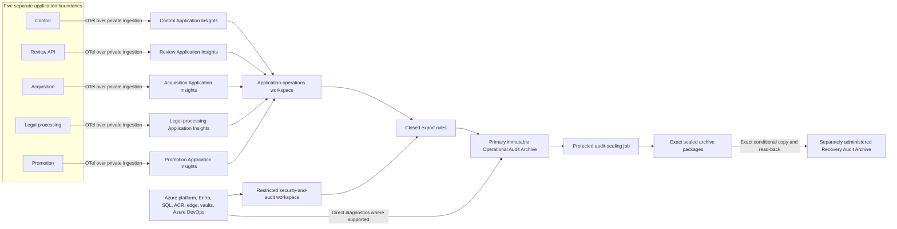

# Use Azure Monitor and immutable operational audit archives

## Decision

Use the **Azure Monitor OpenTelemetry Distro** directly in each Python
application, authenticated with that application's managed identity. Give each
of the five application boundaries its own workspace-based Application
Insights resource, but connect all five to one application-operations Log
Analytics workspace. Send platform, identity, security, database, network,
registry, vault, and deployment-control-plane records to a separate restricted
security-and-audit workspace.

Azure Monitor is the query, alerting, and incident-detection plane. It is not
the source of legal, business, approval, deployment, or effect truth. Those
facts remain in the Management Register and Evidence Vault. Export required
operational audit records to a dedicated immutable Operational Audit Archive
and preserve sealed archive packages in a separately administered recovery
archive. A workspace, Application Insights resource, Azure Pipeline run log,
or alert history may never be the only audit evidence.

This decision deliberately chooses two shared workspaces rather than five
application workspaces. Five separate Application Insights resources preserve
application attribution and resource-context authorization, while two
workspaces keep queries, alert rules, private networking, retention operations,
and cost manageable. This accepts two explicit availability and configuration
blast radii: application operations, and security/audit. It does not merge
application identities, database roles, evidence permissions, task hubs,
networks, deployment authority, or production capabilities.

## Three different kinds of record

| Record class | Authority | Examples | Failure rule |
|---|---|---|---|
| Authoritative pipeline fact | Management Register plus referenced Evidence Vault object | command result, source observation, Approval lifecycle, promotion admission, effect receipt, Serving State | The effect must not proceed when its required authoritative write cannot be proved |
| Operational telemetry | Application Insights and Azure Monitor | latency, health, restart, dependency duration, queue depth, sanitized exception, trace | Work may continue within explicit degraded-observability limits; loss is detected and recorded |
| Operational audit evidence | Direct Azure diagnostics, source audit APIs, immutable archive, and sealed recovery package | Entra sign-in, RBAC change, deployment, WAF event, SQL audit, ACR access, retention-policy change | Missing coverage or an unexplained gap blocks production admission and privileged change |

Copying a business fact into telemetry does not make telemetry authoritative.
Conversely, storing only a trace ID in the Management Register does not satisfy
an audit requirement. The exact authoritative object and its effect receipt
must exist independently, with the trace ID used only for correlation.

## Topology

Both workspaces and all five Application Insights resources join one Azure
Monitor Private Link Scope reached through the shared observability hub and
approved private operator path. Ingestion and queries use the private path;
public query and ingestion access are disabled after proof. This shared scope
is a known observability-network blast radius, not an authorization grant.

Azure resource diagnostic settings use Azure's service path rather than the
application private-ingestion path. Required trusted-service exceptions are
limited to the exact destination accounts and recorded as part of the archive
threat model; they never authorize an application identity.

## Application instrumentation

Each application uses the Azure Monitor OpenTelemetry Distro with the standard
OpenTelemetry APIs. The application runtime identity receives only the exact
ingestion capability for its own Application Insights destination and no
workspace-query, alert-management, export, or archive permission. Application
Insights local authentication is disabled after managed-identity ingestion is
proved.

Do not use the Container Apps managed OpenTelemetry agent as the selected
application path. Its current Application Insights integration does not export
OpenTelemetry metrics and requires the Application Insights instrumentation
key path. Direct instrumentation supplies traces, metrics, and logs and can use
Microsoft Entra authentication consistently.

Platform metrics and logs from Container Apps remain Azure resource telemetry;
they are not replaced by application instrumentation. The required platform
set includes environment and app health, replicas and revisions, restarts,
scaling, ingress where present, console and system failures, and outbound
dependency symptoms. The final diagnostic category list is a versioned closed
registry proved against the deployed resource providers; category groups are
not accepted blindly.

OpenTelemetry retry storage is bounded by bytes and time, stored only on an
application-local ephemeral path, encrypted by the platform, and contains the
same scrubbed data allowed for export. Retry files may not contain legal text,
prompts, model responses, tokens, headers, or evidence. Exhaustion increments
a non-sampled loss counter and produces a degraded-observability signal.

## Closed telemetry contract

Production application telemetry uses versioned structured event names and a
closed attribute allow-list. Permitted fields include:

- application, environment, admitted release digest, configuration and
  contract fingerprints;
- closed operation, state, outcome, dependency, and failure-class codes;
- opaque Management Register identifiers and immutable fingerprints;
- duration, count, byte, attempt, retry, backlog, quota, and cost counters;
- W3C trace and span identifiers; and
- sanitized Azure resource identities where operationally required.

The following are forbidden from ordinary application telemetry:

- source or legal text, evidence bytes, record payloads, reviewer comments,
  prompts, model inputs or outputs, embeddings, and generated explanations;
- request or response bodies, SQL parameter values, unbounded SQL text, HTTP
  query strings, authorization headers, cookies, credentials, tokens, keys,
  connection strings, or secret-store values;
- raw exception objects, locals, stack frames containing values, arbitrary
  dictionaries, and user-controlled field names; and
- human names, email addresses, UPNs, IP addresses, or other direct personal
  identifiers unless an exact security-log source requires them and routes
  them only to the restricted security-and-audit boundary.

The initial browser and later Ask.Legal admin portal propagate W3C trace
context, but never legal content, identity tokens, or authority in baggage.
Every cross-application outbox handoff records the initiating trace identifier
and creates a linked receiving trace; replay never pretends to be the original
span. Logs and traces correlate to authoritative opaque IDs, not to mutable
display names.

The repository owns tests that inject tokens, legal text, prompts, malicious
headers, database values, and raw exceptions through every logging path and
prove their absence at the exporter boundary. A provider's default
autocollection is disabled where it violates the allow-list.

## Sampling and cardinality

Never sample away:

- errors, rejected commands, security denials, health failures, and telemetry
  loss or export gaps;
- Approval, rejection, revocation, promotion, cutover, rollback, recovery,
  exact retirement, access change, or destructive-operation attempts; or
- deployment, migration, signing, image admission, policy, immutability,
  backup, restore, and evidence-verification events.

Routine successful requests and worker spans may use a fixed, versioned head-
sampling policy only after measured volume proves the chosen rate. Sampling
policy and telemetry-contract fingerprints are part of an admitted application
configuration. Provider-side adaptive sampling cannot silently change the
evidence shape.

Metrics use closed low-cardinality dimensions. Opaque per-record IDs, URLs,
source names, exception messages, and trace IDs are forbidden as metric labels.
Cardinality, daily ingestion, retained bytes, exported bytes, query use, and
archive growth have explicit budgets and alerts.

## Platform and security audit sources

Before production admission, a versioned **Audit Source Coverage Registry**
must name every required resource instance, category, collection path,
destination, retention class, expected heartbeat, latency objective, owner,
and negative-access test. At minimum it covers:

- Azure Activity Log and subscription policy, lock, role, identity, network,
  diagnostic-setting, and resource changes;
- Entra audit, interactive and non-interactive sign-ins, service-principal and
  managed-identity activity where the tenant licence exposes it, application
  and Conditional Access changes, and privileged-role activity;
- Azure SQL audit and threat/health signals, including the narrow migration
  identity and procedure-level access boundary;
- Application Gateway access, performance, WAF, certificate, backend-health,
  public/private listener, and routing changes;
- Container Apps control-plane and platform logs for all five environments;
- Durable Task Scheduler access, task-hub health, capacity, retention, purge,
  and private-network changes;
- ACR repository access, image import, signing and verification, policy,
  private-network, retention, replication, and deletion attempts;
- Evidence Vault, Recovery Vault, Operational Audit Archive, Confidential
  Ledger, Key Vault, private endpoint, DNS, firewall, and immutability-policy
  activity;
- Azure Pipelines audit events, protected-resource checks, service connection,
  pool, environment, variable, branch/resource authorization, run, approval,
  artifact, and retention changes; and
- Azure Monitor workspace, Application Insights, alert, action group, data
  collection, diagnostic setting, export rule, private-link, retention, purge,
  and archive configuration changes.

Required direct diagnostic settings write both to the restricted workspace for
detection and directly to immutable Blob storage where Azure supports that
combination. Azure SQL auditing writes directly to its admitted immutable
archive destination using managed identity. Workspace data export supplies a
second collection path for supported tables. Unsupported, partially exported,
or Auxiliary-plan tables need a source-specific collection path or an explicit
blocking gap; they are never assumed to be covered.

The registry is compared with the live provider category catalogue during each
privileged plan. A missing required category fails. A new category is reported
for review; it is not silently enabled because it may contain sensitive data
or introduce unbounded cost.

## Azure DevOps audit limitation

Azure DevOps audit events currently have a 90-day service retention and the
audit feature and REST surface are documented as preview. Native streams to
Event Grid or Azure Monitor require a stored destination key. That conflicts
with ADR 0097's workload-federated, no-reusable-deployment-secret baseline.

The selected baseline is therefore a protected scheduled audit-export job,
separate from every deployment job. It obtains a short-lived Entra-backed
identity, has audit-read permission only, reads overlapping continuation-
token windows from the Azure DevOps Audit REST API, preserves the exact raw
responses and request-window metadata, deduplicates by immutable event
identity, and writes with conditional create to the primary archive. It cannot
approve, queue, cancel, alter, retain, or delete a pipeline run and has no Azure
deployment role.

This path must be proved before production use, including Entra service-
principal access, complete event coverage, pagination, clock skew, duplicate
handling, retry after a missed schedule, source-side mutation behavior, and
independent detection when the exporter is disabled. If the proof fails, the
system stops at an explicit architecture decision. It does not silently store
an Event Grid or Log Analytics shared key in Azure DevOps.

Because Azure Pipelines is partly auditing itself, a protected Azure Monitor
heartbeat and independent Activity/Entra records monitor the export identity,
schedule, permissions, archive writes, and pipeline-control changes. The
exporter cannot mark its own missing interval complete.

## Immutable Operational Audit Archive

Use a dedicated flat-namespace GPv2 Blob account rather than the legal
Evidence Vault account. Operational audit volume, Azure Monitor's trusted-
service writer path, retention, export failure behavior, and query workflow
are materially different from legal evidence. Combining them would broaden
the Evidence Vault trust boundary and risk high-volume monitoring traffic
affecting legal-evidence operations.

The primary archive has separate containers by source and retention class,
locked default version-level WORM, protected append writes where required by
the Azure source, Blob versioning, change feed, inventory, infrastructure
encryption, private operator access, and public and Shared Key access disabled
after every provider writer is proved. It uses RA-GZRS when the chosen region
supports the complete topology. No application runtime, deployment identity,
workspace reader, or routine operator can overwrite, shorten retention,
delete a version, remove a hold, or purge the archive.

Azure Monitor workspace export retries are finite and can duplicate records.
Export volume, failure, latency, last-success time, and dropped-record signals
therefore have independent alerts. Archive consumers deduplicate without
altering raw objects. A green workspace does not prove archive completeness.

A protected audit-sealing job closes one exact UTC interval only after:

1. every registry source has reached its allowed watermark;
2. direct and workspace-export paths have been inventoried;
3. object version, size, service checksum where supplied, and SHA-256 have been
   recorded without rewriting source objects;
4. expected heartbeats, sequence continuity, overlaps, duplicates, late
   arrivals, unsupported tables, and declared gaps have been evaluated; and
5. an immutable manifest, source inventory, validation result, and gap report
   have been conditionally created and read back.

The result is an **Operational Audit Archive Package**. A complete package may
still declare a known gap; it may not label the interval complete. Late records
create a linked supplemental package rather than mutating the original.

The audit-sealing identity can read the primary raw-audit containers and create
only new package objects. It cannot modify source configuration, query legal
evidence, approve work, deploy, promote, or write to the recovery account.

## Recovery archive

Use a separate GPv2 Recovery Audit Archive in the ADR 0094 recovery
subscription and region. It inherits the same same-provider and shared-Entra-
tenant limitation already accepted for the Recovery Vault. It does not claim
protection from an Azure-wide outage or tenant-wide identity compromise.

Only the promotion worker's separately invoked recovery-copy capability can
copy an exact sealed Operational Audit Archive Package. That capability can
read the package container, not raw audit containers or either workspace, and
can conditionally create and read back exact recovery versions, not overwrite
or delete them. It applies ADR 0094's complete-manifest, SHA-256, exact-version,
conditional-create, and read-back protocol. Operational audit copying cannot
be combined with a legal Promotion Manifest or used as production mutation
authority.

This adds a narrow audit-package read capability to the already high-trust
promotion boundary. The alternative—giving another service recovery-vault
write credentials—would contradict the accepted single recovery writer. The
capability and archive containers remain separate, and negative tests prove
that it cannot read raw security logs, legal evidence, or another recovery
container.

An interval needed for a privileged deployment, promotion, exact retirement,
or disaster-recovery decision is not recovery-ready until its required archive
package exists in both accounts and the recovery version has been read back.
Exact packaging delay, maximum tolerable loss, restoration time, retention,
and drill frequency remain measured policy values.

## Alert ownership and response

Use Azure Monitor metric and log alerts with separate action groups for each
application owner and a restricted platform/security action group. An alert
action may notify or open a separately authenticated incident path; it cannot
approve, deploy, revoke legal Approval, promote, delete, restore, or auto-
remediate infrastructure. No public webhook with a reusable secret is the
production baseline.

The minimum alert catalogue includes:

- per-application heartbeat loss, health failure, crash loop, revision drift,
  saturation, latency, dependency failure, backlog, stuck or overlapping run,
  and unusual error, quarantine, cost, or volume movement;
- missing source observations, late no-change reports, unreconciled watcher
  signals, validation failures, and post-cutover search regressions;
- telemetry retry exhaustion, scrubber rejection, cardinality excess,
  ingestion or query failure, workspace/export silence, archive lag, duplicate
  surge, incomplete package, and unexplained audit gap;
- authentication and authorization failures, unusual privileged sign-ins,
  role or service-connection changes, policy exemption, lock or WORM change,
  purge request, public-network enablement, firewall or DNS change, and
  diagnostic-setting or alert deletion;
- SQL audit or ledger-digest failure, Evidence/Recovery Vault write anomaly,
  ACR admission/signature/scanner failure, deployment drift, and recovery-copy
  or drill failure; and
- Application Gateway WAF, backend, certificate, listener, public-control-
  route, and direct-origin negative-access failures.

Every alert has a named owner, severity, threshold basis, response deadline,
runbook, evidence-preservation step, escalation path, suppression rule,
synthetic test, and recovery condition. Application teams receive only their
resource-context telemetry unless an incident grants a time-bounded broader
role. Security/audit workspace access is separately approved, time-bounded
for ordinary investigation, and audited.

## Failure and backpressure behavior

Application work does not synchronously wait for Application Insights. The
exporter uses bounded memory and disk queues. On exhaustion it drops only
allowed operational telemetry, increments a separately observable loss
counter, writes a degraded-observability fact to the Management Register when
that path is healthy, and stops pretending the interval is complete.

Failure of the Management Register or required Evidence Vault write is
different: a command or effect that requires authoritative evidence fails
closed before the external effect. Application telemetry success cannot
override that rule.

During an Azure Monitor outage:

- already-running acquisition and deterministic processing may continue only
  while their authoritative writes, local safety limits, and explicit maximum
  degraded interval remain healthy;
- new privileged deployment, migration, role, policy, retention, signing,
  promotion, cutover, retirement, restore, or recovery actions stop when their
  required monitoring and audit coverage cannot be proved;
- source or legal uncertainty still quarantines normally; observability loss
  never turns failure into a no-change result; and
- recovery creates supplemental archive evidence and reconciles every gap
  before production readiness is restored.

No hard daily cap may silently discard required security or audit data.
Optional high-volume application telemetry may be sampled or curtailed by an
admitted policy, while authoritative and audit paths remain protected.

## Retention, privacy, and cost

Exact retention days remain a later governance value because legal hold,
incident investigation, source licences, personal-data obligations, recovery
objectives, and measured volume must be reconciled. The design nevertheless
requires:

- short searchable retention for ordinary high-volume application traces;
- longer searchable retention for required security and privileged-operation
  tables;
- WORM archive retention independently of workspace retention and purge;
- exact hold, expiry, destruction, and authorized-release procedures; and
- periodic restore, re-query, archive-inventory, and recovery-package drills.

Basic or Auxiliary Log Analytics table plans are not used for a required
alert or export until their query, alert, export, retention, and replication
limits are proved. A purgeable long-term Log Analytics archive is not a WORM
substitute.

The complete cost model includes Application Insights and Log Analytics
ingestion by table, retained and restored data, queries, alerts, workbooks,
availability tests, data export, uncompressed export expansion, archive
transactions and versions, WORM retention, replication, private endpoints and
DNS, sealing and recovery-copy compute, notification channels, drills, and
operator time. Budgets alert before loss-producing limits are reached.

## Required proof before production admission

Documentation acceptance does not authorize these tests or cloud resources.
When separately authorized, admission requires at least:

1. synthetic secrets, tokens, legal text, prompts, reviewer comments, SQL
   values, hostile headers, and raw exceptions cannot escape the exporter
   allow-list;
2. each app identity can ingest only to its own Application Insights resource
   and cannot query either workspace or write either archive;
3. resource-context operators cannot read another application's telemetry and
   application operators cannot read the security workspace;
4. private ingestion and query work with public access disabled; direct
   diagnostic paths still reach only their admitted archive destinations;
5. every required Azure diagnostic category and Azure SQL audit record reaches
   the workspace and immutable archive with measured latency;
6. Azure DevOps audit export survives pagination, overlap, duplicate events,
   missed runs, exporter disablement, identity revocation, and 90-day source
   expiry without a false complete interval;
7. workspace export failure, retry exhaustion, unsupported tables, late data,
   archive write denial, sealer failure, and WORM changes alert independently;
8. a sealed package is inventory-complete, immutable, read back from the
   recovery account, and reconstructable without either workspace;
9. a telemetry outage does not block safe ordinary work forever, does block
   new privileged effects at the declared boundary, and cannot erase or forge
   authoritative facts; and
10. volume, cardinality, searchable retention, export expansion, archive
    growth, alert load, recovery time, and complete monthly cost are measured.

## Alternatives considered

| Alternative | Why it is not selected |
|---|---|
| One shared Application Insights resource | Merges application attribution, access, sampling, configuration, and incident blast radius unnecessarily |
| Five Application Insights resources and five workspaces | Strongest workspace isolation, but multiplies private links, retention, exports, queries, alerts, operations, and fixed cost without storing permitted sensitive content in application telemetry |
| Container Apps managed OpenTelemetry agent | Its current Application Insights path does not provide the selected complete metrics path and depends on local-auth instrumentation-key ingestion |
| Azure Monitor workspace only | Queryable logs can be purged and export can fail; it is not an independently retained tamper-resistant audit authority |
| Put operational audit in the legal Evidence Vault accounts | Broadens the legal-evidence writer and trusted-service boundary and couples high-volume telemetry to legal-evidence reliability and cost |
| Azure DevOps native audit stream with a destination key | Stores a reusable Event Grid or Log Analytics key in the delivery control plane, contrary to ADR 0097's federation baseline |
| A new audit-copy application with recovery credentials | Adds a sixth privileged runtime and violates the accepted single recovery-writer boundary |
| Automatic alert remediation | Lets a noisy or compromised detection plane make privileged changes without an exact approved, evidence-bound command |

## Consequences and open values

The decision gives operators one application view and one restricted security
view while preserving per-application instrumentation and authorization. It
adds an Azure Monitor Private Link Scope, two workspaces, five Application
Insights resources, a dedicated primary and recovery audit archive, closed
diagnostic and telemetry registries, protected export and sealing jobs, and a
substantial cost and recovery test obligation.

The two workspaces, one Private Link Scope, one primary audit account, one
audit-sealing path, and promotion-owned recovery copy are shared operational
blast radii. Their failure must be visible; none can create legal authority or
rewrite authoritative pipeline facts.

Still open are exact regions, workspace and Application Insights names, table
plans, retention periods, WORM profiles, archive partitioning, private-link
topology, diagnostic categories, Azure DevOps licence and API proof, alert
destinations, on-call owners, thresholds, degraded intervals, recovery
objectives, drill frequency, personal-data handling, roles, capacity, and
complete cost. This decision selects the architecture, not those unmeasured
values.

## Current primary evidence

- [Azure Monitor OpenTelemetry Distro](https://learn.microsoft.com/en-us/azure/azure-monitor/app/opentelemetry-enable)
- [Application Insights OpenTelemetry authentication](https://learn.microsoft.com/en-us/azure/azure-monitor/app/azure-ad-authentication)
- [Container Apps managed OpenTelemetry agent](https://learn.microsoft.com/en-us/azure/container-apps/opentelemetry-agents)
- [Workspace-based Application Insights](https://learn.microsoft.com/en-us/azure/azure-monitor/app/create-workspace-resource)
- [Log Analytics workspace access modes](https://learn.microsoft.com/en-us/azure/azure-monitor/logs/manage-access)
- [Azure Monitor Private Link Scope](https://learn.microsoft.com/en-us/azure/azure-monitor/logs/private-link-security)
- [Log Analytics data export](https://learn.microsoft.com/en-us/azure/azure-monitor/logs/logs-data-export)
- [Azure Monitor data retention and archive](https://learn.microsoft.com/en-us/azure/azure-monitor/logs/data-retention-archive)
- [Azure Monitor diagnostic settings](https://learn.microsoft.com/en-us/azure/azure-monitor/platform/diagnostic-settings)
- [Azure Activity Log retention and export](https://learn.microsoft.com/en-us/azure/azure-monitor/platform/activity-log)
- [Microsoft Entra diagnostic settings](https://learn.microsoft.com/en-us/entra/identity/monitoring-health/howto-configure-diagnostic-settings)
- [Azure SQL auditing](https://learn.microsoft.com/en-us/azure/azure-sql/database/auditing-overview)
- [Azure DevOps auditing](https://learn.microsoft.com/en-us/azure/devops/organizations/audit/azure-devops-auditing)
- [Azure DevOps Audit REST API](https://learn.microsoft.com/en-us/rest/api/azure/devops/audit/audit-log/query)
- [Azure Blob immutable storage](https://learn.microsoft.com/en-us/azure/storage/blobs/immutable-storage-overview)
- [Write once, read many storage for Azure Monitor](https://learn.microsoft.com/en-us/azure/azure-monitor/logs/logs-data-export#data-immutability)

## Authorization boundary

This ADR authorizes documentation only. It does not authorize
application instrumentation, dependency installation, Bicep or pipeline
creation, Azure resources, diagnostic settings, audit API access, identities,
role assignments, private endpoints, exports, alerts, archive writes, recovery
copies, deployment, or any production action.
