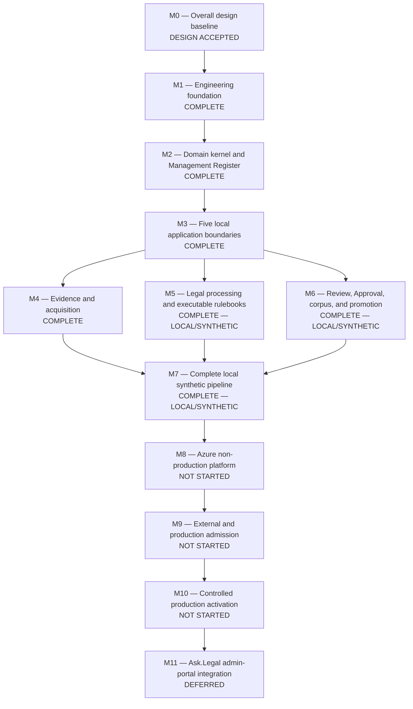

# AskLegal Legal Database Pipeline — Delivery Roadmap

Updated: 2026-08-18

## Purpose

This is the durable overall progress plan for turning the accepted pipeline
design into a locally proved and locally operated V1, with separately gated
later cloud deployment. It tracks delivery state and dependency order; it does
not replace the canonical overall design, ADRs, or the exact current handoff in
`WORKING_STATE.md`.

This roadmap contains no delivery-date estimate and grants no implementation
or operational authorization. Each implementation, external integration,
cloud proof, and production action remains separately gated.

## V1 target — single-Ubuntu-host internal POC

V1 is a **strictly internal POC**, not an Azure-hosted deployment:

- development remains on the Mac, while all five applications run continuously
  on one Ubuntu 24.04 x86-64 PC; the Mac is not a runtime dependency;
- SQL Server 2025 Developer, two Durable Task Scheduler emulator instances,
  two Versity Gateway vault instances, secrets, and monitoring run on Ubuntu;
- hosted Pinecone Cloud in a dedicated isolated POC project supplies the
  replaceable vector-serving copy;
- controlled outbound access to admitted official legal-source endpoints is
  allowed;
- controlled outbound calls to separately admitted hosted model and embedding
  APIs are allowed; and
- Azure application hosting is outside V1.

Products and the exact disabled service topology are selected. Static topology
and read-only host-admission policy contracts now pass locally, but exact
tested image versions/digests, Ubuntu package locks and host facts, private
subnets, Pinecone plan/endpoints, credentials, and admission evidence remain
implementation work. Azure M8 is post-V1/deferred. This direction authorizes no
deployment or external effect; explicit authorization is required before the
first real Pinecone write.

## Honest progress summary

The project is **advanced in design with the local synthetic platform complete
and the first real-package source-access checkpoint implemented, but external
admission and platform operation incomplete**. The architecture and Hong Kong legal-policy model
are extensive. The normative
cross-cutting contract package plus the Python contract, type, durability,
package, synthetic image-admission, and architecture boundaries are locally
proved. M2 is complete: its domain kernel, typed Management Register boundary,
deterministic fake, and complete common SQL substrate are proved, including on
a fresh real local SQL Server. M3 is complete with five independently runnable
local boundaries and fail-closed local adapters. M4 is complete with exact
evidence/acquisition contracts, synthetic connectors, two local vault fakes,
and explicit observation outcomes. M5 is complete for the executable package
engine, local lifecycle, bounded semantic boundary, processing worker, and one
reserved synthetic package. A frozen Hong Kong Legislation package now records
all three scopes and their exact blockers and proves the ordered offline
`HKLEG-BASE-OBS-001` → `HKLEG-BASE-INV-001` → `HKLEG-BASE-EVID-001` →
`HKLEG-BASE-STATE-001` → `HKLEG-BASE-LIMIT-001` → `HKLEG-BASE-ID-001` →
`HKLEG-BASE-DISP-001` → `HKLEG-BASE-REC-001` → `HKLEG-BASE-REL-001` path,
the bounded `REVIEW-001` → `HIST-001` branch, and the orthogonal
`CHANGE-001` cutoff guard, the three ordinary current-observation outcomes,
four ordinary evidence rules, two observable-difference rules, and two
evidence-bound cause rules against 97 exact synthetic cases without
fabricated real-source proof;
every real scope remains `NOT_READY`. The repository now also has a strict
fourteen-role official-source register and bounded HTTPS connector. The legal
team has cleared all fourteen roles. Five roles are technically complete, five
are partially configured, and four remain technically blocked; legal clearance
has not been converted into false technical readiness.
M6 is complete with local corpus/proposal construction, Review-backed Approval,
and a fully checked fake replacement-target promotion and rollback. M7 is
complete: all 32 accepted offline scenarios connect the real local boundaries
through one stable CLI and produce a byte-identical report in two path-distinct
runs. There is no Azure environment, real-source run, real model call,
embedding-provider run, Pinecone promotion, or production activation yet.

| Area | Current state | Evidence or remaining gap |
|---|---|---|
| Overall design and architecture | **DESIGN ACCEPTED** | Architecture and implementation-facing design are accepted through ADR 0099, including all six M2–M7 protocols |
| Hong Kong legal-policy design | Complete ordinary offline path and expanding official-source boundary implemented; real scopes `NOT_READY` | The package binds 14 source roles and all three scopes; 27 offline rules cover first-baseline, ordinary current update through complete release accounting, and missing-consolidation event routing in 127 exact synthetic cases. The strict source register binds 78 endpoints and records legal-team clearance for all roles; five roles are configured, five partially configured, and four technically blocked. Technical reporting accounts for all roles, item URL binding is implemented, bilingual inventories are atomic, and bounded direct plus isolated Patchright discovery is proved. Inert evidence, catalogue, physical, direct-search, adjudicated-evaluation, complete-universe, and activation evidence remain |
| Normative machine contracts | Foundation through M6 contracts complete | Repository-owned Draft 2020-12 package 1.5.0 covers 74 shared objects and 27 cross-cutting fixtures, adding proposal-package and exact embedding profile/request/receipt contracts |
| Python and Management Register foundations | All seven M1 checkpoints complete | Python 3.14.7 contract/type/package/architecture gates, synthetic image admission, the independent Node oracle, and separate real SQL Server and Durable Task emulator proofs pass |
| Domain kernel and Management Register | **M2 COMPLETE** | Five lifecycle machines, operation objects, re-entry, typed store/fake, exact SQL prefix, procedures, ledger, recovery, and conformance proofs pass |
| Five applications and shared runtime packages | **M3 COMPLETE** | Two strict independent FastAPI APIs, one replaceable Review client, three no-ingress workers, and one framework-free application-runtime package pass local boundary proofs; all external effects remain disabled |
| Evidence and acquisition | **M4 COMPLETE** | Deterministic Registered Source/endpoint, Watcher, Scraper, hostile-input, coverage-accounting, manifest-last primary/recovery vault, exact receipt, corruption, retention, restart, and acquisition-outcome proofs pass using synthetic bytes only |
| Legal processing and executable packages | **M5 COMPLETE (LOCAL/SYNTHETIC); HK READINESS IN PROGRESS** | The loader now admits honest non-executable `NOT_READY` inventories; the frozen HK Legislation checkpoint selects Ordinances first while all real scopes remain blocked and no real jurisdiction or model is admitted |
| Review, Approval, corpus, and promotion | **M6 COMPLETE (LOCAL/SYNTHETIC)** | Exact releases/desired state/coverage/proposals, real local Review governance, single-use Approval, replacement target, embedding, backup, routing, rollback, coverage cache, and retirement-denial proofs pass; all remote adapters remain disabled |
| Local end-to-end pipeline | **M7 COMPLETE (LOCAL/SYNTHETIC)** | Stable reset/named/all CLI; 32 expected-result scenarios; golden acquisition-to-recovery flow; failure/retry/restart/hostility/Approval/promotion/recovery/deletion proofs; network denial; and path-distinct reproducibility pass |
| V1 operating environment | **STATIC INPUTS, DISABLED UNIT/IDENTITY/CREDENTIAL-PROOF GRAPHS, AND SQL/DTS/S3 PROCESS COMPOSITION COMPLETE; ADMISSION NOT READY** | Closed contracts prove 16 disabled services, 10 networks, 25 credential references, 12 artifact mappings, all five exact application package closures and runtime profiles, every application-owned credential file, strict-TLS SQL factories, exact two-emulator scheduler factories, a locked explicit-credential S3/Versity client with exact immutable versions, 16 service-unit inputs, two bootstrap one-shots, five unresolved timers, ten uncreated non-login host identities with 14 owned paths, the exact three-subject/six-step credential-interface proof plan, authority boundaries, and a runnable read-only Ubuntu facts collector. Remaining executable readiness/continuous-runtime work, seven runtime blockers, five app-image blockers, six systemd blockers, four identity blockers, upstream product/digest selections, executable credential-interface evidence, package locks, subnets, real host facts, and deployment proof remain |
| Azure infrastructure and delivery | Post-V1/deferred unless separately restored to V1 scope | Azure SQL, Container Apps, Scheduler, Blob, ACR, Application Gateway, Azure Pipelines, and Azure Monitor remain accepted future architecture, but no Bicep, pipelines, or cloud resources exist |
| Real-source, model, embedding, and Pinecone operation | **READ-ONLY HK SOURCE BUILD IN PROGRESS; ALL OTHER EXTERNAL OPERATION NOT STARTED** | Legal admission is clear for all 14 roles. Build reporting identifies 62 endpoint procedures ready and 16 needing inert evidence, catalogue, or physical procedures; five roles are fully operationally callable, five partially configured, and four technically blocked. Patchright proved the NPC application and HKeL Gazette discovery handshakes; the NPC metadata APIs and HKeL verified-copy inventory passed bounded in-memory captures. No corpus publication, model, embedding, Pinecone, deployment, or production effect occurred |
| Production admission and activation | Not started | Security, recovery, quality, operational, and human-approval proofs remain |
| Ask.Legal admin-portal integration | Intentionally deferred | M7 now satisfies the complete-pipeline prerequisite, but integration remains deferred by explicit direction |

Numerical percentage is deliberately omitted: counting accepted documents and
implemented production capabilities as equivalent units would overstate
progress.

Publisher and archive enquiries are deferred by user direction and are not a
V1 prerequisite. Any source that cannot be completed through independently
verified official interfaces remains an explicit coverage limitation rather
than blocking unrelated V1 construction.

## Status legend

- **COMPLETE** — required artifact and its stated validation exist.
- **IN PROGRESS** — at least one required implementation checkpoint is complete
  but the milestone exit gate is not.
- **DESIGN CLOSURE IN REVIEW** — a complete proposal exists, but material
  choices or final acceptance remain with the user.
- **DESIGN ACCEPTED** — direction is settled, but implementation proof does not
  yet exist.
- **NOT STARTED** — no authorized implementation checkpoint is complete.
- **DEFERRED** — intentionally paused by an explicit decision.
- **BLOCKED** — cannot advance because a required external choice or artifact
  is unavailable. No milestone is currently classified as blocked.

## Delivery map

The diagram shows proof dependencies, not a promise that all work must be
serial. Executable legal packages, exact policy values, and local adapters may
advance in parallel once their own prerequisites and authorization gates are
met.

For the M5-to-M7 dependency, M7 requires the Legal Desk package mechanism and
one closed test-only synthetic package, not completion of every production
Hong Kong package. Production packages remain `NOT_READY` until their own
complete source, rulebook, fixture, evaluation, owner, and attestation gates
pass. Their external admission evidence is tracked under M9 and exact package
gates. An M7 success therefore proves that the local platform works; it does
not mark an unfinished real legal package complete.

## Milestones and exit gates

### M0 — Overall design baseline — DESIGN ACCEPTED

Delivered:

- greenfield modular-monorepo and five separately permissioned applications;
- evidence, Management Register, corpus, Approval, replacement-serving-target,
  recovery, and audit boundaries;
- detailed Hong Kong legislation, reconstruction, case proposition, case
  treatment, and HKEX Regulatory design-level rules and catalogues; and
- accepted production stack through ADR 0098.

Exit gate:

- accepted system-wide design exists and unresolved matters are explicitly
  listed instead of receiving implied defaults.

The 2026-08-16 full M2–M7 build-readiness audit is closed by accepted ADR 0099
and six accepted protocols:
Domain/Register, Application interfaces, Acquisition/Evidence, executable
Legal Desk, Review/Promotion, and end-to-end conformance. All seven material
decisions, including Decision 7's bounded semantic-decision authority, are
settled and the user explicitly accepted the reconciled package.

After design acceptance, exact source registers/rulebooks, deployed model
profiles, regions, capacity, security assignments, recovery/retention/service-
level values, budgets, and evaluations remain implementation artifacts or
admission evidence. Their absence keeps capabilities disabled.

### M1 — Engineering foundation — COMPLETE

Delivered:

- implementation-neutral normative `contracts/` package and validator; and
- completed Python 3.14.7 contract-boundary spike under `packages/contracts/`;
  and
- completed repository-wide type-boundary spike using official Pyright strict,
  automatic source discovery, a closed exception register, and 15 focused
  synthetic policy tests; and
- completed narrow Management Register spike with exact migrations, typed
  `mssql-python` adapter, stored procedures, least privilege, ledger,
  concurrency, retry, and lost-ack recovery proofs on real local SQL Server;
  and
- completed local durability spike with the standalone Microsoft Python SDK,
  deterministic fresh-worker replay, buffered stale and duplicate human
  events, fake-register reconstruction, and one effect across a lost-ack retry
  on both the always-on SDK backend and digest-pinned Docker emulator; and
- completed package spike with complete workspace-member coverage, two
  byte-identical offline wheel builds, member-specific clean locked installs,
  independent import isolation, and byte-identical container-input bundles;
  and
- completed local image-admission spike with two reproducible network-disabled
  OCI builds, normalized SPDX/provenance/scanner evidence, fail-closed
  vulnerability and licence policy, exact ORAS graph copy and recovery,
  isolated test-only signing, and locked-down runtime proof; and
- completed local architecture policy covering all five applications,
  14 shared packages, exact direct dependencies, internal imports, cycles,
  declarations, and exclusive capability ownership, followed by the complete
  offline package proof for the expanded 19-member workspace.

Next checkpoints, in recommended order:

1. **Type-boundary spike — COMPLETE** — reject unapproved `Any`, unknown types,
   unparameterized collections, unchecked casts, ignored errors,
   infrastructure imports, and framework leakage.
2. **Management Register spike — COMPLETE** — real SQL Server proves exact migrations,
   least-privilege procedures, JCS bytes, idempotency, concurrency, outbox and
   inbox behavior, ledger checks, deadlock handling, and ambiguous commits.
3. **Durability spike — COMPLETE** — prove deterministic restart, duplicated human events,
   stale fingerprints, idempotent activities, and fake-register recovery.
4. **Package spike — COMPLETE** — exact network-disabled installation,
   independent imports, reproducible wheels, and reproducible container inputs.
5. **Image-admission spike — COMPLETE** — prove reproducible synthetic
   OCI graphs, SBOM, provenance, vulnerability and licence policies, test
   signing, exact graph copy, and fail-closed rejection without Azure.
6. **Architecture spike — COMPLETE** — enforce allowed application/package
   imports and capability surfaces.

Exit gate:

- all seven local proofs, including the completed contract spike, pass from
  exact locks with synthetic inputs and local fakes;
- architecture tests enforce the monorepo dependency and capability rules; and
- no external service is required for the ordinary test suite.

M1 through M7 are complete locally. M8 is the next separately authorized
capability milestone. The disposable SQL Server and Durable
Task emulator containers have been removed; their digest-pinned images may
remain cached.

### M2 — Domain kernel and Management Register — COMPLETE

Delivered:

- the framework-free immutable lifecycle kernel for Pipeline Runs, Work Items,
  Source Contract Reviews, Coverage Gaps, and Quarantines: 37 closed states,
  61 contract-authoritative transitions, optimistic-version rejection,
  runtime-exact primitive validation, recurrence identities, exhaustive
  allowed/forbidden tests, independent contract-to-code equivalence, and one
  exact ordinary developer bootstrap/test command; and
- contract package 1.2.0 plus framework-free immutable Command Envelope,
  Command Result, Effect Intent, and Effect Receipt objects, with closed
  submission resolution, owner/capability/destination bindings, strict runtime
  validation, 27 independent fixtures, and contract-to-code equivalence; and
- explicit quarantine release-to-new-linked-Work-Item re-entry; and
- a typed framework-free `ManagementRegisterStore` port and deterministic
  thread-safe fake covering exact replay/conflict, versions, winners, events,
  effect intents, leases, fencing, attempts, receipts, policy states,
  projections, digest failure, and recovery replay; and
- the narrow local Management Register adapter and exact two-migration prefix,
  including the nine-batch common M2 SQL substrate, five procedure-only
  application roles, recovery views, and real SQL Server conformance proof.

Design prerequisite: **ACCEPTED** in
`docs/design/M2_DOMAIN_AND_REGISTER_PROTOCOL.md`.

Implemented:

- framework-free immutable domain objects, IDs, fingerprints, state machines,
  commands, events, effect intents, results, and policy states;
- typed `ManagementRegisterStore` port and fake implementation;
- exact forward-only SQL Server migration packages and narrow runner;
- command procedures, least-privilege views and roles, event/inbox/outbox
  persistence, projections, ledger verification, and recovery exports; and
- property, concurrency, replay, failure, and migration tests.

Exit gate:

- every normative lifecycle has executable transition tests;
- duplicate, concurrent, stale, and ambiguous operations reach one exact
  result; and
- a fresh local SQL Server can be built and verified only from fingerprinted
  migrations.

Exit result: **PASS**. Every M2 transition is tested exhaustively; replay,
conflict, stale, concurrency, expiry, fencing, deadlock, ambiguous commit,
lost acknowledgement, projection rebuild, digest failure, recovery, overlap,
cancellation, recurrence, and re-entry have explicit proof. The fresh SQL
Server proof applied only the exact `000001`/`000002` prefix and verified its
ledger. Azure recovery operations and production settings remain M8–M10
admission work rather than an unfinished M2 implementation default.

### M3 — Five local application boundaries — COMPLETE

Delivered:

- independently startable control-plane and Review FastAPI applications with
  distinct `/api/v1` OpenAPI, audiences, origins, routes, health checks, exact
  raw-body boundaries, errors, ETags, idempotency, and optimistic versions;
- snapshot/filter/sort/caller/expiry-bound Review pagination, exact manifest
  decisions, audited evidence streaming, and a replaceable PKCE browser client
  that keeps bearer tokens in memory only;
- independently startable acquisition, legal-processing, and promotion
  workers with no HTTP ingress, exact revision configuration, separate local
  task hubs, generation fencing, cooperative shutdown, and fail-closed effect
  adapters;
- a framework-free application-runtime package holding exact configuration,
  local identity, register, pagination, projection, task, lease, and disabled-
  effect adapters; and
- evolved architecture and package policies for 5 applications, 14 packages,
  80 internal edges, 31 capability ports, and exclusive control-plane proposal
  preparation.

Design prerequisite: **ACCEPTED and implemented** in
`docs/design/M3_APPLICATION_INTERFACE_PROTOCOL.md`.

Exit gate:

- each application starts and tests independently;
- forbidden imports and capabilities fail automatically;
- workers have no accidental HTTP, UI, Approval, or production credentials;
  and
- later admin-portal integration depends only on the versioned Review API.

Exit gate: **PASS**. M3 performs no source, model, embedding, serving, backup,
routing, recovery, Azure, deployment, or production effect.

### M4 — Evidence and acquisition — COMPLETE

Design prerequisite: **ACCEPTED** in
`docs/design/M4_ACQUISITION_AND_EVIDENCE_PROTOCOL.md`.

Delivered:

- source registry, watcher, scraper, source-snapshot, evidence-vault, recovery-
  copy, content-addressing, hostile-content isolation, and coverage-accounting
  packages;
- deterministic synthetic source connectors and complete failure cases; and
- local primary/recovery vault fakes with conditional-create, exact-version,
  read-back, manifest, retention, and recovery tests.

Contract package 1.3.0 now governs Connector Request, Watcher Result, Scraper
Result, Vault Object Receipt, Evidence Object, Evidence Package, and
Acquisition Outcome. The acquisition worker uses a two-phase boundary: it can
commit primary evidence, but only an independently supplied exact recovery
receipt can make a Source Snapshot `PRESERVED` and legal-processing eligible.
Recovery copying remains owned by the promotion-worker boundary.

Exit gate:

- every registered synthetic source observation has one explicit outcome;
- complete evidence is preserved before processing;
- missing, changed, contradictory, or hostile inputs fail closed or enter the
  exact Quarantine/Source Contract Review path; and
- no change signal can silently create model, embedding, or promotion work.

Exit gate: **PASS** using only synthetic responses and filesystem-backed local
vaults. Missing/unavailable work creates Coverage Gap, source-contract drift
creates Source Contract Review, hostile content creates Quarantine, stable
full capture creates one preserved Source Snapshot, and admitted no-change
authorizes no downstream work. No real source, Azure, model, embedding,
serving, backup, routing, deployment, or production effect was performed.

### M5 — Legal processing and executable rulebooks — COMPLETE (LOCAL/SYNTHETIC)

Design prerequisite: **ACCEPTED** in
`docs/design/M5_EXECUTABLE_LEGAL_DESK_PACKAGE_PROTOCOL.md`. The M7 platform
proof uses one test-only synthetic package and satisfies no production Hong
Kong package gate.

Delivered locally:

- contract package 1.4.0 for executable package roots, exact scope activation,
  Rule Execution Results, bounded Semantic Task Request/Decision, and candidate
  artifacts;
- a canonical-layout loader that rejects missing/extra files, drift, path or
  code violations, contract mismatch, overlapping scopes, incomplete sources,
  leakage, floating or expired profiles, stale activation, and environment
  misuse;
- a deterministic closed rule engine that blocks zero matches as
  `RULEBOOK_NON_TOTAL`, blocks multiple matches as `RULEBOOK_AMBIGUOUS`, and
  emits byte-identical evidence-bound outcomes and candidate bytes;
- the sole provider-neutral semantic gate with a contract-equal twelve-stage
  catalogue, six exact primary/secondary pairings, distinct profiles/prompts,
  evidence budgets, preserved-reference validation, expiry, and deterministic
  reconciliation; only an exact local fake is implemented and the default
  runner is disabled; and
- reserved package `ZZZ` / `LOCAL_SYNTHETIC` / `TEST_LEGAL_MATERIAL`, rejected
  in every other environment and carrying no real locator, credential, legal
  authority, or production scope.

Real package admission remains outstanding for the accepted Hong Kong
families:

- executable Hong Kong Legislation Source Rulebook, schemas, exact fixtures,
  current-baseline/update behavior, and reconstruction capability;
- executable Hong Kong Cases source register, proposition coverage ledger,
  treatment graph, renderers, exact fixtures, evaluation packages, and
  workflow-admission profiles;
- executable HKEX Regulatory source inventory, rules, schemas, complete
  conformance artifacts, and multilingual retrieval/answer admission; and
- Principles and any additional jurisdiction/material package only after its
  own source, rights, coverage, and rulebook decisions exist.

The first eleven local Hong Kong package checkpoints are complete. The frozen Hong
Kong Legislation package records all 14 accepted stable source roles and all
three non-overlapping scopes, selects `HK-LEG-ORDINANCES` as the current target,
and executes only the offline ordered `HKLEG-BASE-OBS-001` →
`HKLEG-BASE-INV-001` → `HKLEG-BASE-EVID-001` → `HKLEG-BASE-STATE-001` →
`HKLEG-BASE-LIMIT-001` → `HKLEG-BASE-ID-001` → `HKLEG-BASE-DISP-001` →
`HKLEG-BASE-REC-001` → `HKLEG-BASE-REL-001` conformance path. Five observation fixtures cover frozen,
missing-source, mixed-cutoff, lock-drift, and post-cutoff-change branches; four
inventory fixtures cover accounted, unaccounted, duplicate-owned, and
misassigned branches. Five evidence fixtures cover verified and assisted
bilingual success, missing-language blocking, conflict quarantine, and
forbidden historical substitution. Seven state fixtures cover clear operative success, missing
signals, partial-status ambiguity, source conflict, unknown semantics, unproved
operative effect, and missing rulebook support. Five limit fixtures cover a
present-state-only success and blocks for unsupported historical events,
effective dates, identity or continuity relationships, and complete historical
event chains. Five identity fixtures cover fresh register allocation, legacy
aliases, blocked source/legacy identity reuse, blocked unproved lineage, and
quarantined similarity-based ambiguity. The package still declares
Seven disposition fixtures cover all five primary dispositions, a visible
operative-event consolidation gap, and rejection of single-signal shortcuts.
Six record fixtures cover exact candidate creation, non-searchable exclusion,
legacy identity rejection, incomplete bilingual content, non-canonical
rendering, and unapproved authority notes.
Seven release-accounting fixtures cover a complete initial release, missing and
duplicate inventory, inconsistent outputs, a false predecessor, missing
references, and unresolved completeness.
Five targeted-review fixtures cover one bounded investigation and reject no-
question, whole-history, unregistered-source, and fact-scope-mismatch requests.
The package still declares
incomplete rule and fixture universes plus exact source, rights, bytes, evaluation, semantic-
profile, owner, and attestation blockers. It remains non-activatable and
`NOT_READY`; this is progress toward its gate, not satisfaction of it.

Azure OpenAI models sold by Azure through Microsoft Foundry are the selected
service boundary. Exact deployed models remain disabled until their immutable
evaluation/admission profiles pass. This does not block deterministic
contracts, rulebooks, renderers, fakes, or evaluation-package construction.

Exit gate:

- each enabled jurisdiction/material package accounts for its complete frozen
  source universe;
- exact deterministic and semantic gates pass without evaluation leakage;
- uncertainty never becomes guessed legal status or searchable text; and
- only an exact admitted workflow may make a model-assisted proposal.

Exit gate: **PASS for the only enabled package, the reserved local-synthetic
scope.** Its complete invented source universe, deterministic fixtures, sealed
evaluation references, exact local profiles, owner/test attestation, activation,
rule execution, semantic challenge, quarantine, withholding, candidate, and
reproducibility paths pass. No production Hong Kong package is enabled; all
remain `NOT_READY`, so this result makes no Hong Kong legal-readiness claim.

### M6 — Review, Approval, corpus, and promotion — COMPLETE (LOCAL/SYNTHETIC)

Design prerequisite: **ACCEPTED** in
`docs/design/M6_REVIEW_AND_PROMOTION_PROTOCOL.md`.

Delivered locally:

- contract package 1.5.0 adds frozen proposal-package manifests and exact
  embedding profile, request, and receipt objects with independent runtime
  equivalence and schema-conformance proofs;
- deterministic Corpus Release, Desired-State Inventory, complete Coverage
  Status Manifest, Promotion Manifest, and manifest-last Proposal Package
  construction, including exact role, byte, reference, and read-back checks;
- the Review API writes fingerprint-bound comments, decisions, and revocations
  to the named-human `PipelineAdministrator` Approval register with optimistic
  versions, exact command replay, current-role revalidation, and atomic
  single-lineage consumption;
- provider-neutral embedding, replacement-target, backup, routing, coverage,
  rollback, and exact-retirement ports with no-network local fakes; and
- the promotion worker revalidates manifest/profile/cost/base/coverage facts,
  reconciles lost acknowledgements, proves exact vector and metadata inventory,
  verifies retrieval and backup, performs one compare-and-set cutover, and
  reverse-swaps only to the retained predecessor.

Exit gate:

- one human decision binds one exact frozen package and execution lineage;
- any material change invalidates Approval;
- a synthetic replacement serving target exactly matches the desired state
  before simulated cutover;
- exact rollback and recovery are independently verified; and
- broad or inferred deletion is impossible.

Exit gate: **PASS with local synthetic records and fakes only.** The required
stale/revoked/consumed Approval, role removal, invalidation, drift, overlap,
partial batch, lost acknowledgement, vector mismatch, unknown record, cost,
backup, routing, warm-up, post-cutover, rollback, coverage, and retirement
failures are exercised. No model, embedding provider, Pinecone, backup service,
Ask.Legal slot, Azure resource, corpus publication, or production route was
called or changed.

### M7 — Complete local synthetic pipeline — COMPLETE (LOCAL/SYNTHETIC)

Design prerequisite: **ACCEPTED** in
`docs/design/M7_END_TO_END_CONFORMANCE_PLAN.md`.

Delivered locally:

1. schedule and observe a synthetic source;
2. preserve exact evidence;
3. apply one executable Legal Desk rulebook;
4. create candidate records and complete coverage accounting;
5. freeze a Corpus Release, Desired-State Inventory, and Promotion Manifest;
6. inspect and approve through the Review API/client;
7. embed and build a replacement fake serving target;
8. verify, cut over, report, recover, and roll back; and
9. repeat failure, retry, duplicate, restart, stale-approval, overlap, hostile-
   input, and no-change cases.

Exit evidence:

- `uv run --frozen --all-packages asklegal-local reset --exact-test-state`,
  named scenario, and `prove --all` semantics are implemented and documented;
- all 32 scenarios pass twice in clean path-distinct roots with byte-identical
  complete reports and full generated-artifact inventories;
- the golden flow uses the local M3–M6 application/service boundaries from
  source observation through Review HTTP Approval, cutover, rollback, and
  exact recovery;
- every scenario is checked against a frozen expected result/fact/effect entry;
  and
- DNS/socket access is denied while every provider/system remains a local fake.

Exit gate: **PASS.** The report fingerprint from the final stable CLI proof is
`sha256:1371eca6e75e380f8a754e665850e3839aa7e2ff9de4b86e18c5061ae026d8ae`
and its statement is exactly `local synthetic platform proved`. This is the
point at which the local pipeline first genuinely works. No real legal package,
provider, Azure resource, Pinecone target, Ask.Legal route, deployment, or
production effect was accessed or admitted. Admin-portal integration remains
deferred.

### M8 — Azure non-production platform — NOT STARTED

Build under separate authorization:

- repository-owned Bicep, policy, identities, role assignments, networks,
  private DNS, Azure SQL, Container Apps, Scheduler, Blob/Confidential Ledger,
  ACR/Artifact Signing, Application Gateway, Azure Monitor, audit archives,
  and Azure Pipelines/Managed DevOps Pools;
- exact Deployment Change Packages, what-if review, operational approval,
  image admission, migration, deployment, evidence, drift, rollback, and
  retirement jobs; and
- measured configuration values for region, capacity, service levels,
  retention, recovery, security, observability, and cost.

Exit gate:

- a non-production environment is reproducible from reviewed source and exact
  immutable inputs;
- private paths, least privilege, workload federation, policy denial, audit
  sealing, and independent recovery evidence are proved; and
- no reusable Azure deployment credential is present.

### M9 — External and production admission — NOT STARTED

Prove separately authorized real integrations without granting production
mutation merely because an integration works:

- official/publisher source rights, authorization, completeness, rate, outage,
  hostile-input, and change-detection behavior;
- exact Azure OpenAI/Foundry generative and embedding deployment profiles,
  SDK/API, identity, network, data-location, retention, abuse-monitoring,
  quota, cost, outage, evaluation, and admission evidence;
- Pinecone replacement-index, backup, desired-state, search-quality,
  generation-pinning, and rollback behavior;
- Entra, Conditional Access, WAF, audit export, alerting, incident, recovery,
  restore, and regional replacement drills; and
- complete security, privacy, legal, quality, operational, and cost sign-off.

Exit gate:

- every production dependency has current evidence and an admitted exact
  profile;
- source, model, embedding, retrieval, recovery, security, and operational
  gates all pass; and
- a frozen production-candidate package is ready for human approval without
  making any production change.

### M10 — Controlled production activation — NOT STARTED

Perform only under exact operational and legal Promotion approvals:

- deploy the admitted application and infrastructure digests;
- build and verify the complete production-candidate serving state;
- warm and test the separate Ask.Legal production-candidate routing path;
- activate one exact generation, observe it, and preserve all receipts;
- demonstrate bounded rollback and recovery; and
- establish routine reconciliation, quality, security, recovery, cost,
  incident, and audit operations.

Exit gate:

- every question in the canonical design's definition of success can be
  answered from preserved evidence and reports; and
- Ask.Legal serves only the exact verified and approved state.

### M11 — Ask.Legal admin-portal integration — DEFERRED

After M7 proves the pipeline and the Review API contract is stable:

- admit the existing Ask.Legal admin portal as a separate Review API client;
- reproduce reviewer evidence, comparison, rejection, revocation, approval,
  single-role authorization, accessibility, and audit behavior inside the portal;
- retain Review API authorization and Management Register write boundaries;
  and
- retire or retain the standalone browser shell through an explicit product
  decision.

Exit gate:

- portal integration changes only the reviewer experience, not pipeline,
  Approval, evidence, or promotion correctness.

## Cross-cutting gates that apply to every milestone

- **Authorization:** success at one capability never authorizes the next.
- **Contracts:** normative schemas and exact fingerprints lead implementation.
- **Evidence:** preserve inputs and receipts before consequential effects.
- **Least privilege:** each application, job, identity, role, subnet, and
  credential receives only its owned capability.
- **Determinism and idempotency:** retry, duplicate, restart, overlap, and
  ambiguous outcomes have exact tested results.
- **Uncertainty:** block, quarantine, or request review; never guess or skip.
- **Quality:** contract validity does not replace legal, semantic, retrieval,
  security, recovery, or operational admission.
- **Reversibility:** production mutation requires exact recovery evidence and
  independently verified rollback.
- **Handoff:** update `CONTEXT.md`, `DECISIONS.md`, `WORKING_STATE.md`, and this
  roadmap when a milestone status or dependency materially changes.

## Immediate decision and work queue

1. **M1–M7 local platform — COMPLETE:** the engineering foundation, domain and
   register, five application boundaries, acquisition/evidence, executable ZZZ
   processing, Review/Approval/promotion, and all 32 end-to-end scenarios pass.
2. **V1 POC topology — STATIC CONTRACTS COMPLETE; ADMISSION NOT READY:** the
   exact disabled service/network/vault/scheduler/authority inventory, complete
   12-artifact-to-16-service mapping, read-only Ubuntu host-facts policy, five-
   image build-input inventory, five-application runtime-input inventory, and
   process-side file credential loader pass locally. The disabled credential-interface
   proof plan also binds all three credential-gated product services to six
   exact steps and seven inspection surfaces. The composite admission gate now
   revalidates all eight static contracts and reports the single authoritative
   verdict `V1_POC_NOT_ADMITTED`: 14 ordered components, eight static contracts
   validated, 14 blockers, and no admission or effect
   authority. Preserve the exact
   `LOGICALLY_SEPARATE_POC_RECOVERY` limitation. Next resolve tested artifact
   and Ubuntu package pins, collision-free private subnets, remaining adapter
   and readiness composition, host credential delivery, SQL Server and vault
   certificate trust, and the file-only SQL/Versity credential-interface gate
   before any service can be enabled.
   The implementation baseline and incremental proof plan are in
   `docs/design/V1_POC_UBUNTU_TOPOLOGY.md`.
3. **Hong Kong package work:** the stable first-baseline set and complete
   ordinary current-update path are implemented locally through
   `HKLEG-CURRENT-REL-001`. All three scopes remain `NOT_READY`; the next
   package admission work needs real endpoint/source/right evidence,
   adjudicated truth, complete conformance scope, and named ownership. Those
   inputs require separate external authorization.
4. **V1 admission work:** real source packages, hosted model and embedding
   deployments, Pinecone serving, recovery, and application dependencies
   remain separate evidence gates; none is implied by local fake success.
5. **Azure M8 — POST-V1/DEFERRED:** retain the accepted cloud design, but do not
   treat Azure resource creation as a V1 prerequisite without a new decision.
6. **External-effect gate:** Pinecone belongs to the POC design, but credentials,
   plan purchase, project/index creation, writes, and routing remain gated until
   explicitly authorized. Azure application hosting, Entra/WAF, and other cloud
   production dependencies remain post-V1.
7. **Admin portal — DEFERRED:** integration may now be planned against the
   stable Review API, but remains after the pipeline proof by explicit user
   direction and is not part of M8 authority.

No completed local gate authorizes external access, Azure creation, deployment,
production mutation, commit, or push.
