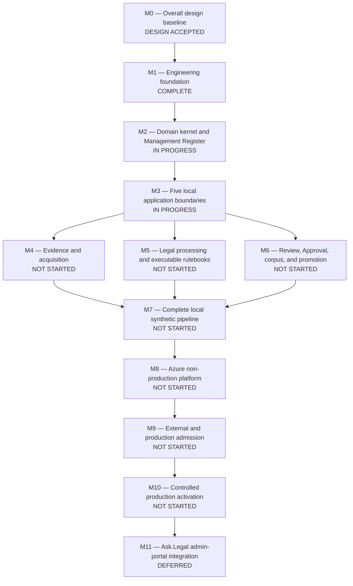

# AskLegal Legal Database Pipeline — Delivery Roadmap

Updated: 2026-08-16

## Purpose

This is the durable overall progress plan for turning the accepted pipeline
design into a locally proved, Azure-hosted, production-admitted system. It
tracks delivery state and dependency order; it does not replace the canonical
overall design, ADRs, or the exact current handoff in `WORKING_STATE.md`.

This roadmap contains no delivery-date estimate and grants no implementation
or operational authorization. Each implementation, external integration,
cloud proof, and production action remains separately gated.

## Honest progress summary

The project is **advanced in design but early in implementation**. The
architecture and Hong Kong legal-policy model are extensive. The normative
cross-cutting contract package plus the Python contract, type, durability,
package, synthetic image-admission, and architecture boundaries are locally
proved, and the narrow Management Register
behavior is proved on real local SQL Server. There is no complete application,
domain kernel, persistent
Management Register, local end-to-end pipeline, Azure environment, real-source run, model call, embedding run,
Pinecone promotion, or production activation yet.

| Area | Current state | Evidence or remaining gap |
|---|---|---|
| Overall design and architecture | **DESIGN ACCEPTED** | Architecture and implementation-facing design are accepted through ADR 0099, including all six M2–M7 protocols |
| Hong Kong legal-policy design | Advanced at design level | Legislation, case proposition/treatment, reconstruction, and HKEX Regulatory designs and conceptual catalogues exist; executable rulebooks, schemas, fixtures, source registers, evaluations, and attestations remain |
| Normative machine contracts | Foundation complete | Repository-owned Draft 2020-12 package 1.1.0 covers 54 shared objects, closed catalogues, lifecycle machines, and synthetic fixtures; Approval and Coverage Status match the accepted governance decisions |
| Python and Management Register foundations | All seven M1 checkpoints complete | Python 3.14.7 contract/type/package/architecture gates, synthetic image admission, the independent Node oracle, and separate real SQL Server and Durable Task emulator proofs pass |
| Remaining engineering proofs | M1 complete; first M2 lifecycle checkpoint complete | Separately authorize or decline the next bounded M2 command/effect-contract slice |
| Five applications and shared runtime packages | Boundary checkpoint complete; runtime not started | Five installable declarative application skeletons and 13 package roles exist; no service, worker, route, entry point, or runtime effect exists |
| Local end-to-end pipeline | Not started | No synthetic complete flow from acquisition through verified promotion exists |
| Azure infrastructure and delivery | Design selected; not implemented | Azure SQL, Container Apps, Scheduler, Blob, ACR, Application Gateway, Azure Pipelines, and Azure Monitor are selected but no Bicep, pipelines, or cloud resources exist |
| Real-source, model, embedding, and Pinecone operation | Not started | Azure OpenAI/Foundry is selected for both model families to match Ask.Legal Backend; exact deployments and every external proof remain disabled/uncreated |
| Production admission and activation | Not started | Security, recovery, quality, operational, and human-approval proofs remain |
| Ask.Legal admin-portal integration | Intentionally deferred | Integrate only after the standalone Review API and complete pipeline work |

Numerical percentage is deliberately omitted: counting accepted documents and
implemented production capabilities as equivalent units would overstate
progress.

## Status legend

- **COMPLETE** — required artifact and its stated validation exist.
- **IN PROGRESS** — at least one required implementation checkpoint is complete
  but the milestone exit gate is not.
- **DESIGN CLOSURE IN REVIEW** — a complete proposal exists, but material
  choices or final acceptance remain with the user.
- **DESIGN ACCEPTED** — direction is settled, but implementation proof does not
  yet exist.
- **NOT STARTED** — no authorized implementation checkpoint is complete.
- **DEFERRED** — intentionally paused by an explicit decision.
- **BLOCKED** — cannot advance because a required external choice or artifact
  is unavailable. No milestone is currently classified as blocked.

## Delivery map

The diagram shows proof dependencies, not a promise that all work must be
serial. Executable legal packages, exact policy values, and local adapters may
advance in parallel once their own prerequisites and authorization gates are
met.

For the M5-to-M7 dependency, M7 requires the Legal Desk package mechanism and
one closed test-only synthetic package, not completion of every production
Hong Kong package. Production packages remain separately in M5 until their own
complete source, rulebook, fixture, evaluation, and attestation gates pass. An
M7 success therefore proves that the local platform works; it does not mark an
unfinished real legal package complete.

## Milestones and exit gates

### M0 — Overall design baseline — DESIGN ACCEPTED

Delivered:

- greenfield modular-monorepo and five separately permissioned applications;
- evidence, Management Register, corpus, Approval, replacement-serving-target,
  recovery, and audit boundaries;
- detailed Hong Kong legislation, reconstruction, case proposition, case
  treatment, and HKEX Regulatory design-level rules and catalogues; and
- accepted production stack through ADR 0098.

Exit gate:

- accepted system-wide design exists and unresolved matters are explicitly
  listed instead of receiving implied defaults.

The 2026-08-16 full M2–M7 build-readiness audit is closed by accepted ADR 0099
and six accepted protocols:
Domain/Register, Application interfaces, Acquisition/Evidence, executable
Legal Desk, Review/Promotion, and end-to-end conformance. All seven material
decisions, including Decision 7's bounded semantic-decision authority, are
settled and the user explicitly accepted the reconciled package.

After design acceptance, exact source registers/rulebooks, deployed model
profiles, regions, capacity, security assignments, recovery/retention/service-
level values, budgets, and evaluations remain implementation artifacts or
admission evidence. Their absence keeps capabilities disabled.

### M1 — Engineering foundation — COMPLETE

Delivered:

- implementation-neutral normative `contracts/` package and validator; and
- completed Python 3.14.7 contract-boundary spike under `packages/contracts/`;
  and
- completed repository-wide type-boundary spike using official Pyright strict,
  automatic source discovery, a closed exception register, and 15 focused
  synthetic policy tests; and
- completed narrow Management Register spike with exact migrations, typed
  `mssql-python` adapter, stored procedures, least privilege, ledger,
  concurrency, retry, and lost-ack recovery proofs on real local SQL Server;
  and
- completed local durability spike with the standalone Microsoft Python SDK,
  deterministic fresh-worker replay, buffered stale and duplicate human
  events, fake-register reconstruction, and one effect across a lost-ack retry
  on both the always-on SDK backend and digest-pinned Docker emulator; and
- completed package spike with complete workspace-member coverage, two
  byte-identical offline wheel builds, member-specific clean locked installs,
  independent import isolation, and byte-identical container-input bundles;
  and
- completed local image-admission spike with two reproducible network-disabled
  OCI builds, normalized SPDX/provenance/scanner evidence, fail-closed
  vulnerability and licence policy, exact ORAS graph copy and recovery,
  isolated test-only signing, and locked-down runtime proof; and
- completed local architecture spike covering all five application skeletons,
  13 shared packages, exact direct dependencies, internal imports, cycles,
  declarations, and exclusive capability ownership, followed by the complete
  offline package proof for the expanded 18-member workspace.

Next checkpoints, in recommended order:

1. **Type-boundary spike — COMPLETE** — reject unapproved `Any`, unknown types,
   unparameterized collections, unchecked casts, ignored errors,
   infrastructure imports, and framework leakage.
2. **Management Register spike — COMPLETE** — real SQL Server proves exact migrations,
   least-privilege procedures, JCS bytes, idempotency, concurrency, outbox and
   inbox behavior, ledger checks, deadlock handling, and ambiguous commits.
3. **Durability spike — COMPLETE** — prove deterministic restart, duplicated human events,
   stale fingerprints, idempotent activities, and fake-register recovery.
4. **Package spike — COMPLETE** — exact network-disabled installation,
   independent imports, reproducible wheels, and reproducible container inputs.
5. **Image-admission spike — COMPLETE** — prove reproducible synthetic
   OCI graphs, SBOM, provenance, vulnerability and licence policies, test
   signing, exact graph copy, and fail-closed rejection without Azure.
6. **Architecture spike — COMPLETE** — enforce allowed application/package
   imports and capability surfaces.

Exit gate:

- all seven local proofs, including the completed contract spike, pass from
  exact locks with synthetic inputs and local fakes;
- architecture tests enforce the monorepo dependency and capability rules; and
- no external service is required for the ordinary test suite.

Current next action: separately authorize or decline the immutable Command
Envelope/Result and Effect Intent/Receipt contract/domain slice. The ordered
lifecycle correction is complete and does not itself authorize that next slice
or M3 runtime work.
The disposable SQL Server and Durable Task emulator containers have been
removed; their digest-pinned images may remain cached.

### M2 — Domain kernel and Management Register — IN PROGRESS

Completed checkpoint:

- the framework-free immutable lifecycle kernel for Pipeline Runs, Work Items,
  Source Contract Reviews, Coverage Gaps, and Quarantines: 37 closed states,
  61 contract-authoritative transitions, optimistic-version rejection,
  runtime-exact primitive validation, recurrence identities, exhaustive
  allowed/forbidden tests, independent contract-to-code equivalence, and one
  exact ordinary developer bootstrap/test command; and
- the narrow local Management Register adapter, first exact migration package,
  synthetic Approval/Serving State procedures, and real SQL Server conformance
  proof. This is foundation evidence, not the complete domain kernel or final
  production schema.

Design prerequisite: **ACCEPTED** in
`docs/design/M2_DOMAIN_AND_REGISTER_PROTOCOL.md`.

Build:

- framework-free immutable domain objects, IDs, fingerprints, state machines,
  commands, events, effect intents, results, and policy states;
- typed `ManagementRegisterStore` ports and fake implementation;
- exact forward-only SQL Server migration packages and narrow runner;
- command procedures, least-privilege views and roles, event/inbox/outbox
  persistence, projections, ledger verification, and recovery exports; and
- property, concurrency, replay, failure, and migration tests.

Exit gate:

- every normative lifecycle has executable transition tests;
- duplicate, concurrent, stale, and ambiguous operations reach one exact
  result; and
- a fresh local SQL Server can be built and verified only from fingerprinted
  migrations.

### M3 — Five local application boundaries — IN PROGRESS

Delivered checkpoint:

- declarative installable skeletons for all five applications and 13 canonical
  shared package roles, governed by closed dependency and capability tests.
  These skeletons have no routes, entry points, worker loops, configuration,
  credentials, or effects.

Design prerequisite: **ACCEPTED** in
`docs/design/M3_APPLICATION_INTERFACE_PROTOCOL.md`. Runtime implementation
must revise and re-prove the architecture manifest as specified there.

Build:

- control-plane FastAPI service;
- Review Application FastAPI service and a minimal replaceable browser client;
- acquisition, legal-processing, and promotion workers;
- separate configuration, identity, database, task-hub, secret, network, and
  effect ports for each boundary; and
- local fake adapters, health checks, OpenAPI, architecture tests, and
  independent package/container entry points.

Exit gate:

- each application starts and tests independently;
- forbidden imports and capabilities fail automatically;
- workers have no accidental HTTP, UI, Approval, or production credentials;
  and
- later admin-portal integration depends only on the versioned Review API.

### M4 — Evidence and acquisition — NOT STARTED

Design prerequisite: **ACCEPTED** in
`docs/design/M4_ACQUISITION_AND_EVIDENCE_PROTOCOL.md`.

Build:

- source registry, watcher, scraper, source-snapshot, evidence-vault, recovery-
  copy, content-addressing, hostile-content isolation, and coverage-accounting
  packages;
- deterministic synthetic source connectors and complete failure cases; and
- local primary/recovery vault fakes with conditional-create, exact-version,
  read-back, manifest, retention, and recovery tests.

Exit gate:

- every registered synthetic source observation has one explicit outcome;
- complete evidence is preserved before processing;
- missing, changed, contradictory, or hostile inputs fail closed or enter the
  exact Quarantine/Source Contract Review path; and
- no change signal can silently create model, embedding, or promotion work.

### M5 — Legal processing and executable rulebooks — NOT STARTED

Design prerequisite: **ACCEPTED** in
`docs/design/M5_EXECUTABLE_LEGAL_DESK_PACKAGE_PROTOCOL.md`. The M7 platform
proof uses one test-only synthetic package and satisfies no production Hong
Kong package gate.

Build initially around the accepted Hong Kong families:

- executable Hong Kong Legislation Source Rulebook, schemas, exact fixtures,
  current-baseline/update behavior, and reconstruction capability;
- executable Hong Kong Cases source register, proposition coverage ledger,
  treatment graph, renderers, exact fixtures, evaluation packages, and
  workflow-admission profiles;
- executable HKEX Regulatory source inventory, rules, schemas, complete
  conformance artifacts, and multilingual retrieval/answer admission; and
- Principles and any additional jurisdiction/material package only after its
  own source, rights, coverage, and rulebook decisions exist.

Azure OpenAI models sold by Azure through Microsoft Foundry are the selected
service boundary. Exact deployed models remain disabled until their immutable
evaluation/admission profiles pass. This does not block deterministic
contracts, rulebooks, renderers, fakes, or evaluation-package construction.

Exit gate:

- each enabled jurisdiction/material package accounts for its complete frozen
  source universe;
- exact deterministic and semantic gates pass without evaluation leakage;
- uncertainty never becomes guessed legal status or searchable text; and
- only an exact admitted workflow may make a model-assisted proposal.

### M6 — Review, Approval, corpus, and promotion — NOT STARTED

Design prerequisite: **ACCEPTED** in
`docs/design/M6_REVIEW_AND_PROMOTION_PROTOCOL.md`.

Build:

- Review API evidence, comparison, rejection, revocation, single-role human-
  identity, reason, and single-consumption contracts;
- immutable Corpus Releases, Desired-State Inventories, coverage-status
  manifests, Promotion Manifests, Approval, and Serving State lifecycle;
- embedding, Pinecone, backup, routing, verification, rollback, and exact
  retirement ports with local fakes; and
- the promotion worker's full stale-approval, overlap, drift, recovery,
  replacement-target, cutover, and rollback checks.

Exit gate:

- one human decision binds one exact frozen package and execution lineage;
- any material change invalidates Approval;
- a synthetic replacement serving target exactly matches the desired state
  before simulated cutover;
- exact rollback and recovery are independently verified; and
- broad or inferred deletion is impossible.

### M7 — Complete local synthetic pipeline — NOT STARTED

Design prerequisite: **ACCEPTED** in
`docs/design/M7_END_TO_END_CONFORMANCE_PLAN.md`.

Prove the entire locally runnable flow:

1. schedule and observe a synthetic source;
2. preserve exact evidence;
3. apply one executable Legal Desk rulebook;
4. create candidate records and complete coverage accounting;
5. freeze a Corpus Release, Desired-State Inventory, and Promotion Manifest;
6. inspect and approve through the Review API/client;
7. embed and build a replacement fake serving target;
8. verify, cut over, report, recover, and roll back; and
9. repeat failure, retry, duplicate, restart, stale-approval, overlap, hostile-
   input, and no-change cases.

Exit gate:

- a new developer can reproduce the full flow offline from documented exact
  commands and locks;
- all artifacts and effects are deterministic and traceable; and
- every external system is still represented by a local fake.

This is the point at which the pipeline itself first genuinely works. The
admin-portal integration remains after it.

### M8 — Azure non-production platform — NOT STARTED

Build under separate authorization:

- repository-owned Bicep, policy, identities, role assignments, networks,
  private DNS, Azure SQL, Container Apps, Scheduler, Blob/Confidential Ledger,
  ACR/Artifact Signing, Application Gateway, Azure Monitor, audit archives,
  and Azure Pipelines/Managed DevOps Pools;
- exact Deployment Change Packages, what-if review, operational approval,
  image admission, migration, deployment, evidence, drift, rollback, and
  retirement jobs; and
- measured configuration values for region, capacity, service levels,
  retention, recovery, security, observability, and cost.

Exit gate:

- a non-production environment is reproducible from reviewed source and exact
  immutable inputs;
- private paths, least privilege, workload federation, policy denial, audit
  sealing, and independent recovery evidence are proved; and
- no reusable Azure deployment credential is present.

### M9 — External and production admission — NOT STARTED

Prove separately authorized real integrations without granting production
mutation merely because an integration works:

- official/publisher source rights, authorization, completeness, rate, outage,
  hostile-input, and change-detection behavior;
- exact Azure OpenAI/Foundry generative and embedding deployment profiles,
  SDK/API, identity, network, data-location, retention, abuse-monitoring,
  quota, cost, outage, evaluation, and admission evidence;
- Pinecone replacement-index, backup, desired-state, search-quality,
  generation-pinning, and rollback behavior;
- Entra, Conditional Access, WAF, audit export, alerting, incident, recovery,
  restore, and regional replacement drills; and
- complete security, privacy, legal, quality, operational, and cost sign-off.

Exit gate:

- every production dependency has current evidence and an admitted exact
  profile;
- source, model, embedding, retrieval, recovery, security, and operational
  gates all pass; and
- a frozen production-candidate package is ready for human approval without
  making any production change.

### M10 — Controlled production activation — NOT STARTED

Perform only under exact operational and legal Promotion approvals:

- deploy the admitted application and infrastructure digests;
- build and verify the complete production-candidate serving state;
- warm and test the separate Ask.Legal production-candidate routing path;
- activate one exact generation, observe it, and preserve all receipts;
- demonstrate bounded rollback and recovery; and
- establish routine reconciliation, quality, security, recovery, cost,
  incident, and audit operations.

Exit gate:

- every question in the canonical design's definition of success can be
  answered from preserved evidence and reports; and
- Ask.Legal serves only the exact verified and approved state.

### M11 — Ask.Legal admin-portal integration — DEFERRED

After M7 proves the pipeline and the Review API contract is stable:

- admit the existing Ask.Legal admin portal as a separate Review API client;
- reproduce reviewer evidence, comparison, rejection, revocation, approval,
  single-role authorization, accessibility, and audit behavior inside the portal;
- retain Review API authorization and Management Register write boundaries;
  and
- retire or retain the standalone browser shell through an explicit product
  decision.

Exit gate:

- portal integration changes only the reviewer experience, not pipeline,
  Approval, evidence, or promotion correctness.

## Cross-cutting gates that apply to every milestone

- **Authorization:** success at one capability never authorizes the next.
- **Contracts:** normative schemas and exact fingerprints lead implementation.
- **Evidence:** preserve inputs and receipts before consequential effects.
- **Least privilege:** each application, job, identity, role, subnet, and
  credential receives only its owned capability.
- **Determinism and idempotency:** retry, duplicate, restart, overlap, and
  ambiguous outcomes have exact tested results.
- **Uncertainty:** block, quarantine, or request review; never guess or skip.
- **Quality:** contract validity does not replace legal, semantic, retrieval,
  security, recovery, or operational admission.
- **Reversibility:** production mutation requires exact recovery evidence and
  independently verified rollback.
- **Handoff:** update `CONTEXT.md`, `DECISIONS.md`, `WORKING_STATE.md`, and this
  roadmap when a milestone status or dependency materially changes.

## Immediate decision and work queue

1. **Design-decision gate:** decision 1 selected Azure OpenAI/Foundry for both
   model families. Decision 2 selected one human administrator role with no
   step-up freshness, Approval TTL, or absence-cover construct. Decision 3
   selected severity, named assignment, immediate urgent notification, optional
   due times, and no fixed review SLA. Decision 4 selected a separate restricted
   production-candidate App Service slot, manual validated swap, and reverse-
   swap rollback; development remains development-only. Decision 5 selected the
   exact environment/jurisdiction/date/state Pinecone name. Decision 6 selected
   the complete immutable, fingerprint-bound Coverage Status Manifest with
   protected retrieval, verified caching, activation blocking, and fail-visible
   unavailability, without a signing-key lifecycle. Decision 7 selected
   LLM-assisted Gazette-event analysis/challenge and Reconstruction Plan
   decision/challenge; offline evaluation is deterministic against human-
   adjudicated truth, and every other unallocated task defaults to
   deterministic handling for now.
2. **Design-acceptance gate — COMPLETE:** ADR 0099 and D1–D6 are accepted.
3. **First M2 implementation gate — COMPLETE:** the framework-free lifecycle
   kernel and its ordered five-step correctness correction pass.
4. **Corrective M2 gate — COMPLETE:** all six guard decisions and all five
   correction steps are accepted and proved.
5. **Accepted-design reconciliation — COMPLETE:** M2/M3/M6 prose, ADR status
   wording, Approval 1.1.0, Coverage Status 1.1.0, and their independent
   fixtures are aligned.
6. **Next M2 feature gate:** separately authorize
   or decline the Command Envelope/Result and Effect Intent/Receipt slice.
7. **Later milestone gates:** separately authorize M3–M7 implementation only
   when their prerequisites and prior exit evidence permit it.
8. **Admission work:** populate and prove the exact source, model, Azure,
   security, recovery, retention, service-level, capacity, cost, and operator
   profiles before activating their capabilities.

The repository now includes the seven completed M1 checkpoints, the narrow
Management Register checkpoint, and the accepted first M2 lifecycle checkpoint.
No completed gate authorizes the next
implementation slice.
