# Ask.Legal Autonomous Legal Database Pipeline — Initial Overall Design

Updated: 2026-08-10

Status: greenfield modular-monorepo design in progress
Authorization: design and documentation only; this document does not authorize
implementation, release publication, embedding-provider calls, Pinecone access,
or any remote change.

## 1. Executive summary

Ask.Legal needs a low-touch system that regularly checks official legal
sources, discovers changes, prepares updated searchable material, and keeps the
Pinecone search database aligned with approved current law.

The system is designed around five promises:

1. **Current search:** Pinecone contains only the approved material Ask.Legal
   currently intends to serve. It is not the permanent legal archive.
2. **Official evidence:** every proposed change is traceable to preserved
   official source material.
3. **Human control:** one person reviews and approves the complete weekly
   change package before any production change.
4. **Safe uncertainty:** the system does not guess. Unclear items are held for
   review while unrelated clear changes may continue.
5. **Reversibility:** old material, exact releases, reports, and recovery data
   are preserved outside Pinecone so an approved state can be rebuilt.

### System at a glance

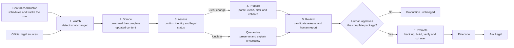

The main handoff is deliberate:

- **Watchers** answer: “Did something change?”
- **Scrapers** answer: “What is the complete updated content?”
- **Desks** answer: “What does the complete official evidence mean, and should
  this material be processed?”
- The **preparation pipeline** turns that preserved content into validated
  search records.
- The **human reviewer** controls whether the complete proposed update may
  reach production.

## 2. What the system is—and is not

### The system will

- check authoritative legal sources on a schedule;
- preserve exactly what it observed;
- detect additions, replacements, commencement events, repeals, corrections,
  and later case treatment;
- scrape the complete updated content and its source metadata when a watcher
  raises a possible-change signal;
- prepare and validate proposed search records;
- explain every proposed addition, change, exclusion, and retirement;
- obtain one approval for the exact complete package;
- apply only the approved production changes; and
- verify and report the final result.

### The system will not

- treat Pinecone as the permanent source of truth;
- provide historical or “law as at date” search;
- place uncommenced legislation in the ordinary current-law search database;
- reconstruct amended legislation by guessing how amendment instructions fit;
- predict that a case will be overruled;
- silently resolve conflicting official evidence;
- create artificial case propositions where none are supported;
- provide duplicate whole-case overview records or whole-case retrieval;
- partly apply an approved package; or
- delete records using broad, uncontrolled deletion commands.

## 3. Plain-language glossary

| Term | Meaning in this design |
|---|---|
| **Pinecone** | The searchable shelf used by Ask.Legal. It is replaceable and contains only the approved serving copy. |
| **Management register** | The control ledger: what material exists, its status, when it was checked, what changed, and where it is in the workflow. |
| **Evidence vault** | The filing cabinet: exact downloads, old versions, reports, approvals, releases, and recovery material. |
| **Corpus Release** | A sealed, immutable version of the complete set of legal records proposed or approved for search. |
| **Desired-state inventory** | The exact complete list of records that should exist in one Pinecone target after an approved update. |
| **Promotion manifest** | The sealed plan that joins all affected releases, Pinecone targets, additions, replacements, removals, recovery evidence, and checks into one approval package. |
| **Search record** | One unit of legal text prepared for semantic search. |
| **Frozen package** | The exact proposed update submitted for approval. If anything changes, it must be rebuilt and approved again. |
| **Quarantine** | A holding area for unclear or conflicting items. Quarantined material does not enter production. |
| **Watcher** | A lightweight source-specific monitor that detects possible additions, changes, removals, and status events. |
| **Scraper** | A source-specific worker that downloads the complete changed legal content and its source metadata after a watcher raises a change signal. |
| **Desk** | A specialist responsible for the legal rules of one jurisdiction and material type, such as Australian legislation. |
| **Preparation pipeline** | The shared steps that parse, clean, distil, and validate scraped content before it can become a candidate release. |
| **Digest** | A digital fingerprint used to prove that approved files have not changed. |
| **Cutover** | The controlled moment when Ask.Legal starts searching the newly verified database state. |
| **Control plane** | The application that schedules work, records workflow state, coordinates packages, and reports health without holding destructive production credentials. |
| **Application** | A separately runnable and permissioned program inside the monorepo. |
| **Package** | A reusable module with a declared public interface and enforced dependency direction. |
| **Modular monorepo** | One Git repository containing several bounded applications and packages without merging their credentials, identities, or deployment powers. |

## 4. Overall pipeline scope

The intended complete pipeline prepares and, after approval, executes a normal weekly
update of the current-law search database. It covers every registered
jurisdiction-and-material combination across legislation, cases, and
Halsbury/reference-book principles. Each combination may have different source
and legal-status rules, but all of them pass through the same evidence,
validation, approval, recovery, and audit controls.

An urgent manual run may be requested when waiting for the weekly cycle would
create an unacceptable coverage gap. It follows exactly the same controls as a
scheduled run; urgency never bypasses evidence, validation, approval, backup,
or verification.

This is an initial design of the overall pipeline, not a final specification.
It maps the intended complete system, records decisions already made, and keeps
unresolved design choices visible. Implementation sequence, temporary operating
modes, migration plans, and delivery estimates are outside its scope.

The complete rebuilt pipeline will live in the greenfield
`AskLegal-LegalDBPipeline` modular monorepo. The older local repositories are
reference material only and do not define this system's code or repository
boundaries.

## 5. Architecture and responsibility

### 5.1 Coordinator, desks, and source teams

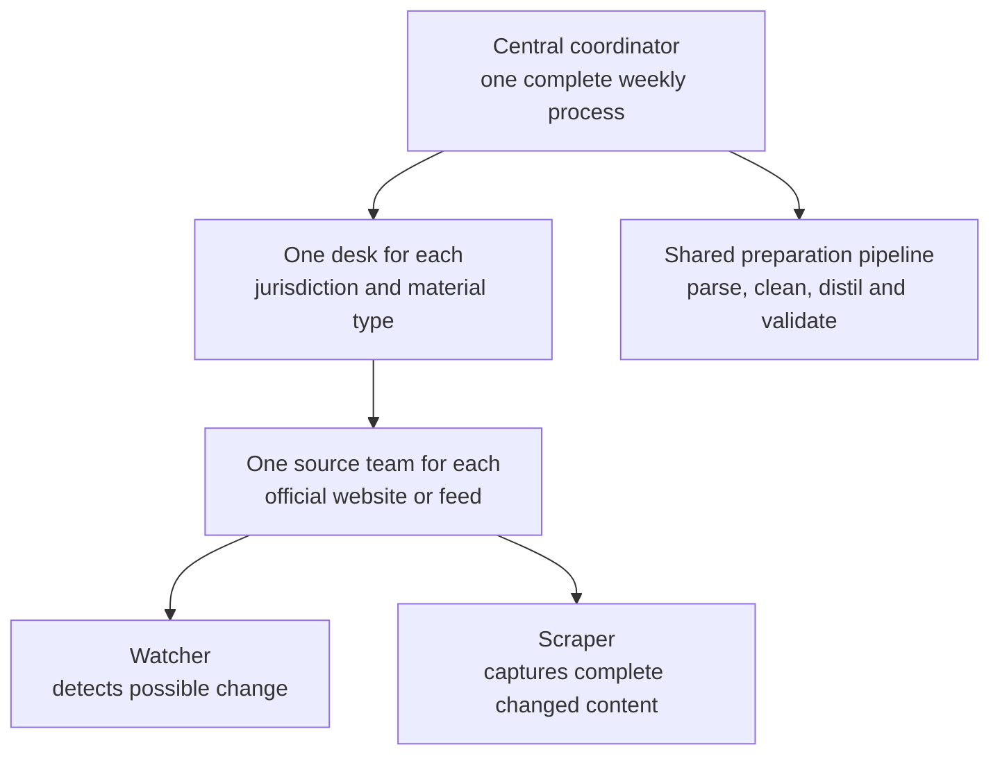

| Role | Responsibility | Must not do |
|---|---|---|
| **Watcher** | Perform scheduled lightweight checks, compare source inventories or status pages, raise possible-change signals, and preserve check evidence. | Treat a change signal as the complete legal content or decide legal truth. |
| **Scraper** | After a watcher raises a change signal, retrieve the complete changed document, related source metadata, and any required official attachments; preserve the raw result exactly. | Decide legal status, alter the raw source, or publish records. |
| **Desk** | Apply the jurisdiction’s source rules, identify legal status, reconcile sources, and prepare fully supported results. | Override unresolved official conflicts. |
| **Preparation pipeline** | Parse and clean the scraped content, distil it into the correct legal-record form, and validate every result against the applicable contract. | Repair source deficiencies by guessing or send invalid records forward. |
| **Coordinator** | Schedule work, enforce common safety checks, assemble the complete package, manage approval, verification, reporting, and recovery. | Invent jurisdiction-specific legal rules. |
| **Human reviewer** | Approve or reject the complete frozen production package. | Approve a moving or partly defined target. |
| **Executor and verifier** | Perform only the exact approved steps, check the resulting inventory and content, and record the result. | Change the package, improvise, or apply only part of it. |

For example, the Australian legislation desk may own a Federal Register source
team containing both a Federal Register watcher and a Federal Register scraper.
The watcher checks cheaply for change; its signal triggers the registered
scraper; and the desk evaluates the complete captured evidence. The watcher and
scraper may share source-specific components, but they remain separate
responsibilities.

This structure allows source-specific acquisition without creating many
uncoordinated legal decision-makers.

### 5.2 Three places for information

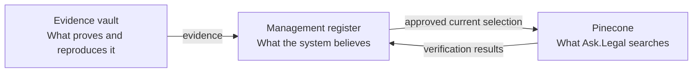

These roles stay logically separate even when the same technology provider
supports more than one of them.

Watcher check results, detected-change signals, desk decisions, and scraper job
status belong in the management register. Exact watcher responses, complete
scraped documents, attachments, and source metadata belong in the evidence
vault.

### 5.3 Source registry and scheduler

The coordinator needs a complete source registry so that “nothing changed” can
be distinguished from “we forgot to check a source.” For every source, it
records:

- the responsible desk, watcher, and scraper;
- the official source location and material covered;
- the expected check schedule;
- the last attempted and last successful check;
- the watcher’s comparison method;
- the conditions that trigger a scraper run;
- the scraper’s required documents, attachments, and metadata; and
- any active source failure, quarantine, or retry state.

The scheduler creates work from this registry. Watcher results and scraper jobs
are recorded in the management register so a detected change cannot be lost
between discovery and acquisition.

### 5.4 Capability boundaries

The finished system keeps the following capabilities distinct even though
their code lives in one repository:

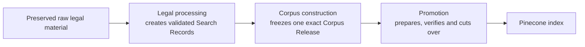

A successful capability does not automatically authorize the next. In
particular, validated legal records are not permission to freeze a Corpus
Release, and a Corpus Release is not permission to call an embedding provider
or change Pinecone. These are artifact, permission, credential, and
verification boundaries rather than Git-repository boundaries.

The existing local repositories may be inspected for lessons and verified
behavior. The greenfield system does not inherit their code, contracts,
schemas, or internal structure automatically.

### 5.5 One complete desired state

Individual desks and source teams produce separate results, but retirement is
safe only when the coordinator can see the whole target. A jurisdiction's
Pinecone target may contain legislation, case propositions, and reference-book
principles from several releases. Comparing one of those releases with the
whole target would wrongly label every other material family as obsolete.

The coordinator therefore builds a **desired-state inventory** before proposing
any production action. It identifies:

- every release that contributes to the target;
- which desk and material family owns each record;
- every expected record ID and content fingerprint;
- records that are new, changed, unchanged, or genuinely retired; and
- any existing record that is not owned by the managed corpus.

Unowned or unexplained production records block automatic retirement. No desk,
watcher, scraper, or individual release may calculate deletion against a shared
target by itself.

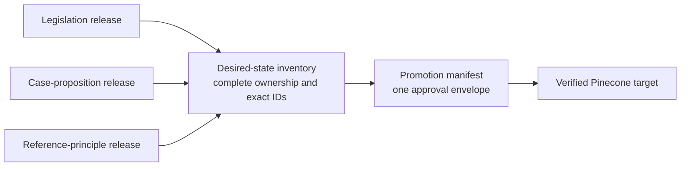

One human approval covers the complete promotion manifest, even when it contains
several releases or targets. The manifest is the unit of approval; a single
profile release is not.

### 5.6 Traceability and stable identity

Every production record needs an unbroken chain:

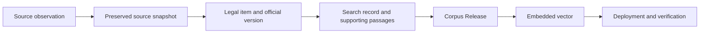

The design must distinguish the identity of a legal item from the identity of a
particular source file, version, search record, and vector. Stable ID rules must
cover renumbering, source-file moves, corrected judgments, substituted
provisions, proposition splits and merges, and reinstatement of retired
material. Each replacement or retirement records its predecessor and reason;
records are never silently reused for a different legal meaning.

IDs must be unique within every complete Pinecone target. Cross-profile
collisions, duplicate source captures, and two workers claiming the same legal
item are validation failures, not matters for the executor to resolve.

### 5.7 Core register objects and legal time

The management register is more than a task list. It holds the relationships
that make the system explainable:

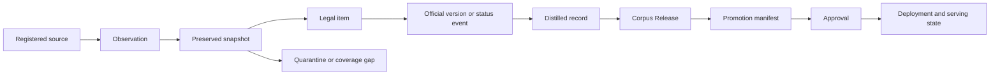

Important facts are append-only: a later observation or correction does not
erase what the system previously saw or served. The register derives the
current operational view from preserved events and records all manual
overrides with a reason and author.

Legal and operational dates are not interchangeable. The system separately
records, when available:

- the legal event or effective date, such as commencement or repeal;
- the source publication, correction, or compilation date;
- the time the system observed and preserved the source;
- the approval time; and
- the deployment and Ask.Legal cutover time.

Dates include their source and time zone. Missing dates remain unknown rather
than being inferred. Retrospective legal events retain both the official legal
effect date and the later observation date.

### 5.8 Greenfield modular-monorepo architecture

All pipeline code lives in one repository, but the final system is not one
undifferentiated application.

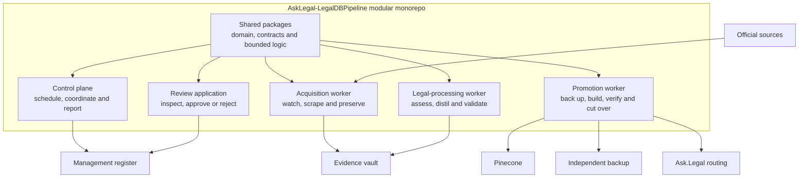

| Application | Owns | Must not have |
|---|---|---|
| **Control plane** | Scheduling, source registry, workflow state, package coordination, coverage status, and reporting | Pinecone deletion or routing credentials |
| **Review application** | Human inspection, approval, rejection, comments, and revocation | Authority to alter the frozen package |
| **Acquisition worker** | Watchers, scrapers, source access, and immutable evidence capture | Approval or production-search credentials |
| **Legal-processing worker** | Parsing, Legal Desk rules, candidate records, evidence-bound AI work, and validation | Approval or production mutation authority |
| **Promotion worker** | Embeddings, recovery checks, replacement targets, final verification, cutover, and exact approved retirement | Authority to change the approved manifest or legal conclusions |

Shared packages contain reusable logic rather than independent authority:

```text
packages/
├── domain/                 stable legal and workflow concepts
├── contracts/              versioned schemas and compatibility rules
├── management-register/    durable-ledger interfaces
├── evidence-vault/         immutable-evidence interfaces
├── source-connectors/      source-specific watchers and scrapers
├── legal-desks/            jurisdiction-and-material rules
├── processing/             parsing, distillation and AI bindings
├── corpus/                 releases, desired state and record lineage
├── promotion/              embedding, target and cutover rules
├── reporting/              human and machine-verifiable reports
└── observability/          health, alerts, audit and incident signals
```

Dependency direction is enforced:

- applications may depend on packages; packages do not depend on applications;
- domain and contract packages do not depend on infrastructure adapters;
- source connectors capture facts but do not decide legal status;
- Legal Desks interpret evidence but do not approve or deploy;
- processing creates candidate records but does not promote them;
- corpus construction produces immutable artifacts but does not authorize use;
- promotion consumes only an exact valid Approval and Promotion Manifest; and
- architecture tests reject forbidden imports and dependency cycles.

Repository colocation does not merge runtime trust. Each application has its
own identity, secrets, network access, deployment job, and minimum database or
storage permissions. Large legal corpora, Source Snapshots, Corpus Releases,
embedding caches, reports containing operational data, backups, credentials,
and production state stay outside Git. An ignored local `var/` tree may imitate
those stores during development.

A component should move to a separate repository only if a real long-term
team, legal access, external distribution, or independent release-lifecycle
boundary emerges. Source count, jurisdiction count, worker scaling, or
different credentials alone do not require another repository.

## 6. Source authority and evidence

Every desk has a written **source rulebook**. It states which official source
controls each fact:

- whether a legal item exists and how it is identified;
- its exact text;
- commencement, repeal, expiry, withdrawal, or other status;
- official corrections and replacement versions; and
- discovery only.

“Official source wins” is not enough because different official sources may
control different facts. For example, an authorised consolidation may control
the current wording of an Act, while a commencement notice controls when an
amendment starts.

Secondary sources may reveal a possible gap or trigger an official check. They
cannot by themselves authorize a production change.

When official sources conflict, the desk first applies any explicit official
replacement rule. If the conflict remains, it preserves all evidence,
quarantines the affected item, and explains the problem in the weekly report.
The watcher supplies change evidence, the scraper supplies the complete source
content, the desk applies legal source rules, and the coordinator accepts only
supported, non-conflicted results.

Each source rulebook also states exactly what the scraper must capture. A
single “download the page” instruction is not enough when the complete legal
item depends on a main document, schedules, attachments, correction notices,
commencement tables, endnotes, or version history.

### 6.1 Completeness cannot rely only on change alerts

A watcher can miss a change because an official feed is incomplete, a website
layout changes, pagination breaks, or an item disappears without a normal
event. The intended pipeline therefore uses two checks:

1. frequent watcher checks for efficient change discovery; and
2. periodic full reconciliation of the official source inventory against the
   management register.

The full reconciliation detects missing sources, unexplained disappearances,
duplicate items, missed changes, and sources that have silently stopped
updating. A missing page is not treated as proof of repeal or withdrawal. The
desk must find the official status evidence required by its rulebook.

Each run has an explicit observation cutoff. Source events first observed after
that cutoff belong to a later package. All documents and attachments for one
legal item must represent a compatible official version; mixed-time snapshots
are rejected.

Source failures use bounded retries and remain visible until resolved. The
register records freshness expectations, last successful observation, outage
duration, and whether the failure creates a search coverage risk. A no-change
claim is valid only when every required source check completed successfully.

### 6.2 Source permission, integrity, and hostile content

For every source, the register records the legal basis for obtaining, storing,
processing, and displaying its material, including any licence, terms, access
limits, attribution duty, and retention restriction. This is especially
important for commercial reference books and case-law providers. A technically
accessible source is not automatically permitted for every use.

Downloads retain retrieval time, source location, content fingerprint, and
available publisher signature or checksum. Redirects, corrections, and
replacements are preserved as evidence rather than overwriting earlier files.

Downloaded text is untrusted input. Instructions embedded in a judgment, web
page, PDF, or metadata field cannot change the system's rules, prompts,
credentials, tools, or approval state. Scrapers and AI processing operate with
the least access needed and cannot turn source text into executable commands.

## 7. Weekly operating cycle

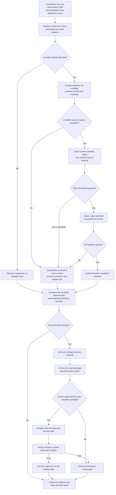

### Important workflow rules

- A genuinely clean no-change report needs no approval because it proposes no
  production action.
- A source failure or quarantine is not reported as “no change.”
- A watcher signal is not enough to prepare records. The required scraper run
  must finish completely, and the preserved result must pass validation.
- A partial or failed scrape is treated as a source failure and cannot reuse a
  mixture of old and new source content.
- An unclear Act does not block unrelated clear changes. The unclear Act is
  quarantined before the clean remainder is frozen for approval.
- Once frozen, approval is all-or-nothing. If the reviewer rejects one included
  change, the package is corrected and rebuilt with new fingerprints.
- One target cannot have two promotions in progress. A later run waits and is
  recomputed against the state that actually wins the earlier cutover.
- Retries are bound to the same input fingerprints and resume from durable
  checkpoints without duplicating records or actions. Changed inputs create a
  new run rather than altering the old one.
- Approval is valid only for the exact observed sources, desired-state
  inventory, settings, target state, recovery evidence, and time window in the
  frozen package. A relevant change before execution invalidates approval.
- Immediately before any remote write, the executor repeats safety checks for
  target identity, current inventory, configuration, credentials, recovery
  readiness, and approval validity.
- Failures before cutover leave Ask.Legal on the previous verified state.
- Failures after cutover trigger the documented recovery procedure; the exact
  served state and every compensating action are recorded.

### Promotion state and concurrency

The management register uses explicit states so a run cannot skip a control:

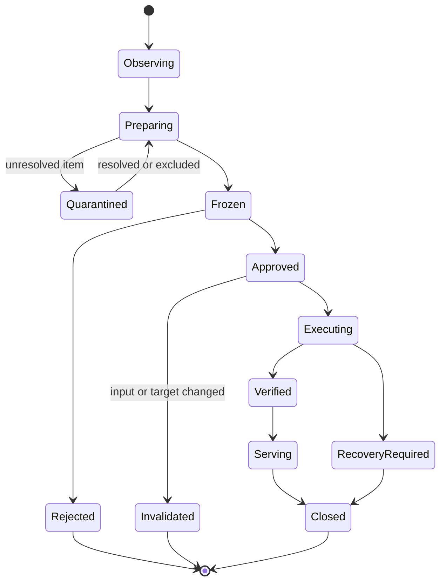

Every transition records who or what made it, when, why, and the fingerprints
of the inputs and outputs. Abandoned and superseded runs remain visible. A
scheduled run, urgent run, retry, and recovery cannot silently compete for the
same target.

## 8. What Pinecone contains

Pinecone is a clean serving copy, not the evidence archive.

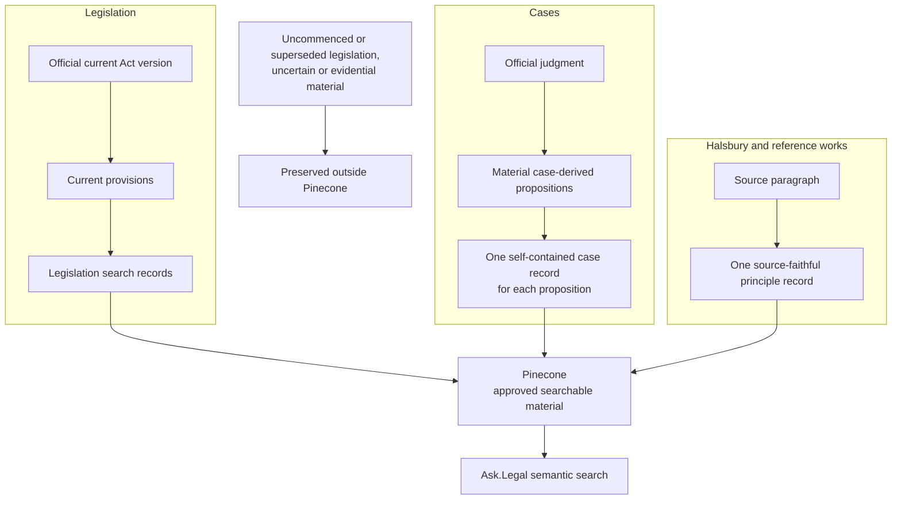

The three material families have different rules, described below.

“Current” is family-specific. For legislation it means the officially supported
operative text. For cases it means the official proposition together with the
latest supported treatment needed to prevent it being mistaken for good law;
negatively treated authorities may remain searchable only under the case rules
below. For a reference work it means the latest source-faithful paragraph the
system is permitted and able to maintain, subject to any visible currency date
and withholding rule.

For every accepted Corpus Release, one validated search record becomes exactly
one vector with the same record ID. The deployment stage embeds only the text
selected by the sealed record contract and forwards only approved query
metadata. It cannot silently skip, split, merge, rewrite, or enrich records.
If even one record is invalid or cannot be represented safely, the affected
release is rejected before promotion.

### 8.1 Serving schema and grouping

The searchable text must be understandable on its own, but text alone is not
enough to operate search safely. The serving layer also needs stable machine
identifiers for the legal item and its parent grouping. For example, all
propositions from one case must share a parent-case key so Ask.Legal can avoid
letting one judgment crowd out other authorities.

The final search contract must support, directly in Pinecone metadata or through
a verified adjacent lookup:

- record ID and parent legal-item ID;
- jurisdiction and material type;
- official source and display citation;
- source/version fingerprint and release identity;
- opinion or provision locator where applicable; and
- any current warning that the user must see with the result.

Operational and evidential detail stays in the management register and evidence
vault. Query-time fields must not depend on parsing human prose or filenames.
Changing the serving schema requires a new sealed contract and complete
validation of the affected corpus.

### 8.2 Search-quality gate

Exact record counts prove database integrity, not usefulness. Before cutover,
the candidate serving state must also pass a fixed retrieval test set covering
each jurisdiction and material family. Tests include expected authority
retrieval, filters, citation display, warning display, proposition grouping,
duplicate suppression, and absence of quarantined or retired material.

The same tests run end-to-end through Ask.Legal after cutover. A material
regression blocks acceptance even if every vector was written successfully.

The embedding provider, model, dimensions, distance metric, and text-building
contract are pinned to each serving state. An embedding-model change requires a
complete compatible rebuild and verified cutover; incompatible vectors are
never mixed in one serving target.

### 8.3 Coverage status outside search

A clean Pinecone index cannot itself explain that a source is down, a commenced
amendment is awaiting an official consolidation, or an item is quarantined.
Silence would make a known gap look like a negative search result. The
management register therefore publishes a small, verified coverage-status
manifest for Ask.Legal and operators. It names affected jurisdictions or legal
items, the type and start time of the gap, and the last known good state.

This manifest does not make prospective, uncertain, or old legal text
searchable. It allows the application to display an appropriate warning when a
known coverage problem could affect an answer.

## 9. Legislation model

### 9.1 Record structure

Legislation is tracked from the complete Act down to the searchable record:

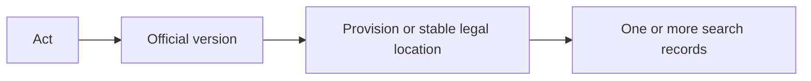

Every record can therefore be traced back to its Act, official version, and
legal location. Long provisions may create several search records without
losing that parent relationship. This supports precise change detection,
replacement, reporting, reuse of unchanged work, and recovery.

### 9.2 Prospective legislation: the waiting room

“Prospective legislation” means enacted or assented legislation that has not
yet commenced. Bills and drafts are outside this category.

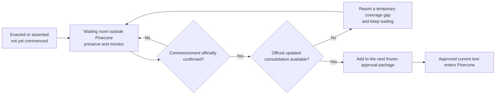

The system may prepare text and validation work in advance in the final target
system, but the material remains outside Ask.Legal search until official
commencement evidence and an official updated consolidation are available.

The system does not splice amendment instructions into an old Act. If an
amendment has commenced but the official consolidation has not caught up, the
system reports a temporary current-law coverage gap and waits.

### 9.3 Required lifecycle states

The management register must distinguish at least:

- enacted or assented, not commenced;
- commencement scheduled for a fixed date;
- commencement dependent on an order, proclamation, or event;
- partially commenced;
- in force;
- repealed or expired; and
- uncertain or source-conflicted.

Straightforward fixed-date commencement is easier than partial, conditional,
retrospective, or amended commencement. The source rulebook must define the
evidence required in each jurisdiction.

### 9.4 Source displays differ by jurisdiction

The system must not assume that every official website displays prospective
and current law in the same way.

- **Australian Commonwealth:** a normal authorised compilation generally
  represents the law as amended and in force at its compilation date.
  Informational future-law compilations must not enter the current-law index.
  An “in force” listing does not prove that every provision has commenced, and
  the latest compilation may temporarily lag a commenced amendment.
- **Singapore:** the official site separately exposes current and uncommenced
  material and provides a legislation timeline.
- **United Kingdom:** revised legislation may show prospective effects inside
  the source display.

Each source team therefore follows its own rulebook and status data rather than
inferring legal effect merely from whether text appears on a page.

## 10. Case-law model

### 10.1 Search unit

The final case search unit is **one material legal proposition from a case**.
Each proposition becomes a separate Pinecone record with `type: "case"`.

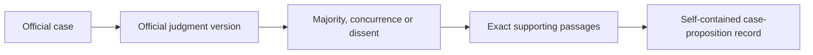

Each proposition record contains the context needed to understand that
proposition:

- case name, citation, court, and date;
- relevant material facts and legal issue;
- the court’s answer;
- important qualifications or exceptions;
- how the court applied the proposition;
- the relevant outcome;
- whether it comes from a majority, concurrence, or dissent; and
- exact supporting judgment passages.

The system must not create one record per sentence, invent unsupported
propositions, or blend different opinions. Search should avoid allowing many
records from one case to crowd out other authorities.

There is no duplicate case-overview vector and no separate whole-case retrieval
feature. The complete judgment, case dossier, evidence, and review history are
preserved outside Pinecone only for management, audit, recovery, and future
reprocessing.

If a case contains no distinct material proposition, it creates no Pinecone
record. If the system is unsure, it quarantines the case for human review
rather than excluding it or inventing a proposition.

The final case contract must encode this proposition-level model, including
stable parent-case identity, exact evidence links, opinion attribution, and
complete source accounting.

### 10.2 Later treatment

The system starts from observed official judgments, not predictions.

| Later event | System response |
|---|---|
| Pending appeal | Show a warning in the human report; leave Pinecone unchanged. |
| Applied or followed | Record positive treatment. |
| Distinguished, doubted, or criticised | Record the treatment; do not retire the proposition. |
| Expressly disapproved or refused to follow | Quarantine for human review. |
| Expressly overruled | Link the later judgment to the affected proposition and keep that record searchable only with an inseparable sourced treatment warning; unaffected propositions remain searchable without being mislabeled. |
| Reversed or set aside | Review only the propositions affected by the appellate result. Do not erase the entire earlier case automatically. |

Every treatment classification must identify the later case, earlier case,
affected proposition where possible, court relationship, opinion type, exact
supporting passages, confidence, and review state. Unclear mapping is
quarantined.

AI may detect citations and propose a treatment classification. It may not
predict overruling or retire a proposition merely because it appears weak.
Production changes remain part of the complete human-approved package.

### 10.3 AI-produced case material

Case-proposition extraction and later-treatment classification are the parts of
the system most dependent on AI judgment. They require controls beyond ordinary
file validation:

- every factual and legal claim must point to exact preserved judgment passages;
- case identity, citation, court, date, record ID, and output structure are
  determined or checked by non-AI rules;
- the exact model, prompt, schema, source fingerprint, and settings are pinned
  to each accepted result;
- unsupported, internally inconsistent, low-confidence, or incomplete results
  are quarantined rather than repaired by guesswork;
- a representative evaluation set tests missed propositions, invented
  propositions, opinion attribution, treatment mapping, and material factual
  distortion across jurisdictions and court levels; and
- any material model, prompt, or extraction-rule change must pass that
  evaluation and creates new traceable results rather than silently rewriting
  accepted history.

The system also measures source coverage. “No later treatment found” means only
that none was found in the official sources successfully checked; it is not a
claim that no such treatment exists anywhere.

## 11. Halsbury and reference-book principles

Case-derived propositions and Halsbury/reference-book principles are separate
families:

| Case-derived proposition | Halsbury/reference-book principle |
|---|---|
| Derived from an official judgment | Taken from a secondary reference work |
| Pinecone `type: "case"` | Pinecone `type: "principle"` |
| One self-contained material proposition | Normally one source-faithful source paragraph |
| May receive later-treatment information tied to a later case | Remains faithful to the publisher’s paragraph and notes |

The system preserves the existing Halsbury model. It does not split a paragraph
into newly written atomic rules or silently rewrite the publisher’s text. The
normal record contains the existing Context, Passage, optional currency date,
and Authorities and notes. Existing deterministic splitting of long paragraphs
may continue.

The management register privately tracks the paragraph’s source version,
location, cited cases and legislation, and review history. A cited authority
changing is a reason to review the paragraph, not proof that the entire
paragraph is wrong.

If a paragraph is clearly materially outdated and no updated source paragraph
is available, the system proposes withholding the complete record from
Pinecone. It does not rewrite only the outdated part. The old record remains
preserved, and withholding requires approval in the complete package.

## 12. Approval and controlled execution

### 12.1 What the reviewer approves

The reviewer approves one exact frozen package containing:

- the preserved source snapshot and legal-status evidence;
- every candidate Corpus Release and the complete desired-state inventory;
- lists of added, changed, unchanged, quarantined, and retired records;
- the exact search-preparation settings and cache identity;
- the exact Pinecone target and configuration;
- the exact proposed additions and exact-ID removals;
- validation results and expected cost; and
- verified pre-change recovery evidence.

Digital fingerprints bind the approval to those exact inputs and outputs. Any
change to a file, record list, target, setting, or fingerprint cancels the
approval and requires a new package.

### 12.2 All-or-nothing approval

The executor cannot apply selected parts of an approved package. If the human
objects to one included change, the package is rejected, corrected, rebuilt,
and submitted again.

This does not mean one unclear item blocks everything. Unclear items are first
quarantined and disclosed. The remaining clean changes may then form the one
complete frozen package presented for approval.

### 12.3 Exact execution

After approval, the executor may perform only the listed operations. Release
publication, search preparation, Pinecone addition, and exact-ID pruning remain
separate recorded steps even though one approval covers their planned sequence.

Broad metadata deletion and “delete everything” operations are forbidden.

### 12.4 Approval identity, freshness, and revocation

The reviewer signs in through an approved identity and the register records the
decision, time, package fingerprint, reviewer, and any reason or comment. An
approval can be revoked before execution. Rejection and revocation do not erase
the package or its history.

Approval expires when its stated validity period ends or when any material
assumption changes, including source evidence, source freshness, target
inventory, configuration, model or prompt identity, recovery readiness, or the
set of included releases. The executor checks these conditions immediately
before acting; possessing an old approval token is not enough.

Service accounts may prepare and execute a package but cannot approve it. An
emergency operator may stop or recover a run, but cannot silently broaden an
approval or substitute different records.

### 12.5 Verified build and cutover

Pinecone upserts and deletions are not a single database transaction. Updating
the live target in place can temporarily expose a mixture of old and new law.
The preferred final architecture is therefore a replacement serving target:

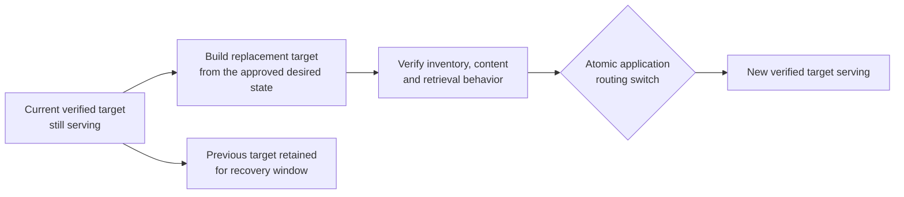

Ask.Legal continues using the old verified target while the replacement is
built. The application switches only after all checks pass, and the previous
target remains protected for the recovery window. In-place exact-ID mutation is
acceptable only if an equivalent serving guarantee and verified rollback can
be demonstrated.

A single approval may cover several jurisdiction targets. Strict all-at-once
visibility across those targets requires one application routing layer that can
switch the complete approved target set together. Without that layer, the
system can provide one approval and target-by-target integrity, but cannot
truthfully claim a globally atomic cutover.

## 13. Failure and uncertainty behavior

| Situation | Required behavior |
|---|---|
| Official sources conflict | Preserve all evidence and quarantine the affected item. |
| Legal status is unclear | Do not guess; quarantine and explain. |
| A source cannot be checked | Report a source failure, not “no change.” |
| A source inventory unexpectedly shrinks or an item disappears | Stop automatic retirement and require official status evidence. |
| A change is detected but the complete updated content cannot be scraped | Preserve the failed attempt, report the acquisition gap, and do not prepare replacement records. |
| A scrape is incomplete or mixes source versions | Reject it and rerun from a clean source snapshot. |
| A commenced amendment lacks an official consolidation | Report a temporary coverage gap and wait. |
| Validation fails before approval | Leave production unchanged. |
| AI output lacks exact support or fails the evaluation rules | Quarantine it; do not improvise a repair. |
| The production target contains unowned records or no complete ownership inventory exists | Block retirement and reconcile ownership. |
| Source, target, configuration, or recovery state changes after approval | Invalidate approval and rebuild the package. |
| Recovery checks fail after approval but before execution | Delay the update; do not weaken the recovery requirement. |
| Replacement build fails part-way | Keep serving the previous verified target and resume or discard only the incomplete replacement. |
| A multi-target cutover fails part-way | Stop, record exactly which targets are live, and follow the approved compensation or recovery plan. |
| Final verification disagrees with the plan | Do not declare success; preserve evidence and begin controlled recovery. |

## 14. Backup and recovery

Pinecone’s own backup and an independent evidence/release backup solve
different problems. The overall pipeline needs both. Pinecone-native backup makes
routine database restoration convenient; independent storage still survives a
Pinecone account problem, mistaken provider-side deletion, workstation loss,
or a need to rebuild without trusting the live service.

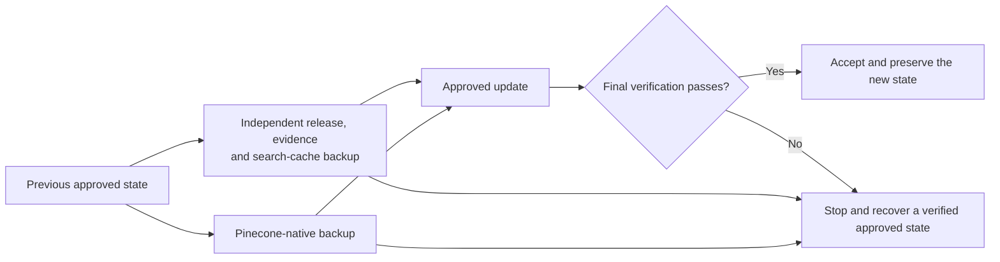

### Recovery requirements

1. Preserve code and non-secret contracts in version control.
2. Preserve the management register, source registry, non-secret settings,
   source snapshots, legal-status evidence, immutable releases, reports,
   approvals, and reusable search-preparation data in encrypted, versioned
   storage independent of both the workstation and Pinecone account.
3. Back up the information needed to recover access securely, without placing
   live credentials or encryption keys inside ordinary reports or releases.
4. Keep a convenient local copy, but do not count another folder on the same
   machine as an independent backup.
5. Create and verify a Pinecone-native backup before an approved production
   change and another after the new state is stable.
6. Protect backups from routine overwrite and deletion, and retain them under a
   written retention and legal-hold policy.
7. Test restoration periodically. A backup is not trusted until restoration,
   application cutover, and complete record and search verification succeed.

The executor must refuse a production mutation unless the previous immutable
release and reusable search data are verified in independent storage and the
pre-change Pinecone backup is ready.

Recovery normally rebuilds or restores a previously approved immutable release
and then verifies the full record inventory. Retired records must remain
reconstructible without depending on the continued existence of the production
index.

The recovery policy must name the acceptable amount of lost work, maximum
restoration time, retention periods, independent storage location, responsible
operator, and tested procedure for each component. Recovery drills record
actual times and discrepancies rather than merely checking that backup files
exist.

## 15. Reports and audit trail

### Before approval

The weekly report gives the reviewer a short decision summary and highlights
anomalies. Detailed machine-readable lists sit behind it. The report includes:

- sources checked, observation times, and freshness;
- additions, replacements, retirements, and prospective-law events;
- quarantined items, source failures, and coverage gaps;
- record counts and expected search-preparation cost;
- validation results, target identity, recovery identifiers, and digital
  fingerprints; and
- a clear statement of the exact action awaiting approval.

### After execution

The final report shows what actually happened, including retries or deviations,
proves that the resulting inventory matches the approved plan, and records
tested recovery instructions.

Reports are views of signed, machine-readable run records rather than the only
evidence. An independent reviewer must be able to reconstruct the source
observations, decisions, transformations, approval, remote actions, cutover,
and final state from preserved identifiers and fingerprints.

### No-change weeks

A clean no-change week still produces a verifiable report. It identifies every
source checked and proves that no production action occurred. A true no-change
report is notification-only and needs no approval. Source failures and
quarantines remain visibly different from “no change.”

## 16. Safety and security rules

- Raw source material and published Corpus Releases are immutable.
- Every run names every explicit release and target; the system never silently
  selects “whatever is latest.”
- Credentials, secrets, vector values, and private keys never appear in Git,
  releases, or reports.
- The evidence needed to explain or reverse a change is preserved before the
  change occurs.
- AI suggestions remain tied to exact source evidence and cannot resolve
  ambiguous validity or retirement alone.
- Every production operation is limited to the target and exact record IDs in
  the approved package.
- Watchers, scrapers, AI processors, coordinators, reviewers, and executors use
  separate roles with the least access each needs. Read access does not imply
  write, delete, approval, or backup-administration access.
- Production credentials are held in a managed secret store, rotated, and
  unavailable to downloaded content or AI prompts.
- Approval and deployment logs are tamper-evident and retained independently
  of the services they audit.
- Network destinations, dependencies, and build artifacts are controlled and
  pinned. Unexpected outbound access or an unapproved dependency stops the run.
- Personal or restricted material is sent to an AI or embedding provider only
  when the applicable source licence, privacy rule, retention setting, and data
  location permit it.

### Operational monitoring and incident response

The system continuously exposes the health of the weekly process rather than
waiting for a reviewer to discover a missing report. Alerts cover:

- missed, late, stuck, or overlapping runs;
- stale or failing official sources and unreconciled watcher signals;
- unusual document, record, retirement, quarantine, or cost volumes;
- validation, embedding, capacity, quota, backup, and recovery-test failures;
- unexpected production records or target-configuration drift; and
- post-cutover search regressions or Ask.Legal connectivity failure.

Thresholds are jurisdiction- and source-specific. A large change is not
automatically wrong, but it requires an explicit stop rule and review rather
than silently passing because its files are structurally valid.

An incident procedure names who may stop work, revoke credentials, preserve
evidence, restore or switch targets, notify the reviewer, and reopen service.
Emergency action cannot erase audit history or convert an unapproved corpus
into an approved one.

## 17. Settled simplifications

The following alternatives were considered and deliberately excluded from the
active design:

- searchable prospective legislation;
- automatic reconstruction of amended Acts from amendment instructions;
- case overview vectors in addition to proposition records;
- separate whole-case retrieval;
- invented case propositions for cases that contain none;
- AI prediction of future overruling;
- partial approval of a frozen package; and
- broad or inferred retirement instead of exact, owned record removal.

These simplifications are part of the design, not missing features.

## 18. Design completeness audit

The core framework is coherent: official evidence is preserved, source workers
have bounded responsibilities, material types use separate legal rules,
uncertainty is quarantined, one human approves the complete frozen package, and
Pinecone is a reversible serving copy rather than the archive.

A detailed audit of the complete legal-data lifecycle, informed by lessons
from the existing pipeline, exposed several requirements that were absent or
too implicit. This revision makes the
following explicit:

- a whole-target desired-state inventory before any retirement;
- one promotion manifest spanning all contributing releases and targets;
- stable ownership, identity, lineage, and collision rules;
- periodic full source reconciliation as a backstop to watchers;
- one observation cutoff and protection against overlapping promotions;
- approval freshness and pre-execution revalidation;
- a verified replacement-target cutover model;
- query-time grouping metadata and end-to-end search-quality gates;
- a coverage-status channel for known gaps outside Pinecone;
- evidence-bound AI evaluation and hostile-source-text controls;
- recovery of the management layer as well as legal records and vectors; and
- access control, monitoring, incident response, licensing, and retention.

These additions close omissions in the framework, but the finished design is
not fully specified until the choices below are settled.

### Critical architecture decisions still open

| Area | Decision required | Why it matters | Recommended direction |
|---|---|---|---|
| Serving cutover | Exact replacement-index or replacement-namespace design, target naming, routing pointer, and rollback action | In-place writes can expose mixed old and new law | Build and verify a replacement target, then switch Ask.Legal through one controlled routing pointer |
| Multi-target promotion | Whether all jurisdictions must become visible together and what happens if one target fails | One human approval does not by itself create one atomic transaction across services | Preflight and build all targets first; use a routing layer to switch the approved target set together |
| Corpus composition | Exact authority and format for the complete desired-state inventory when several releases share a target | Without it, one material family can accidentally retire another | Make the coordinator-owned promotion manifest the sole authority for additions and retirements |
| Final search schema | Where parent legal-item ID, proposition grouping, display citation, provenance, and warnings live | Self-contained text does not provide reliable filtering, grouping, or audit joins | Add explicit query-time fields or a verified adjacent lookup; never infer them from prose |
| Record identity | Stable rules for corrections, renumbering, source moves, proposition splits or merges, and reinstatement | Bad identity rules create duplicates, lost lineage, or accidental replacement | Define identity and predecessor rules separately for legislation, cases, and reference principles |
| Coverage interface | How Ask.Legal consumes and displays known source failures, quarantine, and consolidation gaps | A clean index can otherwise make a known gap look like “no relevant law” | Publish a signed coverage-status manifest alongside each serving state |

### Legal and source decisions still open

| Area | Decision required | Why it matters |
|---|---|---|
| Source register | Complete list of jurisdictions, material classes, official sources, mirrors, and checking frequency | “Everything was checked” is meaningless until the intended universe is defined |
| Source rulebooks | Exact evidence for commencement, partial commencement, repeal, expiry, correction, withdrawal, and source conflict in each jurisdiction | These rules decide what is allowed into or removed from current-law search |
| Legislation scope | Treatment of subordinate legislation, court rules, treaties, delegated instruments, schedules, and non-text status material | “Legislation” is broader than Acts and has different lifecycle events |
| Case coverage | Which courts, tribunals, judgment versions, corrections, appeal events, and later-treatment sources are authoritative | Incomplete coverage can make treatment warnings misleading |
| Reference works | Publisher update feed, paragraph-version identity, licence, currency fields, and withdrawal rules for each work | A reference paragraph cannot be maintained safely without its publisher-specific lifecycle |
| Rights and retention | Storage, AI processing, embedding, display, attribution, and backup rights for every source | Technical access does not create permission to copy or retain material |

### Quality, governance, and operational decisions still open

| Area | Decision required | Why it matters |
|---|---|---|
| AI acceptance | Evaluation corpus, acceptable error rates, confidence rules, sampling, and revalidation triggers | Schema-valid case summaries can still be legally wrong or incomplete |
| Approval policy | Authorized reviewers, approval lifetime, required comments, revocation, absence cover, and emergency authority | The executor needs an objective test for whether approval remains valid |
| Quarantine | Owners, reason codes, review deadlines, escalation, and rules for re-entry or permanent exclusion | Otherwise uncertain material can disappear into an indefinite holding area |
| Recovery | Independent storage provider, encryption-key recovery, retention, acceptable data loss, restoration-time target, and drill frequency | “Backed up” is not a usable recovery promise without measurable targets |
| Anomaly controls | Stop thresholds for source-count changes, retirements, model behavior, costs, and target drift | Structurally valid but implausible changes can still be destructive |
| Capacity and cost | Expected corpus growth, Pinecone and model quotas, budget limits, and behavior when limits are reached | Autonomous runs must fail safely rather than truncate work or overspend |
| Security | Role assignments, credential storage and rotation, network access, audit-log retention, and provider data locations | The architecture defines trust boundaries but still needs enforceable policy values |
| Service levels | Expected update delay, response to missed weekly runs, urgent correction handling, and maximum tolerated source staleness | Operators and users need to know when the corpus is no longer acceptably current |
| Retention and deletion | How long evidence, old releases, vectors, reports, and backups remain; legal holds; approved destruction | Unlimited preservation may conflict with licence or legal duties, while early deletion harms reversibility |

This document deliberately does not prescribe implementation sequence, delivery
estimates, temporary operating arrangements, or migration steps. Those are not
part of the overall-pipeline design.

## 19. Definition of success

The system succeeds when another person can answer all of the following from
the preserved evidence and reports:

- What official sources were checked, and when?
- What changed, and why?
- Was the complete updated source content captured and preserved?
- Which items were excluded or quarantined, and why?
- What exact legal records were approved?
- What did the executor actually change?
- Does Pinecone exactly match the approved current corpus?
- Did Ask.Legal switch only to a fully verified serving state?
- Did the candidate pass the retrieval-quality tests as well as record checks?
- Are known source and coverage gaps visible without making uncertain text searchable?
- Can the previous approved state be restored and verified?
- Can every record be traced to its exact source, transformation, approval, and deployment?

If any answer is unclear, the update is not complete.
