# Ask.Legal Autonomous Legal Database Pipeline — Initial Overall Design

Updated: 2026-08-14

Status: greenfield modular-monorepo design in progress
Authorization: design and documentation only; this document does not authorize
implementation, release publication, embedding-provider calls, Pinecone access,
or any remote change.

## 1. Executive summary

Ask.Legal needs a low-touch system that regularly checks official legal
sources, discovers changes, prepares updated searchable material, and keeps the
Pinecone search database aligned with approved current law while preserving
explicitly warned reconstructed or latest-applicable-HKeL analytical results during
known legislation-consolidation gaps.

The system is designed around five promises:

1. **Current search:** Pinecone contains only the approved material Ask.Legal
   currently intends to serve. It is not the permanent legal archive. ADR 0079
   permits valid latest applicable official HKeL legislation during a known official-
   consolidation gap, while ADR 0080 permits an exact evidence-bound
   reconstruction. Both are explicitly warned.
2. **Official evidence:** every proposed change is traceable to preserved
   official source material.
3. **Human control:** one person reviews and approves the complete weekly
   change package before any production change.
4. **Safe uncertainty:** the system does not guess. Unclear items are held for
   review while unrelated clear changes may continue.
5. **Reversibility:** old material, exact releases, reports, and recovery data
   are preserved outside Pinecone so an approved state can be rebuilt.

### System at a glance

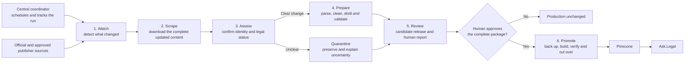

The main handoff is deliberate:

- **Watchers** answer: “Did something change?”
- **Scrapers** answer: “What is the complete updated content?”
- **Desks** answer: “What does the complete official evidence mean, and should
  this material be processed?”
- The **preparation pipeline** turns that preserved content into validated
  search records.
- The **human reviewer** controls whether the complete proposed update may
  reach production.

## 2. What the system is—and is not

### The system will

- check authoritative legal sources on a schedule;
- preserve exactly what it observed;
- detect additions, replacements, commencement events, repeals, corrections,
  and later case treatment;
- scrape the complete updated content and its source metadata when a watcher
  raises a possible-change signal;
- prepare and validate proposed search records;
- explain every proposed addition, change, exclusion, and retirement;
- obtain one approval for the exact complete package;
- apply only the approved production changes; and
- verify and report the final result.

### The system will not

- treat Pinecone as the permanent source of truth;
- provide historical or “law as at date” search;
- place uncommenced legislation in the ordinary current-law search database;
- guess, generatively invent, or serve an unsupported reconstructed
  consolidation;
- predict that a case will be overruled;
- silently resolve conflicting official evidence;
- create artificial case propositions where none are supported;
- provide duplicate whole-case overview records or whole-case retrieval;
- partly apply an approved package; or
- delete records using broad, uncontrolled deletion commands.

## 3. Plain-language glossary

| Term | Meaning in this design |
|---|---|
| **Pinecone** | The searchable shelf used by Ask.Legal. It is replaceable and contains only the approved serving copy. |
| **Management register** | The control ledger: what material exists, its status, when it was checked, what changed, and where it is in the workflow. |
| **Evidence vault** | The filing cabinet: exact downloads, old versions, reports, approvals, releases, and recovery material. |
| **Release Scope** | A stable, versioned, non-overlapping ownership boundary for which one responsible desk accounts for every Search Record at an observation cutoff. |
| **Corpus Release** | A sealed immutable complete snapshot of one Release Scope at one observation cutoff. It contains zero or more validated Search Records, accounts for non-searchable dispositions, and is never a delta. |
| **Desired-state inventory** | One sealed complete composition for a Pinecone target. It selects exactly one Corpus Release for every required Release Scope and persists the matching flattened list of expected record IDs, fingerprints, and owners. |
| **Promotion manifest** | The sole sealed approval and execution envelope binding the base Serving State, candidate Serving State Definition and inventories, exact targets, routing, settings, changes, recovery, validations, ordered actions, rollback, and invalidation conditions under one fingerprint. |
| **Serving State Definition** | The sealed fingerprinted description of one complete candidate search state. It never changes after it is sealed. |
| **Serving State lifecycle event** | An append-only fact that records verification, activation, rollback, failure, protection, or retirement without changing the Serving State Definition. |
| **Search record** | One unit of legal text prepared for semantic search. |
| **Regulatory Materials** | A separately approved jurisdiction-specific family of formal non-legislative regulatory requirements. Its initial Hong Kong scope contains current HKEX Main Board and GEM Listing Rules, not general guidance or policy. |
| **Authority note** | The required controlled metadata string delivered with each record to the downstream LLM. It is `"None"` when no approved note applies; otherwise warnings come first, budgeted material support follows, and budgeted neutral explanatory context comes last without a fixed clause count. It is not embedded; Hong Kong notes are English only. |
| **Frozen package** | The exact proposed update submitted for approval. If anything changes, it must be rebuilt and approved again. |
| **Quarantine** | A holding area for unclear or conflicting items. Quarantined material does not enter production. |
| **Carry-forward selection** | An explicit choice to keep previously approved material searchable with a visible Coverage Gap. Ordinary carry-forward applies when no change is proved. Known-stale analytical carry-forward is the fallback when an official legislation change is proved but neither updated official consolidated text nor an eligible reconstruction is available. It is not verified current at the new cutoff. |
| **Known-stale analytical carry-forward** | The narrow fallback that keeps the latest applicable official HKeL legislation wording held searchable after an official change is known and exact reconstruction cannot pass. Its supporting copy may be verified or assisted under ADR 0081. The text is unchanged, receives a mandatory warning and new warned record identity, and must not be described as current or reconstructed. |
| **Reconstructed Consolidation Artifact** | One immutable internal result produced by applying a complete proved chain of operative amendments deterministically to the latest applicable bilingual HKeL base supported by matching verified or assisted official HKeL copies. It is not an HKeL Official Version. Its Search Records use ordinary legislation serving behavior with the mandatory reconstruction authority note. |
| **Withholding Release** | A complete Corpus Release that removes unsafe or unsupported records from its searchable set while accounting for every withheld item and its evidence. Withholding is not legal retirement. |
| **Watcher** | A lightweight source-specific monitor that detects possible additions, changes, removals, and status events. |
| **Scraper** | A source-specific worker that downloads the complete changed legal content and its source metadata after a watcher raises a change signal. |
| **Desk** | A specialist responsible for the legal rules of one jurisdiction and material type, such as Australian legislation. |
| **Preparation pipeline** | The shared steps that parse, clean, distil, and validate scraped content before it can become a candidate release. |
| **Digest** | A digital fingerprint used to prove that approved files have not changed. |
| **Cutover** | The controlled moment when Ask.Legal starts searching the newly verified database state. |
| **Pinecone Index Generation** | One immutable, fully built and verified jurisdiction serving target with a date-led unique name. |
| **Routing configuration** | The complete versioned map from every jurisdiction to the exact Pinecone Index Generation Ask.Legal must search. Its active index names are supplied through Azure App Service application settings. |
| **Control plane** | The application that schedules work, records workflow state, coordinates packages, and reports health without holding destructive production credentials. |
| **Application** | A separately runnable and permissioned program inside the monorepo. |
| **Package** | A reusable module with a declared public interface and enforced dependency direction. |
| **Modular monorepo** | One Git repository containing several bounded applications and packages without merging their credentials, identities, or deployment powers. |

## 4. Overall pipeline scope

The intended complete pipeline prepares and, after approval, executes a normal weekly
update of the current-law search database. It covers every registered
jurisdiction-and-material combination across legislation, cases,
jurisdiction-specific Principles, and expressly approved jurisdiction-specific
Regulatory Materials. Each combination may have different source and
legal-status rules, but all of them pass through the same evidence, validation,
approval, recovery, and audit controls.

An urgent manual run may be requested when waiting for the weekly cycle would
create an unacceptable coverage gap. It follows exactly the same controls as a
scheduled run; urgency never bypasses evidence, validation, approval, backup,
or verification.

This is an initial design of the overall pipeline, not a final specification.
It maps the intended complete system, records decisions already made, and keeps
unresolved design choices visible. Implementation sequence, temporary operating
modes, migration plans, and delivery estimates are outside its scope.

The complete rebuilt pipeline will live in the greenfield
`AskLegal-LegalDBPipeline` modular monorepo. The older local repositories are
reference material only and do not define this system's code or repository
boundaries.

## 5. Architecture and responsibility

### 5.1 Coordinator, desks, and source teams

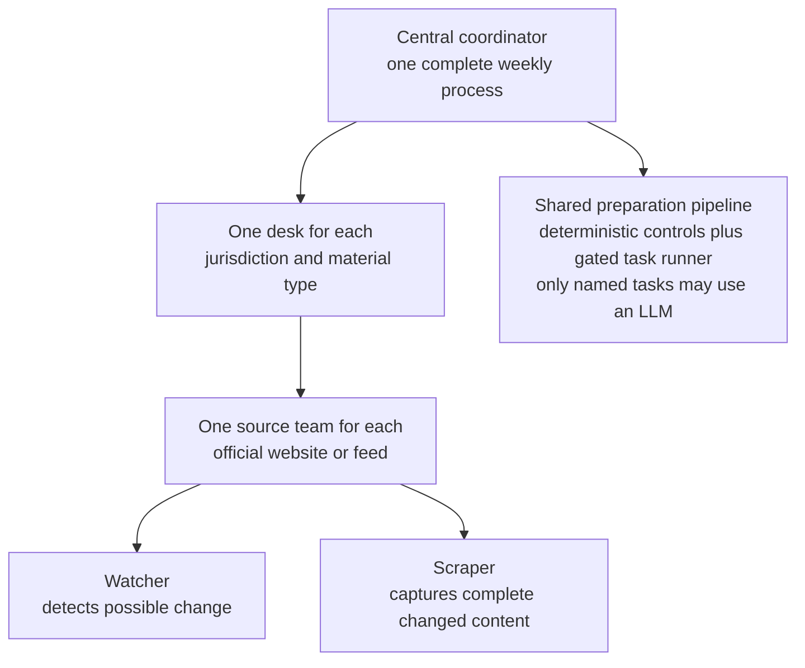

| Role | Responsibility | Must not do |
|---|---|---|
| **Watcher** | Perform scheduled lightweight checks, compare source inventories or status pages, raise possible-change signals, and preserve check evidence. | Treat a change signal as the complete legal content or decide legal truth. |
| **Scraper** | After a watcher raises a change signal, retrieve the complete changed document, related source metadata, and any required official attachments; preserve the raw result exactly. | Decide legal status, alter the raw source, or publish records. |
| **Desk** | Apply the jurisdiction’s source rules, identify legal status, reconcile sources, and prepare fully supported results. | Override unresolved official conflicts. |
| **Preparation pipeline** | Parse and validate preserved content, apply the approved task allocation through the sole gated runner when later settled, and validate every result against the applicable contract. | Repair source deficiencies by guessing, let an LLM make a legal or production decision, or send invalid records forward. |
| **Coordinator** | Schedule work, enforce common safety checks, assemble the complete package, manage approval, verification, reporting, and recovery. | Invent jurisdiction-specific legal rules. |
| **Human reviewer** | Approve or reject the complete frozen production package. | Approve a moving or partly defined target. |
| **Executor and verifier** | Perform only the exact approved steps, check the resulting inventory and content, and record the result. | Change the package, improvise, or apply only part of it. |

For example, the Australian legislation desk may own a Federal Register source
team containing both a Federal Register watcher and a Federal Register scraper.
The watcher checks cheaply for change; its signal triggers the registered
scraper; and the desk evaluates the complete captured evidence. The watcher and
scraper may share source-specific components, but they remain separate
responsibilities.

This structure allows source-specific acquisition without creating many
uncoordinated legal decision-makers.

### 5.2 Three places for information

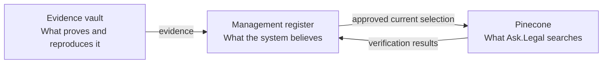

These roles stay logically separate even when the same technology provider
supports more than one of them.

Watcher check results, detected-change signals, desk decisions, and scraper job
status belong in the management register. Exact watcher responses, complete
scraped documents, attachments, and source metadata belong in the evidence
vault.

### 5.3 Source registry and scheduler

The coordinator needs a complete source registry so that “nothing changed” can
be distinguished from “we forgot to check a source.” For every source, it
records:

- one stable source ID for the official or publisher product and accepted
  evidence role;
- the responsible desk, watcher, and scraper;
- the exact facts its evidence may prove and the uses it must not support;
- whether an outage blocks a release, only affected work, or neither;
- separately versioned technical or physical endpoints, including languages,
  formats, validity dates, and predecessor or successor routes;
- the official product and material covered;
- the expected check schedule;
- the last attempted and last successful check;
- the watcher’s comparison method;
- the conditions that trigger a scraper run;
- the scraper’s required documents, attachments, and metadata; and
- any active source failure, quarantine, or retry state.

The scheduler creates work from this registry. Watcher results and scraper jobs
are recorded in the management register so a detected change cannot be lost
between discovery and acquisition.

A URL is an endpoint, not source identity. Moving an unchanged official
product to a new URL updates its endpoint record without changing the stable
source ID or losing observation history. Source authority is fact-specific:
the same source may prove one fact and be forbidden from proving another.

### 5.4 Capability boundaries

The finished system keeps the following capabilities distinct even though
their code lives in one repository:

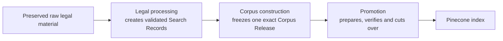

A successful capability does not automatically authorize the next. In
particular, validated legal records are not permission to freeze a Corpus
Release, and a Corpus Release is not permission to call an embedding provider
or change Pinecone. These are artifact, permission, credential, and
verification boundaries rather than Git-repository boundaries.

The existing local repositories may be inspected for lessons and verified
behavior. The greenfield system does not inherit their code, contracts,
schemas, or internal structure automatically.

### 5.5 One complete desired state

Individual desks and source teams produce separate results, but retirement is
safe only when the coordinator can see the whole target. A jurisdiction's
Pinecone target may contain legislation, case propositions, jurisdiction-
specific Principles, and approved Regulatory Materials from several releases.
Comparing one of those releases with the whole target would wrongly label every
other material family as obsolete.

The coordinator therefore builds a **desired-state inventory** before proposing
any production action. It identifies:

- every release that contributes to the target;
- which desk and material family owns each record;
- every expected record ID and content fingerprint;
- records that are new, changed, unchanged, or genuinely retired; and
- any existing record that is not owned by the managed corpus.

Unowned or unexplained production records block automatic retirement. No desk,
watcher, scraper, or individual release may calculate deletion against a shared
target by itself.

Before a desk can publish a Corpus Release, the management register defines its
stable Release Scope. Scopes within one target do not overlap, and each scope
has one accountable desk and explicit coverage rules. A Corpus Release accounts
for the entire scope at the run's observation cutoff, including unchanged
records; it is not merely the records changed during that run. If nothing in a
scope changed, a later inventory reuses the existing release instead of
rebuilding or copying it.

A Corpus Release may contain zero Search Records only when its completeness
evidence proves that the scope genuinely has no supported current searchable
material or a complete evidence-backed Withholding Release accounts for every
non-searchable item and disposition. A source failure, incomplete
reconciliation, or Quarantine without those dispositions cannot be encoded as
an empty release. A new release identifies its predecessor, but it does not
change production merely by existing; it replaces the predecessor for serving
only when selected by a complete Desired-State Inventory and promoted under a
valid Approval.

The Desired-State Inventory records the composition in two matching views:

1. a scope view selecting exactly one Corpus Release for every Release Scope
   required by the versioned scope registry; and
2. a flattened target view listing every expected Search Record ID, content
   fingerprint, owning scope, and owning release.

Both views are sealed and must agree exactly. The scope view proves provenance
and completeness of ownership. The flattened view proves target-wide identity,
uniqueness, content, and safe retirement. It is persisted rather than
recomputed during execution so the approved target cannot change through a
different composition algorithm or release-selection result.

An unchanged scope references its existing release. A valid empty release is
still selected and contributes zero flattened records. A missing or multiply
selected required scope, overlapping ownership, duplicate record ID, content
fingerprint mismatch, or record present in only one view makes the inventory
invalid. When a valid inventory is compared with the current production target,
any unexplained production record blocks promotion until its ownership and
disposition are resolved. A Desired-State Inventory is evidence of intended
target state; it is not Approval and does not authorize building or changing
Pinecone.

#### Unavailable and uncertain Release Scopes

When a required Release Scope cannot produce a fully current release, the Legal
Desk makes one explicit evidence-backed serving decision:

1. **Carry forward:** if there is no affirmative evidence that the existing
   records changed and the desk supports continued serving, the Desired-State
   Inventory may select the last approved release. The selection records the
   failed or quarantined observation, last-verified date, Coverage Gap, authority note,
   and review deadline. It is never labeled verified current at the new cutoff.
2. **Reconstruct or use known-stale fallback:** if official evidence proves
   that legislation changed but updated official consolidated text is not yet
   available, ADR 0080 selects an exact warned reconstruction when every proof
   passes. Otherwise ADRs 0079 and 0081 keep valid latest applicable official HKeL wording
   searchable with its separate warning. The candidate release publishes the
   Coverage Gap and selects exactly one result per affected serving unit. A
   location with neither eligible reconstruction nor valid fallback text has
   no record.
3. **Withhold:** if the available evidence indicates that existing records may
   now be materially misleading and neither ADR 0080 nor ADR 0079 applies, the
   desk creates a new complete Withholding Release. It excludes the
   affected records from the searchable set but accounts for each item, reason,
   and exact evidence. The resulting removals require Approval and do not
   declare that the Legal Items ceased to exist.
4. **Do not rebuild the jurisdiction:** if the desk cannot support either
   continued serving or withholding, no new Desired-State Inventory or
   Pinecone Index is produced for that jurisdiction. Its previous target stays
   routed with a visible Coverage Gap. Other jurisdictions may proceed, but
   otherwise-clear changes sharing the blocked jurisdiction wait.

A bare empty release, silent reuse, or automatic retirement is forbidden. The
coverage-status channel must distinguish ordinary last-approved carry-forward,
known-stale analytical carry-forward, withheld records, unresolved scope
failures, and verified-current records.

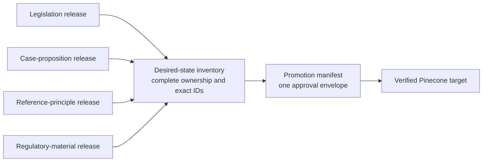

One human approval covers the complete promotion manifest, even when it contains
several releases or targets. The manifest is the unit of approval; a single
profile release is not.

### 5.6 Traceability and stable identity

Every production record needs an unbroken chain:

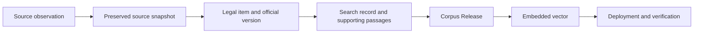

The design must distinguish the identity of a legal item from the identity of a
particular source file, version, search record, and vector. Stable ID rules must
cover renumbering, source-file moves, corrected judgments, substituted
provisions, proposition splits and merges, and reinstatement of retired
material. Each replacement or retirement records its predecessor and reason;
records are never silently reused for a different legal meaning.

IDs must be unique within every complete Pinecone target. Cross-profile
collisions, duplicate source captures, and two workers claiming the same legal
item are validation failures, not matters for the executor to resolve.

Read-only inspection of the existing Distillation implementations found a
useful but narrower identity pattern. Their `rec_` IDs are deterministic hashes
of profile-qualified source structure: publication or Title identity,
source-native locator, and local split-child position. They deliberately exclude
cleaned wording and global output order. This gives reproducible opaque IDs and
is substantially better than hashing prose or using line numbers.

That method is not the greenfield identity model. Raw paths, AustLII paths,
paragraph numbers, locators, grouping, and split positions can change. The
legacy profiles do not provide permanent Legal Item, Official Version, Legal
Location, or predecessor identities. The Australian case profile also emits
one ID per judgment, which cannot represent this design's multiple material
Case Propositions from one judgment. The user explicitly rejected transferring
or adapting the source-derived approach on 2026-08-10.

The accepted identity model instead starts with permanent opaque identities
allocated by the Management Register after the object is established from evidence.
Source paths, citations, provider IDs, titles, locators, and paragraph numbers
remain aliases and evidence rather than identity inputs. Official Versions and
Search Records are immutable. A changed approved searchable payload selects a
different exact Search Record. A previously unseen payload receives a new ID
and explicit forward predecessor relationship; an exact preserved payload may
be reselected under ADR 0055. The old selected record remains preserved.
Separate fingerprints prove the exact bytes of every object.

A Search Record may be reused for a later Official Version only when exact
serving-payload equality and continuing legal support are proved. The payload
contains the five legacy base fields plus required `authority_note` under ADRs
0013 and 0050. An authority-note change therefore selects a different exact
Search Record. A previously unseen payload receives a new ID; ADR 0055 permits
a former exact supported record to be reselected without backward lineage. A
change only to traceability-held citation or provenance creates a new immutable Record
Traceability Lookup revision without changing the Search Record ID or
rebuilding Pinecone.
Withholding and retirement stop selection for serving but never erase or reuse
identity.

Lineage relationships are immutable, typed, evidence-backed, and acyclic. They
support one-to-one corrections, one-to-many splits, many-to-one merges,
renumbering, and replacements. Separate append-only Search Record Selection
Events record selection, reselection, withholding, retirement, and
reinstatement without creating backward lineage. Ambiguity is quarantined for the
responsible Legal Desk; similarity or a matching visible locator is not enough.
The general legislation continuity rules are settled in ADR 0012, case-law
continuity in ADR 0014, Principles continuity in ADRs 0015 and 0017, and the
initial Hong Kong Regulatory Materials boundary in ADR 0054. They remain
separate rule families because legislation, judicial treatment, publisher
events, and exchange-rule amendments do not have the same meanings.

### 5.7 Core register objects and legal time

The management register is more than a task list. It holds the relationships
that make the system explainable:

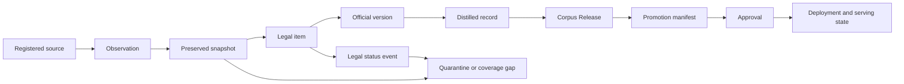

Important facts are append-only: a later observation or correction does not
erase what the system previously saw or served. The register derives the
current operational view from preserved events and records all manual
overrides with a reason and author.

Legal and operational dates are not interchangeable. The system separately
records, when available:

- the legal event or effective date, such as commencement or repeal;
- the source publication, correction, or compilation date;
- the time the system observed and preserved the source;
- the approval time; and
- the deployment and Ask.Legal cutover time.

Dates include their source and time zone. Missing dates remain unknown rather
than being inferred. Retrospective legal events retain both the official legal
effect date and the later observation date.

### 5.8 Greenfield modular-monorepo architecture

All pipeline code lives in one repository, but the final system is not one
undifferentiated application.

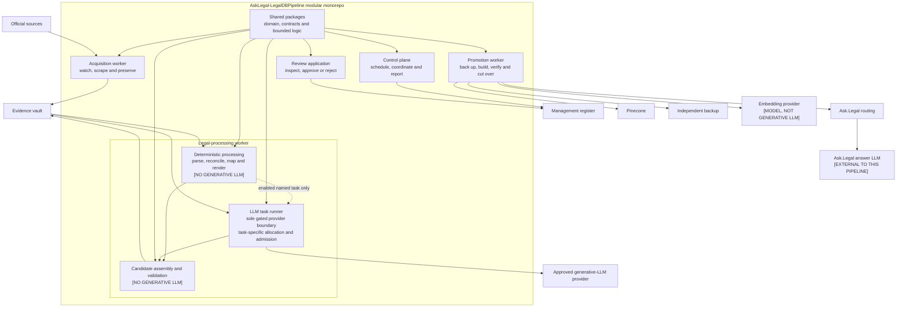

| Application | Owns | Must not have |
|---|---|---|
| **Control plane** | Scheduling, source registry, workflow state, package coordination, coverage status, and reporting | Pinecone deletion or routing credentials |
| **Review application** | Human inspection, approval, rejection, comments, and revocation | Authority to alter the frozen package |
| **Acquisition worker** | Watchers, scrapers, source access, and immutable evidence capture | Approval or production-search credentials |
| **Legal-processing worker** | Deterministic controls, Legal Desk authority, candidate records and validation, plus the sole gated LLM task runner; Hong Kong later treatment and Case Proposition extraction have accepted hybrid allocations while other task allocation may remain deferred | Approval or production mutation authority; direct model calls outside the task runner |
| **Promotion worker** | Embeddings, recovery checks, replacement targets, final verification, cutover, and exact approved retirement | Authority to change the approved manifest or legal conclusions; generative-LLM credentials |

Shared packages contain reusable logic rather than independent authority:

```text
packages/
├── domain/                 stable legal and workflow concepts
├── contracts/              versioned schemas and compatibility rules
├── management-register/    durable-ledger interfaces
├── evidence-vault/         immutable-evidence interfaces
├── source-connectors/      source-specific watchers and scrapers
├── legal-desks/            jurisdiction-and-material rules; no model calls
├── processing/             deterministic processing and gated LLM task contracts
├── corpus/                 releases, desired state and record lineage
├── promotion/              embedding, target and cutover rules
├── reporting/              human and machine-verifiable reports
└── observability/          health, alerts, audit and incident signals
```

Dependency direction is enforced:

- applications may depend on packages; packages do not depend on applications;
- domain and contract packages do not depend on infrastructure adapters;
- source connectors capture facts but do not decide legal status;
- Legal Desks interpret evidence but do not approve or deploy;
- only the legal-processing worker's LLM task runner may hold generative-LLM
  provider credentials or make generative-LLM calls;
- processing creates candidate records but does not promote them;
- corpus construction produces immutable artifacts but does not authorize use;
- promotion consumes only an exact valid Approval and Promotion Manifest; and
- architecture tests reject forbidden imports and dependency cycles.

Repository colocation does not merge runtime trust. Each application has its
own identity, secrets, network access, deployment job, and minimum database or
storage permissions. Large legal corpora, Source Snapshots, Corpus Releases,
embedding caches, reports containing operational data, backups, credentials,
and production state stay outside Git. An ignored local `var/` tree may imitate
those stores during development.

A component should move to a separate repository only if a real long-term
team, legal access, external distribution, or independent release-lifecycle
boundary emerges. Source count, jurisdiction count, worker scaling, or
different credentials alone do not require another repository.

### 5.9 Exact generative-LLM execution boundary

The design uses four settled operational labels:

- **GENERATIVE LLM** — a task makes a provider call that proposes structured
  language or legal analysis;
- **NO GENERATIVE LLM** — the component uses deterministic code, written
  rules, stored evidence, or human decisions;
- **MODEL, NOT GENERATIVE LLM** — the promotion worker uses an embedding model
  to convert final validated text into vectors but does not generate legal
  content; and
- **EXTERNAL TO THIS PIPELINE** — Ask.Legal's downstream answer LLM consumes
  retrieved metadata but is not a module in this repository.

Any legal-analysis task whose allocation is not accepted uses the temporary
fifth label **ALLOCATION DEFERRED**. That label
authorizes neither a model call nor an assumption that the task must be
deterministic.

No application is generally “AI-powered”. The exact pipeline map is:

| Application or logical module | Label | Exact role |
|---|---|---|
| Control plane | **NO GENERATIVE LLM** | Scheduling, source registry, workflow, completeness, coverage status, and reports |
| Review application | **NO GENERATIVE LLM** | Presents exact evidence and proposals to the authorized human; it does not generate Approval |
| Acquisition worker and source connectors | **NO GENERATIVE LLM** | Watch, scrape, hash, inventory, and preserve source artifacts |
| Legal-processing worker — deterministic ingress | **NO GENERATIVE LLM** | Schema checks, parsing, normalization, source reconciliation, status mapping, bilingual alignment, and known-rule checks |
| Legal-processing worker — Hong Kong Case Proposition deterministic stages | **NO GENERATIVE LLM** | Source admission and complete structure, proposal validation, objection reconciliation, Coverage Ledger arithmetic, identities, rendering, and finalization under ADR 0065 |
| Legal-processing worker — Hong Kong Case Proposition analysis and challenge stages | **GENERATIVE LLM** | Separate evidence-bound semantic proposal and independent challenge tasks under ADRs 0065 and 0066; neither has acceptance, current-authority, release, or serving authority, and both remain disabled until an exact complete workflow passes ADR 0067 admission through ADR 0068's package contract |
| Legal-processing worker — Hong Kong later-treatment model stages | **GENERATIVE LLM** | Whole-judgment discovery and candidate-level treatment analysis produce evidence-bound proposals under ADR 0053; they have no legal or serving authority and remain disabled until exact task contracts pass admission |
| Legal-processing worker — candidate `gazette-event-extraction` | **ALLOCATION DEFERRED** | Candidate bounded proposal task over preserved Gazette evidence; it could never establish the legal event or release result itself |
| Legal-processing worker — Legal Desk rules | **NO GENERATIVE LLM** | Applies jurisdiction-and-material rules and records the responsible decision; it may consume but cannot delegate authority to an LLM proposal |
| Legal-processing worker — renderers, identity, authority-note and candidate validation | **NO GENERATIVE LLM** | Produces and verifies exact candidate Search Records from accepted facts |
| Corpus construction | **NO GENERATIVE LLM** | Builds complete releases, desired-state inventories, coverage accounting, and lineage artifacts |
| Promotion worker — embedding adapter | **MODEL, NOT GENERATIVE LLM** | Embeds only validated selected `metadata.text` under a pinned embedding contract |
| Promotion worker — all other parts | **NO GENERATIVE LLM** | Checks recovery, builds and verifies replacement targets, and performs only exact approved cutover or retirement actions |
| Reporting and observability | **NO GENERATIVE LLM** | Reports and monitors preserved facts without generating legal conclusions |
| Ask.Legal downstream answer model | **EXTERNAL TO THIS PIPELINE** | Receives the six Pinecone metadata fields and produces the user-facing analysis after retrieval |

The final task inventory remains unsettled except for the staged hybrid Hong
Kong later-treatment allocation accepted by ADR 0053 and the two-pass hybrid
Hong Kong Case Proposition extraction allocation accepted by ADR 0065.
Gazette-event extraction and other unallocated work remain candidates only.
HKeL XML/PDF reconciliation, Status Coverage Maps, Bilingual Alignment Groups,
legal status, record eligibility, authority-note selection, and release
accounting remain governed by exact evidence, deterministic contract checks,
and responsible Legal Desk decisions even if a later-approved task supplies a
bounded proposal. Publisher-derived Principles remain source-faithful unless a
future accepted task contract expressly preserves that rule.

The LLM task runner is an infrastructure gateway, not a decision-maker. It
receives only the exact preserved evidence and versioned task contract required
for one enabled task. Each result records the model, prompt, schema, settings,
source fingerprints, and output fingerprint. The result is a proposal and must
point to exact source passages. It cannot decide source authenticity, legal
status, identity, authority note, retirement, release, approval, or production action.

A generic evidence-bound-AI hook does not authorize a new task. A future task
remains disabled until an accepted ADR or Source Rulebook names its stable task
ID, evidence boundary, output claims, forbidden decisions, schema, prompt,
model settings, deterministic validation, evaluation threshold, review rule,
reuse rule, and failure behavior. Only the task runner may then call the model
provider. ADR 0039 records this boundary.
ADR 0043 records the later deferral of the exact task inventory and
deterministic-versus-LLM allocation; ADR 0053 later settles Hong Kong later
treatment and ADR 0065 later settles Hong Kong Case Proposition extraction,
while leaving exact executable packages and evidence-derived runtime profiles
to their task-admission processes. ADR 0066 fixes the Case Proposition task
contracts, and ADR 0067 fixes their complete-workflow admission and monitoring
policy. ADR 0068 fixes the evaluation-suite, protected-evidence, sealed-
selection, evaluator-result, and admission-profile package architecture without
admitting a model or enabling a provider call.

## 6. Source authority and evidence

Every desk has a written **Source Rulebook** for one jurisdiction-and-material
pair. All rulebooks satisfy one common **Source Rulebook Contract**, but the
actual sources, coverage, evidence, priority, and legal-status answers remain
separate. Australian Legislation and Singapore Legislation cannot prove one
another complete; there is no cross-jurisdiction Principles rulebook; and the
Hong Kong Regulatory Materials decision does not classify another
jurisdiction's regulatory sources.

The boundaries are explicit:

- the Source Register records stable Registered Source IDs, their approved
  roles, owners, checking expectations, and technical connector details;
- source connectors check and capture facts without deciding their legal
  meaning; and
- a Source Rulebook references those source IDs and tells the responsible Legal
  Desk what preserved evidence may prove and which outcomes are permitted.

A Source Rulebook does not contain credentials, retrieve source content,
approve a Promotion Manifest, or authorize production. It states which approved
official or publisher source controls each fact:

- whether a legal item exists and how it is identified;
- its exact text;
- commencement, repeal, expiry, withdrawal, or other status;
- official or publisher corrections and replacement versions; and
- discovery only.

“The source wins” is not enough because different sources may control different
facts. For example, an authorised consolidation may control the current wording
of an Act, a commencement notice may control when an amendment starts, and a
publisher edition may control the text of a Principle.

An unregistered discovery source may reveal a possible gap or trigger a check.
It cannot by itself authorize a production change. A publisher source may
support a Principles change only when the relevant jurisdiction's Principles
rulebook registers it for that purpose.

When controlling sources conflict, the desk first applies any explicit
replacement or priority rule. If the conflict remains, it preserves all
evidence, quarantines the affected item, and explains the problem in the weekly
report. The watcher supplies change evidence, the scraper supplies the complete
source content, the desk applies source rules, and the coordinator accepts only
supported, non-conflicted results.

Each source rulebook also states exactly what the scraper must capture. A
single “download the page” instruction is not enough when the complete legal
item depends on a main document, schedules, attachments, correction notices,
commencement tables, endnotes, publisher edition or update notices, or version
history.

The common contract requires every concrete rulebook to state:

1. jurisdiction, material family, responsible Legal Desk, owned Release
   Scopes, rulebook ID, version, fingerprint, and effective observation cutoff;
2. the exact coverage promise and exclusions;
3. Registered Sources and the facts each source is allowed to prove;
4. Watcher checks, complete source-inventory reconciliation, freshness limits,
   retries, disappearance checks, and supported no-change conditions;
5. the complete Source Snapshots, attachments, inventories, metadata, and
   fingerprints required before a decision;
6. recognized source and legal events;
7. evidence, source priority, replacement, and conflict rules for each event;
8. material-specific identity and continuity evidence;
9. conditions for creation, reuse, replacement, authority notes, carry-forward,
   withholding, retirement, Waiting Room, Frozen Principles Scope, Quarantine,
   or no jurisdiction rebuild;
10. failure behavior for missing, stale, incomplete, conflicting, unmatched, or
    unsupported evidence; and
11. passing, failing, boundary, conflict, and regression examples or tests.

Every material rule has a stable rule ID, plain explanation, required inputs,
accepted source roles, permitted outcomes, and review requirement. Every Legal
Desk decision records the rulebook ID, version and fingerprint, exact rule ID,
Observation and Source Snapshots, facts, unresolved facts, identity and serving
outcomes, and responsible desk.

If no rule matches, required evidence is missing, complete reconciliation
fails, or a source conflict remains unresolved, the pipeline preserves the
evidence and uses Quarantine or the accepted unavailable-scope process. It
cannot silently record “no change” or invent a convenient outcome. The human-
readable explanation, machine-readable rule, and automated examples or tests
use the same rule IDs.

Rulebook versions are immutable once used. A new version has a new fingerprint
and explicit effective observation cutoff. It also declares whether existing
items, decisions, authority notes, Quarantines, releases, or serving records require
re-evaluation. Earlier decisions remain bound to the version that produced
them; re-evaluation creates new evidence-backed decisions rather than rewriting
history. ADR 0018 records the complete Source Rulebook Contract.

### 6.1 What a Legal Desk is

A **Legal Desk** is a named logical decision authority for exactly one
jurisdiction-and-material pair. Examples are the Hong Kong Legislation Legal
Desk, Hong Kong Cases Legal Desk, and Hong Kong Regulatory Materials Legal
Desk. It is not a physical desk, an LLM pretending to be a lawyer, or a rule
that every item must be inspected manually by a human.

Each Desk has:

- one stable Desk ID, jurisdiction, material family, accountable Legal Desk
  Owner, and owned Release Scopes;
- one exact active Source Rulebook Package at a decision cutoff;
- only the Registered Source roles and Fact Authorities that rulebook permits;
- stable rules, reason codes, result contracts, conformance bindings, and
  human-review triggers; and
- append-only decision history in the Management Register.

Several Desks may share one generic rule-evaluation engine or application
process, but they never share source authority or silently apply one
jurisdiction's answers to another. Sharing code does not create one global
Legal Desk.

The boundary is:

| Legal Desk receives | Legal Desk does | Legal Desk produces | Legal Desk does not do |
|---|---|---|---|
| Preserved Source Snapshots and Observations | Confirms that evidence roles and completeness satisfy the active rulebook | One immutable Legal Desk Decision | Watch, scrape, download, or alter source evidence |
| Structured source facts and exact evidence ranges | Applies source priority, conflict, identity, continuity, status, membership, authority, disposition, and uncertainty rules | Established and unresolved facts plus an ordered Rule Trace | Invent a fact, reconstruct missing text, or accept a convenient default |
| Prior Management Register state and predecessor identities | Decides supported legal and record-eligibility consequences permitted by the rulebook | Processing, legal-disposition, coverage, authority-note-meaning, record-boundary, identity-impact, and review results | Render final bytes, issue Search Record IDs, or construct a Corpus Release |
| A permitted evidence-bound proposal when a task is admitted | Validates and accepts or rejects only what exact rules and evidence support | Exact Quarantine, blocked, or human-review route when resolution is not supported | Treat a model, confidence score, reviewer prose, or source instruction as authority |

The Legal Desk itself is **NO GENERATIVE LLM**. A later admitted model task may
propose facts or legal analysis to it, but the proposal has no decision
authority. The Desk applies the same written rules whether the proposal came
from deterministic processing, an LLM task, or a human research step.

The **Legal Desk Owner** is the accountable human or organizational legal-
domain role that governs the Desk's coverage, rulebook versions, stable rules,
reference decisions, and exact review triggers. That owner does not manually
approve every normal runtime result. Fully resolved ordinary work may be
accepted automatically when the rulebook expressly permits it. Human review is
opened only for an exact unresolved fact, ambiguity, rulebook gap, or named
exceptional trigger.

A **Legal Desk Decision** binds the exact Desk, rulebook fingerprint, cutoff,
evidence and prior-state fingerprints, any accepted proposal, established and
unresolved facts, ordered rules, every result dimension, review route, and
decision fingerprint. The decision is then consumed by deterministic
renderers, identity services, coverage accounting, and corpus construction.
It is not a Search Record, Corpus Release, Approval, or production command.

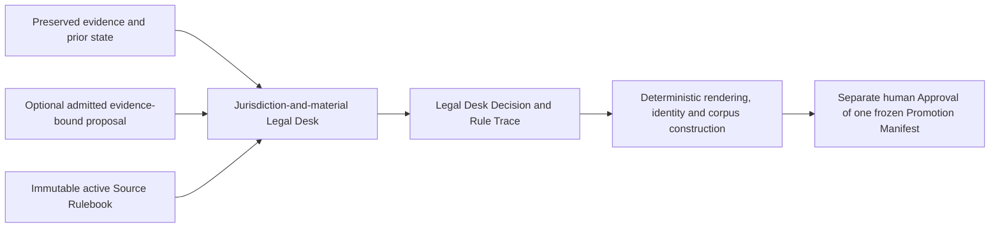

The Desk has no source, model-provider, Pinecone, Azure, backup, routing, or
promotion credentials. It cannot approve or deploy a result. If no stable rule
matches, required evidence is absent, or a conflict remains material, the Desk
fails closed through the exact blocked, Quarantine, Source Contract Review, or
unavailable-scope path instead of extending its own authority.

### 6.2 Completeness cannot rely only on change alerts

A watcher can miss a change because an official feed is incomplete, a website
layout changes, pagination breaks, or an item disappears without a normal
event. The intended pipeline therefore uses two checks:

1. frequent watcher checks for efficient change discovery; and
2. periodic full reconciliation of the official source inventory against the
   management register.

The full reconciliation detects missing sources, unexplained disappearances,
duplicate items, missed changes, and sources that have silently stopped
updating. A missing page is not treated as proof of repeal or withdrawal. The
desk must find the official status evidence required by its rulebook.

Each run has an explicit observation cutoff. Source events first observed after
that cutoff belong to a later package. All documents and attachments for one
legal item must represent a compatible official version; mixed-time snapshots
are rejected.

Source failures use bounded retries and remain visible until resolved. The
register records freshness expectations, last successful observation, outage
duration, and whether the failure creates a search coverage risk. A no-change
claim is valid only when every required source check completed successfully.

### 6.3 Source authorization assumption, integrity, and hostile content

This technical design assumes that every Registered Source and intended use is
legally compliant and has the required organizational approval. The register
may preserve licence, terms, attribution, access, and retention information
supplied by the source owner, but the pipeline does not independently decide
legal compliance at this stage. The legal team will define source-specific
rights and contractual controls later.

For a Principles source licence expiry, ADR 0015 defines the present technical
behavior: keep using the exact last approved records, mark the source scope
frozen in the register, and stop every update for that source. Expiry alone is
not treated as publisher withdrawal, authority-note change, withholding, retirement, or
deletion.

Downloads retain retrieval time, source location, content fingerprint, and
available publisher signature or checksum. Redirects, corrections, and
replacements are preserved as evidence rather than overwriting earlier files.

Downloaded text is untrusted input. Instructions embedded in a judgment, web
page, PDF, or metadata field cannot change the system's rules, prompts,
credentials, tools, or approval state. Scrapers and the LLM task runner operate with
the least access needed and cannot turn source text into executable commands.

## 7. Weekly operating cycle

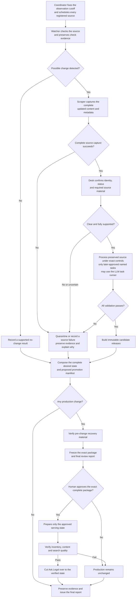

### Important workflow rules

- A genuinely clean no-change report needs no approval because it proposes no
  production action.
- A source failure or quarantine is not reported as “no change.”
- A watcher signal is not enough to prepare records. The required scraper run
  must finish completely, and the preserved result must pass validation.
- A partial or failed scrape is treated as a source failure and cannot reuse a
  mixture of old and new source content.
- An unclear Act does not block unrelated clear changes. The unclear Act is
  quarantined before the clean remainder is frozen for approval.
- Once frozen, approval is all-or-nothing. If the reviewer rejects one included
  change, the package is corrected and rebuilt with new fingerprints.
- One target cannot have two promotions in progress. A later run waits and is
  recomputed against the state that actually wins the earlier cutover.
- Retries are bound to the same input fingerprints and resume from durable
  checkpoints without duplicating records or actions. Changed inputs create a
  new run rather than altering the old one.
- Approval is valid only for the exact observed sources, desired-state
  inventory, settings, target state, recovery evidence, and time window in the
  frozen package. A relevant change before execution invalidates approval.
- Immediately before any remote write, the executor repeats safety checks for
  target identity, current inventory, configuration, credentials, recovery
  readiness, and approval validity.
- Failures before cutover leave Ask.Legal on the previous verified state.
- Failures after cutover trigger the documented recovery procedure; the exact
  served state and every compensating action are recorded.

### Promotion state and concurrency

The management register uses explicit states so a run cannot skip a control:

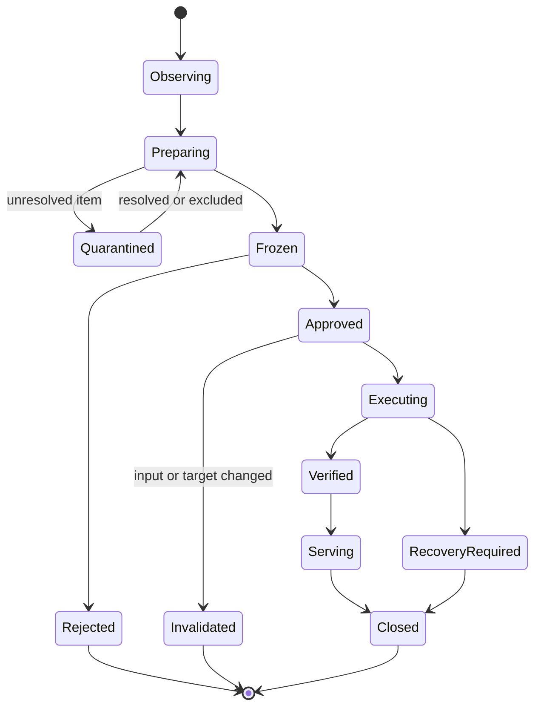

Every transition records who or what made it, when, why, and the fingerprints
of the inputs and outputs. Abandoned and superseded runs remain visible. A
scheduled run, urgent run, retry, and recovery cannot silently compete for the
same target.

## 8. What Pinecone contains

Pinecone is a clean serving copy, not the evidence archive.

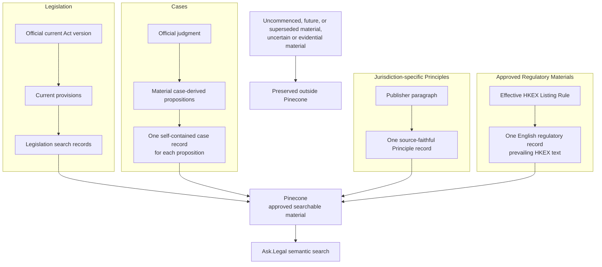

The four approved material families have different rules, described below.

“Current” is family-specific. For legislation it means the officially supported
operative text. For cases it means the official proposition together with the
latest supported treatment needed to prevent it being mistaken for good law;
negatively treated authorities remain searchable only under the case rules
below, and a conclusively overruled proposition is retired. For Principles it
means the latest maintained source-faithful paragraph, or the exact last
approved paragraph carried forward unchanged after a licence-expiry freeze,
subject to the other Principles authority-note and withholding rules. For Hong
Kong Regulatory Materials it means the exact HKEX rule text and applicability
proved effective at the frozen cutoff, including any concurrently current
transitional branch.

For every accepted Corpus Release, one validated search record becomes exactly
one vector with the same record ID. The deployment stage embeds only the text
selected by the sealed record contract and forwards only approved query
metadata. It cannot silently skip, split, merge, rewrite, or enrich records.
If even one record is invalid or cannot be represented safely, the affected
release is rejected before promotion.

### 8.1 Serving schema and internal traceability

The searchable text must be understandable on its own. Ask.Legal's live query
path uses only the Search Record ID and the six Pinecone metadata fields. Full
traceability does not need to be squeezed into those fields or joined during a
search.

A separate internal Record Traceability Lookup maps each record ID to:

- record ID and parent legal-item ID;
- Official Version and supporting Legal Location IDs;
- source-evidence references and fingerprints;
- Release Scope and Corpus Release ownership;
- structured authority-note evidence matching `metadata.authority_note`;
- internal grouping and display-citation identifiers where useful;
- opinion or provision locator where applicable; and
- the exact serving-payload fingerprint.

Operational and evidential detail stays in the management register and evidence
vault, while the lookup contains only compact pointers and fingerprints. It
does not contain the source files. Serving fields must not depend on parsing
human prose or filenames. Changing the serving schema requires a new sealed
contract and complete
validation of the affected corpus.

Read-only inspection of the existing data-preparation Release Store confirmed
that its registered serving-record schemas standardize the outer envelope as
top-level `id` plus exact metadata `text`, `country`, `jurisdiction`, `type`,
and `source`. The individual profile schemas share that shape but have their
own schema identities, constants, jurisdiction vocabularies, and locked
fingerprints. They remain reference evidence rather than runtime dependencies.

The target contract deliberately adds one field because the downstream LLM can
receive legal-record information only through Pinecone metadata. Every target
record therefore has exactly six required metadata fields: the five legacy
base fields plus `authority_note`. The field is always a string. The exact
case-sensitive value `"None"` means no approved record-level authority note
applies at that Serving State's observation cutoff; it does not claim that no
later treatment or source gap exists beyond the successfully checked evidence.
Omission, null, empty strings, whitespace, and alternative sentinels are invalid.

ADR 0054 adds `"regulatory"` as the serving `type` for approved
jurisdiction-specific Regulatory Materials without adding another metadata
field. Before such records can serve, every active query path, category filter,
renderer, downstream prompt, audit path, and promotion validator must prove
explicit compatibility with that value; an unknown-type fallback is not a
compatibility guarantee.

Query-facing date metadata and recency search are deliberately deferred. The
present contract adds no commencement, effective, publication, observation, or
generic recency field, and Ask.Legal performs no date filter or temporal boost.
Those dates remain structured internal facts in the Management Register and
Evidence Vault. A future explicit decision may define a new versioned query
contract, but it must first give each material family a legally meaningful
record-level date, handle unknown and mixed dates, and prove that recency does
not displace older controlling authority.

A real authority note is a concise controlled, source-supported authority and
reliance instruction. Mandatory `[WARNING: ...]` clauses appear first;
selected material `[SUPPORT: ...]` clauses may follow; selected neutral
`[CONTEXT: EXPLAINED]` clauses come last. Context is not endorsement. Neither
support nor context cancels, hides, or weakens a warning. The note is passed
unchanged with `metadata.text` to the downstream LLM. The embedding-input
contract uses `metadata.text` only and excludes `metadata.authority_note`.
Changing the note changes the immutable serving payload and therefore selects a
different exact Search Record. A previously unseen payload receives a new ID;
an exact former record may be reselected under ADR 0055. An unchanged text
embedding may be reused under its fingerprint.

The complete case-treatment graph and non-case status evidence stay internal.
The authority note is a controlled material rendering, not a raw citation or
event list. `APPROVED` and `FOLLOWED` are eligible support; `APPLIED` is
included when materially useful to authority assessment; and `EXPLAINED` is
included only as neutral context when it materially clarifies the exact
proposition. `CITED_ONLY` stays internal. There is no fixed support- or
explanation-clause count. The renderer includes every current material non-
repetitive signal that fits the pinned authority-note metadata and downstream-
context budget and consolidates equivalent events. Operative opinion status,
Hong Kong court authority, treatment significance, exact scope, and continuing
status control ordering and compression when the budget is approached. It
does not use citation counts as authority or create a numerical strength score.
An ordinary citation or consolidated repetitive treatment creates no note
churn.

Every distinct mandatory warning meaning must be rendered before support or
context. If faithful consolidation cannot make all mandatory warnings fit, the
proposition cannot serve with an incomplete note and follows Quarantine,
withholding, or no-new-target rules. Optional support and context that do not
fit after consolidation remain fully traceable internally.

For every Hong Kong record, a real authority note is an English-only internal
instruction. It is not translated merely because a Hong Kong legislation
record contains both English and Traditional Chinese source text. The
downstream LLM must apply the English note regardless of query language and may
express the resulting qualification in the language of its answer. If
Ask.Legal later displays the raw note to users, the language rule requires a
new explicit decision. ADRs 0020 and 0050 record this boundary.

Parent identity, internal grouping and citation data, provenance, release
references, and structured authority-note evidence remain in the immutable
fingerprinted Record Traceability Lookup. Every served Search Record has
exactly one matching entry. Missing, duplicate, orphaned, or mismatched entries
and authority notes that do not match their approved evidence block promotion. The
lookup is not read by Ask.Legal or the downstream LLM during an ordinary query.

Each registered profile retains its own schema identity and locked fingerprint.
The serving-record and Record Traceability Lookup contracts and exact content
fingerprints are bound into the Desired-State Inventory, Promotion Manifest,
and Serving State. The lookup is used for build validation, review,
investigation, and audit; temporary unavailability after activation does not
stop ordinary search. When implementation is authorized, the adopted contracts
belong in the greenfield contract package; runtime code does not import them
from the legacy workspace.

Compatibility must be proved per live query path rather than inferred from the
age or stability of the Ask.Legal application. Current read-only inspection
found the Python AI-Service broadly compatible with the legacy base fields, but
it has not proved that it passes required `authority_note` unchanged to the downstream
LLM. The Node Australian retrieval path still requires legacy `_node_content`
metadata and is incompatible. Every consumer of the new index must pass the
six-field end-to-end contract.

#### 8.1.1 Exact Serving Record and traceability encoding

ADR 0078 now fixes the shared normative encoding. One Serving Record contains
only a register-issued `rec_` plus 48-lowercase-hex `id` and one closed
`metadata` object containing required strings `text`, `country`,
`jurisdiction`, `type`, `source`, and `authority_note`. It contains no vector,
schema ID, date, provenance, evidence, grouping, citation, or traceability
field. Each registered material profile uses a closed JSON Schema Draft 2020-
12 schema to narrow values and exact limits without changing that outer shape.

Contract JSON is canonicalized with RFC 8785 JCS and encoded as UTF-8. All
fingerprints use SHA-256 rendered as `sha256:` followed by 64 lowercase
hexadecimal characters. The Search Record's content fingerprint is exactly:

```text
SHA-256(JCS(metadata))
```

It excludes the record ID so register-issued identity remains separate from
content proof. The exact authority-note fingerprint is SHA-256 over the UTF-8
bytes of the selected `metadata.authority_note`. The flattened Desired-State
Inventory's `content_fingerprint` has this serving-payload meaning. Exact bytes
are compared when registering equality; a digest collision or mismatched claim
is a critical integrity failure.

The Record Traceability Lookup is a complete immutable strict package. Its
canonical root manifest binds its schema, lookup-revision ID, all used serving-
record profile schemas, and one exact shard for every selected Release Scope.
Each shard binds its Release Scope, selected Corpus Release, shard ID, path,
media type, entry count, and exact artifact fingerprint. Unchanged shards may
be reused across lookup revisions.

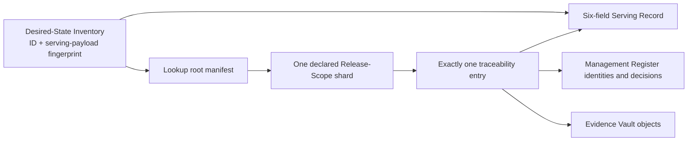

One entry records the Search Record ID and serving-payload fingerprint, exact
profile, Legal Item, non-empty Official Version and Legal Location sets,
Release Scope, Corpus Release, typed evidence references and fingerprints,
the authority-note decision and rendered-value fingerprint, and always-present
optional grouping and display-citation arrays. `authority_note_evidence` is
required even for exact `"None"`; the internal decision still proves why no
LLM-facing note applies.

Shards use explicitly declared `application/x-ndjson` files. Every line is one
JCS-canonical entry, entries sort by Search Record ID, and each line including
the last ends with LF. Empty scopes have a declared zero-byte shard. The root
fingerprint covers canonical `manifest.json`; the manifest transitively binds
every exact shard without containing its own digest or creating a cycle.

Before promotion, deterministic validation proves a perfect one-to-one join
between the flattened Desired-State Inventory and the complete lookup, exact
scope and release ownership, schema and profile compatibility, legal-identity
and evidence existence, authority-note equality, counts, canonical ordering,
and two-run reproducibility. Missing, duplicate, orphaned, mismatched,
undeclared, or unsorted content blocks the candidate. Ask.Legal still performs
no ordinary runtime lookup join.

### 8.2 Search-quality gate

Exact record counts prove database integrity, not usefulness. Before cutover,
the candidate serving state must also pass a fixed retrieval test set covering
each jurisdiction and material family. Tests include expected authority
retrieval, filters, citation display, authority-note display, proposition grouping,
duplicate suppression, and absence of quarantined or retired material.

The same tests run end-to-end through Ask.Legal after cutover. A material
regression blocks acceptance even if every vector was written successfully.

Serving State binds the exact query-contract identity and fingerprint and the
evidence that every active query path supports it. It does not bind the corpus
to one incidental application build. Exact app builds remain in deployment and
request logs. An app release requires a new Serving State only when it changes
retrieval, filtering, grouping, citations, authority notes, or another behaviour
governed by the query contract.

The embedding provider, model, dimensions, distance metric, and text-building
contract are pinned to each serving state. An embedding-model change requires a
complete compatible rebuild and verified cutover; incompatible vectors are
never mixed in one serving target.

### 8.3 Coverage status outside search

A clean Pinecone index cannot itself explain that a source is down, a commenced
amendment is awaiting an official consolidation, or an item is quarantined.
Silence would make a known gap look like a negative search result. The
management register therefore publishes a small, verified coverage-status
manifest for Ask.Legal and operators. It names affected jurisdictions or legal
items, the type and start time of the gap, and the last known good state.

This manifest does not by itself make prospective, uncertain, or old legal text
searchable. During a known official-consolidation gap, ADR 0080 permits an exact
evidence-bound reconstruction and ADRs 0079 and 0081 permit latest applicable official HKeL
wording as its fallback. The manifest makes the application warning independent
of whether the LLM follows the record warning and identifies the active mode,
accepted event facts, base version, and missing-consolidation condition. It
does not itself construct legal text.

## 9. Legislation model

### 9.1 Record structure

Legislation is tracked from the complete Act down to the searchable record:

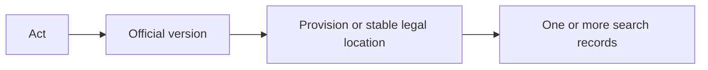

Every record can therefore be traced back to its Act, official version, and
legal location. Long provisions may create several search records without
losing that parent relationship. This supports precise change detection,
replacement, reporting, reuse of unchanged work, and recovery.

### 9.2 Prospective legislation: the waiting room

“Prospective legislation” means enacted or assented legislation that has not
yet commenced. Bills and drafts are outside this category.

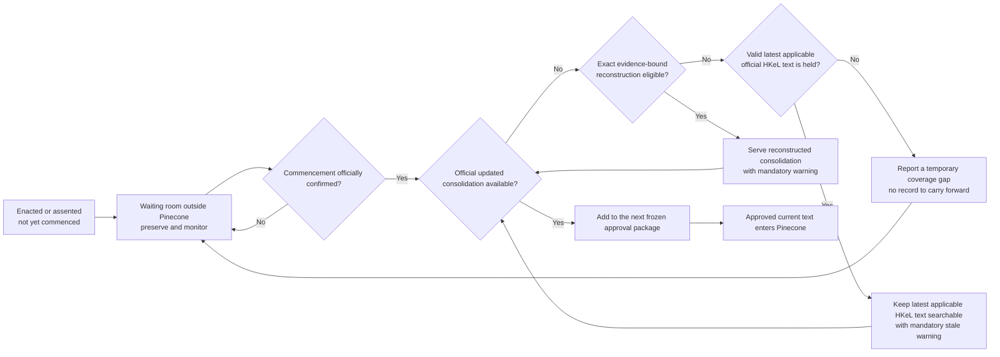

New material for which no valid applicable HKeL base text is held cannot be
reconstructed. It remains outside Ask.Legal search until an ordinary official
consolidation becomes available, unless another valid ADR 0079 fallback record
exists.

If an amendment has commenced but HKeL has not caught up, the system records
the event and exact affected locations and reports a Coverage Gap. It first
attempts ADR 0080 reconstruction using the complete proved bilingual base,
event chain, amendment operations, and applicability evidence. A successful
result serves with the exact reconstruction warning. Any unsupported,
incomplete, conflicting, or ambiguous operation produces no reconstructed
text and falls back to ADRs 0079 and 0081's warned latest applicable official HKeL wording where
available. Exactly one result is selected for each affected serving unit.

#### Hong Kong publication-lag reconstruction

ADR 0080 calls the immutable internal result a **Reconstructed Consolidation
Artifact**. It requires the latest applicable bilingual HKeL base supported by
matching verified or assisted official HKeL copies,
complete official amendment and commencement evidence from that version to the
cutoff, exact event order and applicability, the closed ADR 0082 supported-
operation registry,
separate authentic English and Traditional Chinese application, complete
bilingual reconciliation, and reproducible final bytes. It is not an HKeL
Official Version. A model may not directly author the final text; any later
model proposal role remains subject to ADR 0043, while deterministic rules
produce the result.

The Search Record otherwise behaves exactly like ordinary Hong Kong
Legislation: the same `metadata.type`, index, namespace, retrieval, ranking,
source, citation, quotation, bilingual construction, splitting, release,
approval, promotion, rollback, and retirement rules apply. There is no separate
material type or lower-ranked query path. Its only special record-level
treatment is this exact English `metadata.authority_note`, with placeholders
filled only from proved evidence:

```text
[WARNING: RECONSTRUCTED CONSOLIDATION] As at [observation cutoff], HKeL had not yet published an updated consolidated copy incorporating the proved operative amendments affecting this provision. This record is a reconstructed consolidation using the latest applicable HKeL copy, version date [base version date], and the official amendment and commencement evidence identified in metadata.source, effective [effective date or exact applicability condition]. [INSTRUCTION: If you use this record to support any part of an answer, you must explicitly include the preceding warning in your response.]
```

When the model uses the record to support any part of an answer, it reproduces
the warning portion before `[INSTRUCTION: ...]` explicitly in the response. It
does not reproduce the instruction itself. Retrieval without use does not
trigger it.

The Record Traceability Lookup binds the base Official Version, all amendment
and commencement artifacts, ordered operations, affected locations, bilingual
proofs, rulebook and engine versions, release, and later reconciliation. When
HKeL publishes the matching applicable consolidation, the ordinary official
record replaces the reconstruction after passing all gates. A material
mismatch suspends the affected reconstruction rule or operation class while
the valid official result proceeds.

#### Reconstruction operation registry

ADR 0082 fixes a closed, immutable, versioned operation allow-list. The engine
can execute only exact source-backed tree and text changes:

| Operation ID | Exact operation |
|---|---|
| `HKRECON-OP-001` | Substitute one exact text range |
| `HKRECON-OP-002` | Substitute every exact match inside one completely enumerated scope |
| `HKRECON-OP-003` | Insert one complete structural node at an exact position |
| `HKRECON-OP-004` | Delete one completely identified structural node |
| `HKRECON-OP-005` | Replace one complete structural node |
| `HKRECON-OP-006` | Renumber or relabel one exact node without inferring unstated cross-reference repairs |
| `HKRECON-OP-007` | Move one complete node when its new parent, order, and dependency effects are explicit |
| `HKRECON-OP-008` | Replace one closed table, Form, Schedule, formula, diagram-backed, or other renderer-supported region |

Every operation binds the exact authentic-language amendment evidence, legal
effect, commencement and applicability, base fingerprint, target and before
state, expected match set, source-supplied new content, order, dependency
closure, after state, and hashes. Target selection never uses fuzzy text,
semantic similarity, a model-authored patch, or an open-ended catch-all.

English and Traditional Chinese run as separate authentic-language streams and
must produce one complete aligned legal result. All operations needed for one
dependency-closed serving unit succeed atomically or no reconstruction exists
for that unit. Independently separable siblings may proceed only when complete
evidence proves the failed branch cannot affect them.

The engine produces an immutable Reconstruction Plan and Reconstruction
Execution Report before creating the Reconstructed Consolidation Artifact.
Those artifacts bind every operation, before-and-after hash, evidence item,
rule, result, and failure. They remain outside Pinecone but are reachable
through the Record Traceability Lookup.

An incomplete chain, unresolved order or applicability, unexpected match,
unsupported structure, bilingual disagreement, missing dependency closure, or
non-reproducible output emits no reconstructed record. The exact Coverage Gap
and reason are recorded, and ADRs 0079 and 0081 provide the warned latest-
applicable-HKeL fallback where eligible. ADR 0082 does not settle whether an
admitted future LLM task may propose or challenge a structured plan; ADR 0043
still governs that allocation, while deterministic rules always produce final
bytes.

#### Reconstruction conformance catalogue

ADR 0083 freezes the direct conceptual test universe for ADR 0080 through ADR
0082. It uses two linked layers:

1. 32 evidence-to-plan decision cases prove the exact accepted operation plan
   or the correct block, Quarantine, Source Contract Review, Coverage Gap, and
   fallback consequence; and
2. 31 plan-to-artifact deterministic cases prove atomic execution,
   reproducibility, exact artifacts, serving output, traceability, fallback,
   later-HKeL reconciliation, and readiness boundaries.

The current 63 cases map one-to-one to 63 permanent primary coverage cells. Thirty-five
controlled pairs fix high-risk distinctions such as exact versus fuzzy target,
complete versus partial replacement, proved versus unresolved order,
authentic-language evidence versus translation, bounded sibling versus shared
dependency, complete versus forged report, exact versus altered warning, and
later-HKeL match versus material mismatch.

Every case, cell, and pair member must pass; there is no percentage threshold.
The count follows direct coverage of accepted branches rather than a target or
Cartesian product. The existing 121-case package remains the ordinary pre-
reconstruction baseline, so a reconstruction-enabled profile has 184 direct
cases plus the 35 reconstruction pair assertions.

The logical strict package contains separate decision and deterministic
catalogues, a frozen coverage matrix and pair catalogue, declared case
packages, source-shaped synthetic inputs, Legal Desk reference decisions, and
separately hashed exact expected artifacts. It cannot read the network, real
source stores, credentials, undeclared files, Pinecone, Azure, or production
state. A later admitted LLM plan-proposal task requires its own semantic
evaluation; it cannot replace this deterministic final-output suite.

#### Reconstruction Plan and Execution Report contracts

ADR 0084 fixes two strict internal JCS JSON artifacts. A Reconstruction Plan
exists only after the Hong Kong Legislation Legal Desk accepts one complete
structured plan for one Legal Item, latest applicable bilingual HKeL base,
cutoff, applicability branch, and dependency-closed result. A Reconstruction
Execution Report then accounts for every planned operation and exact output or
failure.

| Internal object | Opaque register-issued identity |
|---|---|
| Reconstruction Plan | `rpl_` plus 48 lowercase hexadecimal characters |
| Operation instance | `rop_` plus 48 lowercase hexadecimal characters |
| Reconstruction Execution Report | `rex_` plus 48 lowercase hexadecimal characters |
| Reconstructed Consolidation Artifact | `rca_` plus 48 lowercase hexadecimal characters |

IDs are identity, not hashes. Complete canonical artifact bytes receive
separate `sha256:` fingerprints stored with references. Every reference binds
both the issued ID and exact fingerprint; mutable paths, URLs, aliases, titles,
and locators cannot substitute for immutable objects.

The Plan binds the cutoff, Legal Item, exact base and evidence class,
applicability decision, complete event chain, dependency closure, affected
locations, contract versions, evidence inventory, Legal Desk decision, and
exact English and Traditional Chinese streams. Each operation records its
registry type, amendment and effect events, source units, structural selector,
before state, source-backed parameters, expected after state, dependencies,
atomic group, and order.

An authentic-language stream may be explicitly `UNCHANGED` with zero
operations only when official evidence proves a one-language-only correction
and its expected final tree equals the base. At least one stream must be
`CHANGED`; missing language evidence or generated translation remains invalid.
Effect-only commencement and applicability events may have no text operation
but must bind the operations whose legal effect they establish.

The Report validates the base, event chain, dependency closure, both language
streams, operation results, bilingual result, Rule Trace, coverage consequence,
selection consequence, and exact output artifacts. It distinguishes
`APPLIED`, `FAILED_PRECONDITION`, `FAILED_EXECUTION`, and
`NOT_RUN_AFTER_ATOMIC_FAILURE`, so no operation silently disappears after a
failure. A failed plan emits an explicit zero-artifact result and may name
`FALLBACK` only through a separately validated ADR 0079/0081 selection.

Normative Reports omit wall-clock times, hostnames, temporary paths, process
IDs, logs, and similar run noise so two clean executions remain byte-identical.
Operational attempt facts remain separate register events. Neither Plan nor
Report fields enter Pinecone, embeddings, or `metadata.text`; the Serving
Record remains the strict six-field ADR 0078 object with the ADR 0080 warning.

#### Reconstructed Consolidation Artifact

ADR 0085 fixes the immutable final internal package produced by successful
execution. It has an opaque `rca_` identity and contains exactly the declared
manifest, authentic-language trees and source-unit inventories, reconstructed
location units, Bilingual Alignment Map, dependency and source-unit coverage
proofs, derivation map, and identity-lineage result.

The dependency direction is acyclic: the artifact references the accepted
Plan but not the Execution Report; the Report references the artifact; the
Record Traceability Lookup later references all three. Each receives a separate
canonical fingerprint.

Every final source unit has one primary derivation:

- `UNCHANGED_BASE_UNIT` binds byte-identical content from the admitted HKeL
  base; or
- `OPERATION_RESULT_UNIT` binds one admitted `rop_` operation and exact
  authentic-language amendment source units.

There is no generated, inferred, translated, manual, engine-corrected, or
catch-all derivation. Structural changes, node order, labels, asset
relationships, and changed content must also bind their responsible operation.
One unaccounted byte or relationship invalidates the complete atomic artifact.

`reconstructed-location-units.jsonl` is the sole reconstructed input to the
ordinary Hong Kong legislation renderer. It is not a Serving Record: it has no
`metadata`, Search Record ID, embedding, authority note, final partition, or
Pinecone field. The ordinary renderer and partitioner create exact six-field
records later, using the ADR 0080 warning as the only special record-level
treatment.

The package preserves complete authentic English and Traditional Chinese
trees even when they have different structures. Every final unit appears
exactly once in its language inventory and one Bilingual Alignment Group. The
identity-lineage result records retained, new, ended, renumbered, moved, split,
merged, and replaced locations under register-issued identity rather than
calculating identity from numbering or text.

Later HKeL comparison never mutates the artifact. Exact legal-content agreement
supports ordinary HKeL replacement. A material mismatch preserves the package
and evidence, selects the valid HKeL result, and triggers the attributed
monitoring and suspension result.

#### Later-HKeL monitoring and reconciliation

ADR 0086 reuses the scalable monitoring tiers in ADR 0031. Active
reconstruction creates a known affected item, not a second full-corpus polling
loop. Unchanged lightweight HKeL signals perform no full acquisition or
comparison; a relevant changed signal triggers bounded acquisition of the
exact bilingual bundle.

A later HKeL candidate first passes every ordinary source, evidence, bilingual,
status, identity, rendering, release, Approval, and promotion gate. Invalid
HKeL does not replace or become comparison truth. Valid applicable HKeL always
becomes the preferred ordinary result even when comparison is deferred or a
mismatch remains under investigation.

Comparison uses one exact Reconstruction Comparison Basis: the same item,
safely reconciled locations, authentic languages, event horizon, applicability
branch, operative period, presentation projection, and dependency boundary.
The result is one of:

- `EXACT_CANONICAL_MATCH`;
- `PRESENTATION_ONLY_MATCH`;
- `MATERIAL_MISMATCH`;
- `COMPARISON_NOT_ISOLATABLE`; or
- `HKEL_CANDIDATE_INVALID`.

Additional overlapping changes make comparison non-isolatable. The pipeline
does not reverse amendments or create a synthetic HKeL past version merely to
score itself. Valid HKeL still replaces serving; the former reconstruction is
preserved without a positive or negative comparison score.

A material mismatch is attributed only after exact evidence proves whether the
cause is base selection, source interpretation, event chain, applicability,
operation mapping, operation execution, bilingual dependency, rendering,
identity, particular source evidence, or remains unresolved. Suspension covers
the smallest complete safe component and every active or pending reconstruction
that references it. If the cause cannot be bounded, all reconstruction under
the affected rulebook/build profile stops.

During suspension, affected reconstruction falls back to the latest eligible
ADR 0079/0081 warned HKeL text or to no record when no fallback exists.
Unaffected work proceeds. Restart requires a corrected immutable component, a
permanent regression case and controlled pair where needed, complete affected
and ordinary suites, impact-set reconciliation, two clean runs, and a new
attestation. The current reconstruction catalogue therefore contains 63
direct cases and 35 controlled pairs, making 184 direct cases with the ordinary
baseline after ADR 0087's readiness cases.

#### Reconstruction readiness and activation

ADR 0087 keeps accepted reconstruction design separate from executable
authority. One exact immutable Reconstruction Capability Profile (`rcp_`) must
bind the rulebook, source interpretations, operation registry, contracts,
conformance universe, deterministic build, security boundaries, runtime
identity, and candidate-writing capabilities. Independent attesters then bind
complete mandatory suite, reproducibility, containment, malicious-input,
architecture, retry, restart, and idempotency results in one immutable
Reconstruction Capability Attestation (`rct_`).

Only a current Management Register activation for the exact profile,
attestation, build, scope, runtime identity, and capability grants permits the
legal-processing worker to create real candidate reconstruction artifacts.
Missing, stale, expired, mismatched, suspended, revoked, or unverifiable state
blocks before changing source text. Runtime rechecks prevent an in-flight
suspension from registering an eligible artifact.

Candidate-processing activation is not source-access authority, model-access
authority, human Approval, or permission to embed, back up, mutate Pinecone,
change Azure, deploy, or route traffic. Corpus construction must still freeze a
complete release, Desired-State Inventory, traceability lookup, recovery
evidence, and Promotion Manifest. Only the promotion worker may execute that
exact manifest after valid human Approval. This repository remains
`DESIGN_ONLY`; no capability or attestation currently exists.

### 9.3 Required lifecycle states

The management register must distinguish at least:

- enacted or assented, not commenced;
- commencement scheduled for a fixed date;
- commencement dependent on an order, proclamation, or event;
- partially commenced;
- in force;
- repealed or expired; and
- uncertain or source-conflicted.

Straightforward fixed-date commencement is easier than partial, conditional,
retrospective, or amended commencement. The source rulebook must define the
evidence required in each jurisdiction.

### 9.4 Source displays differ by jurisdiction

The system must not assume that every official website displays prospective
and current law in the same way.

- **Australian Commonwealth:** a normal authorised compilation generally
  represents the law as amended and in force at its compilation date.
  Informational future-law compilations must not enter the current-law index.
  An “in force” listing does not prove that every provision has commenced, and
  the latest compilation may temporarily lag a commenced amendment.
- **Singapore:** the official site separately exposes current and uncommenced
  material and provides a legislation timeline.
- **United Kingdom:** revised legislation may show prospective effects inside
  the source display.
- **Hong Kong:** HKeL publishes Ordinances, Subsidiary Legislation, and
  Instruments, including a separate Instruments & Others data package. Only
  verified HKeL copies have the stated legal status; English and Traditional
  Chinese legislation are both authoritative, while Simplified Chinese and
  ordinary HTML or RTF renderings are informational. Ask.Legal nevertheless
  accepts matching official HKeL assisted copies as its product-evidence
  threshold for any covered item under ADR 0081; it records that distinction
  without claiming verification.

Each source team therefore follows its own rulebook and status data rather than
inferring legal effect merely from whether text appears on a page.

### 9.5 Legislation identity continuity

Legislation identifiers follow proved legal continuity, not matching URLs,
titles, citations, visible provision numbers, wording, or document positions.
The responsible Legal Desk applies the following general rules to preserved
official evidence:

| Event | Identity result | Search and serving result |
|---|---|---|
| An official URL, provider location, or mirror moves while the artifact is proved unchanged | Keep the Legal Item, Official Version, and Legal Locations; add the new source location as an alias | Reuse exact Search Records |
| A new official consolidation or compilation is published | Keep the Legal Item; create a new Official Version; keep locations only after complete provision reconciliation | Reuse exact unchanged records only when continuing legal support is also proved |
| A continuing provision is amended | Keep the Legal Item and, when continuity is proved, its Legal Location; create a new Official Version when the changed official text is published | Changed serving payloads receive new Search Records linked to their predecessors |
| An official correction changes the text | Keep the Legal Item; create a new Official Version; keep the location unless the correction changes structural identity | Changed records receive new IDs linked as official corrections |
| An instrument is officially renamed | Keep the Legal Item only when official evidence establishes a rename of the same instrument | Change a Search Record only when its serving payload changes; a traceability-only citation change revises the Record Traceability Lookup |
| A provision is truly renumbered | Keep its Legal Location only under an official mapping or a reasoned Legal Desk decision permitted by the written rulebook; retain old and new locators as aliases | Create a new Search Record if a serving field changed and record renumbering lineage |
| A provision is repealed without replacement | Preserve its Legal Item and historical Legal Location; record a new Official Version only when one was published, otherwise append a Legal Status Event | Remove the records from the next approved current desired state without deleting identity or evidence |
| A provision is repealed and substituted, even at the same number | End the old Legal Location and create a new one | Create new records linked as substitutions |
| A provision is split, or several are merged | End the predecessor locations and create the required successor location or locations | Create new records and preserve complete one-to-many or many-to-one lineage |
| An entire instrument is repealed or expires without a successor | Preserve the Legal Item and all historical locations; append the supported Official Version or Legal Status Event | Retire current records only through an approved complete desired-state change |
| A repealed instrument is replaced or re-enacted as a new instrument | Create a new Legal Item, locations, and versions even if title or wording is similar | Create new Search Records and link the authorities as replacement or re-enactment |
| An instrument or provision is officially revived | Reuse a Legal Item or Location only when official continuity evidence proves revival of that same legal object | Reuse an old record only when all six metadata fields are exact and the Legal Desk proves continuing legal support; otherwise create a reinstatement successor |
| The pipeline corrects its own processing error | Keep the official identities unchanged | Create a new Search Record for a changed payload and label the lineage as a processing correction, not an official correction |
| Official sources conflict or continuity is ambiguous | Make no new current identity assertion | Preserve all evidence and quarantine the event |

A **Legal Status Event** is not an Official Version. It records a sourced
change in legal effect or status—such as commencement, repeal, expiry, or
revival—when no new official version was published. This prevents the pipeline
from manufacturing an “official” text merely because the law changed.

An amending instrument is a separate Legal Item from the principal instrument.
It causes a new Official Version of the principal instrument only when the
official source publishes that version. If the amendment has commenced but no
official consolidation is available, the system reports a Coverage Gap and
first applies ADR 0080's complete reconstruction gates. The reconstructed
artifact is not an Official Version. If any proof fails, ADR 0079 keeps valid
latest applicable official HKeL wording searchable for each affected location. Event
awareness alone never authorizes reconstruction.

Every continuity decision records the applied rule, responsible Legal Desk,
official identifiers and status evidence, complete before-and-after artifacts
and provision inventories, fingerprints, effective and observation dates, and
all identities kept, created, ended, or related. Automated comparison may
propose a match, but similarity, numbering, or an alias cannot decide legal
continuity. Each jurisdiction's source rulebook must still specify the exact
official evidence that satisfies these categories.

### 9.6 Hong Kong legislation coverage and bilingual records

The Hong Kong Legislation Legal Desk owns three complete, non-overlapping
Release Scopes:

| Release Scope | Complete ownership boundary |
|---|---|
| `HK-LEG-ORDINANCES` | Principal, amending, private, and other enacted Hong Kong Ordinances |
| `HK-LEG-SUBSIDIARY` | Subsidiary legislation, including applicable regulations, rules, rules of court, orders, proclamations, resolutions, notices, bylaws, commencement instruments, and other instruments made under an Ordinance and having legislative effect |
| `HK-LEG-CONSTITUTIONAL-AND-OTHER-INSTRUMENTS` | The Basic Law, Annex III national laws applied to Hong Kong, central constitutional decisions and interpretations, and genuine residual constitutional or other material accepted from HKeL's Instruments or Instruments & Others classification |

Schedules, annexes, appendices, forms, and tables remain Legal Locations under
their parent Legal Item. The Gazette is a Registered Source rather than a
Release Scope. Its classifications help identify enactments and status events,
but every covered legal item remains owned by exactly one scope above.

HKeL's `Instrument` type and A-number are source publication and indexing
facts, not legal classifications or Release Scopes. The Hong Kong Legislation
Source Rulebook contains one immutable, versioned, and fingerprinted HKeL
Instrument Disposition Registry that accounts for every Instruments & Others
entry and every Legal Item or Legal Status Event it represents or proves. One
source entry may support several legal objects, and the registry keeps the
source artifact separate from those objects.

This Instruments & Others design is an accepted current baseline with a
mandatory future-review flag. It must be revisited before the Hong Kong
Instruments disposition work is treated as final or implementation-ready. The
review may amend or supersede ADR 0030 and the populated registry.

Actual legal nature determines ownership. A Hong Kong Ordinance in the
A-series belongs to `HK-LEG-ORDINANCES`; A-series subsidiary legislation
belongs to `HK-LEG-SUBSIDIARY`; and only the Basic Law, applicable national
laws, central constitutional decisions and interpretations, and genuine
residual instruments belong to the constitutional-and-other scope. An
A-number remains an Identity Alias and cannot decide continuity or create
duplicate ownership.

Each supported legal object receives exactly one primary serving disposition:

| Instrument disposition | Current-law result |
|---|---|
| `SEARCHABLE_CURRENT` | The presently operative rule, power, duty, boundary, procedure, or authoritative interpretation may be searched after all evidence and conflict checks pass |
| `WAITING_ROOM` | Validly made or adopted material remains outside current search until the accepted evidence proves it operative |
| `EVIDENCE_ONLY` | The artifact proves an event or relationship whose relevant present effect is fully represented by another tracked current authority |
| `HISTORICAL` | Ceased, superseded, spent, functionally exhausted, or otherwise historical material remains preserved outside current-law Pinecone |
| `QUARANTINE` | Unresolved identity, nature, effect, ownership, evidence, bilingual alignment, replacement, or conflict prevents search |

Evidence relationships are separate from that primary disposition. An
authority may be searchable and also `interpret` another provision; a
promulgation artifact may remain evidence-only while the applied national law
supplies the searchable provisions. The system does not duplicate text merely
because a wrapper reproduces the same authority.

HKeL `InEffect` is a required signal but not an automatic legal conclusion.
The Legal Desk records an item-specific disposition reason. A previously
unknown, missing, changed, reclassified, unaccounted, or duplicate-owned entry
blocks the affected item or scope until a new registry version resolves it.
Every observation cutoff completely reconciles the live source inventory with
the selected registry version.

A still-applicable NPCSC interpretation may be searchable as its own Legal
Item and linked to the exact Basic Law provision it interprets. When retrieval
of the provision alone could cause materially incomplete reliance, the
provision's Search Record carries an evidence-backed English warning clause in
its authority note naming the interpretation. A relationship does not
automatically create an authority note; without an approved substantive note
the value remains `"None"`. ADR 0030 records the complete registry, routing,
disposition, relationship, authority-note,
and reconciliation rules.

Hong Kong Legislation registers fourteen stable source roles. Each role records
its exact fact authority, outage impact, monitoring tier, and separately
versioned endpoint records. There is no global `controlling` flag.

| Stable source ID | Accepted role | Outage and cadence |
|---|---|---|
| `HK-LEG-HKEL-CURRENT-INVENTORY` | Complete current HKeL item, language-resource, version, status-signal, locator, and hash inventory; not exact wording or event cause | Release-blocking; daily lightweight check and complete Observation within 24 hours of cutoff |
| `HK-LEG-HKEL-CURRENT-DATA` | Current bilingual XML construction and comparison input; not sufficient text-and-version proof by itself | Blocks affected work only; on demand after a real signal |
| `HK-LEG-HKEL-VERIFIED-COPIES` | Applicable verified bilingual HKeL text-and-version evidence | Blocks affected work only; on demand |
| `HK-LEG-HKEL-ASSISTED-COPIES` | Applicable official assisted bilingual HKeL text-and-version evidence under ADR 0081; not statutory verification | Blocks affected work only; on demand |
| `HK-LEG-HKEL-PAST-INVENTORY` | Earlier-version resource inventory for a specific baseline, investigation, recovery, audit, or evaluation task | No ordinary release gate; on demand only |
| `HK-LEG-HKEL-PAST-DATA` | Earlier structured XML; exact wording requires matching past verified PDFs | No ordinary release gate; on demand only |
| `HK-LEG-HKEL-EDITORIAL-RECORDS` | Exact official editorial amendments, affected locations, Parts, and effective dates; not resulting consolidated text | Blocks affected work when required; weekly inventory check |
| `HK-LEG-HKEL-PUBLICATION-SPECIFICATIONS` | Meaning of HKeL schemas, fields, structures, formats, status values, and verification marks; no item-specific fact | Blocks affected new interpretation when required; weekly fingerprint check |
| `HK-LEG-GLD-EGAZETTE` | Available modern ordinary and Extraordinary Gazette artifacts and their assigned legal events; not resulting consolidation | Release-blocking; daily complete inventory check and Observation within 24 hours of cutoff |
| `HK-LEG-OFFICIAL-GAZETTE-ARCHIVE` | Official printed or archive evidence for a specific pre-online, missing, ambiguous, or conflicting event | No ordinary release gate; on demand only |
| `HK-LEG-HKEL-GAZETTE-BACKCAPTURE` | Older Gazette discovery and source-note linking only | Nonblocking; on demand only |
| `HK-LEG-BASIC-LAW-PORTAL` | Constitutional inventory, links, and discrepancy signals; not controlling wording or status | Nonblocking outage; monthly plus event-triggered cross-check |
| `HK-LEG-NPC-NATIONAL-LAWS-DATABASE` | Originating national-law text or national status only when an item rule assigns that fact; not Hong Kong application or HKeL serving evidence | Blocks only affected work that requires the fact; monthly, event-triggered, and on demand |
| `HK-LEG-NPC-NPCSC-OFFICIAL-MATERIALS` | Exact originating NPC or NPCSC decision or interpretation when an item rule assigns that fact | Blocks only affected work that requires the fact; monthly, event-triggered, and on demand |

Stable IDs do not contain URLs, languages, formats, dates, or filenames.
DATA.GOV.HK catalogues and resources, HKeL item and generated download routes,
the Editorial Records product and RSS signal, GLD Gazette lists and issued
artifacts, archive holdings, the Basic Law portal, and NPC products are
versioned endpoint records. A URL move does not change source identity.

Hong Kong source monitoring uses four scalable tiers:

| Monitoring tier | Source roles | Normal cadence and release gate |
|---|---|---|
| Daily current-law signals | HKeL current inventory; ordinary and Extraordinary GLD Gazette inventories | One lightweight deterministic check per day; latest complete Observation within 24 hours of the weekly release cutoff |
| Weekly supporting sources | HKeL Editorial-Record inventory; HKeL publication specifications and Important Notices | Once per weekly cycle; current-cycle success whenever an affected decision relies on the source |
| Monthly or event-triggered cross-checks | Basic Law portal and constitutional or national-authority sources | Monthly baseline plus immediate affected check after a relevant controlling-source signal; temporary absence does not invalidate complete controlling evidence unless an item-specific decision requires that source fact |
| On-demand item and investigation evidence | Full current XML, matching verified or assisted PDFs, HKeL past inventory and data, archival Gazette evidence, and other large or historical artifacts | Acquire only after a change, new item, missing evidence, active review, historical investigation, recovery task, or release dependency requires it |

Watcher checks compare the minimum complete inventories, timestamps, hashes,
issue sequences, schemas, and specification fingerprints. They do not
repeatedly download unchanged corpora. An unchanged complete state records a
no-change Observation and stops with no LLM, embedding, or Pinecone work. A
real signal is deduplicated, scraped, and passed through deterministic schema,
hash, version, inventory, bilingual, known-rule, and prior-evidence checks
before further processing begins.

ADR 0043 defers the final task allocation, including whether a bounded Gazette
extraction proposal should use the sole generative-LLM task runner. The generic
gate in ADR 0031 authorizes no model call by itself. Processing work may be
reused only when every result-determining input matches. Embeddings start only
for validated changed Search Records selected for a candidate release. An
official, controlling-source, or authorized human signal may open an urgent
run between scheduled checks, but urgency bypasses no evidence, deterministic
evidence checks, Legal Desk authority, validation, approval, recovery, or
promotion control.

A stale, partial, failed, or unreconciled blocking source is unavailable, not
“no change”. After bounded retries, the pipeline reports a Coverage Gap and
uses only the accepted ordinary carry-forward, ADR 0080 reconstruction, ADR
0079 known-stale analytical fallback, withholding, or no-rebuild outcome.
Publisher delay does not itself prove that the law changed. ADR 0031 records
the monitoring, freshness, generative-LLM gating, urgent-run, and failure rules;
ADR 0032
records the stable source inventory and moves historical sources to on-demand
use.

The Gazette has three fact-specific source roles. The exact GLD e-Gazette PDF
or notice artifact proves available modern events; the printed Gazette or
Government Records Service supplies historical or escalation evidence; and
HKeL Gazette back-captures are discovery only until the required evidence is
obtained. An HTML search result is a locator, not the preserved event artifact.

Legal Supplement No. 1 proves publication and as-enacted Ordinance wording,
including its own commencement clause. Legal Supplement No. 2 proves subsidiary
legislation and exact commencement, revocation, or other notices. Legal
Supplement No. 3 Bills are discovery only. A Main Gazette notice proves only
the event expressly given effect by its enabling provision. Gazette
Extraordinary has the same evidential role as its instrument class; its timing
does not give it automatic priority over a source controlling a different
fact.

Publication and effective dates are recorded separately. Default, fixed,
appointed, and partial commencement use their exact accepted evidence; partial
commencement changes only the named Legal Locations. Repeal, revocation,
expiry, revival, correction, and amended or revoked event notices likewise
require the exact operative provision or instrument and effective date.
Earlier event history is preserved rather than overwritten.

Source priority is therefore fact-specific. Gazette evidence proves the event;
matching HKeL XML and the applicable verified or assisted official HKeL copy
evidence support the resulting consolidated text. If the Gazette proves a
commenced change before HKeL catches up, the system records the event, exposes
a Coverage Gap, and selects an eligible ADR 0080 reconstruction. If it cannot
pass, ADRs 0079 and 0081 select warned latest-applicable-HKeL records for affected locations with
valid official text.
If HKeL appears to show a status change without accepted event evidence, the change is
quarantined. The Watcher covers ordinary and Extraordinary Gazette publication
and reconciles complete expected issue-and-notice inventories rather than
depending on keyword alerts. ADRs 0025, 0031, and 0032 record these rules;
exact clock times and retry backoff remain operational details.

HKeL past data and Editorial Records have separate roles. Past inventory, XML,
and applicable verified PDFs are acquired only for a specific initial-baseline,
investigation, recovery, audit, or evaluation task. They receive no ordinary
weekly check and impose no ordinary release freshness gate. Exact past wording
requires English and Traditional Chinese past XML reconciled with matching past
verified PDFs. Historical text remains outside current-law Pinecone and does
not prove present law or why a change occurred.

Normal comparison uses the pipeline's preserved previous accepted current
bundle, the newly acquired current bundle, and the accepted event evidence
explaining the change. Historical text may reveal that a section disappeared
or similar wording appeared elsewhere, but similarity only raises a question.
It cannot prove renumbering, repeal, commencement, or identity. Those outcomes
require the exact official mapping or other evidence permitted by the rulebook;
otherwise the question is quarantined.

An HKeL Editorial Record is official evidence of the editorial amendments it
states and their effective dates. The system preserves its complete bilingual
record, Parts, affected items and locations, operations, metadata, and
fingerprint. The Editorial Record is not the resulting consolidated Official
Version and never supplies `metadata.text`; matching current XML and the
applicable verified or assisted official HKeL copy evidence still support the
searchable result. The system does not apply an Editorial Record to old text.

An Editorial Record without matching updated applicable HKeL text evidence
creates a blocked update and Coverage Gap. An unexplained HKeL text change, a
disagreement between past XML and its verified PDF, or a conflict between an
Editorial Record and the resulting HKeL text enters Quarantine. Past-data
failure blocks only the requested investigation or dependent decision when a
current record is otherwise completely supported. Editorial Records remain a
weekly source because they may directly explain a current-text change. ADRs
0026 and 0032 record these boundaries.

Coverage means complete accounting, not automatic Pinecone inclusion. Each
scope accounts for operative current material, enacted but uncommenced material
in the Waiting Room, amendment and status evidence, repealed or past versions
preserved outside current search, and uncertain material in Quarantine. Only
supported operative current provisions become Search Records. LegCo Bills,
drafts, the Bills Database, and proceedings are excluded from the automated
Hong Kong Legislation pipeline under ADR 0027. There is no Registered Source,
Watcher, connector, inventory, routine Source Snapshot, Bill workflow, authority note,
or serving output for them. Optional manual consultation is non-controlling and
cannot replace accepted evidence.

Complete Gazette reconciliation may observe the minimum issue identity and
classification of a Legal Supplement No. 3 entry. That does not authorize Bill
text acquisition or processing. Judgments belong to Hong Kong Cases,
publisher-derived material belongs to Hong Kong Principles, and treaties are
outside this rulebook unless implemented through covered Hong Kong legislation.

For HKeL-derived current text, XML and the applicable PDF evidence have
different mandatory jobs. Matching English and Traditional Chinese XML is the
machine-readable construction input: it supplies the complete inventory,
paired structure, Legal Location boundaries, change detection, canonical text,
and deterministic splitting. Matching English and Traditional Chinese official
HKeL verified or assisted copies are the text-and-version evidence under ADR
0081. A newer complete assisted version may proceed instead of an older
verified version. The source class is preserved accurately.

The system preserves both XML languages and both applicable PDFs, records
whether each PDF is verified or assisted, builds the bilingual candidate from
XML, and reconciles each XML language with its PDF. It also proves that both
language versions identify the same instrument, Official Version, Legal
Location, and operative state. The comparison covers identifiers, version and
relevant Part or Schedule dates, locators, headings, exact wording and
punctuation, numbering, order, lead-ins, footnotes, tables, forms, Schedules,
and bilingual alignment. Only versioned, enumerated PDF presentation
differences such as page headers, footers, line wrapping, and pagination may be
ignored. Fuzzy similarity, translation inference, and generative-LLM judgment cannot
establish equality.

The failure rule is exact: missing or older XML, no matching official HKeL
verified or assisted copy, different English and Traditional Chinese versions,
or an uncheckable legal structure blocks or quarantines the affected candidate.
There is no monolingual fallback. A new Official Version still receives a new
Official Version identity even when its six-field serving payload is unchanged;
the old Search Record may be reused only when exact payload equality and
continuing legal support are proved.

The Evidence Vault retains the XML, PDFs, source metadata, hashes, mappings,
and deterministic comparison report. The Record Traceability Lookup points to
that evidence. PDF bytes, PDF-extracted text, XML markup, and comparison data
never enter `metadata.text`, embeddings, Pinecone, or the ordinary downstream
LLM request. Only the reconciled canonical bilingual text constructed from XML
crosses the serving boundary.

The dual-representation rule is mandatory for all HKeL-derived Hong Kong
Legislation: matching bilingual XML plus matching verified or assisted official
HKeL copies. ADR 0081 makes assisted copies eligible across covered scopes. The Basic Law
portal is a registered discovery, inventory, link, and cross-check source; its
page text does not construct the serving payload.

The assisted-copy role is
`HK-LEG-HKEL-ASSISTED-COPIES`. The Basic Law portal role is
`HK-LEG-BASIC-LAW-PORTAL`. HKeL assisted evidence may establish more than one
separately recorded fact when the exact promulgation instrument actually
contains both the locally applicable text and its application evidence; the
pipeline does not demand redundant files merely to make the source chain look
longer.

An eligible assisted copy does not by itself create an Authority Note. Its
record uses `metadata.authority_note: "None"` unless a separate substantive
authority note applies. The assisted classification remains in the management register,
Evidence Vault, and Record Traceability Lookup. If HKeL later supplies a
matching verified copy, the pipeline appends that stronger evidence after
reconciliation; an exact unchanged serving payload does not need a new Search
Record.

The pipeline interprets HKeL artifacts through a pinned **HKeL Publication
Specification Bundle**, not through tag-name guesses or mutable documentation
lookups during record processing. The bundle contains the exact relied-on XSD,
XML data dictionaries, Important Notices, applicable DATA.GOV.HK catalogue
descriptions, fingerprints, and the Source Rulebook's explicit interpretation
mapping. It defines source structure, metadata boundaries, status values,
version and language fields, resource hashes, and verified-versus-assisted-copy
classification and marks.

These specifications explain how to read an artifact; they prove no item-
specific wording or legal event. A status field may route work or identify a
conflict, but the assigned Gazette, Editorial Record, HKeL verified-copy,
assisted-copy, or other evidence still proves the relied-on
fact. Specification material never
enters serving metadata, embeddings, Pinecone, or the downstream LLM request.

A Watcher fingerprints the exact relied-on specifications. A changed, stale,
conflicting, unknown, or non-validating specification opens Source Contract
Review and pauses only affected new processing. The review compares bundles,
updates parsers and conformance fixtures where necessary, issues a new immutable
Source Rulebook version and impact declaration, and re-evaluates only the
identified affected material. It does not silently change existing records.

A temporary documentation outage does not stop processing while the accepted
bundle is preserved, live input continues to validate, no relevant change is
observed, and the checking freshness limit remains satisfied. ADR 0028 records
the accepted pinning, change-control, failure, and serving boundaries.

Matching HKeL XML reconciled with matching official verified or assisted
copies remains the ordinary route for new or changed consolidated Hong Kong
text. ADR 0080 adds one publication-lag route: a deterministic reconstructed
consolidation may enter ordinary search only from the latest applicable
bilingual HKeL base under ADR 0081 and a complete proved operative amendment chain. It
uses the exact approved reconstruction warning and is not an HKeL Official
Version. If reconstruction cannot pass, ADR 0079 requires a newly identified
warned latest-applicable-HKeL payload wherever valid text is held. Both routes expose
the Coverage Gap until matching HKeL consolidation arrives.

HKLII is not a Hong Kong Legislation construction, verification, or status
source. ADR 0045 registers it as `HK-CASE-HKLII-DISCOVERY` for automated Hong
Kong Cases discovery, aliases, inventory cross-checks, and candidate treatment
leads. It remains non-controlling: a discrepancy only starts an investigation;
HKeL and accepted event evidence decide the legislation outcome.

Every searchable Hong Kong legislation location produces one bilingual Search
Record. The single `metadata.text` contains the corresponding English and
Traditional Chinese text for the same Legal Location, Official Version, and
operative state. The system creates no English-only or Traditional-Chinese-only
serving record and adds no language metadata field. Both languages are embedded
together because the embedding input is `metadata.text`, and both reach the
downstream LLM in the same retrieval result.

The two language portions must be version-aligned and structurally matched. A
missing, stale, differently versioned, or unmatched required language blocks a
new record and enters Quarantine or the accepted unavailable-scope process;
there is no monolingual fallback. Deterministic splitting keeps corresponding
English and Traditional Chinese material together. Changing either language
changes `metadata.text` and therefore creates a new Search Record ID.

Simplified Chinese may be preserved as informational evidence but cannot
replace Traditional Chinese in the serving payload. The canonical layout is
English first and Traditional Chinese second, with both labelled as authentic
text. English-first is deterministic formatting rather than an authority
ranking. Each language block contains the official instrument title and
chapter, citation, or other identifier when one exists, the exact provision or
structural locator, an optional official heading, and the official text:

    [English — Authentic Text]
    Instrument: {official English title} ({official chapter or citation})
    Provision: {official English locator}
    Heading: {official heading, when present}
    Text:
    {official English text}

    [繁體中文 — 真確文本]
    法例：{官方繁體中文名稱}（{官方章號或引稱}）
    條文：{官方繁體中文定位標示}
    標題：{官方標題，如有}
    正文：
    {官方繁體中文文本}

Source URLs, internal IDs, traceability-only dates, reviewer notes, authority notes,
AI explanations, unofficial summaries, and Simplified Chinese do not enter
`metadata.text`. Legal dates that are part of the official source text remain.
The renderer uses UTF-8, Unicode NFC, LF line endings, fixed whitespace, and a
versioned deterministic representation for lists, tables, forms, and similar
official structures. Unsupported structures are quarantined rather than
flattened by guesswork.

The system builds the complete bilingual payload before measuring it with the
exact tokenizer and limit pinned by the embedding contract. It separately
measures the complete compact serving metadata, including `authority_note`, against
the pinned metadata-byte ceiling. An overlong record splits only at matching
official boundaries: provision or other top-level location, subsection,
paragraph, subparagraph, Schedule or form item, table row or meaningful row
group, then another explicit official unit. If a child alone is too long, the
partitioner recursively descends to that child's next complete supported
aligned level. It does not stop at the first structural level.

Consecutive aligned units are grouped deterministically in source order using
the minimum number of valid parts and filling each earlier part with as many
complete consecutive units as possible. Every candidate is re-rendered with
its actual final part number and total before both ceilings are checked. Each
piece repeats the bilingual instrument and provision context. Its English
serving-part line follows the English locator, and its matching
`服務部分：第1部分，共3部分` line follows the Chinese locator. Only legally
necessary parent lead-in or other governing dependency text is repeated, in
both languages and expressly marked as repeated parent context before the
local text. Sliding-window overlap, monolingual pieces, text-similarity pairing,
and arbitrary sentence, punctuation, token, or character cuts are forbidden.
Unalignable structures and indivisible official units that remain too long are
quarantined with a Coverage Gap. ADR 0040 defines the complete recursive rule,
source-unit coverage proof, identity consequences, and conformance fixtures.

Because embedding both languages can dilute retrieval, the selected model must
pass fixed English, Traditional Chinese, cross-language, long-record, and
split-record evaluations. The exact multilingual embedding model and token
limit remain open. A poor model result does not authorize language-only
duplicates. A real Hong Kong `metadata.authority_note` remains outside
`metadata.text`, is excluded from embedding, and is English only under ADR
0020. ADRs 0019 and 0021 record the coverage, bilingual serving, canonical
layout, and splitting decisions. ADR 0022 records the mandatory XML-and-
verified-PDF reconciliation rule. The [Department of Justice](https://www.doj.gov.hk/en/about/orgchart_ldd_published_version.html),
[HKeL important notices](https://www.elegislation.gov.hk/importantnotices), and
[official current-data catalogue](https://data.gov.hk/en-data/dataset/hk-doj-hkel-legislation-current)
describe the source boundary and publication formats.

### 9.7 Hong Kong ordinary current-update rule path

The Hong Kong Legislation Source Rulebook gives the ordinary update path stable
rule IDs. The written rules, future executable representation, automated
fixtures, Legal Desk decision, and review screen use the same IDs. Each
decision preserves an ordered Rule Trace with the evidence, established and
unresolved facts, identity effects, disposition, review state, and reason.

The path applies when the pipeline already has a preserved previous accepted
current HKeL bundle. A first-ever baseline follows the separate path in section
9.8; absence of a predecessor cannot be represented as no change.

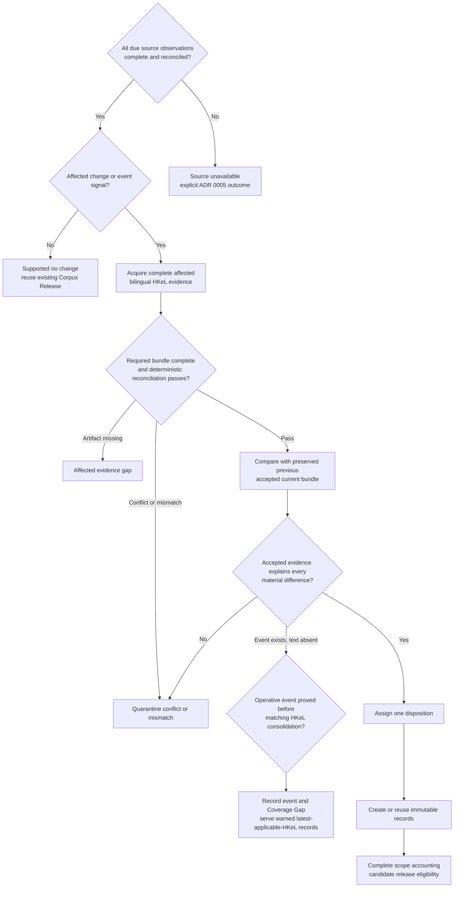

The stable rules are:

| Rule group | Stable IDs | Decision boundary |
|---|---|---|
| Observation | `HKLEG-CURRENT-OBS-001` to `003` | Complete supported no change, bounded affected work, or unavailable observation |
| HKeL evidence | `HKLEG-CURRENT-EVID-001` to `004` | Matching official HKeL copy path, verified-or-assisted evidence classification, missing artifact, or conflicting evidence |
| Difference | `HKLEG-CURRENT-DIFF-001` and `002` | Compare accepted current bundles, or open a separate initial-baseline task when no predecessor exists |
| Cause and HKeL lag | `HKLEG-CURRENT-CAUSE-001`, `CAUSE-002`, and `EVENT-001` | Prove every material cause, quarantine an unexplained change, or expose an operative event awaiting consolidation |
| Disposition | `HKLEG-CURRENT-DISP-001` | Assign exactly one searchable-current, Waiting Room, evidence-only, historical, or Quarantine result |
| Record and release | `HKLEG-CURRENT-REC-001` and `REL-001` | Reuse or create immutable six-field records and prove complete scope accounting |

Every result keeps its dimensions separate: processing is `PASS`, `BLOCK`, or
`QUARANTINE`; legal disposition is one of the five supported states only when
the disposition gate decides it; coverage records an exact gap or none; Source
Contract Review is an independent follow-up state; and record output is exact
or explicitly none. `SUPPORTED_NO_CHANGE`,
`AFFECTED_ACQUISITION_REQUIRED`, and `INITIAL_BASELINE_REQUIRED` are workflow
or reason results rather than extra legal dispositions. ADR 0044 fixes the
complete normalization.

No-change requires every due observation to be complete, fresh, reconciled,
and unchanged, with no unmatched Gazette event, Editorial Record,
specification change, or urgent signal. It records the comparison and reuses
the existing Corpus Release. A changed or missing item, resource, language,
version, status signal, locator, hash, Gazette event, Editorial Record, or
specification fingerprint opens affected work but proves no legal conclusion.

Every covered item uses matching English and Traditional Chinese XML and
matching bilingual official HKeL verified or assisted copies. A newer complete
assisted-copy bundle may proceed instead of an older verified bundle. A
missing artifact blocks the affected work; a conflict or deterministic
reconciliation failure enters Quarantine. There is no monolingual, fuzzy,
translation, or generative-LLM override.

The new supported current bundle is compared with the preserved previous
accepted current bundle. Historical HKeL data is acquired only for a separate
baseline, investigation, recovery, audit, or evaluation task. Observable
wording, structure, movement, disappearance, split, or merge raises a question;
it does not prove legal continuity or status.

Every material difference requires the exact accepted Gazette instrument,
Editorial Record, official correction, official mapping, or other evidence
assigned to its cause. A changed HKeL appearance or status signal is
insufficient. An unexplained or conflicting change is quarantined. If the
event is proved operative before HKeL publishes matching consolidated evidence,
the pipeline records the event and affected locations, exposes a Coverage Gap,
and selects an eligible ADR 0080 reconstructed payload. If reconstruction
cannot pass, it selects an ADR 0079 and ADR 0081 warned latest-applicable-HKeL payload for every
affected location with valid official text; a location with neither result
emits no record. Exactly one result serves per affected unit.

Only after these gates pass does the Legal Desk assign one primary disposition.
For a searchable-current location, exact equality of all six metadata fields
and proved continuing legal support permits record reuse. Any serving-field
change creates a new Search Record ID and evidence-backed lineage. Complete
Release Scope accounting includes unchanged selected records as well as every
affected item, event, disposition, candidate, retirement, Quarantine, and
Coverage Gap. It is required before release sealing, and passing it creates
candidate-release eligibility rather than production authority.

ADRs 0033 and 0044 fix eighteen conformance cases using these same IDs. They cover no
change, ordinary updates, missing and conflicting evidence, bilingual mismatch,
HKeL lag after a proved event, unexplained change, Waiting Room treatment,
exact record reuse, unsupported disappearance, assisted-copy boundaries,
missing predecessor, irrelevant historical-source outage, partial
commencement, Editorial Records, release-blocking Observation failure, and
item-bounded affected-source failure. Schema-valid output with the wrong Rule
Trace or collapsed result dimensions fails conformance.

### 9.8 Hong Kong first current baseline

The first baseline is the starting complete current-state account used when no
previous accepted current HKeL bundle exists. Its job is to prove what the
accepted current evidence supports at one fixed observation cutoff. It does
not replay the full history of every law.

For a clear item, the baseline accepts present operative state when the
complete current inventory accounts for it; matching bilingual current XML and
the applicable bilingual verified or eligible assisted PDFs reconcile; HKeL's
current item, provision, and structure signals are unambiguous; no accepted
Gazette, Editorial Record, constitutional-source, urgent, or other signal
conflicts; and the rulebook supports the proposed ownership and disposition.
An HKeL list entry, `InEffect` value, status code, version date, or current-copy
label is not sufficient by itself.

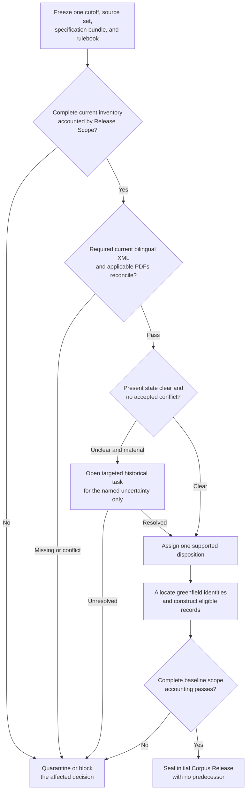

The stable first-baseline rules are:

| Stable ID | Decision boundary |
|---|---|
| `HKLEG-BASE-OBS-001` | Freeze one internally consistent observation package; do not mix cutoffs |
| `HKLEG-BASE-INV-001` | Account for every current HKeL object, language, resource, and Release Scope owner |
| `HKLEG-BASE-EVID-001` | Apply the accepted bilingual XML and applicable verified- or assisted-copy evidence gates |
| `HKLEG-BASE-STATE-001` | Establish clear present operative state from the combined accepted current evidence |
| `HKLEG-BASE-LIMIT-001` | Limit the assertion to present state; do not invent historical events, dates, or continuity |
| `HKLEG-BASE-REVIEW-001` | Open a bounded historical task only for a named material uncertainty |
| `HKLEG-BASE-HIST-001` | Use requested historical evidence only for its assigned fact and question |
| `HKLEG-BASE-ID-001` | Allocate new register-owned identities; treat source and legacy IDs as aliases |
| `HKLEG-BASE-DISP-001` | Assign one supported current, Waiting Room, evidence-only, historical, or Quarantine disposition |
| `HKLEG-BASE-REC-001` | Construct new canonical six-field greenfield records for supported current locations |
| `HKLEG-BASE-REL-001` | Seal only after complete first-release accounting, with no accepted predecessor |
| `HKLEG-BASE-CHANGE-001` | Re-freeze or run a separate ordinary update when a source changes after the cutoff |

Historical investigation is an exception, not a routine corpus backfill. It is
opened only when duplicate identity, partial or unclear status, ownership,
replacement, cessation, reappearance, renumbering, split, merge, continuity,
or a same-fact source conflict prevents a required current decision. The task
records the exact question, affected object, requested source roles, permitted
facts, and stopping condition. An unavailable historical source blocks only
that dependent decision unless complete scope accounting becomes impossible.

Historical matching may suggest a candidate explanation but never proves
identity, legal status, or an event by itself. It cannot replace a missing
current HKeL bundle or create reconstructed text. A baseline item accepted from
clear current evidence therefore carries a present-state-only assertion scope:
the pipeline may say the item is supported as current at the cutoff, but it may
not claim when or how that state arose unless the exact event evidence was
actually preserved and a rule assigns that fact.

The Management Register allocates new greenfield identities after the evidence
and disposition gates pass. Existing Distillation or Pinecone IDs may remain
non-authoritative aliases or migration trace facts, but they are not carried
forward as the new identity and do not create predecessor lineage. Every item,
including every non-searchable item, remains in complete release accounting.

If a source changes while the baseline is being prepared, the frozen package
remains immutable. The pipeline either starts a later cutoff or accepts the
original cutoff as a complete predecessor and processes the later signal under
the ordinary current-update rules before claiming later currency. It never
mixes old and new artifacts into a convenient partial baseline.

ADR 0034 fixes fourteen matching conformance cases. The accepted Instruments &
Others architecture and rows remain under the user's mandatory future-review
flag, so the constitutional-and-other-instruments baseline cannot be called
final while that gate is open. The two other non-overlapping Hong Kong
Legislation Release Scopes are not automatically blocked.

### 9.9 HKeL ordinary-provision reconciliation fixtures

The first accepted low-level fixture group covers ordinary instrument titles,
identifiers, sections, subsections, paragraphs, headings, and text. Each stable
fixture contains minimal synthetic bilingual XML and applicable PDF evidence,
source and version facts, the permitted presentation projection, expected
legal-content mapping, exact expected canonical `metadata.text` where one may
exist, the result, reason, rule references, and reconciliation-report facts.
The executable bytes must later follow the exact pinned HKeL schema; they may
not change the accepted outcome.

The result classes have narrow meanings:

| Result | Meaning |
|---|---|
| `PASS` | Evidence completeness and deterministic reconciliation pass; later legal-status, identity, disposition, record, and release gates still apply |
| `BLOCK` | Required evidence is unavailable, unknown source semantics require Source Contract Review, or deterministic candidate construction violates its contract without a source conflict; no candidate exists |
| `QUARANTINE` | Existing evidence conflicts, describes different legal material, or cannot be reconciled faithfully; preserve it for Legal Desk review |

The permitted PDF projection removes only enumerated presentation elements:
known verification-cover material checked separately, known repeated headers
and footers, page numbers and page-break markers, line wrapping and pagination,
or another element expressly classified by the pinned specification mapping.
Every ignored occurrence appears in the reconciliation report. There is no
generic PDF cleanup.

Words, numbers, dates, capitalization, quotation marks, apostrophes, hyphens,
dashes, punctuation, brackets, paragraph markers, numbering, order, headings,
cross-references, token boundaries, and legally meaningful whitespace are not
casually ignored. Dropping a line break must preserve the exact token boundary;
a line-end hyphen is not automatically inserted or removed.

English and Traditional Chinese pair only through official item, version,
provision, and structural identifiers interpreted under the pinned
specifications. Each language independently reconciles with its applicable
PDF, and the official structures must align. Translation similarity, word
counts, nearby positions, and a generative LLM cannot create or repair a pair.

The accepted ordinary-provision fixture set is:

| Stable fixture ID | Condition | Result |
|---|---|---|
| `HKLEG-RECON-ORD-FIX-001` | Exact legal content, identity, version, location, and structure match | `PASS` |
| `HKLEG-RECON-ORD-FIX-002` | Only enumerated and reported PDF headers, footers, page numbers, page breaks, line wrapping, or pagination differ | `PASS` |
| `HKLEG-RECON-ORD-FIX-003` | A legal word, number, date, cross-reference, quotation mark, hyphen, or punctuation differs | `QUARANTINE` under `HKLEG-CURRENT-EVID-004` |
| `HKLEG-RECON-ORD-FIX-004` | XML and PDF identify different items, Official Versions, or Legal Locations | `QUARANTINE` under `HKLEG-CURRENT-EVID-004` |
| `HKLEG-RECON-ORD-FIX-005` | A required XML or applicable PDF is absent, older, unreachable, truncated, or incomplete | `BLOCK` under `HKLEG-CURRENT-EVID-003` |
| `HKLEG-RECON-ORD-FIX-006` | One authentic language or its applicable PDF is absent | `BLOCK`; no monolingual fallback |
| `HKLEG-RECON-ORD-FIX-007` | The two authentic languages identify different versions or locations | `QUARANTINE`; do not pair by translation |
| `HKLEG-RECON-ORD-FIX-008` | An official heading differs or is unexpectedly absent | `QUARANTINE`, unless the pinned mapping proves the element is not an official heading |
| `HKLEG-RECON-ORD-FIX-009` | Paragraph numbering, markers, nesting, lead-in relationship, or order differs | `QUARANTINE`; matching sentences cannot be flattened into equivalence |
| `HKLEG-RECON-ORD-FIX-010` | A pinned explicit mapping classifies an XML element as non-legal operational metadata and all legal content reconciles | `PASS`; exclude the metadata and report the mapping |
| `HKLEG-RECON-ORD-FIX-011` | An XML element, enum, namespace, status, or meaning is unknown under the pinned specification bundle | `BLOCK`; preserve it and open Source Contract Review under ADR 0028 |
| `HKLEG-RECON-ORD-FIX-012` | Reconciled XML renders exactly in the accepted bilingual layout and contains no operational additions | `PASS`; any renderer-only contract deviation blocks the candidate until corrected |

`PASS` means only that this evidence gate passed. It never means that the law
is proved operative, that a Search Record has been approved, or that Pinecone
may be changed. Missing evidence uses
`AFFECTED_EVIDENCE_UNAVAILABLE`; a real XML/PDF or bilingual conflict enters
Quarantine; and unknown source semantics open Source Contract Review without
being guessed into either legal text or metadata.

ADR 0035 contains the common synthetic bilingual example and exact canonical
output used by the pass fixtures. ADR 0036 settles Schedules, tables, and forms;
ADR 0037 settles notes, images, and cross-references; ADR 0038 settles partial
status and general bilingual structural mismatch; and ADR 0040 settles general
overlong partitioning. Exact executable fixture bytes remain implementation
work. The Instruments & Others review remains separate and deferred.

### 9.10 HKeL Schedule, table, and form fixtures

The second accepted low-level fixture group preserves the legal relationships
inside Schedules, tables, and prescribed forms without trying to reproduce PDF
page design. Every Schedule is a Legal Location under its parent instrument.
Officially identified Schedule Parts, paragraphs, items, tables, forms, form
Parts, and independently referenced row or field groups may become child Legal
Locations. Unnumbered cells, blank controls, visual rows, page coordinates, and
renderer-created parts do not automatically receive permanent identity.

Tables use a deterministic labelled-row representation rather than general
Markdown. Each value receives its complete official header path, from a merged
outer heading to the leaf heading, joined by ` > `. The renderer preserves the
table identity, title, lead-in, units, qualifications, header scope, row and
column order, item numbers, values, blank states, symbols, and dependent row
groups. A blank, dash, zero, `N/A`, ditto mark, checkbox state, and omitted cell
are different source facts.

Forms preserve their number, title, parent, Parts, instructions, field groups,
field labels, control types, choice groups, options, dependencies,
declarations, certifications, signature and date fields, prescribed wording,
and order. Empty-control scaffolding describes the official blank form; it
never invents a completed answer or selected choice.

English and Traditional Chinese structures pair through official item,
version, parent, locator, and structural identifiers. Different widths,
wrapping, pages, and visual arrangement are acceptable only when each language
independently matches its applicable PDF and the official header paths, row
roles, form groups, controls, and order align. Translation similarity and a
generative LLM cannot repair a structural mismatch.

An overlong structure splits only at corresponding complete Schedule units,
table rows or inseparable row groups, or form Parts or field groups. Each part
repeats its necessary bilingual title, headings, units, instructions,
dependencies, and parent context. It never splits inside a cell, dependent row
group, form field, choice group, declaration, certification, signature
statement, or governing instruction, and a PDF page break is never a legal
split boundary.

The accepted fixtures are:

| Stable fixture ID | Condition | Result |
|---|---|---|
| `HKLEG-RECON-STF-FIX-001` | Schedule identity, title, parent, items, wording, nesting, and order match | `PASS` |
| `HKLEG-RECON-STF-FIX-002` | An exact classified Schedule heading repeats only because of a PDF page break | `PASS`; remove and report that occurrence |
| `HKLEG-RECON-STF-FIX-003` | Schedule number, title, parent, Part, item, nesting, wording, or order disagrees | `QUARANTINE` |
| `HKLEG-RECON-STF-FIX-004` | A simple rectangular table's complete headers, cells, empty states, and order match | `PASS` |
| `HKLEG-RECON-STF-FIX-005` | Merged headings map deterministically to unique complete header paths | `PASS` |
| `HKLEG-RECON-STF-FIX-006` | Only enumerated table widths, wrapping, pagination, or repeated headings differ | `PASS`; report every ignored occurrence |
| `HKLEG-RECON-STF-FIX-007` | Row or column order, cell assignment, header scope, span, nesting, or continuation disagrees | `QUARANTINE` |
| `HKLEG-RECON-STF-FIX-008` | Blank, omission, dash, zero, `N/A`, ditto, checkbox, symbol, or another value disagrees | `QUARANTINE` |
| `HKLEG-RECON-STF-FIX-009` | Bilingual tables differ visually but official header, row, cell, and order roles align | `PASS` |
| `HKLEG-RECON-STF-FIX-010` | Bilingual row, column, header, cell, group, or order roles cannot align | `QUARANTINE` |
| `HKLEG-RECON-STF-FIX-011` | Form identity, fields, controls, choices, instructions, dependencies, declarations, signatures, and order match | `PASS` |
| `HKLEG-RECON-STF-FIX-012` | Form spacing, field dimensions, wrapping, pagination, or placement alone differs | `PASS` when enumerated and reported |
| `HKLEG-RECON-STF-FIX-013` | A form field, control, instruction, option, dependency, declaration, signature, date, or order differs | `QUARANTINE` |
| `HKLEG-RECON-STF-FIX-014` | A table span, row group, form control, or dependency is unknown under the pinned specifications | `BLOCK`; open Source Contract Review |
| `HKLEG-RECON-STF-FIX-015` | A legally meaningful visual relationship cannot be represented faithfully in the accepted plain-text grammar | `QUARANTINE`; do not summarize or flatten it |
| `HKLEG-RECON-STF-FIX-016` | The deterministic longest consecutive split uses only corresponding complete safe units and repeats all required context | `PASS`; if no faithful smallest unit exists, apply `FIX-015` |

A faithful split that exists but is rendered incorrectly is a blocked
processing defect, not conflicting source evidence. A source structure that
cannot be faithfully represented or safely split is quarantined. ADR 0036
defines the renderer examples and full fixture conditions. ADR 0037 settles
footnotes, notes, images, and cross-references. Partial status and general
bilingual mismatch remain the next catalogue group; Instruments & Others
remains separately deferred.

### 9.11 HKeL note, image, and cross-reference fixtures

The third accepted low-level fixture group keeps legislative words, publisher
context, authority notes, visual evidence, and internal relationships separate.

A note is included in `metadata.text` only when the pinned HKeL specification
and Source Rulebook classify it as statutory text. A non-legislative HKeL
publisher note is preserved internally and excluded from the legislation. If
that note reveals a material reliance limitation, the record remains ineligible
until the Legal Desk approves a controlled English warning clause in
`metadata.authority_note` or
withholds it. Unknown note status blocks Source Contract Review. An HKeL
Editorial Record remains separate event evidence under ADR 0026.

Decorative images are excluded and reported, while official captions and
legends remain exact source text. A meaningful image can be represented in a
Search Record only through complete official structured text that HKeL itself
supplies and the pinned mapping identifies as equivalent. OCR, AI-generated alt
text, or reviewer prose cannot replace source evidence. A missing required
asset blocks; a complete meaningful image without a faithful official textual
equivalent enters Quarantine because the downstream LLM receives only text
metadata.

A cross-reference keeps its exact official words in `metadata.text`. Its target
is resolved separately through official identifiers and stored as an internal
relationship; the target's wording is never pasted into the referring record.
An exact unresolved reference may pass reconciliation with an internal
`UNRESOLVED_REFERENCE` state, followed by a separate authority-note-or-withholding
decision only when the unresolved target materially affects safe use. A known
out-of-scope target may pass without a coverage claim.

The accepted fixtures are:

| Stable fixture ID | Condition | Result |
|---|---|---|
| `HKLEG-RECON-NIR-FIX-001` | Statutory footnote marker, body, wording, numbering, order, attachment, and bilingual relationship match | `PASS`; include exact source text |
| `HKLEG-RECON-NIR-FIX-002` | A statutory footnote marker, body, number, order, or attachment differs | `QUARANTINE` |
| `HKLEG-RECON-NIR-FIX-003` | Required footnote evidence or one authentic language is missing | `BLOCK` |
| `HKLEG-RECON-NIR-FIX-004` | A note is explicitly classified as non-legislative HKeL publisher context | `PASS`; exclude from serving text and preserve internally |
| `HKLEG-RECON-NIR-FIX-005` | A publisher note materially qualifies safe reliance | Reconciliation may pass; record eligibility `BLOCK` until an approved authority note or withholding decision exists |
| `HKLEG-RECON-NIR-FIX-006` | Note category or effect is unknown | `BLOCK`; open Source Contract Review |
| `HKLEG-RECON-NIR-FIX-007` | A safe split keeps the statutory marker and complete body with the material qualified | `PASS`; a separating split is invalid and blocked |
| `HKLEG-RECON-NIR-FIX-008` | An enumerated image is decorative only | `PASS`; exclude and report |
| `HKLEG-RECON-NIR-FIX-009` | An official caption or legend reconciles | `PASS`; include exact wording |
| `HKLEG-RECON-NIR-FIX-010` | A required meaningful image asset is missing or unreadable | `BLOCK`; do not substitute generated text |
| `HKLEG-RECON-NIR-FIX-011` | HKeL supplies a complete mapped official textual equivalent for a meaningful image | `PASS`; use official text and preserve the image as evidence |
| `HKLEG-RECON-NIR-FIX-012` | A meaningful image has no faithful official textual equivalent | `QUARANTINE`; do not invent prose |
| `HKLEG-RECON-NIR-FIX-013` | Image identity, caption, legend, attachment, or bilingual image relationship conflicts | `QUARANTINE` |
| `HKLEG-RECON-NIR-FIX-014` | Exact reference words reconcile and official identifiers resolve the same target | `PASS`; preserve words and resolve internally |
| `HKLEG-RECON-NIR-FIX-015` | XML, PDF, English, or Traditional Chinese points to a different target | `QUARANTINE` |
| `HKLEG-RECON-NIR-FIX-016` | Exact reference reconciles but its target cannot be resolved | Reconciliation `PASS` with `UNRESOLVED_REFERENCE`; later materiality review may block record eligibility |
| `HKLEG-RECON-NIR-FIX-017` | A known target is intentionally outside corpus coverage | `PASS`; preserve it and make no target-coverage claim |
| `HKLEG-RECON-NIR-FIX-018` | Candidate construction expands, rewrites, modernizes, or silently corrects a reference | `BLOCK` as a deterministic processing defect |

ADR 0037 contains the full classification and fixture conditions. ADR 0038
settles partial legal status and general bilingual structural mismatch. ADR
0040 settles recursive general overlong-record partitioning and completes the
conceptual catalogue. ADR 0041 settles the strict machine-readable package and
catalogue contract; exact executable HKeL-schema fixture bytes remain later
implementation work.

### 9.12 HKeL partial-status and bilingual-structure fixtures

The fourth accepted low-level group prevents one convenient instrument-wide
status or superficial one-to-one translation structure from hiding the legal
state of individual locations.

The Management Register builds one immutable **Status Coverage Map** for each
covered item and cutoff. Every relevant Legal Location appears exactly once
with its parent relationship, status signals, accepted event evidence, dates,
inheritance or exception basis, one primary disposition, authority-note consequence,
unresolved facts, fingerprints, Rule Trace, and responsible Legal Desk
decision. The map is internal; it adds no Pinecone field and no prose to
`metadata.text`.

A parent status reaches descendants only when accepted evidence and the written
rule expressly cover the complete branch. Exact child exceptions override it
only for the named children. Status is never copied from a sibling. An HKeL
`InEffect`, partial-status, or similar source value is a signal rather than
standalone proof of commencement or cessation.

Authentic English and Traditional Chinese may use different numbers of source
units. A **Bilingual Alignment Group** contains one or more consecutive units
from each language that official identifiers and the pinned rulebook establish
as the same item, version, location, operative state, and parent relationship.
One-to-one, one-to-many, many-to-one, and many-to-many groups are permitted.
Every source unit appears exactly once, and each language keeps its authentic
wording, markers, nesting, and order. Translation similarity and a generative
LLM cannot create the mapping.

A problem affects the smallest complete legal branch that can safely be
separated. An independent sibling may continue; a conflict in governing or
unbounded context quarantines the complete dependent subtree or item. For an
ordinary update, Quarantine of a previously served record still requires ADR
0005's explicit carry-forward, Withholding Release, or no-rebuild decision.
The fixture itself never authorizes automatic production reuse or removal.

Partial status does not automatically create a note for every record. A current
record requires an English warning clause in `metadata.authority_note` only
when standalone reliance could
materially overstate the operative scope of its smallest mixed-status parent.
Independent records retain `authority_note: "None"`. An authority note never makes non-current or
uncertain text searchable.

The accepted fixtures are:

| Stable fixture ID | Condition | Result |
|---|---|---|
| `HKLEG-RECON-PSB-FIX-001` | Exact event evidence names the locations that commenced and complete current bundles agree | `PASS`; named operative locations may be current and valid unnamed locations remain in the Waiting Room |
| `HKLEG-RECON-PSB-FIX-002` | One instrument has exactly identified current, uncommenced, ended, and uncertain locations | `PASS` status partition; assign separate current, Waiting Room, historical, and Quarantine dispositions |
| `HKLEG-RECON-PSB-FIX-003` | A proved fixed commencement date is after the cutoff | `WAITING_ROOM`; no current record |
| `HKLEG-RECON-PSB-FIX-004` | Commencement is operative and matching current bilingual HKeL evidence reconciles | Status `PASS`; eligible for current search after later gates |
| `HKLEG-RECON-PSB-FIX-005` | An operative event precedes matching HKeL consolidation | `COVERAGE_GAP`; select an eligible warned `RECONSTRUCTED_CONSOLIDATION`, otherwise ADRs 0079 and 0081 warned carry-forward wherever valid latest applicable official HKeL text is held, otherwise no record |
| `HKLEG-RECON-PSB-FIX-006` | A validly made new item has an `InEffect` signal but no required commencement proof | `WAITING_ROOM`; the signal alone cannot create current law |
| `HKLEG-RECON-PSB-FIX-007` | A prior current record receives an unexplained ceased, partial, missing, or similar status signal | `QUARANTINE`; ADR 0005 decides release treatment, with no automatic retirement or carry-forward |
| `HKLEG-RECON-PSB-FIX-008` | Partial status is reported but exact affected locations are not established | Quarantine the smallest safely containable branch and investigate; do not select a convenient subset |
| `HKLEG-RECON-PSB-FIX-009` | Accepted sources assign different operative states to the same location and cutoff | `QUARANTINE`; do not silently prefer one source |
| `HKLEG-RECON-PSB-FIX-010` | A known parent status and exact child exception are both proved under a defined inheritance rule | `PASS`; apply each state only to its covered locations |
| `HKLEG-RECON-PSB-FIX-011` | A status value, partial-status construct, or inheritance meaning is unknown | `BLOCK`; open Source Contract Review |
| `HKLEG-RECON-PSB-FIX-012` | A current child under a mixed-status parent could materially imply broader operation | Current child requires the approved English authority-note warning clause; independent current locations remain `"None"` |
| `HKLEG-RECON-PSB-FIX-013` | Official identifiers prove a non-one-to-one bilingual structure | `PASS`; create one complete Bilingual Alignment Group |
| `HKLEG-RECON-PSB-FIX-014` | Authentic languages differ in internal markers, segmentation, or grammatical order inside an official group | `PASS`; preserve each authentic structure rather than forcing symmetry |
| `HKLEG-RECON-PSB-FIX-015` | One authentic language contains an extra or missing legal unit | `QUARANTINE`; no translation, deletion, duplication, or monolingual fallback |
| `HKLEG-RECON-PSB-FIX-016` | Language structures identify different locations, versions, parents, or operative states | `QUARANTINE` |
| `HKLEG-RECON-PSB-FIX-017` | Both structures are known but no deterministic official mapping covers every unit exactly once | `QUARANTINE`; similarity cannot create alignment |
| `HKLEG-RECON-PSB-FIX-018` | A bilingual structural construct has unknown published meaning | `BLOCK`; open Source Contract Review |
| `HKLEG-RECON-PSB-FIX-019` | A mismatch is proved confined to one independent child | Quarantine that child only; supported siblings may proceed with complete release accounting |
| `HKLEG-RECON-PSB-FIX-020` | A mismatch affects governing context or cannot be safely bounded | Quarantine the complete smallest dependent subtree or item |
| `HKLEG-RECON-PSB-FIX-021` | Candidate construction pairs by similarity, changes order, drops or duplicates a unit, translates a gap, or creates a monolingual part | `BLOCK` as a deterministic processing defect |

ADR 0038 contains the full conditions. Status and bilingual maps must be built
from accepted evidence, pinned mappings, deterministic checks, and responsible
Legal Desk decisions; a generative-LLM proposal could not establish or repair
them. ADR 0043 leaves the exact supporting task allocation deferred. ADR 0040
settles the final conceptual fixture group: general overlong-record
partitioning.

### 9.13 HKeL recursive overlong-record fixtures

The fifth and final accepted conceptual HKeL reconciliation group makes record
size a serving constraint without turning legal text into arbitrary chunks.
One complete normal Legal Location remains one record whenever its complete
final bilingual payload fits both hard ceilings. Separate locations are never
merged because they are short, and records are never split to approach a
target size.

The exact final `metadata.text` is measured with the tokenizer pinned by the
embedding contract. The complete compact metadata object is separately
measured against its byte ceiling; this includes the required `authority_note`
even though the note is not embedded. Exact models, ceiling numbers, and
serialization are later pinned technical-contract values. Estimates from
characters, a different tokenizer, target sizes, and unmeasured safety margins
cannot replace either check.

For an overlong location, the reconciled bilingual source becomes an ordered
tree of official legal units and accepted Bilingual Alignment Groups. The
partitioner keeps the largest complete children that individually fit with
their required context. When one child is itself too large, only that branch
descends recursively to its next official aligned children. A complete
subsection may therefore remain whole while an oversized sibling descends to
paragraphs or subparagraphs.

The resulting **partition frontier** contains the largest consecutive complete
bilingual legal units that can be served safely. One alignment group, an
inseparable table-row or prescribed-form group, and a statutory note or
governing qualification with its smallest dependent branch remain indivisible
unless the source and rulebook expressly provide a smaller faithful bilingual
structure. Unknown structure opens Source Contract Review. A smallest
supported unit that still cannot fit enters Quarantine with a Coverage Gap; it
is never truncated.

Every final part carries **dependency closure**: the smallest complete
bilingual governing headings, lead-ins, headers, definition scope,
qualifications, provisos, statutory notes, and other context needed to
understand its primary content. Necessary text is explicitly labelled as
repeated parent context and is counted before the part is accepted. Useful but
unnecessary background is not repeated. Cross-provision target wording is not
dependency context and remains an internal relationship under ADR 0037.

Among all valid contiguous partitions, the canonical result uses the fewest
parts. If several such partitions exist, it places the greatest possible
number of consecutive frontier units in the earliest part, and then applies
the same rule to each later part. This minimum-part, earliest-full definition
makes grouping exact even when the final `X of N` serving labels affect size.
Every part is re-rendered with the actual total and must pass both ceilings.

An internal **Primary Source-Unit Coverage Proof** demonstrates that every
authentic unit in both languages occurs exactly once as primary content and in
source order. Repeated dependencies point to their source units and are not
miscounted as primary content. The proof stays in internal evidence and
traceability, not Pinecone metadata. Each serving part receives a register-
issued Search Record ID; changed text, authority note, dependency closure, label, or
partition boundary creates new records with exact replacement or split
lineage.

The accepted fixtures are:

| Stable fixture ID | Condition | Result |
|---|---|---|
| `HKLEG-RECON-ORP-FIX-001` | Complete final bilingual location fits both ceilings | `PASS`; one unsplit record |
| `HKLEG-RECON-ORP-FIX-002` | Several separate short Legal Locations could fit together | Keep one record per location; never merge them |
| `HKLEG-RECON-ORP-FIX-003` | Only the exact `metadata.text` token ceiling is exceeded | Apply canonical recursive partitioning and revalidate every part |
| `HKLEG-RECON-ORP-FIX-004` | Tokens fit but complete metadata, including `authority_note`, exceeds the byte ceiling | Apply the same partition rule; the ceilings are independent |
| `HKLEG-RECON-ORP-FIX-005` | Several valid groupings exist | Choose the minimum-part, earliest-full canonical partition |
| `HKLEG-RECON-ORP-FIX-006` | An oversized subsection has complete aligned paragraphs | Recursively descend only that branch to paragraphs |
| `HKLEG-RECON-ORP-FIX-007` | An oversized paragraph has complete aligned subparagraphs | Descend again; do not stop at the first level |
| `HKLEG-RECON-ORP-FIX-008` | One official non-one-to-one Bilingual Alignment Group is encountered | Keep the complete group indivisible and preserve each authentic unit once |
| `HKLEG-RECON-ORP-FIX-009` | Child text depends on a lead-in, qualification, definition scope, or proviso | Repeat and count the minimum complete bilingual dependency in every affected part |
| `HKLEG-RECON-ORP-FIX-010` | Parent text is useful but unnecessary background | Do not repeat it for retrieval enrichment |
| `HKLEG-RECON-ORP-FIX-011` | Split table or form content needs headers, labels, or an inseparable row or field group | Repeat required bilingual labels and keep inseparable groups whole |
| `HKLEG-RECON-ORP-FIX-012` | A statutory note has effect attached to the affected unit | Keep the note within dependency closure; never strand it elsewhere |
| `HKLEG-RECON-ORP-FIX-013` | Actual part totals or number labels change whether tentative groups fit | Use actual final labels and revalidate the complete partition |
| `HKLEG-RECON-ORP-FIX-014` | One authentic unit is absent from primary coverage | `BLOCK` as a deterministic processing defect |
| `HKLEG-RECON-ORP-FIX-015` | Primary content is duplicated or reordered | `BLOCK`; expressly labelled dependency repetition remains permitted |
| `HKLEG-RECON-ORP-FIX-016` | An unofficial sentence, punctuation, token, whitespace, or character cut would fit | Reject it; use supported structure or quarantine |
| `HKLEG-RECON-ORP-FIX-017` | The smallest complete dependent bilingual unit exceeds a ceiling | `QUARANTINE` the smallest complete branch and record a `COVERAGE_GAP` |
| `HKLEG-RECON-ORP-FIX-018` | A proposed boundary exists in only one language | `QUARANTINE`; no monolingual or mismatched part |
| `HKLEG-RECON-ORP-FIX-019` | Parsing assigns complete authentic text to the wrong Legal Location | `BLOCK` as a deterministic source-location ownership defect |
| `HKLEG-RECON-ORP-FIX-020` | Two clean builds use identical evidence and contracts | Outputs, coverage proofs, and reports must be byte-identical |
| `HKLEG-RECON-ORP-FIX-021` | A structure or dependency meaning is unknown | `BLOCK`; open Source Contract Review rather than guessing |
| `HKLEG-RECON-ORP-FIX-022` | A new version of previously served material cannot be partitioned safely | Quarantine it; ADR 0005 requires explicit carry-forward, withholding, or no-rebuild treatment |

Fixtures bind the minimal source-shaped XML and applicable PDF evidence,
source-unit identities, expected canonical payload or failure, exact
measurements, Rule Trace, coverage proof, and lineage outcome. Reproducibility
alone does not prove correctness: tests must also assert Legal Location
ownership, bilingual coverage, and dependency closure. ADR 0040 contains the
full normative contract.

### 9.14 Machine-readable HKeL fixture packages

The eighty-nine accepted fixtures use one language-independent package
contract. Each fixture is a small immutable synthetic directory, not a
production source snapshot and not another Pinecone schema:

```text
fixtures/
├── catalogue.json
└── <group>/<fixture-id>/
    ├── fixture.json
    ├── input/<declared synthetic evidence>
    └── expected/<declared exact artifacts>
```

`fixture.json` is strict Draft 2020-12 JSON with unknown properties rejected.
It fixes the stable fixture ID, purpose, group, frozen and synthetic state,
Hong Kong Legislation profile, exact contract fingerprints, synthetic
observation context, evidence expectations, input artifacts, assertion scopes,
and expected results. XML, PDF bytes, images, and long bilingual records remain
separate native files rather than escaped manifest strings.

All paths are package-relative POSIX paths. Absolute paths, parent traversal,
symlinks, network retrieval, production stores, credentials, and undeclared
files are forbidden. Every declared file has a role, language when applicable,
media type, relative path, and SHA-256 over its exact bytes.

Evidence slots distinguish:

- `AVAILABLE`, which requires named hash-matching artifacts;
- `INTENTIONALLY_ABSENT`, which makes missing evidence part of the scenario;
  and
- `UNREADABLE`, which requires a named artifact containing the exact bad bytes.

Conflicting, stale, or differently versioned evidence uses available artifacts
whose declared facts establish the conflict. This prevents an accidentally
incomplete fixture package from passing as an intentional missing-evidence
test.

The expected result keeps separate concepts in separate fields:

| Field | Meaning |
|---|---|
| `processing_outcome` | `PASS`, `BLOCK`, or `QUARANTINE` |
| `legal_disposition` | One disposition permitted by the pinned rulebook, or `NOT_APPLICABLE` when the asserted checkpoint does not decide it |
| `coverage_effect` | No gap or exact Coverage Gap expectations |
| `source_contract_review_required` | Whether unknown source meaning requires the bounded review process |
| `reason_codes` | Exact ordered reasons for failure or special consequence |
| `rule_trace` | Exact ordered stable rules expected to apply |
| `record_output` | `EXACT` with a declared expected artifact and count, or `NONE` with an explicit zero-output assertion |

`PASS` therefore does not claim current searchable law. Waiting Room and
historical are dispositions rather than failures. A Coverage Gap is a corpus-
coverage fact, and Source Contract Review is a required follow-up rather than a
guessed legal answer.

Expected artifacts remain separately inspectable and hashed. Depending on the
fixture's assertion scopes, they include exact candidate or serving records,
reconciliation and projection reports, Bilingual Alignment Maps, Status
Coverage Maps, Primary Source-Unit Coverage Proofs, traceability entries,
identity and lineage results, Coverage Gaps, Source Contract Review results,
and the complete execution report. Test-only register state supplies synthetic
register-issued IDs when identity is in scope.

The frozen `catalogue.json` binds the complete five-group universe:

| Fixture group | Count |
|---|---:|
| Ordinary provisions | 12 |
| Schedules, tables, and forms | 16 |
| Notes, images, and cross-references | 18 |
| Partial status and bilingual structure | 21 |
| Recursive overlong-record partitioning | 22 |
| **Total** | **89** |

The catalogue contains every exact ID range, package path and fingerprint, plus
the common rulebook and contract fingerprints. Duplicate, missing, unlisted,
or out-of-range fixtures fail. Optional feature tags support discovery only;
they are never normative assertions.

JSON Schema proves document shape. A semantic validator must also prove
catalogue completeness; path containment and hashes; evidence roles and pinned
references; mandatory expected artifacts; exact outcome, disposition, gap,
review state, reasons, and Rule Trace; byte-equal record output; bilingual
mapping; Legal Location ownership; dependency closure; source-unit coverage;
authority note; traceability; identity; lineage; and two isolated byte-identical clean
executions. A schema-valid, repeatable defect still fails.

The package fingerprints exact file bytes rather than reformatting before
comparison. Artifact-specific contracts own JSON, JSONL, text, Unicode,
line-ending, renderer, tokenizer, and serialization rules. The fixture package
references those pinned contracts instead of duplicating them. ADR 0041 is the
normative package contract. Its executable JSON Schemas, synthetic XML and PDF
bytes, expected artifacts, and validator are later implementation work.

### 9.15 Frozen Hong Kong Legislation Source Rulebook package

The accepted Hong Kong legislation decisions are assembled into one immutable
policy package for the jurisdiction-and-material pair `hk-legislation`. It is
not split into unrelated rulebooks for Ordinances, subsidiary legislation, and
constitutional material. Those three Release Scopes stay under one responsible
Legal Desk but carry separate decision-readiness states.

```text
hk-legislation-rulebook/
├── rulebook.json
├── coverage/{coverage,release-scope-readiness}.json
├── sources/{source-role-bindings,source-check-policy}.json
├── interpretation/hkel-publication-specification.lock.json
├── rules/{catalogue,<stable-rule-id>}.json
├── codes/catalogue.json
├── contracts/locks.json
├── tests/{hkel-reconciliation-fixtures,current-update-cases,
│         first-baseline-cases}.lock.json
└── impact-declaration.json
```

The strict root manifest has rulebook ID, date-led `YYYY-MM-DD.N` version,
frozen status, Hong Kong Legislation Legal Desk, effective observation
boundary, predecessor or initial marker, the three owned scopes, and an ordered
path, role, media-type, and SHA-256 inventory of every normative component.
The package fingerprint is computed outside the root over the exact manifest
bytes and ordered component inventory, avoiding a self-referential hash.

Coverage declares the exact promise and exclusions. Each Release Scope is
either `DECISION_READY` or `NOT_READY`. A not-ready scope names its blockers and
cannot support a fresh decision or Corpus Release, while another independent
ready scope is not automatically invalidated. The jurisdiction cannot be
called wholly complete while any required scope is not ready. ADR 0005 governs
the serving consequence.

The constitutional-and-other-instruments scope remains not ready until the
mandatory future Instruments & Others review and resulting row-level registry
and legal-effect work are complete. This preserves the user's deferral without
allowing the unresolved scope to disappear from completeness accounting.

Source-role bindings lock stable Registered Source IDs, permitted Fact
Authorities, forbidden uses, outage impact, required evidence, applicable
scopes, and rules allowed to rely on the role. Mutable endpoint URLs, generated
download routes, connector settings, and current health remain in the Source
Register and operations. A URL move does not create a new legal policy version.

The source-check policy binds only result-determining completeness, freshness,
supported-no-change, bounded-failure, and release-effect rules. Actual schedule
times, timeouts, retry timing, backoff, and provider throttling are operational
settings that must conform. If a setting changes the meaning of failure or a
decision threshold, it becomes a normative package change.

The interpretation lock binds exact HKeL specification artifact identities,
fingerprints, and the accepted interpretation map. The artifacts themselves
remain in the Evidence Vault. A material changed interpretation requires Source
Contract Review, a new package, and an impact declaration.

Every rule object has one stable ID, plain explanation, stage and ordering,
scope, required facts and source roles, preconditions, facts it may establish,
permitted result dimensions, failure behavior, decision authority, review
requirement, and covering test IDs. Ordering dependencies cannot form an
invalid cycle, and every path ends explicitly. There is no implicit success,
newest-source-wins, similarity fallback, or catch-all no change.

Rules are declarative contracts rather than embedded executable code. They may
state Legal Desk and human-review authority without deciding the separately
deferred allocation between deterministic implementation and explicitly
approved LLM proposal tasks.

The stable code catalogue keeps source and legal events, processing outcomes,
legal dispositions, coverage effects and gap reasons, evidence and identity
reasons, review states, and controlled English authority-note template IDs distinct.
Codes are never redefined or reused; deprecated codes remain interpretable.
Free text may explain a decision but never replaces its codes.

Contract locks bind decision records, Rule Traces, status and bilingual maps,
reconciliation and projection reports, coverage proofs, serving records and
authority notes, traceability, identities and lineage, gaps, Quarantines, Waiting Room,
Source Contract Review, and release-accounting reports. Every decision cites
the exact package fingerprint, cutoff, rules, evidence, facts, results, desk,
and review state.

The pre-reconstruction package test universe is exact:

| Test catalogue | Count |
|---|---:|
| HKeL reconciliation fixtures under ADR 0041 | 89 |
| Ordinary current-update cases | 18 |
| First-baseline cases | 14 |
| **Total** | **121** |

ADR 0080 adds a reconstruction capability that these 121 cases do not prove.
Any reconstruction-enabled rulebook profile must bind the closed ADR 0082
supported-operation registry and current 63-case, 35-pair ADR 0083 catalogue,
plus its future fixture bytes, expected artifacts, schemas, fallback,
later-official reconciliation, and ADR 0087 readiness gates. Until that
executable extension passes a valid attestation, the baseline can attest
ordinary Hong Kong Legislation behavior but not reconstruction readiness.

Every rule and permitted branch must have accepted coverage before its scope is
decision-ready. Correct final output with the wrong Rule Trace fails.

Package validation proves schemas, hashes, containment, complete inventories,
unique and resolvable IDs, legal rule ordering, defined results, no default
success, complete test locks, and impact declaration. Two clean validations
must produce the same inventory and fingerprint.

A valid package alone does not prove one application build implements it. A
separate immutable Rulebook Conformance Attestation binds the package
fingerprint, exact processing build and dependency lock, conformance runner and
contracts, complete 121-test results, and clean reproduction. Only that exact
attested combination may make baseline decisions. A reconstruction-enabled
attestation must also bind and pass the ADR 0080 extension. The attestation is not permission to
access sources, publish a release, or mutate production.

Packages are immutable. Registration, activation, supersession, and revocation
are append-only Management Register events. Exactly one package applies to one
Observation cutoff, and an open lineage never mixes package versions. Every
replacement includes an impact declaration covering scopes, rules, decisions,
authority notes, Quarantines, gaps, releases, and serving records that may require
re-evaluation. ADR 0042 is the normative package decision.

## 10. Case-law model

### 10.1 Search unit

The final case search unit is **one material legal proposition from a case**.
Each proposition becomes a separate Pinecone record with `type: "case"`.

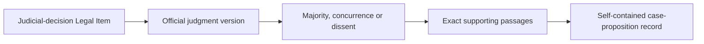

One separately delivered judicial decision is one Legal Item. The whole
lawsuit is not. A Case Dossier groups related trial, appeal, supplementary,
costs, remedy, and procedural decisions for navigation and accounting without
merging their authority identities. An official correction or revised-reasons
publication is a new Official Version of the same Legal Item only when the
issuing court presents it as a correction or replacement of that decision.

ADR 0060 defines one proposition as one material legal answer from one
attributed judicial reasoning path. Materiality does not require novelty. A
familiar rule qualifies when the judgment genuinely uses, establishes,
materially explains, or materially qualifies it to resolve a live issue.

A proposition qualifies only when:

1. its legal issue or question is identifiable;
2. the judgment supplies an identifiable legal answer, test, standard,
   interpretation, burden, exception, or other legally usable conclusion;
3. the exact opinion and authority role are established;
4. exact passages support the proposition and every material qualification;
5. the necessary facts, procedural posture, application, and result can be
   stated without speculation;
6. it forms one honest searchable unit without blending opinions or distinct
   rules; and
7. no unresolved source, version, opinion, support, or attribution conflict
   makes it unsafe.

Procedural chronology, party submissions not adopted by the court, bare
citations, quotations that do no material work in the court's reasoning,
issue-free facts, outcome-only statements, administrative directions, and
repeated legal wording do not qualify by themselves.

The accepted labelled `metadata.text` layout contains:

1. **Case** — case name and official citation;
2. **Court and decision date**;
3. **Opinion and authority role** — exact attribution as joint or majority
   reasoning, adopted reasoning, concurrence, dissent, plurality, obiter, or
   another supported role;
4. **Legal issue**;
5. **Proposition — derived statement** — source-faithful and explicitly
   labelled as derived rather than quoted;
6. **Material context** — only the necessary facts and procedural posture;
7. **Qualifications or exceptions**;
8. **Application and relevant result**; and
9. **Exact judgment support** — the smallest complete set of verbatim original-
   language passages and stable locators that proves the statement, limits,
   application, and attribution.

Both the derived statement and exact support enter `metadata.text`, so both are
embedded and delivered to the downstream LLM. The summary supports retrieval
and comprehension; the passages let the model distinguish the pipeline's
distillation from the court's actual words. Exact support cannot remain only in
the internal Record Traceability Lookup because Ask.Legal does not read that
lookup in an ordinary query.

The complete judgment, source artifacts, full opinion and passage map,
translations, fingerprints, extraction proposals, review history, internal
identities, and non-selected context remain outside Pinecone. The record
contains the minimum complete legal content rather than the complete evidence
dossier.

A multi-element test remains one record when its elements operate together as
one rule. Independently applicable legal answers become separate records. A
qualification or exception remains with the rule it limits unless the judgment
independently supports it as another usable proposition. One proposition may
use non-contiguous passages from the same reasoning path but may never blend
different opinions or misstate dissenting, concurring, plurality, or obiter
reasoning as an operative majority holding.

ADR 0061 fixes the exact conceptual boundary before any size measurement:

| Condition | Proposition result |
|---|---|
| Different independently usable legal questions, tests, burdens, remedies, jurisdictional rules, or alternative grounds | Split into separate propositions |
| Elements of one cumulative or balancing test | Keep together |
| Rule plus controlling exception, definition, threshold, burden, qualification, application, or later narrowing | Keep together |
| Same legal answer repeated or fragmented in one opinion with the same scope and role | Merge into one record using the smallest complete non-repetitive exact support |
| General rule applied again without establishing a distinct legal branch | One proposition; do not duplicate the application |
| One lead or joint opinion joined by several judges | One proposition record per genuine proposition, not one per judge |
| Concurrence, dissent, separate opinion, or plurality position | Keep separately attributed; do not manufacture majority reasoning |
| Exact reasons expressly adopted from another opinion in the same delivered judgment | May form one adopted reasoning path when the adopting passage and adopted scope are exact |
| Similar reasoning, silence, agreement in outcome, or inferred adoption | Do not merge |

Each record repeats only the minimum context needed to stand alone. It does not
depend on a context-only or whole-case companion record. Independent internal
grouping by judgment and issue creates no additional vector or serving field.

An overlong record first loses only optional repetition, retains the smallest
complete non-repetitive exact ranges, and may use shorter derived wording only
after the complete meaning and every qualification revalidate. It splits only
when the legal test proves genuinely independent propositions. An indivisible
complete proposition that still exceeds a pinned text-token or six-field byte
limit enters Quarantine with the applicable Coverage Gap. It is never divided
into arbitrary fragments that require Ask.Legal to retrieve or join several
records to restore its meaning, and a mandatory authority-note warning is never
weakened to force a fit.

Correct first extraction of several propositions creates independent initial
records without artificial lineage. A later processing correction uses
`split_from` when one record improperly combined propositions and `merged_from`
when several records improperly duplicated or fragmented one proposition. Old
records and selection history remain preserved. These are processing
corrections, not Later Treatment. An official corrected judgment instead
re-evaluates every affected support, context, attribution, and boundary under
ADR 0014.

The system must not create one record per sentence, invent unsupported
propositions, create an official-translation duplicate, or create a whole-case
overview. A later judgment that merely follows or approves an older authority
without expressing a self-contained proposition of its own needs no invented
record; the Later Treatment relationship records that effect. Search should
avoid allowing many records from one case to crowd out other authorities.

There is no duplicate case-overview vector and no separate whole-case retrieval
feature. The complete judgment, case dossier, evidence, and review history are
preserved outside Pinecone only for management, audit, recovery, and future
reprocessing.

#### Hong Kong Case Proposition Coverage Ledger

ADR 0062 requires one immutable fingerprinted Case Proposition Coverage Ledger
for every exact judgment Official Version. The ledger is the complete internal
checklist connecting the original judgment to candidates, accepted
propositions, and serving records. It proves that nothing was silently skipped
and that each result maps to exact source material. Its arithmetic does not by
itself prove that every semantic legal judgment is correct; separate extraction
evaluation, uncertainty controls, and correction monitoring remain necessary.

Before semantic analysis, deterministic structure processing creates an
ordered inventory of every opinion and every **Coverage Unit** in the accepted
original artifact. Units include numbered and unnumbered paragraphs, headings,
footnotes, tables, quoted blocks, orders, dispositions, schedules, appendices,
and administrative source material. Every unit maps exactly to preserved
source evidence. If the complete artifact cannot be enumerated and mapped, the
ledger is `BLOCKED`; supported-looking parts cannot proceed as if complete.

Long judgments may use opinion-aware segments, subject to exact arithmetic:

- every Coverage Unit occurs exactly once as primary segment content and in
  original order;
- repeated context is an explicit dependency on the primary unit and does not
  count as another covered unit;
- every required cross-reference, definition, qualification, result, or
  disposition resolves to an exact covered unit and fingerprint; and
- cross-opinion adoption is a recorded dependency supported by ADR 0061's
  exact express-adoption evidence, never inferred agreement.

Every unit and candidate receives an exact outcome:

| Object | Allowed final accounting |
|---|---|
| Coverage Unit | `RESOLVED`, `QUARANTINED`, or `BLOCKED` |
| Resolved unit | `PROPOSITION_EVIDENCE`, `CONTEXT_EVIDENCE`, or `NON_PROPOSITIONAL` with a stable reason family |
| Candidate | Accepted, rejected with reason, merged into identified candidate, split into identified candidates, quarantined, or blocked |

Proposition-evidence links state the exact issue, answer, qualification,
application, result, authority-attribution, quotation, and supplementary-
support roles. Treatment-only material is not discarded; it links to the
separate treatment-screening inventory. Every accepted proposition must have
ADR 0060's complete evidence roles, and every serving record must point to the
accepted proposition and exact ledger fingerprint. Missing, duplicated,
orphaned, unsupported, unresolved, or fingerprint-mismatched objects invalidate
a complete result.

One ledger ends in exactly one result:

| Result | Plain meaning |
|---|---|
| `COMPLETE_WITH_PROPOSITIONS` | Every coverage and evidence check passes and at least one proposition exists |
| `COMPLETE_NO_PROPOSITION` | Every check passes, no proposition exists, and no unit or candidate remains unresolved |
| `ACCOUNTED_WITH_QUARANTINE` | The complete source structure is inventoried, but a material semantic or evidence issue remains unresolved |
| `BLOCKED` | Complete examination cannot occur because required text, structure, dependency, or processing support is unavailable |
| `INVALID` | Identity, schema, fingerprint, inventory, arithmetic, or contract validation failed; this is a processing defect, not a legal conclusion |

A valid zero-proposition result requires the complete accepted original
Official Version, every opinion and unit resolved, every candidate accounted
for, no proposition-evidence unit, and every citation-bearing or treatment-only
unit handed to treatment screening. It is different from a judgment that has
propositions but currently selects no Search Record because of later treatment.
Uncertainty is Quarantine or blocked work, never a false zero.

The Evidence Vault preserves the full ledger, the Management Register owns its
identity and supersession, and the Record Traceability Lookup links each
selected record to its exact fingerprint. The ledger creates no Pinecone
vector, metadata field, or query-time dependency. Result-affecting source,
parser, contract, extraction, model, or prompt changes create a new immutable
result or explicit impact decision rather than mutating history.

The final machine contract must encode this proposition-level model, including
stable parent-case identity, exact evidence links, opinion attribution,
Coverage Unit and ledger accounting, and the accepted renderer. ADRs 0060
through 0062 define the required output, boundary, and complete accounting
without silently deciding the method; ADR 0065 separately settles the high-
level deterministic-versus-generative-LLM extraction allocation.

#### Hong Kong Case Proposition extraction conformance

ADR 0063 separates two linked proofs. The **semantic extraction evaluation**
tests whether the workflow understood the judgment: it must find required
material propositions, reject unsupported ones, preserve qualifications,
attribute every opinion correctly, apply ADR 0061's boundaries, select
sufficient exact evidence, preserve original language, and distinguish valid
zero, unselected propositions, Quarantine, blocked work, and invalid results.
The **deterministic contract suite** tests exact source and Coverage Ledger
accounting, candidate outcomes, evidence ranges and quotation bytes, rendering,
identities, limits, traceability, reproducibility, and forbidden side effects.
A blended score cannot substitute for either proof.

Each semantic evaluation judgment has a hidden Legal Desk-adjudicated
Reference Proposition Map. It records required and forbidden meanings, exact
opinion roles and support, controlling qualifications, acceptable equivalent
derived wording or proposition boundaries, and the correct uncertainty result.
It is not one preferred prose answer. High-risk or genuinely contestable maps
receive independent second review before entering the sealed admission set.
The evaluated workflow never receives the map, coverage labels, pair roles,
expected results, or critical-error annotations.

ADR 0064 freezes the initial coverage-driven catalogue at 132 direct synthetic
cases, 132 matching primary coverage cells, and 31 high-risk positive/near-miss
pairs. The seven group counts are `18/18/22/20/20/16/18`: 78 semantic cases
cover materiality, content and evidence, proposition boundaries and opinion
attribution, courts, languages, length, uncertainty, and safety; 54
deterministic cases cover structure and ledger arithmetic, candidates,
evidence, rendering and output, corrections, packages, security, and admission.
The count follows required branches rather than an arbitrary target and is not
a permanent ceiling.

Every ID, scenario, required result, primary cell, pair ID, and pair membership
is permanent and non-answer-bearing. Exact catalogues and a coverage matrix
must list every required object. Directory discovery, globs, ranges, broad
tags, aggregate counts, secondary labels, or scores cannot hide one missing
primary case or pair member. New requirements add IDs; correcting a frozen row
requires a new version, explicit mapping, impact declaration, preserved prior
results, and affected re-evaluation.

Synthetic cases alone cannot admit an extraction workflow. A later task-
admission package must extend the semantic catalogue with sealed real Hong Kong
judgments and hidden independently adjudicated Reference Proposition Maps
across the same court, original-language, opinion, length, materiality,
evidence, boundary, uncertainty, and safety dimensions. Development and sealed
admission cases remain separate. Complete real judgments, expected maps,
protected outputs, and operational results stay outside Git.

Admission binds the exact complete workflow rather than a model name:

| Gate | Required result |
|---|---|
| Deterministic suite | Every case passes exact schemas, artifacts, bytes, fingerprints, reproducibility, and no-side-effect assertions |
| Semantic critical gate | No designated critical error in the finite frozen admission set |
| Semantic dimensions | Every separately pinned quality dimension meets its threshold |
| High-risk slices | Chinese, segmented, multi-opinion, zero-result, Quarantine, and other required slices each meet their own threshold |
| Stability | Repeated runs satisfy the pinned rule without averaging away critical failure |
| Identity | Parser, contracts, method, model and prompt when applicable, validators, renderer, Source Rulebook, build, packages, thresholds, evaluator, and results all match the admitted fingerprints |

Critical errors include fabricated propositions or evidence, a false complete-
no-proposition result, omission that materially broadens the rule, operative-
opinion inversion, manufactured majority reasoning, confident completion over
required uncertainty or missing coverage, and hostile source content escaping
the task boundary. Zero tolerance applies to those errors in the frozen
admission set; it is not a claim that unseen production errors are impossible.
Runtime ledgers, validation, Quarantine, monitoring, sampling, impact analysis,
and new regression cases remain mandatory.

Extraction correctness and retrieval quality remain separate gates. English
and Chinese query retrieval, Pinecone crowding, embedding, ranking, and
downstream-answer evaluation cannot prove that the extracted proposition is
legally correct. The exact synthetic catalogue rows are settled by ADR 0064;
schemas, fixture bytes, threshold numbers, protected real judgments and maps,
and exact runtime task admission remain later executable work. ADR 0067 later
fixes the repetition, critical-error, high-risk, context, retry, cost,
monitoring, suspension, and revalidation policy. ADR 0068 later fixes the
candidate-independent suite, protected evidence views, selection method,
evaluator result, and pre-frozen profile package contracts. Their actual
evidence and values remain uncreated.

#### Hong Kong Case Proposition extraction allocation

ADR 0065 settles a seven-stage hybrid workflow. In simple terms, code proves
the document and its complete structure; one LLM proposes the legal meaning;
code rejects mechanically invalid proposals; another independently instructed
LLM tries to find mistakes or omissions; code reconciles every objection; the
Legal Desk accepts a fully resolved ordinary result or sends only a named
unresolved issue to human review; and code creates the final candidate record.

| Stage | Owner | What it does |
|---|---|---|
| 1. Admission and structure | **NO GENERATIVE LLM** | Proves source and Official Version identity, artifact integrity, source-supported facts, every Coverage Unit, exact ranges, opinions, segments, dependencies, and task preconditions; incomplete mapping is blocked |
| 2. Proposition analysis | **GENERATIVE LLM** | Proposes material legal answers, qualifications, context, applications, boundaries, attribution, exact supplied evidence, handoffs, and uncertainty; it cannot declare completeness or current authority |
| 3. Proposal validation | **NO GENERATIVE LLM** | Rejects nonexistent ranges, identity or opinion mismatches, missing fields, invalid evidence roles, forbidden blending, impossible boundaries, incomplete ledger accounting, invalid limits, and task-contract violations |
| 4. Independent challenge | **GENERATIVE LLM** | Looks for missed propositions, unsupported breadth, missing limits, wrong attribution, bad boundaries, dependency gaps, hostile-text escape, and an unsafe zero or complete result; it emits evidence-linked objections and cannot edit or accept |
| 5. Objection reconciliation | **NO GENERATIVE LLM** | Resolves every objection as accounted for, invalid, reopened, quarantined, blocked, or human review; one changed re-analysis receives one final bounded challenge |
| 6. Acceptance | **NO GENERATIVE LLM** | The Hong Kong Cases Legal Desk accepts only exact admitted, fully validated and fully accounted ordinary results; a human handles only an exact unresolved semantic or rulebook trigger |
| 7. Finalization | **NO GENERATIVE LLM** | Finalizes the ledger and Rule Trace, identities, six-field payload, exact quotations and limits, traceability, and correction or reuse effects before corpus construction |

The analysis and challenge tasks have separate pinned instructions and fresh
contexts. They do not vote, and a different provider is not inherently safer.
The challenger cannot repair the first result; every objection must be resolved
through deterministic reconciliation and, when necessary, bounded re-analysis.

Long, important, Court of Final Appeal, Traditional-Chinese, multi-proposition,
new-test, and valid-zero judgments do not automatically require a human.
Human review is reserved for an unresolved semantic conflict after re-analysis,
uncertain operative opinion or adoption scope, an unresolved possible material
proposition, an indivisible overlong serving-policy decision, a novel source
structure outside accepted support, repeated critical failure, or another
exact versioned Source Rulebook trigger. Missing evidence is blocked rather
than interpreted into existence by a reviewer.

Both LLM stages remain disabled until executable input and output schemas,
prompts, admitted models and settings, packet limits, retry ceiling,
evaluations, thresholds, costs, timeouts, retention, sampling, monitoring, and
revalidation triggers are pinned. Neither task has source, Azure, Pinecone,
routing, deployment, credential, code-execution, release, approval, or current-
authority power. Later treatment separately determines current authority and
`metadata.authority_note`.

#### Hong Kong Case Proposition semantic task contracts

ADR 0066 fixes the two task families as
`hk-case-proposition-analysis/v1` and
`hk-case-proposition-challenge/v1`. The analysis task proposes material legal
answers and complete unit uses. The independent challenge task produces
supported semantic objections to a deterministically validated assembled
proposal. Neither task approves, renders, publishes, or determines current
authority.

One semantic pass is one complete workflow over one judgment, not necessarily
one provider call. A short judgment may use one call per pass. A long judgment
uses complete opinion-aware packet calls followed by a judgment-level
integration or result-challenge call. The packet boundary never becomes a
legal boundary, and every primary Coverage Unit remains accounted for.

Every request carries a deterministic envelope binding:

- the exact task version, closed request kind, execution, attempt, packet, and
  parent-work identities;
- Source Rulebook, parser, structure, segmentation, Coverage Ledger, prompt,
  schema, model-settings, validator, and build fingerprints;
- Judicial Decision, Official Version, accepted original artifact, source,
  cutoff, court, date, citation, judges, opinions, and original-language facts;
- the complete judgment manifest, assigned primary units, packet position,
  boundaries, and dependencies;
- immutable unit and Evidence Range IDs, exact original-language evidence,
  locators, fingerprints, structural roles, opinion ownership, and citation
  leads; and
- exact permitted claims, forbidden decisions, allowed values, required
  evidence roles, output budget, and permitted prior-stage material.

Missing binding or coverage data blocks the model call. The model receives no
URL to fetch, credentials, external tools, code execution, Pinecone, Azure,
approval, routing, deployment state, or hidden evaluation answer. Original
court-authored text controls. Judiciary translations and predecessor
extractions are excluded by default; a later request kind may include them only
as explicitly non-controlling, exactly aligned material with a proved purpose
and separate fidelity and no-bias evaluation.

The analysis contract has four closed request kinds:

| Request kind | Exact function |
|---|---|
| `FULL_JUDGMENT` | Analyse a safely fitting complete judgment while retaining its complete ledger manifest |
| `EVIDENCE_PACKET` | Analyse every primary unit assigned to one opinion-aware packet and its exact dependencies |
| `JUDGMENT_INTEGRATION` | Reconcile the complete assembled candidates and unit uses across packets using relevant exact evidence, including repetition, adoption, split, and merge boundaries |
| `TARGETED_REANALYSIS` | Reconsider one exact reconciled objection against a bounded candidate, unit use, dependency, boundary, or no-proposition claim |

The response binds the request and evidence fingerprints; accounts for every
assigned unit; proposes candidates, legal issue and source-faithful derived
statement, materiality, opinion and authority role, evidence roles, necessary
facts and procedure, qualifications, application and result, boundaries,
handoffs, and structured uncertainty; and ends only with a conclusion valid for
its assigned scope. A partial packet cannot declare judgment-wide completion.

The analysis model selects immutable **Evidence Range IDs** for exact support.
It does not supply authoritative quotation copies. After Legal Desk acceptance,
deterministic processing copies the exact preserved text represented by those
IDs into `metadata.text`. The model may draft only clearly labelled derived
language and other non-quoted source-faithful summaries.

The challenge contract uses fresh context and four closed request kinds:

| Request kind | Exact function |
|---|---|
| `FULL_JUDGMENT_CHALLENGE` | Challenge a complete validated proposal where source and proposal fit safely together |
| `COVERAGE_PACKET_CHALLENGE` | Examine every assigned original unit and proposed use for omissions or unsafe non-propositional conclusions |
| `JUDGMENT_RESULT_CHALLENGE` | Challenge assembled judgment-wide candidates, opinion paths, dependencies, cross-packet boundaries, and proposed zero or completion |
| `FINAL_TARGETED_CHALLENGE` | Check only whether one reopened objection was safely resolved |

Its response accounts for every assigned unit, candidate, relationship, and
proposed judgment state. Each objection has one stable type, exact affected
object and supporting Evidence Range IDs, possible material effect, narrow re-
analysis question, and required evidence scope. The challenger cannot edit or
accept the proposal, choose reconciliation, route to a human, or decide current
authority. Complete coverage with no objections means only that no supported
objection was found.

Neither task returns numeric model confidence. Concrete states such as
supported proposal, unresolved semantic question, missing supplied context,
conflicting supplied evidence, and no proposition within completely assigned
scope replace arbitrary percentages. Strict versioned JSON is mandatory. One
schema-repair request may fix representation without changing the semantic
result; a semantic change must pass validation and challenge again.

ADR 0067 later fixes the policy for context reserve, attempts, evaluation
repetitions and gates, cost reservation, provider data handling, monitoring,
suspension, and revalidation. ADR 0068 later fixes the suite, protected-
reference, real-selection, evaluator-run, and pre-frozen profile contracts.
Exact executable schemas and prompts, model and settings, packet ceilings,
ordinary thresholds, costs, concurrency, timeouts, retention values, selected
real judgments and maps, evaluator implementation, and other evidence-derived
values remain uncreated. Provider failure or exhaustion blocks or quarantines
affected work and never becomes a valid zero or accepted result.

#### Hong Kong Case Proposition workflow admission and monitoring

ADR 0067 admits one exact complete Case Proposition workflow, not a model name.
The fingerprinted object includes source and parser contracts, complete
Coverage Ledger and packet construction, both ADR 0066 tasks, exact provider
and models, prompts, executable schemas and settings, deterministic validators,
objection reconciliation, Legal Desk rules, renderer, processing build,
evaluation packages and results, and operational profiles. An admission is
limited to its declared task, source, court, language, artifact, opinion,
length, structure, and request-kind scope and gives no source, Pinecone, Azure,
promotion, or production authority.

The Management Register records immutable admission states:

| State | Operational meaning |
|---|---|
| `CANDIDATE` | Complete proposed workflow; no operational provider calls |
| `EVALUATING` | Evaluation evidence only under separate evaluation authorization |
| `ADMITTED` | Every gate passed; permitted ordinary new judgments may use the sole task runner |
| `SUSPENDED` | New calls stop during exact impact investigation and revalidation |
| `REVOKED` | No new work; restoration requires a new identity or exact evidence-backed re-admission event |
| `SUPERSEDED` | A later admitted workflow owns new work; old results remain reproducible |

Only `ADMITTED` may process ordinary new judgments. A changed model snapshot,
tokenizer, prompt, schema, validator, rulebook, provider behavior, renderer, or
other result-affecting component breaks the admitted identity. Floating model
aliases and silent fallback are forbidden. Analysis and challenge may use the
same or different admitted models; separate prompts, fresh contexts, different
roles, and deterministic reconciliation establish independence without model
voting or mandatory provider diversity.

Before each call, the admitted tokenizer counts the fixed prompt and schema,
all evidence and prior-stage data, and the maximum response. Together they may
use no more than 80% of the context window, leaving at least 20% as a hard
reserve. The runner cannot borrow that reserve or rely on truncation. Oversized
work is deterministically repacketed along complete opinion-aware boundaries
with exact dependencies. If a safe complete packet still cannot fit, the work
blocks or enters the applicable structural Quarantine.

The complete-workflow admission gate is:

| Gate | Required result |
|---|---|
| Synthetic coverage | All 132 frozen cases run and are accounted for |
| Real judgments | Every registered sealed real judgment is evaluated against its hidden independently adjudicated Reference Proposition Map |
| Deterministic proof | Every deterministic case passes two clean isolated runs with byte-identical canonical artifacts |
| Ordinary semantic stability | Every ordinary semantic case and sealed real judgment runs three times |
| High-risk stability | Every high-risk or critical case runs five times, and every high-risk positive/near-miss distinction passes every repetition |
| Critical safety | No critical error in any repetition, including a model-created quotation presented as verbatim court text |
| Slice quality | Every separately pinned semantic dimension and required court, language, opinion, length, zero, Quarantine, segmentation, boundary, and hostile-text slice meets its own threshold |
| Identity | Every task, validator, reconciliation, Legal Desk, ledger, renderer, failure path, package, profile, and build fingerprint matches |

Equivalent source-faithful wording and expressly permitted alternate boundaries
need not be byte-identical. One blended average cannot compensate for a
critical error, failed high-risk distinction, or weak required slice. If no
candidate workflow passes, LLM processing remains disabled.

Provider attempts and semantic reconsideration are different bounded actions:

- one initial call plus no more than two transient retries for admitted
  transport, rate-limit, or timeout failures;
- exactly one representation-only schema repair without a semantic change;
- exactly one targeted semantic re-analysis for one reconciled objection batch,
  followed by exactly one final targeted challenge; and
- no retry merely to sample until the answer becomes convenient.

Before one judgment starts, deterministic planning reserves the full permitted
analysis, integration, challenge, repair, and re-analysis budget. The profile
pins per-call and per-judgment token and currency limits, concurrency, and
rolling budgets. At 80% the system reports and reduces non-urgent concurrency;
at 90% it starts no new ordinary judgments while reserved complete work
finishes; at 100% it makes no new provider call. Urgency requires a separate
budget authorization and never permits partial coverage.

The provider arrangement prohibits training on task data and pins provider
retention, logging, region, encryption, abuse-monitoring exceptions, and
deletion behavior. The Evidence Vault preserves exact requests, structured
responses, attempts, validations, objections, reconciliations, Legal Desk
decisions, evaluation results, and fingerprints under the later retention
policy. Private chain of thought is neither requested nor stored.

Runtime never drops to a cheaper quality mode: every judgment retains complete
deterministic validation, Coverage Ledger accounting, independent challenge,
objection reconciliation, and Legal Desk acceptance. A sealed canary set
covering every critical-error family and high-risk slice runs weekly. The
complete admitted suite runs at least every 90 days. Any result-affecting
change or production critical incident causes immediate complete or impact-
scoped revalidation.

New calls automatically suspend after a critical canary or suite failure,
fingerprint mismatch, deterministic or evidence-boundary failure, unknown or
changed material provider data handling, an admitted quality, cost, latency,
schema, retry, Quarantine, or drift stop threshold, or a security incident.
Restart requires recorded resolution, impact analysis, applicable
revalidation, and a new admission event; it is never an informal switch.

This policy does not select a provider or model. ADR 0068 separates the
candidate-independent sealed real-judgment inventory, Reference Proposition
Maps, and evaluator into the Evaluation Suite Package. The exact candidate
model snapshot, prompts, executable schemas, settings, token and output
ceilings, timeouts, backoff, concurrency, currency limits, ordinary diagnostic
thresholds, provider values, and non-critical drift thresholds belong to one
immutable Workflow Admission Profile. The suite and profile are frozen before
sealed scoring, and neither may weaken the complete-workflow identity, 20%
reserve, repetition rules, exact deterministic proof, zero-critical-error and
high-risk gates, bounded attempts, cost reservation, capability limits,
suspension, or human-review boundaries.

#### Hong Kong Case Proposition evaluation and profile packages

ADR 0068 defines the package contract that instantiates ADR 0067 without
creating a circular fingerprint or allowing a test, threshold, or answer key to
change after a result is known. Admission uses four immutable objects in order:

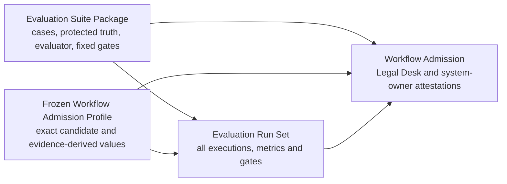

The suite package is candidate-independent. It binds the frozen 132-case
synthetic catalogue and 31 pairs, the sealed-real catalogue and selection
matrix, deterministic fixtures, hidden Reference Proposition Maps,
adjudications, fixed architectural gates, schemas, evaluator, declared
inventory, and canonical root fingerprint. It contains neither a candidate
output nor an admission decision.

Each semantic case separates three permissioned views:

| Evidence view | Contents | Evaluated task access |
|---|---|---:|
| Model-facing input | The exact legal identity, original evidence, structural manifest, Coverage Units, Evidence Range IDs, dependencies, and task material ordinary runtime would receive | Yes |
| Evaluator reference | Hidden required and forbidden meanings, exact evidence, permitted equivalents, uncertainty result, slice labels, pair roles, critical labels, and scoring assertions | No |
| Adjudication record | Mapper and reviewer roles, independence, disagreements, resolution, freeze, correction, and supersession history | No |

The evaluated model necessarily receives the real case name and citation when
ADR 0066 requires them. That is not evaluation-answer leakage. The model never
receives the opaque evaluation ID, human test title, selection cell, pair role,
Reference Proposition Map, expected result, critical label, score, or admission
status. Complete real judgments, sealed-set membership, maps, adjudications,
raw model outputs, and case-level results remain in protected registered
storage outside Git.

“Sealed” does not assert that a public judgment was absent from provider
training. It asserts that exact admission membership, evaluation truth,
adjudication, and protected results are unavailable to the task and ordinary
workflow developers. The Hong Kong Cases Legal Desk and evaluation owner freeze
the real-case selection matrix before inspecting the candidate's sealed
results.

The real selection is branch-driven rather than count-driven. Every required
cell names at least one primary case, and every selected case owns at least one
cell. The matrix directly covers all admitted Hong Kong court families,
original English and Traditional Chinese and mixed-language reasoning, material
opinion roles, short and segmented judgments, varied source structures, zero,
one and many propositions, evidence forms, materiality and boundary problems,
Quarantine and blocked outcomes, and real critical or high-risk distinctions
that can be safely adjudicated. Synthetic fixtures retain impossible,
malformed, hostile, leakage, and exact mechanical branches that should not be
manufactured from real law.

A judgment or map used for prompt, model, validator, packet, threshold,
demonstration, or debugging work is development evidence and cannot count as a
pristine sealed admission case. Protected cases have explicit development,
sealed-admission, sealed-canary, or regression roles. Exposure of membership,
truth, or case-level expected behavior removes sealed admission and canary
eligibility, triggers an impact assessment and versioned replacement, and may
retain the old case only as regression evidence. Developers receive aggregate
dimension and slice diagnostics, not protected case identities or maps.

Each Reference Proposition Map binds one exact original artifact and opinion
and Coverage Unit inventory. It records required and forbidden legal meanings,
exact supporting ranges, authority roles, qualifications, permitted equivalent
wording and alternate boundaries, and the correct zero, Quarantine, blocked, or
treatment-handoff result. The primary mapper does not see evaluated outputs.
High-risk, critical, contestable, plurality, uncertain-attribution, and
alternate-boundary maps receive independent second legal review.

An unlisted possible equivalent cannot receive a private post hoc pass. A
blinded Legal Desk adjudication rejects it or creates a new map and suite
version. Every affected candidate is then evaluated against the same new truth.
An unresolved reference is evaluator-blocked rather than a candidate pass or
failure.

The evaluator applies package preflight, execution-integrity checks, exact
deterministic conformance, semantic comparison, and gate evaluation in that
order. It records explicit produced-to-reference proposition matching, every
unmatched required or accepted proposition, and each dimension and slice's
numerator, denominator, aggregation rule, and case contribution. An
uncontrolled evaluator LLM cannot define truth or final admission. The
fingerprinted evaluator itself passes positive cases, critical near-miss
mutations, leakage and package failures, and two clean byte-identical
deterministic runs.

One Evaluation Run Set binds one exact suite and one exact frozen candidate
profile. Every planned case repetition ends in:

| Status | Meaning |
|---|---|
| `PASS` | Every applicable assertion passed |
| `FAIL` | The exact workflow produced a validly evaluated wrong or unsafe result |
| `INVALID_RUN` | Package, binding, infrastructure, or execution integrity prevented valid evaluation |
| `EVALUATOR_BLOCKED` | Reference truth or evaluator support was inadequate |
| `NOT_RUN` | The declared execution did not occur |

Only `PASS` satisfies a required repetition. Invalid runs retain every attempt
and may repeat only under the same frozen identity and bounded attempt rules.
Evaluator-blocked cases require a new reference or evaluator version and equal
affected reruns. A not-run case makes the run set incomplete. The complete run
set records all requests, attempts, repairs, re-analysis, challenge,
deterministic artifacts, semantic assertions, critical and pair results,
dimensions, slices, context, tokens, cost, latency, capacity, leakage,
capability, and final `ELIGIBLE` or `NOT_ELIGIBLE` gate result.

The Workflow Admission Profile is frozen before sealed admission scoring. It
binds the exact complete workflow, suite, provider and model, prompts and
schemas, settings, limits, provider data handling, thresholds, canaries,
monitoring, and stop behavior. Every non-architectural value carries its unit,
scope, method, evidence references, sample and observation period, estimator,
uncertainty or safety margin, owner, and rationale. A naked number is invalid.

The profile serializes but cannot weaken ADR 0067's fixed complete-catalogue,
repetition, high-risk, zero-critical-error, 20% context-reserve, attempt,
cost-reservation, monitoring, suspension, or revalidation gates. Evidence-
derived values use development or calibration evidence and are frozen before
the sealed set is scored. A small slice uses exact case or distinction gates
rather than a misleading percentage. No threshold may be lowered after seeing
a candidate failure merely to make it pass; a changed profile is a new
candidate that runs the complete applicable suite.

An `ELIGIBLE` run set authorizes only the two ADR 0067 attestations. The final
admission event requires the exact suite, profile, run set, Hong Kong Cases
Legal Desk semantic attestation, and system-owner technical and operational
attestation. Neither role may waive a failed or missing gate, and admission is
not a production Promotion Manifest Approval.

ADR 0068 settles this package and selection architecture. Actual JSON Schemas,
fixture bytes, real-judgment identities, maps, prompts, models, numerical
values, evaluator code, evaluation runs, and attestations remain uncreated and
require their own later implementation and evaluation authorization.

For Hong Kong, ADR 0046 limits ordinary searchable Case coverage to the Court
of Final Appeal, Court of Appeal, Court of First Instance, and Competition
Tribunal. A court qualifies when its ratio can bind at least one lower Hong
Kong court; this does not mean that every proposition binds every other court.
Separately accountable historical coverage includes corresponding pre-1997
Hong Kong superior courts and Privy Council appeals from Hong Kong.

Standalone decisions of the District and Family Courts, Magistrates' Courts,
Juvenile Court, Lands Tribunal, Labour Tribunal, Small Claims Tribunal,
Obscene Articles Tribunal, Coroner's Court, and comparable lower bodies do not
enter ordinary searchable serving. An in-scope CFI, CA, or CFA appellate
decision remains covered even when the underlying proceeding came from an
excluded body. Technical extractability does not create legal-authority scope.

The coverage promise applies to accepted publicly released written judgments
and reasons, not every hearing, oral ruling, unreasoned order, private or
restricted proceeding, pleading, transcript, or filing. Every in-scope
official decision is nevertheless accounted for, including one that yields no
material Case Proposition and therefore no Pinecone record.

The Lands Tribunal remains only a possible future `specialist-persuasive`
source. Activating it would require a separate accepted scope, retrieval
isolation from binding case law, an explicit LLM-facing authority-note warning clause,
complete source and coverage rules, and dedicated tests. Family Court and
Labour Tribunal material require their own later decisions and do not enter
through this option automatically.

ADR 0047 makes original-language-only serving the default for Hong Kong Case
Propositions. The language actually authored by the court at the supporting
opinion or passage controls and remains exact, including genuinely mixed-
language material. One proposition creates one serving record, not separate
English and Chinese records.

An official Judiciary translation is a linked Judiciary Translation Artifact,
not another judgment, Official Version, opinion, authority, or default serving
copy. It is preserved for alignment, review, terminology, extraction and
answer evaluation, and paired cross-language tests. Missing optional
translation does not block a proved original-language record or create a
Coverage Gap. A translation conflict is isolated unless it also calls the
original judgment evidence into question.

Before the embedding model and downstream LLM are accepted, tests must cover
English and Traditional Chinese queries against both English and Traditional-
Chinese original judgments. If original-only serving passes, no translation
enters `metadata.text`. A short, labelled translation retrieval aid or full
bilingual duplication requires a later explicit decision and measured need;
full duplication is the last fallback. Controlling original text may never be
removed or truncated to make room, and language-specific duplicate records may
not crowd retrieval. Hong Kong `metadata.authority_note` remains English only
under ADRs 0020 and 0050.

HKLII is registered under ADR 0045 as the non-controlling automated source role
`HK-CASE-HKLII-DISCOVERY`. It may discover candidate Hong Kong judgments,
historical authorities, aliases, possible inventory gaps, and later-treatment
leads. It cannot establish judgment text, version, treatment, or authority by
itself. The matching Judiciary, court-registry, Judiciary Library, Privy
Council, or other rulebook-approved originating artifact must be preserved
before processing proceeds. HKLII AI summaries and search features are
suggestions only. HKLII outage never blocks an otherwise complete originating-
source release or supports no change. Legal and policy review is deferred under
the user's compliance assumption; this does not expand HKLII's Fact Authority.

#### Hong Kong judgment acquisition and coverage accounting

ADR 0048 separates an Official Judgment Listing Entry, one separately
delivered Judicial Decision, and each Official Judgment Artifact that publishes
an Official Version. A source result is not automatically one judgment or one
Search Record. Several proceeding numbers, listings, formats, and an optional
translation may belong to the same decision, and one valid decision may produce
no material Case Proposition.

Every official listing entry observed at a fixed cutoff has exactly one
acquisition outcome:

| Outcome | Meaning |
|---|---|
| `ACQUIRED` | Complete accepted originating judgment evidence is preserved |
| `DUPLICATE_OR_ALIAS` | The entry is proved to identify an already acquired decision or artifact |
| `TRANSLATION_ARTIFACT` | An optional official translation is linked to the acquired original under ADR 0047 |
| `OUT_OF_SCOPE` | The exact court, artifact-class, or publication exclusion is recorded |
| `BLOCKED_UNAVAILABLE` | An in-scope original is known but cannot be obtained or completely validated |
| `QUARANTINED` | Decision, version, language, opinion, artifact, or source evidence remains conflicting or unresolved |

An acquired decision separately receives one or more supported Case
Propositions, a valid no-material-proposition result, processing Quarantine, or
the applicable explicit unavailable-scope outcome. A missing or unreadable file
is never treated as a valid zero-proposition decision.

Coverage proof keeps three results separate: complete inventory-entry
accounting, complete or gapped originating-evidence coverage, and the number of
decisions producing zero, one, or many Search Records. Complete accounting may
expose a Coverage Gap; it does not cure that gap or establish release
eligibility. No new Search Records is not by itself a supported no-change
result.

Every acquisition bundle preserves the exact source bytes or official rendered
capture, source and endpoint facts, cutoff and observation time, listing and
publication metadata, source labels, court and case identity facts, all
proceeding numbers, language and original-or-translation role, media type,
hash, and parser or rendering report. Working conversions never replace source
evidence, and official anonymisation or redaction is never reversed.

Unlike Hong Kong Legislation, cases have no mandatory two-format evidence pair.
One complete accepted official original format may proceed. When several
official original-language representations are relied on, all are preserved
and their legal content is deterministically reconciled. An unexplained
material difference is quarantined. A stable URL whose bytes change creates a
new Source Snapshot but becomes a new Official Version only with official
correction, revision, reissue, or replacement evidence.

Monitoring uses daily lightweight newly-added or RSS checks, metadata-only
court, product, and time-partition reconciliation at risk-based freshness
intervals, full artifact acquisition only for affected items, and historical
acquisition only for the historical baseline or a bounded investigation.
Before the LRS can support a baseline or no-change result, conformance must
prove that the connector enumerates the complete promised scope. An unproved
enumeration limit remains visible; HKLII discovery cannot cure it.

These acquisition, hash, reconciliation, and coverage-accounting functions use
no generative LLM. Case Proposition extraction and later-treatment analysis use
the separately accepted staged allocations in ADRs 0065 and 0053 respectively;
their model tasks begin only after deterministic acquisition admission.

#### Hong Kong first current-authority baseline

ADR 0049 makes the first Hong Kong Cases baseline a current-authority baseline,
not a judgment dump or legacy-index import. It freezes one cutoff and accounts
for acquisition, identity, opinions, passages, Case Propositions, later
treatment, authority notes, current-authority exclusions, zero-record decisions,
Quarantines, and Coverage Gaps across every required binding-case scope.

Release ownership uses one court-family-and-original-decision-year scope under
the semantic pattern `HK-CASE-{COURT_FAMILY}-{DECISION_YEAR}`. Publication,
translation, correction, processing, and later-treatment dates do not move the
decision. A later correction updates the original scope, and a later judgment
that changes an old proposition may require a new release for that older
scope. These partitions bound rebuilds and failures; they do not limit legal
authority or corpus-wide treatment reconciliation.

The ordered baseline freezes the source and contract package, proves complete
scope enumeration, applies ADR 0048, allocates new greenfield identities,
parses every acquired decision, creates propositions or valid no-proposition
outcomes, screens all in-scope judgments through the cutoff for material later
treatment, assigns current proposition results, proves complete accounting, and
then seals one no-predecessor Corpus Release per complete scope. All required
scopes compose into one candidate Hong Kong Cases Desired-State Inventory.

One acquired proposition is searchable with `authority_note: "None"`,
searchable with one controlled authority note, non-searchable under a conclusive current-authority
rule, or quarantined. A no-proposition judgment still participates in citation
and treatment screening because it may affect an older case. Missing or
unreadable text is never a valid zero-record decision.

There is no arbitrary age cutoff. Age and historical acquisition route do not
decide current authority. The first supported period is the earliest source-
verified coverage boundary; an unverified period remains not ready or gapped
rather than being silently excluded. Every later in-scope judgment through the
cutoff must be screened because no official source publishes a consolidated
“currently good law” judgment state.

Pinecone growth is narrower than judgment-archive growth. Only material current
Case Propositions create vectors; full judgments remain in evidence storage;
no-proposition decisions, whole-case overview records, translations, duplicate
formats, and multiple proceeding numbers create no duplicate vectors; and
conclusively overruled propositions leave ordinary current serving. Exact
unchanged records and embeddings may be reused.

The initial baseline has no carry-forward predecessor. A missing in-scope
judgment can create both an acquisition gap and an unknown treatment gap. Only
accepted evidence and a written rule may bound that impact. A generic authority note
cannot cure unknown text, and an unresolved required scope cannot be hidden
inside an otherwise complete target.

Cutoff enforcement, inventory, hashes, identity, scope, authority-note checks,
and release arithmetic use no generative LLM. Proposition extraction uses ADR
0065's two-pass staged hybrid allocation, and Hong Kong treatment proposals use
ADR 0053's staged hybrid allocation. Neither model flow has authority over
legal or production outcomes.

### 10.2 Judgment and proposition continuity

Case-law identity follows official decision relationships rather than a
matching name, citation, proceeding number, URL, paragraph number, or wording.

| Event | Identity and serving result |
|---|---|
| Official URL or provider location moves while the artifact is proved unchanged | Keep the Legal Item, Official Version, and Legal Locations; reuse a Search Record only when all six serving fields are exact |
| Duplicate official copy is discovered | Add the evidence or alias; do not duplicate records |
| Case name, citation, or proceeding number is officially corrected | Keep the Legal Item; create a new Official Version only if a corrected judgment was published; select a different exact Search Record if its payload changed and allocate it when that payload is new |
| Court publishes corrected or revised reasons for the same decision | Keep the Legal Item, create a new Official Version, completely reconcile opinions and passages, and replace only affected proposition records |
| Court delivers supplementary reasons or a later costs, remedy, or procedural decision | Normally create a new Legal Item linked through the Case Dossier unless the court expressly identifies it as a correction or replacement |
| Several proceeding numbers receive one delivered set of reasons | Use one Legal Item with multiple aliases; do not duplicate propositions per proceeding number |
| Paragraphs or opinion structure change in an official revision | Continue locations only after complete reconciliation; create or end locations for new, removed, split, merged, or differently attributed reasons |
| Our processing corrects one proposition | Keep the judgment identities; select the required replacement Search Record and allocate it with processing-correction lineage when its payload is new |
| Review discovers an additional supported proposition | Create a new Search Record without inventing a predecessor |
| One record improperly combines propositions | Retire it from current serving and create supported successors linked as split from it |
| Several records duplicate or fragment one proposition | Create one supported successor linked as merged from them and retire the predecessors from current serving |
| A record is invented, unsupported, or wrongly attributed | Retire it as invalid processing output; preserve it and do not call the event later judicial treatment |
| Official authenticity, version, opinion, or continuity remains unclear | Preserve competing evidence and quarantine the decision |

A proposition must not blend different opinions or present dissenting,
concurring, or plurality reasoning as a majority holding. A change to judge or
opinion attribution requires review of every affected proposition.

### 10.3 Later treatment

The system starts from observed official judgments, not predictions.

| Later event | System response |
|---|---|
| Pending appeal | Show the event in the human report; do not infer treatment or automatically change Pinecone |
| Cited only | Preserve the relationship internally; citation alone proves no endorsement or authority strength and creates no note |
| Explained | Keep the proposition; add `[CONTEXT: EXPLAINED]` only when the explanation materially clarifies its exact meaning, scope, or use, and never present explanation as endorsement |
| Applied | Keep the proposition; add a selected `[SUPPORT: APPLIED]` clause when the application is materially useful to authority assessment |
| Followed or approved | Keep the proposition and make the exact treatment eligible for the budget-based support summary; include every material non-repetitive signal that fits and consolidate equivalent repetitive events |
| Distinguished | Keep the proposition; require a `[WARNING: ...]` clause only when the Legal Desk determines that the distinction materially limits safe use |
| Doubted or criticised | Keep the proposition only with a mandatory controlled warning clause in `metadata.authority_note` identifying the treating authority, support, and reliance qualification |
| Expressly disapproved or refused to follow | When evidence, mapping, authority, finality, and one exact consequence rule are clear, automatically accept and report the ordinary authority-note or other bounded consequence; uncertainty or a missing rule enters review or Quarantine |
| Expressly and conclusively overruled in full | Retire the exact affected proposition from ordinary current-law Pinecone; preserve its identity, evidence, serving history, and `overruled_by` lineage outside Pinecone |
| Partly overruled | Retire the affected part; retain a narrower record only when the earlier judgment itself supports that standalone proposition |
| Reversed or set aside | Review and retire only propositions whose authority was actually removed; do not erase the entire earlier judgment automatically |
| Treatment authority or scope is unclear | Preserve all evidence and quarantine the treatment decision |
| Adverse treatment is later withdrawn, reversed, corrected, or superseded | Require a new evidence-backed decision; a clear rulebook-supported note removal or exact reinstatement may be accepted automatically and reported, but disappearance or changed words alone never imply reinstatement |

Every treatment classification must identify the later case, earlier case,
affected proposition where possible, court relationship, opinion type, exact
supporting passages, confidence, and review state. Unclear mapping is
quarantined.

Hong Kong treatment does not use one flat label as its database decision. The
Cases Legal Desk separately records:

1. the judicial treatment: cited only, explained, applied, followed, approved,
   distinguished, limited, doubted, criticised, disapproved, refused to
   follow, overruled, or unresolved;
2. whether that treatment is express, follows by necessary reasoning, or is
   ambiguous;
3. the exact affected proposition or bounded set and whether the scope is
   whole, partial, issue-specific, fact-specific, or procedural;
4. the later court's jurisdiction and hierarchy, opinion and operative status,
   finality, and any separate appellate disposition; and
5. the accepted internal-only, support-note, warning-note, Quarantine,
   withholding, retirement, or reinstatement consequence.

The fourth axis is an authority gate and never an independent serving action.
Lower-court, dissenting, unadopted concurring, non-controlling plurality,
foreign, and non-operative statements retain exact attribution but cannot be
represented as overruling by the operative Hong Kong court. `AFFIRMED`,
`VARIED`, `REVERSED`, `SET_ASIDE`, and `REMITTED` are separate appellate
dispositions that reopen proposition review; they do not automatically label
or retire every proposition in the earlier decision. Only express and
conclusive overruling with exact proposition mapping and sufficient court and
opinion authority may support retirement through an accepted Legal Desk Rule
Trace.

Under ADR 0053, the Hong Kong later-treatment task family uses staged hybrid
analysis. Deterministic processing prepares the judgment structure, citations,
identities, court relationships, candidate context, and coverage ledger. A
schema-bound LLM may inspect the whole accepted judgment for discovery and
orientation, after which each candidate receives a separate exact evidence
packet for an evidence-bound treatment proposal. Deterministic validators then
check the proposal before the Legal Desk decides its legal effect.
It may not predict overruling or retire a proposition merely because it appears
weak. Legal effect remains a Source Rulebook and Legal Desk decision, and
production changes remain part of the complete human-approved package.

Retirement means exclusion from the next approved current Desired-State
Inventory, not deletion. The exact prior record, evidence, releases, and
serving history remain preserved. Unaffected propositions from the same
judgment remain eligible. A warning clause in the authority note is reserved
for propositions that remain potentially usable but require qualification; it
is not used for an exact proposition conclusively shown to be no longer current
authority. Support clauses never cancel or weaken a warning clause.

#### 10.3.1 One relationship, two internal views

ADR 0058 records each resolved treatment once, as a directional relationship
from the later treating decision, Official Version, opinion, and exact passages
to one exact earlier treated Case Proposition. One later judgment may create
many such relationships. When the treating reasoning also supports one or more
ordinary Case Propositions in the later judgment, their IDs may be linked, but
that link is optional. A no-proposition judgment may still treat or overrule an
earlier proposition.

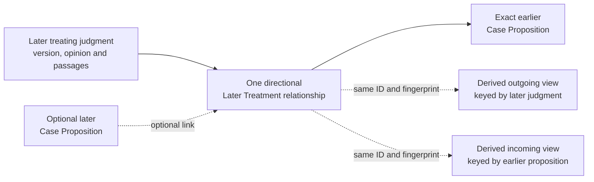

The Management Register derives two projections from that one relationship set
at the frozen cutoff:

| Internal projection | Question it answers | Main uses |
|---|---|---|
| Incoming Treatment View | Which later judgments treated this earlier proposition, and how? | Current-authority decision, authority-note rendering, audit |
| Outgoing Treatment View | Which earlier propositions did this later judgment treat, and how? | Complete judgment accounting, reverse impact, corrections, audit, reprocessing |

These are indexes over the same fact, not two legal relationships. Their IDs,
fingerprints, active status, and cutoff results must agree exactly. An
unresolved target remains a separate Treatment Lead and cannot masquerade as a
settled incoming relationship, although a bounded adverse lead may trigger the
accepted internal Quarantine rules.

Corrections, withdrawal, reversal, or supersession never overwrite an accepted
relationship. They append the required successor relationship, decision, or
supersession event and preserve the old evidence. The outgoing view finds every
earlier proposition whose incoming result may have changed, and affected-work
deduplication accounts for each relationship and proposition exactly once.

Pinecone remains a proposition index rather than a treatment-graph database:

- the earlier proposition's `metadata.authority_note` may contain selected
  material incoming treatment;
- the later judgment's `metadata.text` contains its treatment of earlier
  authority only when the source-supported reasoning is part of a genuine,
  material, self-contained Case Proposition;
- the later proposition's own `metadata.authority_note` describes later
  treatment of that proposition, not an outbound list; and
- no separate treatment relationship, graph vector, exhaustive citation list,
  new metadata field, or whole-case treatment-summary vector enters Pinecone.

Bare citations and immaterial treatment remain internal. Pinecone alone does
not guarantee an exhaustive citator-style answer. A future feature that needs
exact enumeration must expose the internal graph through a separately accepted
Query Contract and query path rather than infer completeness from semantic
retrieval.

#### 10.3.2 Immutable treatment transitions

ADR 0055 keeps immutable Search Record lineage separate from append-only
Serving State selection history. For every accepted treatment result, the next
complete inventory either reuses the selected exact record, selects a different
exact record, or selects no record because the proposition is no longer current
authority.

| Current result | Record transition |
|---|---|
| Internal treatment changes but all six serving fields remain exact | Reuse the Search Record; update treatment and release accounting without Pinecone record churn |
| A rendered authority note changes to a payload not issued before | Create a forward successor; reuse the cached embedding when text and the embedding contract remain exact |
| Repetitive treatment consolidates to the same rendered note | Reuse the Search Record and preserve every relationship internally |
| A former exact payload becomes supported again | Reselect the preserved Search Record through a new selection or reinstatement event; create no backward lineage |
| Full conclusive overruling | Select no successor for the exact proposition; preserve the prior record and history outside current Pinecone |
| Partial overruling | End selection of the combined record and select only narrower propositions independently supported by the earlier judgment |
| Uncertain treatment or mapping | Make no guessed transition; apply Quarantine, carry-forward, withholding, or no-new-target rules |

Exact equality means byte-exact canonical values for all six metadata fields.
A traceability-only citation, alias, evidence pointer, or internal treatment
change does not change the Search Record. Payload replacement means a
still-current proposition needs different LLM-facing metadata; legal retirement
means that the proposition itself is omitted from the next current inventory.

Every transition remains part of a complete frozen Corpus Release,
Desired-State Inventory, Promotion Manifest, human Approval, replacement
Pinecone Index build, verification, and routing switch. Clear ordinary Legal
Desk automation does not authorize a direct live-index edit.

### 10.4 Case-analysis proposals

The two named case-analysis task families now have different allocation states:

- Hong Kong **Case Proposition extraction** uses deterministic admission and
  validation around separate LLM proposition-analysis and proposition-
  challenge tasks under ADR 0065. ADR 0066 fixes their task IDs and conceptual
  contracts, ADR 0067 fixes complete-workflow admission and monitoring, and
  ADR 0068 fixes the evaluation and profile package architecture; provider use
  remains disabled until actual executable packages and one exact evidence-
  derived profile pass those gates; and
- Hong Kong **`later-treatment-proposal`** uses the staged hybrid allocation
  accepted by ADR 0053, although its exact runtime task IDs and contracts remain
  disabled until admitted.

The accepted Hong Kong Case Proposition extraction flow is:

1. deterministic source admission, complete Coverage Unit and opinion
   structure, segmentation, dependencies, and task preconditions;
2. an evidence-bound LLM proposition-analysis pass;
3. deterministic proposal and ledger validation;
4. a separately instructed evidence-bound LLM challenge pass;
5. deterministic objection reconciliation with at most one changed re-analysis
   and one final bounded challenge;
6. Legal Desk acceptance of fully resolved ordinary work or exact narrow human
   review; and
7. deterministic identities, rendering, traceability, and finalization.

The accepted Hong Kong treatment flow is:

1. deterministic judgment validation, structure, citation, identity,
   hierarchy, context, and coverage preparation;
2. a whole-judgment LLM pass that proposes a candidate inventory for discovery
   and orientation only;
3. a separate LLM analysis of each exact candidate evidence packet;
4. deterministic rejection of unsupported or structurally invalid output; and
5. a Hong Kong Cases Legal Desk rule automatically accepts and reports a clear
   ordinary result or routes uncertainty, ambiguity, and objectively
   exceptional legal change to human treatment review before recording the
   consequence.

The LLM is the primary semantic analyser in stages 2 and 3 because treatment
language varies across judgments and cannot be reduced safely to a fixed phrase
list. Deterministic code may extract formal citations and obvious leads, but a
missing keyword cannot prove no treatment and a matching keyword cannot prove
the class. Deterministic validation checks exact evidence, opinion structure,
identity, court and hierarchy facts, schema, coverage, and permitted claims; it
does not replace semantic reading. The Legal Desk remains the authority that
accepts, corrects, rejects, or quarantines the proposed legal effect.

Normal and common treatment does not require separate human treatment review.
When complete evidence, the admitted model task, deterministic validation, and
one exact Source Rulebook rule all pass, the Legal Desk may automatically
accept the ordinary internal or serving consequence, including a routine
support-note or warning-note revision, and report the complete result and diff
to the human. Human treatment review is reserved for uncertainty or ambiguity
and a narrow fixed exceptional-change rule. This automation does not replace
the separate human Approval for the complete frozen Promotion Manifest.

The exceptional bar is structural, not a subjective measure of importance.
Novelty, Court of Final Appeal authorship, express overruling, reinstatement, a
new legal test, or a large but uniform batch does not qualify by itself. Clear
bounded overruling, reversal or setting aside, evidence-backed reinstatement,
and safely bounded new or changed tests remain automated and reported.

`EXCEPTIONAL_CHANGE_REVIEW` is limited to an operative controlling decision
that changes the binding-authority structure itself, or expressly replaces a
foundational constitutional or jurisdiction-wide doctrine while crossing
multiple independent doctrinal lines and exceeding both high absolute and
proportional rulebook impact thresholds. Unbounded or uncertain impact and the
absence of an accepted rule instead produce `UNCERTAINTY_REVIEW`. Operational
anomaly controls may independently pause unusual volume, cost, retirement
count, or target diff without changing the legal-treatment classification.

Evaluation reports preserve automated and human-routed results, structured
corrections and reversals, sampled misses, and exact serving effects. A future
threshold or routing change requires a versioned rulebook or ADR and impact
declaration; the system must not silently tune this policy after seeing the
results. Sampling is a non-blocking quality audit rather than routine
per-treatment approval.

For each searchable proposition, the accepted treatment graph remains
complete internally while the LLM-facing renderer emits a budgeted current
summary. Warnings come first, material support comes second, and material
neutral explanations come last. `APPROVED` and `FOLLOWED` are eligible
support, materially useful `APPLIED` treatment may be rendered, materially
clarifying `EXPLAINED` treatment may be rendered as neutral context, and
`CITED_ONLY` never creates a note. There is no fixed support- or explanation-
clause count: every material non-repetitive signal that fits is included and
equivalent signals are consolidated. Court authority and operative status
control ordering and compression when the budget is approached and matter more
than event count; citation-count and numerical strength scoring are forbidden.

Every substantive treatment proposal carries the complete accepted treating
and earlier judgment references, exact context, opinion attribution, identity
and proposition mapping, scope, authority and finality facts, later-status
checks, and Rule Trace. Direct semantic meaning can be express without a magic
word. `APPROVED`, `DOUBTED`, `CRITICISED`, `DISAPPROVED`,
`REFUSED_TO_FOLLOW`, and `OVERRULED` require express meaning. Necessary
reasoning may support only `APPLIED`, `FOLLOWED`, `DISTINGUISHED`, or
`LIMITED`; ambiguity produces `UNRESOLVED`. Model confidence, repeated model
agreement, HKLII labels, headnotes, citation counts, similarity, and keywords
are not legal evidence.

When a complete judgment cannot fit safely, opinion-aware structure-preserving
segments and a complete coverage ledger replace the single pass. Silent
truncation is forbidden. Even when the complete judgment fits, a one-shot
instruction to read it and update the database is forbidden because it mixes
discovery, interpretation, validation, and serving consequences into an
uncheckable answer.

Any generative case task runs only through the legal-processing worker's task
runner defined in section 5.9 and ADRs 0039, 0043, and 0053. Its output remains
a proposal rather than a legal decision and requires controls beyond ordinary
file validation:

- every factual and legal claim must point to exact preserved judgment passages;
- case identity, citation, court, date, record ID, and output structure are
  determined or checked by non-LLM rules;
- the exact model, prompt, schema, source fingerprint, and settings are pinned
  to each accepted result;
- unsupported, internally inconsistent, low-confidence, or incomplete results
  are quarantined rather than repaired by guesswork;
- a representative evaluation set tests missed propositions, invented
  propositions, opinion attribution, treatment mapping, and material factual
  distortion across jurisdictions and court levels; and
- any material model, prompt, or extraction-rule change must pass that
  evaluation and creates new traceable results rather than silently rewriting
  accepted history.

The system also measures source coverage. “No later treatment found” means only
that none was found in the official sources successfully checked; it is not a
claim that no such treatment exists anywhere.

#### 10.4.1 Two-suite Hong Kong treatment conformance

ADR 0056 separates two linked proofs at the model trust boundary:

| Suite | Input | Required proof | Does not prove |
|---|---|---|---|
| Semantic model evaluation | Complete synthetic evidence or an exact permitted sealed real-judgment artifact | Correct passages, proposition mapping, treatment, expression mode, scope, materiality, opinion status, and uncertainty in schema-bound output | Exact authority-note bytes, record transition, release arithmetic, or promotion eligibility |
| Deterministic contract fixture | Frozen candidate proposal or accepted Legal Desk decision plus exact prior state | Exact validation, Rule Trace, treatment graph, authority note, identity, lineage, selection event, embedding action, release diff, outcome, review route, and forbidden-side-effect result | Whether an LLM can understand varied authentic judgment language |

Semantic evaluation accepts only enumerated legally immaterial structured
variants; it does not use free-form prose similarity. Synthetic cases isolate
boundaries and paired near-misses. A sealed representative real-judgment set
tests authentic Hong Kong language and structure. Real judgment artifacts and
operational evaluation results stay outside Git.

Deterministic fixtures use strict manifests, minimal synthetic judgments,
pinned facts and contracts, and canonical expected artifacts. Every applicable
fixture must pass exactly. The catalogue has no arbitrary fixed total: a frozen
coverage matrix accounts for every treatment, authority and opinion boundary,
expression and scope path, note-budget branch, record transition, uncertainty
path, correction and later-status event, update outcome, model-safety failure,
and review route. High-risk boundaries require paired near-misses.

The model evaluation contract pins aggregate and boundary-specific thresholds
and designated critical errors. Fabricated evidence, false conclusive
overruling, operative-opinion inversion, and confident resolution of a required
unresolved scope have zero tolerance in the frozen admission set. This does not
claim the model can never fail on unseen judgments. Runtime deterministic
validation, Quarantine, review routing, monitoring, and revalidation remain
mandatory.

Both suites and every applicable required catalogue row must pass before a
Hong Kong later-treatment model task and its downstream contract can be
admitted together. A material change to the catalogue, evaluation set,
annotation policy, accepted answers, thresholds, model contract, or fixtures
creates a new immutable version and impact declaration.

ADR 0057 fixes the package mechanics. Stable IDs identify only suite and
primary checkpoint: semantic discovery or analysis, or deterministic
validation, decision, note rendering, record transition, or release effect.
The ID never reveals its expected legal answer and is never supplied to the
model. High-risk positive and near-miss cases are linked by separate permanent
pair IDs.

Three frozen strict documents control completeness:

- `semantic-catalogue.json` explicitly lists every synthetic or sealed real
  semantic case;
- `deterministic-catalogue.json` explicitly lists every exact fixture; and
- `coverage-matrix.json` binds every required behavior to direct primary cases
  and every high-risk boundary to both pair roles.

Directory scans, globs, ranges, broad tags, aggregate scores, and expected
counts cannot replace those lists. Every case is primary for at least one cell,
and secondary tags cannot hide missing direct coverage.

Semantic packages use strict `evaluation.json` manifests. Deterministic
packages use strict `fixture.json` manifests. Both declare every input, hash,
contract, coverage cell, assertion scope, expected artifact, and package file.
The model receives only admitted evidence and its task contract—never fixture
identity, title, coverage, pair, expected answer, adjudication, score, or
critical-error metadata.

Every deterministic artifact role is `EXACT`, `NONE`, or `NOT_APPLICABLE`.
Missing output cannot mean zero output. Applicable artifacts validate against
pinned schemas and then match canonical bytes. Two isolated clean executions
are byte-identical and prove no network, source, model, embedding, Azure,
Pinecone, routing, credential, production-store, or undeclared-file access.

Small synthetic packages may live in Git. Protected real-judgment artifacts,
expected answers, model outputs containing operational data, and evaluation
results remain in registered external storage. New normative inputs or answers
receive new IDs and fingerprints; old packages remain preserved.

### 10.5 Ordinary Hong Kong Cases updates

ADR 0052 governs ordinary updates after the first current-authority baseline.
Each update freezes one cutoff and one exact accepted predecessor. Required
official inventories and due time partitions determine whether the state is
supported unchanged, contains affected work, or is blocked. Supported no
change requires every due official check, inventory reconciliation, artifact
comparison, and treatment-coverage check to pass; silence or source failure is
not no-change evidence.

New, changed, missing, conflicting, or specifically reviewed decisions open
bounded acquisition under ADR 0048. The pipeline then builds a transitive
affected-impact graph covering the changed decision, its own propositions,
every treatment it may add, change, or remove, and every earlier proposition
and court-year Release Scope whose current result may change. Only affected
releases change; exact unaffected records and releases are reused.

The update outcomes are `SUPPORTED_NO_CHANGE`, `ACCOUNTING_ONLY_CHANGE`,
`SERVING_CHANGE`, `BLOCKED`, and `QUARANTINED`. Changed proposition text or
`metadata.authority_note` selects a different exact Search Record. A new
payload receives a new ID; a former exact supported record may be reselected
under ADR 0055. An authority-note-only revision may reuse the exact cached text
embedding. Missing judgment text may create an unknown treatment gap that
cannot be cured by a generic note; ADR 0005 then controls carry-forward,
withholding, or no new target.

HKLII has one narrow role in this flow. Registered Source
`HK-CASE-HKLII-DISCOVERY` may find candidate judgments, inventory differences,
aliases, historical leads, citations, and possible treatment relationships.
Each result creates only discovery or reconciliation work. The matching
accepted originating judgment must prove the exact decision, opinion,
passages, court relationship, proposition mapping, and legal effect before any
record, authority note, retirement, release, or Pinecone result can change.

HKLII cannot prove official-source completeness or supported no change, and it
cannot cure an official enumeration gap. Its outage, delay, or empty result is
nonblocking when required originating-source checks pass. An affirmative
in-scope HKLII difference is reconciled against originating evidence, closed
as stale, duplicate, false, or out of scope with evidence, or remains explicit
affected work; it is not silently promoted or ignored.

Every update keeps one predecessor and one cutoff. Post-cutoff events wait for
the next update, and a candidate is rebuilt if its accepted base changes.
Watcher checks, acquisition admission, hashing, deterministic parsing,
identity, impact traversal, exact comparison, scope accounting, and release
arithmetic use no generative LLM. Proposition extraction uses the staged two-
pass hybrid boundary in ADR 0065. Hong Kong later-treatment analysis uses the
staged hybrid proposal-and-decision boundary in ADR 0053.

## 11. Jurisdiction-specific Principles

Principles is always jurisdiction-qualified. Australian Principles, Singapore
Principles, United Kingdom Principles, Hong Kong Principles, and any future
equivalent each have separate Registered Sources, Legal Desks, source
rulebooks, Release Scopes, releases, and evidence. There is no single cross-
jurisdiction Principles rulebook or Release Scope.

Case-derived propositions and jurisdiction-specific Principles are separate
families:

| Case-derived proposition | Principle |
|---|---|
| Derived from an official judgment | Taken from an approved publisher source |
| Pinecone `type: "case"` | Pinecone `type: "principle"` |
| One self-contained material proposition | Normally one source-faithful publisher paragraph |
| May receive later-treatment information tied to a later case | Remains faithful to the publisher’s paragraph and notes |

The system preserves the existing Principles model. It does not split a
paragraph into newly written atomic rules or silently rewrite the publisher’s
text. The normal record contains the existing Context, Passage, optional
currency date, and Authorities and notes. Existing deterministic splitting of
long paragraphs may continue.

The management register privately tracks the paragraph’s source version,
location, cited cases and legislation, and review history. A cited authority
changing is a reason to review the paragraph, not proof that the entire
paragraph is wrong.

### 11.1 Identity hierarchy

Each jurisdiction's Principles applies the register-issued identity model as
follows:

```text
Publisher collection or platform       = grouping boundary
Independently maintained Principles Title = Legal Item
Publisher edition or rolling update     = Official Version
Publisher paragraph                     = Legal Location
Source-faithful Principle payload       = Search Record
```

“Official Version” means publisher-authorized for this Principles Title. It
does not describe the material as primary law. A collection holding several
separately maintained titles does not merge them into one Legal Item.

One paragraph normally produces one Search Record. Deterministic serving parts
are allowed for a paragraph too long for the serving contract, but they remain
children of the same paragraph location and preserve the publisher's exact
meaning and order. A changed six-field payload, including a changed `authority_note`,
gets a new Search Record ID.

### 11.2 Publisher continuity rules

| Event | Identity result | Serving result |
|---|---|---|
| URL, platform, path, or mirror moves but the artifact is unchanged | Keep the proved Legal Item, Official Version, and paragraph locations; add aliases | Reuse exact records |
| Publisher renames a continuing title | Keep the Legal Item when publisher evidence proves continuity | Replace only records whose serving payload changed |
| New edition or complete rolling update state | Keep the Legal Item; create a new Official Version and reconcile the complete paragraph inventory | Reuse exact records with continuing support; replace changed records |
| Publisher correction | Keep the title and continuing paragraph identity; create the applicable new Official Version | Create successor records for changed payloads and preserve correction lineage |
| Paragraph renumbered or moved within the same title | Keep its Legal Location only with publisher mapping, stable publisher identity, or a source-rulebook decision proving continuity | Reuse an exact payload or create a moved/renumbered successor |
| Paragraph transferred to a separately maintained title | Create a new Legal Location under the destination Legal Item and link it to the former location | Create new destination records and preserve transfer lineage even if the publisher text is unchanged |
| Old number reused for a different topic | Create a new Legal Location | Create new records; do not transfer identity from the former paragraph |
| Paragraph split or several paragraphs merged | End the former locations and create the new locations with split or merge lineage | Create the new records and account for all predecessor content |
| Authorities, notes, or currency information change | Keep the continuing title and paragraph identities under the new publisher version | Create a new record if any serving field changes; otherwise revise only the Record Traceability Lookup |
| Cited law changes outside the Principles Title | Keep existing identities and initiate review | Do not assume the paragraph is wrong; continue, warn, withhold, or replace only after an evidence-backed decision |
| Publisher withdraws or expressly supersedes content | Preserve the identities and record the publisher event | Retire the affected records through an approved desired-state change unless a supported replacement exists |
| Source is unavailable but withdrawal is not proved | Do not infer a publisher change | Use the explicit carry-forward, withholding, or no-rebuild rules from ADR 0005 |
| Publisher versions or paragraph mappings conflict | Make no continuity assertion | Preserve the evidence and quarantine the event |

If a paragraph is clearly materially outdated and no updated publisher paragraph
is available, the system withholds the complete record from Pinecone. It does
not rewrite only the outdated part. When the paragraph remains supportable but
needs qualification, it may remain searchable with a controlled
`metadata.authority_note`. The old record and all evidence remain preserved,
and any authority-note change or withholding enters the complete approved package.

### 11.3 Licence-expiry freeze

Licence expiry is not publisher withdrawal. The source scope becomes a Frozen
Principles Scope:

- the exact last approved Corpus Release remains selectable;
- its Search Record IDs, text, metadata, existing authority-note values, and cached
  embeddings remain unchanged and usable;
- later replacement Pinecone Index Generations continue to include those exact
  records;
- source watching, acquisition, corrections, new editions, new paragraphs,
  authority-note revisions, and all other updates for that source stop; and
- expiry alone creates no authority-note change, withholding, retirement, deletion, new
  record, or lookup revision.

The Management Register stores the freeze event for control and audit. It is
not added to `metadata.text` or `metadata.authority_note`, so the downstream LLM sees
the same approved payload as before the freeze. If access later resumes, the
pipeline captures and reconciles the complete current publisher state before
accepting updates; it does not assume the missed period was unchanged.

This design assumes the continued use is legally compliant. The legal team
will consider source-specific licence and compliance controls at a later stage.
ADRs 0015 and 0017 record the complete accepted Principles continuity and
jurisdiction-ownership decisions.

## 11A. Hong Kong Regulatory Materials

Hong Kong Regulatory Materials is a separate jurisdiction-specific family for
formal non-legislative regulatory requirements. Its user-facing category is
**Regulatory**, and its Search Records use `metadata.type: "regulatory"`.
ADR 0054 initially admits only the HKEX Main Board and GEM Listing Rules.

The classification preserves their actual authority. The Listing Rules are
formal requirements made by the Exchange under section 23 of the Securities
and Futures Ordinance and approved by the SFC under section 24. They are
non-statutory exchange rules rather than Hong Kong Legislation, and they are
not publisher commentary or general policy. Another jurisdiction's regulatory
materials require a separate coverage and Source Rulebook decision.

### 11A.1 Coverage and source boundary

The family starts with two complete non-overlapping Release Scopes:

| Release Scope | Complete ownership boundary |
|---|---|
| `HK-REG-HKEX-MAIN-BOARD` | Current effective Main Board Listing Rules |
| `HK-REG-HKEX-GEM` | Current effective GEM Listing Rules |

Each scope inventories every Chapter, note, appendix, Practice Note,
Regulatory Form, Fees Rule, and other component that HKEX expressly makes part
of the rulebook. Similar naming or placement in the rulebook website does not
prove inclusion.

Guidance letters, FAQs, listing decisions, review decisions, circulars,
consultations, consultation conclusions, and non-rule checklists or templates
remain outside the initial searchable scope. They may support evidence and
review, but they cannot be mixed into rule text. A later searchable regulatory-
guidance collection needs a separate authority and serving decision.

For current wording, the HKEX-maintained consolidated PDFs prevail over the
Thomson Reuters-maintained online rulebook presentation. Official amendment
packages and update notices prove only their assigned changed text, effective
conditions, and transitions. Approval evidence, online navigation, guidance,
and consultations have their own narrower Fact Authorities. No single source
is treated as controlling for every fact.

### 11A.2 Component inventory and completeness

ADR 0069 requires one immutable HKEX Rule Component Inventory Package at every
frozen cutoff. It contains separate Main Board and GEM component inventories,
one declared source-entry universe, exact evidence and Source Rulebook
bindings, per-scope reconciliation, totals, readiness results, predecessor, and
canonical fingerprint. The actual changing list is a versioned registry
artifact rather than ADR content.

The package distinguishes an observed publication entry, a preserved source
artifact, and a board-owned rule component instance. Every observed entry in
the registered inventory universe is classified as a rule component,
evidence-only, excluded non-rule material, or unresolved membership. Every
rule component has exactly one Main Board or GEM Release Scope owner. One
artifact may support components in both rulebooks, but the separate Legal Items
retain separate component identities and market context.

Membership and ownership do not decide current effect or searchability. Each
component separately records current, transitional-current, future fixed-date,
future conditional, superseded, withdrawn, or unknown effective state; its
material disposition; and a `PASS`, `BLOCK`, or `QUARANTINE` processing result.
Proposed non-rule material has no rule-component state. A passed excluded
guidance result creates no rule, while a known current rule with unavailable
evidence is blocked rather than labelled historical.

Rule-component membership requires exact official inclusion evidence. Website
placement, similar title or numbering, publication by HKEX or the SFC, a link
from a rule page, and semantic similarity are insufficient by themselves.
Unresolved membership quarantines the smallest affected boundary and cannot be
cured by an authority note.

The package reports source-entry accounting, component ownership and
structure, current-state accounting, and serving readiness separately. Complete
accounting may expose a blocked or quarantined scope. Missing, duplicate,
unowned, double-owned, orphaned, skipped, or fingerprint-mismatched objects
invalidate the applicable proof. A bounded Main Board problem need not block
GEM, but a shared unbounded source gap cannot be hidden through scope
partitioning.

Moved, renamed, renumbered, split, merged, withdrawn, disappeared, and
reappearing entries create new immutable observations and comparisons.
Disappearance does not prove withdrawal. Supported no change requires every due
inventory role and every entry and component to reconcile exactly with the
accepted predecessor; it creates no rule processing, embedding, or Pinecone
work merely to record silence.

### 11A.3 Lean source register

ADR 0070 limits the ordinary current-database pipeline to five Registered
Source roles. They are pipeline evidence, not material automatically sent to
the downstream LLM.

| Registered Source role | Exact ordinary responsibility |
|---|---|
| `HK-REG-HKEX-RULEBOOK-CATALOGUE` | Bounds the top-level Main Board and GEM product families and their locators |
| `HK-REG-HKEX-CONSOLIDATED-RULEBOOKS` | Supplies prevailing current English wording and contained structure; Chinese translations are optional non-serving support under ADR 0072 |
| `HK-REG-HKEX-REGULATORY-FORMS` | Supplies the separately published required English form inventories, inclusion evidence, and prevailing English form content |
| `HK-REG-HKEX-FEES-RULES` | Supplies the separately published required English Fees Rules and prevailing English content |
| `HK-REG-HKEX-RULE-UPDATES` | Supplies final update inventories, amendment words, stated dates, conditions, transitions, and mappings, but not occurrence of an external trigger |

The complete inventory universe is the reconciled union of these products,
not one web page, search count, navigation tree, or PDF table of contents. All
five receive lightweight deterministic current-source checks. Full artifacts
are acquired only after a trustworthy change signal or when unchanged bytes
cannot otherwise be proved. Every required role must have a complete
successful Observation within 24 hours of the weekly cutoff.

The online Thomson Reuters rulebook is an optional non-controlling cross-check,
not a release dependency or wording authority. Source-precedence, language,
component-inclusion, exclusion, and the standing SFC approval framework are
pinned as Source Rulebook basis evidence rather than duplicated as routinely
polled sources. Guidance, consultations, FAQs, decisions, circulars, and
general pages are registered only if a later exact bounded decision genuinely
requires their Fact Authority.

There is no generic external-trigger source. A conditional amendment names the
exact event and official Registered Source allowed to prove it. Only live
pending conditions receive targeted monitoring. If an event might have
occurred but its required evidence is stale or unavailable, the affected
component becomes unresolved rather than silently remaining future.

For ordinary final changes, an accepted final HKEX update, the matching current
HKEX product, and pinned evidence of the standing SFC approval framework may
support the explicit rulebook outcome
`APPROVAL_SATISFIED_BY_FINAL_PUBLICATION`. A proposal, draft, consultation, or
item still stated to be subject to approval cannot. Direct approval evidence
remains required whenever an exact item or conflict makes that fact necessary.

Source conflicts are fact-specific. Consolidated rulebooks control the wording
they contain; separately published Forms and Fees Rules control their own
components; update packages control their assigned amendment and stated-timing
facts; and prevailing English is the required serving text. Optional Chinese
translations remain outside the ordinary release path. If an already-effective
update cannot be reconciled with the applicable English current product, the
pipeline does not reconstruct the rule. The affected component becomes unknown
or quarantined and may make the board not serving-ready. A Chinese discrepancy
has that effect only when it positively exposes a possible English identity,
version, effective-state, wording, or completeness defect.

None of the source inventories, update packages, approval-framework material,
monitoring reports, or optional research material enters Pinecone by reason of
registration. The downstream LLM receives only the approved six-field Search
Record metadata selected for serving.

### 11A.4 Effective state and identity

ADR 0071 decides effective state for one exact **applicability branch** at one
frozen cutoff, not for a whole update, file, Chapter, or Legal Location from its
publication date or update number. A branch binds exact wording to its
supported cohort, transaction, reporting period, time window, external
condition, or other limitation. One update may therefore create several
states, and one Legal Location may have concurrently current old and new
branches.

Each branch is exactly current, transitional-current, future-fixed-date,
future-conditional, superseded, withdrawn, unknown, or not applicable. The
Rule Component Inventory retains one derived component summary without
flattening the branch decisions. A still-effective ordinary rule remains
current merely because a future amendment exists; concurrent materially
limited branches produce a transitional-current summary; and an uncertainty
that could change what is current produces an unknown summary.

Fixed-date and conditional amendments remain in the regulatory Waiting Room
before effect. Reaching a date or proving an external trigger does not cause
clock-only promotion: the resulting English wording must reconcile with the
controlling current product. A lag, unexplained change, missing version, or
conflict produces unknown and Quarantine rather than reconstructed current
text. An external condition requires positive fresh evidence from its exact
official trigger source. If the event could have occurred while that source is
stale or unavailable, absence of evidence cannot keep the branch future.

Every concurrently applicable transition branch remains explicit. Different
operative wording or obligations produce separate minimum self-contained
Search Records; the same wording with one simple limitation may use one record
only when `metadata.text` states the complete condition. An old branch becomes
superseded only when a supported successor governs every former application,
or withdrawn only when exact evidence ends it without such a successor.
Disappearance or renumbering proves neither. Open-ended cohorts are not guessed
to have expired.

Current and transitional-current branches may be searchable only after all
other gates pass. Future branches remain in the Waiting Room, superseded and
withdrawn branches remain historical outside Pinecone, and unknown branches
enter Quarantine. Technical source unavailability remains a separate ADR 0005
carry-forward, withholding, or no-rebuild decision; a carried-forward release
is last approved rather than freshly verified.

Prior versions and expired transitions remain preserved outside Pinecone;
Ask.Legal does not gain as-at-date search through this decision. Material
applicability context is included in `metadata.text` for the downstream LLM. A
controlled `metadata.authority_note` warning is added only when needed and
otherwise remains `"None"`.

Main Board and GEM are separate Legal Items. A complete effective consolidated
state is an Official Version for pipeline identity, and each independently
maintained rule-bearing unit is a Legal Location. An official amendment creates
the applicable new version and successor Search Records only when it takes
effect. URL moves, similar wording, and reused rule numbers never decide
identity; official renumbering, splits, merges, and repeal require exact
evidence and typed lineage.

### 11A.5 Record and language model

ADR 0073 fixes the English record-construction contract. One normal Search
Record covers the smallest complete official rule-bearing unit that is
independently usable with its required governing context. `Complete` means the
selected semantic unit is uncut and retains its qualifications; it does not
force every subrule under one visible rule number into every record. A coherent
whole rule may remain one record, while independently usable subrules,
definition entries, list items, Practice Note paragraphs, or appendix units may
form separate records. Cumulative conditions, exceptions, provisos, and notes
remain together when their combined logic is inseparable.

Tables use one complete table or legally inseparable row group with caption,
headers, units, calculation basis, and notes. Fees Rules keep the amount,
currency, activating bracket or category, calculation, timing, and applicable
notes together. Regulatory Forms use meaningful Parts, instructions,
declarations, certifications, undertakings, or field groups rather than one
record per blank. Closed renderer markers identify blank or selection controls
without inventing completed values.

Each record repeats only the minimum exact dependency closure required for
correct independent use: grammatical lead-ins, local definition scope,
qualifications, exceptions, incorporated notes, transition conditions, table
headers, units, or Form instructions. Repetition is labelled, mapped to one
source-unit owner, and measured in the final payload. Useful background is not
repeated merely to improve retrieval. Global definitions remain separately
searchable.

Cross-references retain their exact referring words and target locators and may
carry an exact official target heading under `Referenced locations`. They do
not recursively copy target rule text. Internal Cross-Reference Relationships
and the Record Traceability Lookup preserve resolution outside Pinecone. A
child that cannot stand safely under this boundary stays with a larger official
parent or is quarantined when no faithful unit can fit.

ADR 0072 amends ADR 0054's original bilingual layout. Each record contains the
complete prevailing English rule text and English applicability context only.
It contains no full Chinese source block, Chinese-only duplicate, parallel
Chinese vector, or machine-generated Chinese source text. Required English
evidence controls release readiness. Missing, late, stale, or conflicting
optional Chinese translation material does not block a supported English
candidate unless it exposes a possible defect in the English identity,
version, effective state, wording, or completeness.

Official Chinese translations may remain linked, preserved evidence for
terminology, evaluation, investigation, audit, and possible future design.
They are not ordinary release dependencies, do not require cutoff freshness,
and do not create a Search Record merely by changing. An available Chinese
artifact never substitutes for missing required English evidence.

`metadata.authority_note` remains `"None"` when the labelled source text and
context fully communicate the rule's authority. A record-specific material
transition, scope, source, representation, or reference limitation may require
a controlled English warning. Guidance cannot become a current rule through
an authority note.

The canonical `metadata.text` is:

```text
Context:
Material: HKEX Listing Rule — non-statutory exchange regulatory rule
Market: Main Board | GEM
Component: <exact English component>
Location: <exact source-native English locator>
Official heading: <only when HKEX supplies one>
Effective context: <only for a material current applicability branch>
Serving part: X of N <only for overlong material>

Required governing context:
<exact repeated English context; omit the block when none is required>

Referenced locations:
- <exact locator and official heading; omit the block when none is required>

English rule text — prevailing language:
<complete exact primary English source text>
```

The effective-context line is a closed deterministic rendering of accepted
branch facts, not a generated legal summary. Exact substantive transition
wording remains in the source block or required governing context. The closed
presentation projection preserves official wording, numbering, punctuation,
order, meaningful headings, table relationships, Form labels, fee entries, and
notes while excluding page furniture, navigation, URLs, internal IDs,
operational dates, reviewer prose, and model output. UTF-8 NFC, LF line
endings, stable block order, and exact table and Form projections make clean
builds reproducible.

Overlong handling first renders the complete final `metadata.text` and complete
six-field payload, including actual part labels, repeated context, and
`authority_note`. It separately measures the exact pinned embedding-token
ceiling and compact metadata-byte ceiling. If either fails, only the oversized
branch recursively descends through official English children. The canonical
valid partition uses the fewest consecutive parts and, among ties, makes each
earlier part as full as possible. Every final part is rendered with its real
total and remeasured.

Page, sentence, punctuation, whitespace, token-position, character, visual-
column, and sliding-window cuts are forbidden unless the same point is proved
as an official semantic boundary. Required context is never removed to make a
part fit. An indivisible overlong unit is quarantined with a Coverage Gap.
Separate normal units are not packed together merely because they are short,
and there is no target record size.

Every result creates one immutable HKEX English Source-Unit Coverage Proof.
Every meaning-bearing current unit has exactly one primary record owner or an
explicit blocked or quarantined result; repeated dependencies point to that
owner; and context-only, presentation-only, future, historical, and excluded
units are separately accounted. The proof preserves source order, board
ownership, branch state, evidence, renderer version, records, totals, and
fingerprint. It remains outside Pinecone. A complete proof can expose a
quarantined current branch and therefore does not by itself make a Release
Scope serving-ready.

Changed source text, material branch context, dependency closure, referenced-
location rendering, table or Form projection, partition, part label, or
authority note changes the immutable six-field payload. Presentation-only
reflow creates no new Search Record when canonical bytes remain exact. Future
branches may be analysed internally but remain in the Waiting Room and do not
count as current serving records.

English-only serving still requires a pinned multilingual retrieval workflow.
Before this family can serve, evaluation must cover Traditional-Chinese and
mixed-language descriptions of English rules, exact numbers and references,
board disambiguation, definitions, future and transitional amendments, Forms,
Fees Rules and tables, source attribution, guidance-versus-rule confusion, and
crowding against other material families. The downstream LLM may explain the
English rule in Chinese but must not claim its explanation is HKEX's official
translation or fabricate Chinese source quotation.

If the admitted workflow fails the Chinese-query gates, Regulatory Materials
do not serve through it. A compact official-Chinese retrieval aid or restored
bilingual serving requires another explicit design and evaluation; the system
cannot silently add another field, Chinese duplicates, or a second vector
family. ADR 0073 settles the conceptual renderer, partition, and coverage
contracts. Executable schema bytes, conformance packages, numerical limits,
models, evaluation thresholds, and implementation remain open and separately
unauthorized.

### 11A.6 Two-layer conformance

ADR 0074 uses one immutable `hk-regulatory` conformance suite with two linked
layers and one frozen coverage matrix. The evidence-to-decision layer supplies
complete synthetic source-shaped evidence and tests the exact structured Legal
Desk result for source authority, membership, board ownership, effective-state
branch, disposition, record boundary, governing dependency, and uncertainty.
The decision-to-artifact deterministic layer starts from frozen accepted facts
and tests exact records, authority notes, table and Form projections,
measurements, partitions, source-unit coverage, traceability, identity,
readiness, failure, and no-side-effect artifacts.

The split itself did not decide the LLM-versus-deterministic allocation; ADR
0076 later settles the four change-gated proposal tasks. Every proposal
component receives only ordinary evidence and task inputs, never hidden case
identity, coverage labels, pair roles, reference decisions, or expected
outputs. The Regulatory Legal Desk owns the accepted structured reference
result under one exact Source Rulebook. Final rendering, coverage, identity,
and conformance comparison remain deterministic.

The strict package contains `suite.json`, `coverage-matrix.json`,
`decision-catalogue.json`, `deterministic-catalogue.json`, and one completely
declared package per stable non-answer-bearing case ID. Strict schemas, exact
SHA-256 fingerprints, package-local normalized paths, explicit artifact roles,
and complete inventories prohibit globs, dynamic discovery, mutable aliases,
undeclared files, network access, and answer leakage. Deliberately absent or
unreadable inputs are declared and cannot be confused with accidentally
incomplete packages. Every expected artifact is exactly `EXACT`, `NONE`, or
`NOT_APPLICABLE`.

The coverage matrix, not a chosen case count, proves completeness. Every
required cell has a direct primary case, every case owns at least one cell,
every applicable stable rule and result branch has direct coverage, and every
high-risk boundary has linked positive and near-miss cases. Direct coverage
spans package and source integrity, the five-role inventory union, membership
and board ownership, every effective-state branch, English and optional-
Chinese behavior, record units and dependencies, cross-references, tables,
Forms, Fees Rules, rendering, partitioning, source-unit accounting, identity,
readiness, and forbidden side effects.

Critical errors cannot be averaged away. These include guidance promoted as a
rule, wrong-board ownership, future wording served as current, reconstruction,
omitted transition, Chinese substitution, invented or silently corrected
source text, arbitrary splitting, incomplete primary coverage, warning-based
repair of unknown state, and any external mutation during conformance.

Every deterministic case matches exact canonical bytes and two isolated clean
runs produce identical artifacts and fingerprints. Package validity remains
separate from a Regulatory Rulebook Conformance Attestation binding one exact
rulebook, suite, processing build, dependency lock, runner, and complete
successful result set. Neither object proves real-source currency, authorizes
source access or serving, or tests retrieval.

ADR 0075 freezes the audited exact catalogue in
[`HONG_KONG_REGULATORY_CONFORMANCE_CATALOGUE.md`](HONG_KONG_REGULATORY_CONFORMANCE_CATALOGUE.md)
at 284 permanent direct cases, 284 matching primary coverage cells, and 57
high-risk pairs. The count follows direct primary coverage for every accepted
legal and technical result branch, both controlled sides of every high-risk
boundary, distinct mechanical failures and result codes, and selected combined
cases only where interaction changes the answer. It is not a target, cap,
aggregate score, or unbounded Cartesian product.

The evidence-to-decision layer has 143 cases across source Fact Authority,
membership, board ownership, English-versus-Chinese evidence, applicability-
branch state, transition, and record-boundary decisions. The deterministic
layer has 141 cases across canonical rendering, Regulatory authority notes,
tables, Fees Rules, Forms, exact-limit partitioning, source-unit coverage,
readiness, immutable identity, traceability, strict packages, reproducibility,
and forbidden effects. All 57 pairs have exactly one positive and one near-
miss member. One layer cannot compensate for a failure in the other, and no
critical error can be averaged away.

The catalogue freezes conceptual scenarios and required results, not executable
schemas, fixture bytes, source artifacts, rule codes, models, prompts,
numerical limits, provider calls, or run results. The remaining Regulatory
design subjects are the generative-LLM-versus-deterministic proposal allocation
and the separate multilingual retrieval and downstream-answer admission gate.

### 11A.7 Change-gated hybrid semantic analysis

ADR 0076 settles four explicit Regulatory proposal tasks:

- `hk-regulatory-update-analysis` and
  `hk-regulatory-update-challenge`; and
- `hk-regulatory-record-analysis` and
  `hk-regulatory-record-challenge`.

Complete supported no change stops before any generative-model work.
Deterministic admission, parsing of source-explicit facts, hashing, inventory,
and change scope run first. Update tasks propose changed-range mapping,
membership or ownership evidence, dates, conditions, cohorts, transitions,
lineage leads, and unresolved facts. Record tasks propose independently usable
or inseparable boundaries, governing dependencies, references, and table, fee,
and Form relationships. Every proposal cites exact preserved ranges. Separate
challenge passes look for omissions, conflicts, false independence, wrong
ownership, and hidden uncertainty.

The Regulatory Legal Desk remains the rulebook executor and decision authority.
Ordinary work may be accepted automatically only when complete evidence, both
task outputs, deterministic validation, one exact Source Rulebook path, and the
admitted workflow all pass with no review trigger. Humans handle missing rule
coverage, conflicting official evidence, material unresolved semantics, novel
source structure, and other exact exceptional triggers rather than every normal
change.

Date arithmetic, branch state, canonical source bytes, rendering, authority
notes, table and Form projection, measurement, partitioning, coverage,
readiness, identity, traceability, corpus construction, reporting, embeddings,
promotion, Pinecone, Azure routing, backup, and deployment remain outside
generative-model authority. The four tasks remain disabled until exact task
contracts and sealed representative real-HKEX evaluations are implemented and
admitted.

### 11A.8 Multilingual retrieval and downstream-answer admission

ADR 0077 requires one immutable profile to pass three separate layers before
English-only Regulatory records may serve:

1. multilingual retrieval over the exact English corpus;
2. downstream-answer behavior over frozen adjudicated six-field contexts; and
3. the complete pinned Ask.Legal query, ranking, metadata-delivery, and answer
   path.

The suite directly covers English, Traditional-Chinese, and mixed-language
queries across boards, rule concepts and numbers, definitions, dates, numeric
requirements, Forms, Fees Rules, tables, transitions, authority notes, and
cross-family crowding. Retrieval uses exact relevance judgments and hard
negatives. Answer evaluation proves that only the six metadata fields are used,
English source meaning and limitations survive Chinese explanation,
`authority_note` affects reliance, and no official-Chinese claim or quotation
is fabricated. Complete-path evaluation proves that every active query path
passes the note unchanged and uses the exact admitted index and context rules.

Mandatory slices and critical behaviors have pre-frozen gates; one aggregate
score cannot hide a board, language, state, component, crowding, warning, or
quotation failure. Exact current Ask.Legal Query Contract and application-build
bytes must be verified from their owning system before an executable admission
profile is frozen.

If supported English-only candidates cannot pass mandatory Chinese or mixed-
language gates, Regulatory records do not serve. Only then does a genuine
product choice arise between a compact official-Chinese retrieval aid and full
bilingual serving. No Chinese field, duplicate, vector family, or runtime legal
translation is added silently.

## 12. Approval and controlled execution

### 12.1 What the reviewer approves

The reviewer approves one exact Promotion Manifest. It is the sole immutable
machine-readable approval and execution envelope and contains:

- manifest identity, schema version, creation time, observation cutoff, and
  validity window;
- the exact base Serving State and Routing Configuration;
- the exact candidate Serving State Definition;
- every candidate Desired-State Inventory and referenced Corpus Release;
- the old and proposed Pinecone Index identities and complete configurations;
- exact code, contract, search-schema, embedding-model, dimensions, metric,
  text-building, cache, and non-secret runtime setting identities;
- exact lists and counts of additions, replacements, carried-forward records,
  withholdings, retirements, and unchanged records;
- preserved source, legal-status, Quarantine, and Coverage Gap evidence;
- verified pre-change recovery evidence and the exact rollback Serving State;
- validation, retrieval, capacity, quota, and recovery-readiness results;
- expected and maximum permitted cost;
- the ordered production actions, preconditions, checkpoints, stop conditions,
  post-cutover verification, and rollback action; and
- every source, freshness, target, configuration, evidence, recovery, time, or
  fingerprint condition that invalidates the package.

Digital fingerprints bind the approval to those exact inputs and outputs. Any
change to a file, record list, target, setting, or fingerprint cancels the
approval and requires a new package.

The manifest references immutable evidence, releases, record payloads, reports,
and recovery artifacts by exact identity and fingerprint rather than copying
the full corpus. It contains no credentials, tokens, private keys, vector
values, or secret settings. Approval, execution checkpoints, remote-operation
receipts, and final results are separate append-only records referring to the
manifest fingerprint; the manifest is never mutated to record progress.

### 12.2 All-or-nothing approval

The executor cannot apply selected parts of an approved package. If the human
objects to one included change, the package is rejected, corrected, rebuilt,
and submitted again.

This does not mean one unclear item blocks everything. Unclear items are first
quarantined and disclosed. The remaining clean changes may then form the one
complete frozen package presented for approval.

### 12.3 Exact execution

After approval, the executor may perform only the listed operations. Release
publication, search preparation, Pinecone addition, and exact-ID pruning remain
separate recorded steps even though one approval covers their planned sequence.

The executor cannot choose a target, derive a new record list, substitute a
model or setting, skip a checkpoint, broaden a retry, invent a compensating
action, or use a different rollback state. A retry remains bound to the same
manifest inputs and permitted checkpoint. Any material difference invalidates
the Approval and requires a new Promotion Manifest.

Broad metadata deletion and “delete everything” operations are forbidden.

### 12.4 Approval identity, freshness, and revocation

Approval is a separate immutable authenticated decision record, not a mutable
field on the Promotion Manifest. It records:

- Approval identity and schema version;
- the exact Promotion Manifest identity and fingerprint;
- approve or reject;
- authenticated reviewer identity and evidence of current authority;
- decision time and reason or comment;
- valid-from and expiry times;
- the expected base Serving State; and
- the objective conditions that must remain true before execution.

One authorized human approves or rejects the complete manifest. The reviewer
cannot alter the manifest during approval, and service accounts cannot approve.
Rejection is terminal for that manifest; any correction produces a new manifest
and decision rather than converting the rejection or partly approving it.

The immutable decision is followed by separate append-only lifecycle events for
revocation, expiry, automatic invalidation, and consumption. These events never
erase or rewrite the original decision. Approval may be revoked before
production execution begins. After execution begins, an emergency operator may
stop or recover the run but cannot broaden or replace the Approval.

Approval expires when its stated validity period ends or when any material
assumption changes, including source evidence, source freshness, target
inventory, configuration, model or prompt identity, recovery readiness, or the
set of included releases. The executor checks these conditions immediately
before acting; possessing an old approval token is not enough.

When execution begins, the Approval is consumed by one recorded execution
lineage. It cannot authorize an unrelated run. A retry may resume only in that
same lineage, from a manifest-permitted checkpoint, with identical input
fingerprints and while all validity conditions still pass. A changed retry
input, target, setting, step, or rollback state requires a new manifest and
Approval.

Immediately before the first production action, the promotion worker proves
that the manifest fingerprint, reviewer authority, validity window, base
Serving State, current target inventory, routing configuration, recovery
readiness, non-secret settings, and absence of revocation still match. Any
failed check makes the Approval unusable and records the reason.

### 12.5 Verified build and cutover

Pinecone upserts and deletions are not a single database transaction. Updating
the live target in place can temporarily expose a mixture of old and new law.
The system therefore uses complete replacement Pinecone Indexes:

```mermaid
flowchart LR
    OLD["Current verified target<br/>still serving"]
    BUILD["Build replacement Pinecone Index<br/>from the approved desired state"]
    TEST["Verify inventory, content<br/>and retrieval behavior"]
    SWITCH{"Atomic application<br/>routing switch"}
    NEW["New verified target serving"]
    KEEP["Previous target retained<br/>for recovery window"]

    OLD --> BUILD --> TEST --> SWITCH --> NEW
    OLD --> KEEP
```

Ask.Legal continues using the old verified target while the replacement is
built. The application switches only after all checks pass, and the previous
target remains protected for the recovery window. In-place mutation of a live
index is not the normal promotion path.

Each jurisdiction's target is one complete Pinecone Index containing all
managed material families assigned to that jurisdiction. Every affected
jurisdiction receives a fresh index; an unaffected jurisdiction carries its
exact existing verified index reference into the next complete routing
configuration. The coordinator must not infer an unaffected target by choosing
an index named `latest`.

Pinecone Index names are date-led rather than purely sequential. A date alone
can collide when a build is retried or an urgent correction occurs on the same
day, so every name also contains a UTC time or another immutable unique suffix
bound to the frozen package. A representative logical form is
`<jurisdiction>-<YYYYMMDD>-<unique-suffix>`; the exact provider-valid format is
still to be specified. Names are labels, not authority: the manifest
fingerprint and verified inventory identify the approved content.

Current Pinecone rules permit only lowercase Latin letters, numbers, and
dashes, require the name to start and end with a letter or number, and impose a
45-character API limit. The working recommendation is
`asklegal-<env>-<jurisdiction>-<YYYYMMDD>-<package8>`, with a stricter project
limit of 40 characters, a stable short jurisdiction code, the UTC package-freeze
date, and an eight-character token from the immutable package identifier.

Ask.Legal obtains the active Pinecone Index names through Azure App Service
application settings. That configuration is treated as one complete versioned
routing generation mapping every jurisdiction to an exact index and naming the
matching Serving State.
The Promotion Manifest includes and fingerprints the proposed complete routing
configuration. All replacement indexes are built and verified before the
application activates that routing generation.

The development environment has a dedicated App Service deployment slot. Its
index-name settings must be marked as deployment-slot settings so they stay with
that slot. It uses development-only Pinecone access and is never a source for a
production cutover or a destination for production rollback. A production
candidate requires a separate slot or another complete-generation activation
boundary.

Every answer-producing request reads and pins one routing generation for all
searches contributing to that answer. A request already in flight may finish
against the previous generation after cutover, but one request may never mix
old and new jurisdiction targets. The served routing generation, Serving State
ID, and activation-event ID are recorded with the answer's operational audit
data.

The activation must be conditional on the approved base routing generation
still being active. If another promotion or recovery changed it, cutover stops
and the package is recomputed. Failure before activation leaves users on the
previous state. A material failure after activation invokes the approved
rollback by restoring the previous complete routing generation.

Old indexes are not deleted during cutover. They remain protected for the
recovery window and may be retired only through a later exact, approved action
after no retained routing configuration or recovery obligation references
them. The exact production mechanism used to activate all index names as one
routing generation remains unresolved; independently updating several
environment variables would not by itself satisfy the all-at-once guarantee.

Azure App Service injects application settings at application startup, and a
setting change restarts the application. Settings marked as deployment-slot
settings stay with their slot. A slot swap first restarts and warms the source
instances with the target slot's slot-specific settings and then switches the
routing rules. The production design must use those semantics deliberately; it
must not treat the existing development slot as a production staging slot.

### 12.6 Serving State definition and lifecycle

A Serving State has two deliberately separate parts:

1. the **Serving State Definition**, which says exactly what the candidate is;
   and
2. append-only **lifecycle events**, which prove what happened to it.

The definition is sealed before Approval. It contains its identity, schema
version, fingerprint and environment; predecessor and exact rollback state;
complete Routing Configuration; every jurisdiction's Pinecone Index Generation
and Desired-State Inventory; serving-profile schemas and internal Record
Traceability Lookup;
query, filter, grouping, citation, authority-note, text-building and embedding
contracts; coverage-status manifest; required verification definitions;
recovery references; and every result-affecting non-secret runtime setting.

The canonical fingerprint includes every immutable referenced identity and
fingerprint. It excludes Approval, execution receipts, activation time,
mutable status, later monitoring observations, secret values, and the
incidental Ask.Legal application build. The Promotion Manifest binds the
candidate definition. The definition does not bind the manifest back, which
avoids a circular fingerprint.

Creating a definition does not claim that its proposed indexes exist or are
safe. Manifest-authorized build and verification events must prove that the
real targets match it before it becomes an eligible Serving State.

```mermaid
flowchart LR
    D["Immutable Serving State Definition"]
    M["Promotion Manifest and Approval"]
    V["Build and verification events"]
    A["Activation event"]
    P["One active state for the environment"]
    R["Rollback activation event<br/>points to retained predecessor"]

    D --> M --> V --> A --> P
    P --> R --> P
```

Lifecycle events record build results, verification, activation,
post-cutover checks, failure, rollback activation, recovery protection, and
exact retirement. Each event records the environment, state, time, responsible
identity, applicable manifest, Approval and execution lineage, predecessor
event, receipts, and evidence fingerprints. A current-status screen may be
derived from those events, but it is never a mutable source of truth.

Only activation and rollback-activation events change the active state. They
compare the actual active state with the manifest's expected base and serialize
the transition, so exactly one state is active per environment. Rollback
reactivates the retained predecessor through a new event; it does not modify or
copy that earlier state. A state may therefore have several activation events,
and the event ID identifies the particular period during which it served.

The complete Azure routing generation carries the state ID with the exact
index mapping. Each answer-producing request pins one state and activation
event for its whole lifetime and records both in its audit data. Exact Ask.Legal
build identity remains in the request and deployment logs, where it supports
incident reconstruction without changing corpus identity.

## 13. Failure and uncertainty behavior

| Situation | Required behavior |
|---|---|
| Official sources conflict | Preserve all evidence and quarantine the affected item. |
| Legal status is unclear | Do not guess; quarantine and explain. |
| A source cannot be checked | Report a source failure, not “no change.” |
| A required Release Scope cannot produce a fully current release | Apply the explicit ordinary carry-forward, ADR 0080 reconstruction, ADR 0079 known-stale fallback, withholding, or no-rebuild rule; publish the Coverage Gap and never silently omit the scope. |
| A source inventory unexpectedly shrinks or an item disappears | Stop automatic retirement and require official status evidence. |
| A change is detected but the complete updated content cannot be scraped | Preserve the failed attempt, report the acquisition gap, and do not prepare replacement records. |
| A scrape is incomplete or mixes source versions | Reject it and rerun from a clean source snapshot. |
| A commenced amendment lacks an official consolidation | Report a temporary Coverage Gap; select an exact warned ADR 0080 reconstruction, otherwise ADRs 0079 and 0081 warned latest applicable official HKeL text, otherwise no record. |
| Validation fails before approval | Leave production unchanged. |
| An LLM proposal lacks exact support or fails the evaluation rules | Quarantine it; do not improvise another model-generated repair. |
| The production target contains unowned records or no complete ownership inventory exists | Block retirement and reconcile ownership. |
| Source, target, configuration, or recovery state changes after approval | Invalidate approval and rebuild the package. |
| Recovery checks fail after approval but before execution | Delay the update; do not weaken the recovery requirement. |
| Replacement build fails part-way | Keep serving the previous verified target and resume or discard only the incomplete replacement. |
| Azure routing activation is incomplete or application instances disagree on the active generation | Stop further activation, preserve the observed routing state, prevent mixed-generation requests, and follow the approved rollback or recovery plan. |
| Final verification disagrees with the plan | Do not declare success; preserve evidence and begin controlled recovery. |

## 14. Backup and recovery

Pinecone’s own backup and an independent evidence/release backup solve
different problems. The overall pipeline needs both. Pinecone-native backup makes
routine database restoration convenient; independent storage still survives a
Pinecone account problem, mistaken provider-side deletion, workstation loss,
or a need to rebuild without trusting the live service.

```mermaid
flowchart LR
    OLD["Previous approved state"]
    IR["Independent release, evidence<br/>and search-cache backup"]
    PB["Pinecone-native backup"]
    UP["Approved update"]
    VE{"Final verification passes?"}
    NEW["Accept and preserve the new state"]
    REC["Stop and recover a verified approved state"]

    OLD --> IR
    OLD --> PB
    IR --> UP
    PB --> UP
    UP --> VE
    VE -->|"Yes"| NEW
    VE -->|"No"| REC
    IR --> REC
    PB --> REC
```

### Recovery requirements

1. Preserve code and non-secret contracts in version control.
2. Preserve the management register, source registry, non-secret settings,
   source snapshots, legal-status evidence, immutable releases, reports,
   approvals, and reusable search-preparation data in encrypted, versioned
   storage independent of both the workstation and Pinecone account.
3. Back up the information needed to recover access securely, without placing
   live credentials or encryption keys inside ordinary reports or releases.
4. Keep a convenient local copy, but do not count another folder on the same
   machine as an independent backup.
5. Create and verify a Pinecone-native backup before an approved production
   change and another after the new state is stable.
6. Protect backups from routine overwrite and deletion, and retain them under a
   written retention and legal-hold policy.
7. Test restoration periodically. A backup is not trusted until restoration,
   application cutover, and complete record and search verification succeed.

The executor must refuse a production mutation unless the previous immutable
release and reusable search data are verified in independent storage and the
pre-change Pinecone backup is ready.

Recovery normally rebuilds or restores a previously approved immutable release
and then verifies the full record inventory. Retired records must remain
reconstructible without depending on the continued existence of the production
index.

The recovery policy must name the acceptable amount of lost work, maximum
restoration time, retention periods, independent storage location, responsible
operator, and tested procedure for each component. Recovery drills record
actual times and discrepancies rather than merely checking that backup files
exist.

## 15. Reports and audit trail

### Before approval

The weekly report gives the reviewer a short decision summary and highlights
anomalies. Detailed machine-readable lists sit behind it. The report includes:

- sources checked, observation times, and freshness;
- additions, replacements, retirements, and prospective-law events;
- quarantined items, source failures, and coverage gaps;
- record counts and expected search-preparation cost;
- validation results, target identity, recovery identifiers, and digital
  fingerprints; and
- a clear statement of the exact action awaiting approval.

### After execution

The final report shows what actually happened, including retries or deviations,
proves that the resulting inventory matches the approved plan, and records
tested recovery instructions.

Reports are views of signed, machine-readable run records rather than the only
evidence. An independent reviewer must be able to reconstruct the source
observations, decisions, transformations, approval, remote actions, cutover,
and final state from preserved identifiers and fingerprints.

### No-change weeks

A clean no-change week still produces a verifiable report. It identifies every
source checked and proves that no production action occurred. A true no-change
report is notification-only and needs no approval. Source failures and
quarantines remain visibly different from “no change.”

## 16. Safety and security rules

- Raw source material and published Corpus Releases are immutable.
- Every run names every explicit release and target; the system never silently
  selects “whatever is latest.”
- Credentials, secrets, vector values, and private keys never appear in Git,
  releases, or reports.
- The evidence needed to explain or reverse a change is preserved before the
  change occurs.
- LLM proposals remain tied to exact source evidence and cannot resolve
  ambiguous validity or retirement alone.
- Every production operation is limited to the target and exact record IDs in
  the approved package.
- Watchers, scrapers, the legal-processing LLM task runner, coordinators,
  reviewers, and executors use separate roles with the least access each needs.
  Read access does not imply write, delete, approval, or backup-administration
  access.
- Production credentials are held in a managed secret store, rotated, and
  unavailable to downloaded content or LLM prompts.
- Approval and deployment logs are tamper-evident and retained independently
  of the services they audit.
- Network destinations, dependencies, and build artifacts are controlled and
  pinned. Unexpected outbound access or an unapproved dependency stops the run.
- Personal or restricted material is sent to a generative-LLM or embedding
  provider only
  under a Registered Source configuration approved by the source owner. This
  design assumes that approval is legally compliant; the legal team will set
  the source-specific licence, privacy, retention, and data-location controls
  later.

### Operational monitoring and incident response

The system continuously exposes the health of the weekly process rather than
waiting for a reviewer to discover a missing report. Alerts cover:

- missed, late, stuck, or overlapping runs;
- stale or failing official or publisher sources and unreconciled watcher
  signals;
- unusual document, record, retirement, quarantine, or cost volumes;
- validation, embedding, capacity, quota, backup, and recovery-test failures;
- unexpected production records or target-configuration drift; and
- post-cutover search regressions or Ask.Legal connectivity failure.

Thresholds are jurisdiction- and source-specific. A large change is not
automatically wrong, but it requires an explicit stop rule and review rather
than silently passing because its files are structurally valid.

An incident procedure names who may stop work, revoke credentials, preserve
evidence, restore or switch targets, notify the reviewer, and reopen service.
Emergency action cannot erase audit history or convert an unapproved corpus
into an approved one.

## 17. Settled simplifications

The following alternatives were considered and deliberately excluded from the
active design:

- searchable prospective legislation;
- unsupported, ambiguous, incomplete, model-authored, or unwarned reconstructed
  Hong Kong consolidations;
- case overview vectors in addition to proposition records;
- separate whole-case retrieval;
- invented case propositions for cases that contain none;
- generative-LLM prediction of future overruling;
- partial approval of a frozen package;
- source-path-and-locator hashes as the greenfield legal identity model; and
- broad or inferred retirement instead of exact, owned record removal.

These simplifications are part of the design, not missing features.

## 18. Design completeness audit

The core framework is coherent: official evidence is preserved, source workers
have bounded responsibilities, material types use separate legal rules,
uncertainty is quarantined, one human approves the complete frozen package, and
Pinecone is a reversible serving copy rather than the archive.

A detailed audit of the complete legal-data lifecycle, informed by lessons
from the existing pipeline, exposed several requirements that were absent or
too implicit. This revision makes the
following explicit:

- a whole-target desired-state inventory before any retirement;
- one promotion manifest spanning all contributing releases and targets;
- stable ownership, identity, lineage, and collision rules;
- periodic full source reconciliation as a backstop to watchers;
- one observation cutoff and protection against overlapping promotions;
- approval freshness and pre-execution revalidation;
- a verified replacement-target cutover model;
- internal record traceability and end-to-end search-quality gates;
- a coverage-status channel for known gaps outside Pinecone;
- the sole generative-LLM gateway, proposal-only authority boundary,
  task-admission contract, evidence-bound evaluation, and hostile-source-text
  controls, with Hong Kong later treatment allocated to a staged hybrid flow
  while all other candidate allocation remains deferred;
- recovery of the management layer as well as legal records and vectors; and
- access control, monitoring, incident response, the source-authorization
  assumption, and retention.

These additions close omissions in the framework. Replacement Pinecone
Indexes, complete Azure-held routing generations, per-request generation
pinning, and the requirement for date-led unique index names are settled. The
exact production activation mechanism and final name format remain deferred as
shown below. The finished design is not fully specified until the choices
below are settled.

### Hong Kong Legislation audit result — 2026-08-12

The final Hong Kong Legislation consistency audit is complete in
[`HONG_KONG_LEGISLATION_DESIGN_AUDIT.md`](HONG_KONG_LEGISLATION_DESIGN_AUDIT.md).
It corrected two contradictions and one missing test branch:

- ADR 0043 made the named case and Gazette model tasks provisional candidates
  because the final deterministic-versus-generative-LLM allocation was
  deferred; ADR 0053 later settles Hong Kong later-treatment allocation and
  ADR 0065 later settles Hong Kong Case Proposition extraction;
- ADR 0044 separates processing outcome, legal disposition, coverage effect,
  Source Contract Review, record output, and reason or workflow result; and
- direct release-blocking and item-specific `HKLEG-CURRENT-OBS-003` cases raise
  the frozen pre-reconstruction conformance universe to 121 tests.

After those corrections, the Ordinances and subsidiary-legislation policy
architecture is coherent and complete. It still requires executable schemas,
fixture bytes, validators, connectors, exact templates and code entries,
technical limits, and a successful build attestation. The constitutional-and-
other-instruments scope remains deliberately `NOT_READY` until the user's
future Instruments & Others review and row-level registry work. This is a
visible deferral, not an undiscovered design defect.

ADR 0080 later adds the accepted reconstruction path, ADR 0082 fixes its closed
supported-operation registry, ADRs 0083, 0086, and 0087 freeze its current 63-
case and 35-pair conceptual conformance extension, and ADR 0084 fixes the strict
Plan and Report contracts. ADR 0085 fixes the Reconstructed Consolidation
Artifact contract, ADR 0086 fixes later-HKeL reconciliation, and ADR 0087 fixes
capability attestation and candidate-processing activation. Executable schemas,
fixture and expected-artifact bytes, validators, implementation, and a real
attestation remain separately authorized work; the 121-test audit does not
claim to prove them.

### Hong Kong Case Treatment audit result — 2026-08-13

The final design-level consistency audit is complete in
[`HONG_KONG_CASE_TREATMENT_DESIGN_AUDIT.md`](HONG_KONG_CASE_TREATMENT_DESIGN_AUDIT.md).
It confirms that the proposition model, staged semantic analysis, Legal Desk
authority, treatment classifications, incoming and outgoing projections,
authority-note serving, immutable transitions, bounded updates, and promotion
boundary are coherent after correcting the following omissions:

- treatment classes and appellate dispositions are now explicitly separate;
- one resolved relationship has one exact treated proposition, while uncertain
  mappings remain Treatment Leads;
- proposed deterministic rows no longer permit two alternative results in one
  execution;
- direct cases now cover hostile instruction-like source text, multi-target
  edge rejection, reversal uncertainty, Chinese-text and English-note
  behavior, unresolved-lead projection, no-predecessor baseline behavior, old-
  authority retention, correction-scope continuity, legacy-ID isolation, and
  unsupported listing disappearance; and
- ADR 0059 freezes the accepted catalogue at 155 direct cases, 155 matching
  primary coverage cells, and 21 complete high-risk pairs.

No further Hong Kong treatment-catalogue decision remains. The architecture is
not implementation-ready: the Hong Kong Cases Source Register and exact Source
Rulebook, executable Case Proposition renderer and Coverage Ledger schemas,
the machine-readable extraction and treatment contracts and fixtures, sealed
real-judgment evaluations, runtime task admission, Query Contract integration,
and build attestation remain necessary. ADR 0060 has settled the Case
Proposition output-and-evidence boundary, ADR 0061 its conceptual split, merge,
overlong, and correction-lineage behavior, ADR 0062 its complete coverage and
zero-proposition accounting, ADR 0063 its extraction-evaluation and admission
architecture, ADR 0064 its initial 132-case, 132-cell, and 31-pair conformance
universe, ADR 0065 its two-pass staged hybrid allocation, ADR 0066 its two
semantic task-family contracts, and ADR 0067 its complete-workflow admission
and monitoring policy. ADR 0068 now settles the evaluation-suite, protected-
evidence, real-judgment selection, evaluator-result, and admission-profile
package architecture; the remaining work cannot silently change them.

### Critical architecture decisions still open

| Area | Decision required | Why it matters | Recommended direction |
|---|---|---|---|
| Azure production routing activation | Whether a distinct production-candidate App Service slot already exists or must be created, which routing settings swap or stay slot-specific, and how activation, observation, rollback, and request pinning work | The development slot is an isolated environment and cannot safely double as the production candidate; direct app-setting edits restart the application | Use a separate restricted production-candidate slot with explicit warm-up and controlled swap, unless another complete-generation mechanism proves the same guarantees |
| Index naming contract | Confirm the proposed `asklegal-<env>-<jurisdiction>-<YYYYMMDD>-<package8>` contract, stable jurisdiction codes, package-token derivation, and collision handling | Date-only names can collide and names must remain deterministic, provider-valid, and auditable | Use lowercase letters, numbers, and dashes; cap names at 40 characters; use the UTC package-freeze date and an eight-character immutable package token; do not use `latest` |
| Coverage interface | How Ask.Legal consumes and displays known source failures, quarantine, and consolidation gaps | A clean index can otherwise make a known gap look like “no relevant law” | Publish a signed coverage-status manifest alongside each serving state |

### Legal and source decisions still open

| Area | Decision required | Why it matters |
|---|---|---|
| Source register | Complete list of jurisdictions, material classes, controlling official or publisher sources, mirrors, and checking frequency | “Everything was checked” is meaningless until the intended universe is defined |
| Hong Kong Regulatory executable artifacts | Populate exact endpoint and Main Board/GEM inventory rows; implement Source Rulebook rules and codes, schemas, the frozen 284-case suite, four task contracts and sealed real-source admission, and multilingual query, relevance, model, limit and threshold profiles | ADRs 0054 and 0069–0077 settle the high-level family, source, state, language, record, conformance, exact-catalogue, task-allocation, and retrieval/answer architecture; only executable evidence-derived artifacts remain, and none is authorized by design alone |
| Concrete source rulebooks | Populate equivalent rules for every other jurisdiction-and-material pair and produce the Hong Kong executable artifacts | The Hong Kong policy-architecture audit is complete; the deferred Instruments & Others review and actual executable artifacts remain explicit readiness gates rather than open package architecture |
| Remaining legislation scope | Hong Kong coverage and the Instrument Disposition Registry rules are settled in ADRs 0019 and 0030; define the equivalent boundary for every other jurisdiction and populate Hong Kong's complete reviewed Instruments & Others registry | “Legislation” is broader than Acts, and one jurisdiction's accepted boundary cannot prove another complete |
| Case coverage | Define equivalent boundaries for every other jurisdiction and populate Hong Kong's exact Source Register, historical inventory boundary, court-authority and finality matrix, consequence codes, and executable conformance artifacts | ADRs 0045 through 0068 settle Hong Kong's current design-level court, source-role, acquisition, treatment, update, proposition, coverage-ledger, evaluation, conformance-catalogue, allocation, semantic task-contract, workflow-admission, evaluation-package, monitoring, and serving boundaries, but implementation still needs exact rulebook and profile values and other jurisdictions remain undecided |
| Principles | Separate Australian Principles, Singapore Principles, and other jurisdiction rulebooks; publisher update feed, stable paragraph identifiers, currency evidence, and withdrawal signals for each Principles Title | ADRs 0015 and 0017 settle the shared identity and licence-expiry behavior, but every jurisdiction owns distinct sources, coverage, evidence, and releases |

Source-specific rights, contracts, and legal-compliance controls are explicitly
deferred to the legal team. This technical design assumes the registered uses
are legally compliant; the deferred legal review is not treated as an open
identity-continuity decision.

### Quality, governance, and operational decisions still open

| Area | Decision required | Why it matters |
|---|---|---|
| Remaining generative-LLM allocations and executable task-profile contents | Decide every remaining candidate task's deterministic, model-assisted, and human boundary; instantiate ADR 0068 for Hong Kong Case Propositions with exact schemas, selected and adjudicated evidence, prompts, evaluator, provider and model candidates, and evidence-derived numerical values | ADRs 0053 and 0065 settle the high-level Hong Kong later-treatment and Case Proposition splits, ADR 0066 settles the Case Proposition task contracts, ADR 0067 settles admission and monitoring policy, and ADR 0068 settles the evaluation and profile package architecture; Gazette-event extraction and other allocations remain deferred under ADR 0043, and no Case Proposition workflow is provider-ready until one exact package and profile are implemented, evaluated, and admitted |
| Approval policy | Authorized reviewers, approval lifetime, required comments, revocation, absence cover, and emergency authority | The executor needs an objective test for whether approval remains valid |
| Quarantine | Owners, reason codes, review deadlines, escalation, and rules for re-entry or permanent exclusion | Otherwise uncertain material can disappear into an indefinite holding area |
| Recovery | Independent storage provider, encryption-key recovery, retention, acceptable data loss, restoration-time target, and drill frequency | “Backed up” is not a usable recovery promise without measurable targets |
| Anomaly controls | Stop thresholds for source-count changes, retirements, model behavior, costs, and target drift | Structurally valid but implausible changes can still be destructive |
| Capacity and cost | Expected corpus growth, Pinecone and model quotas, budget limits, and behavior when limits are reached | Autonomous runs must fail safely rather than truncate work or overspend |
| Security | Role assignments, credential storage and rotation, network access, audit-log retention, and provider data locations | The architecture defines trust boundaries but still needs enforceable policy values |
| Service levels | Expected update delay, response to missed weekly runs, urgent correction handling, and maximum tolerated source staleness | Operators and users need to know when the corpus is no longer acceptably current |
| Retention and deletion | How long evidence, old releases, vectors, reports, and backups remain; operational holds and approved destruction | Early deletion harms reversibility, while unlimited retention creates unbounded storage and recovery obligations |

This document deliberately does not prescribe implementation sequence, delivery
estimates, temporary operating arrangements, or migration steps. Those are not
part of the overall-pipeline design.

## 19. Definition of success

The system succeeds when another person can answer all of the following from
the preserved evidence and reports:

- What Registered Sources were checked, and when?
- What changed, and why?
- Was the complete updated source content captured and preserved?
- Which items were excluded or quarantined, and why?
- What exact legal records were approved?
- What did the executor actually change?
- Does Pinecone exactly match the approved current corpus?
- Did Ask.Legal switch only to a fully verified serving state?
- Did the candidate pass the retrieval-quality tests as well as record checks?
- Are known source and coverage gaps visible without making uncertain text searchable?
- Can the previous approved state be restored and verified?
- Can every record be traced to its exact source, transformation, approval, and deployment?

If any answer is unclear, the update is not complete.
