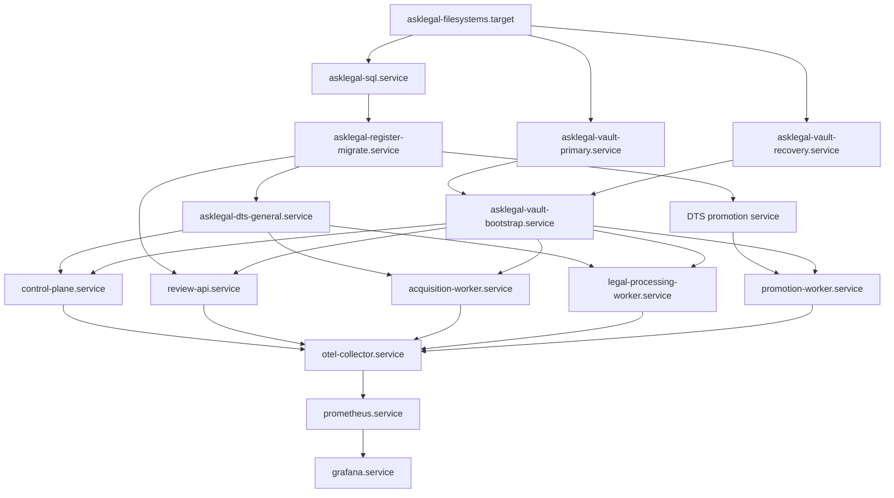

# V1 POC Ubuntu service topology

Status: implementation baseline, 2026-08-17

This document turns the accepted V1 POC products in
`.agent/DECISIONS.md` into one concrete single-host topology. It authorizes
repository design and local validation only. It does not authorize provisioning
the Ubuntu host, creating credentials or Pinecone resources, accessing sources
or providers, deploying applications, or making an external write.

## Fixed boundary

- Development host: macOS only; never required by the running system.
- Runtime host: one Ubuntu 24.04 x86-64 PC, 64 GB RAM, one 5 TB ext4 disk.
- Recovery class: `LOGICALLY_SEPARATE_POC_RECOVERY`.
- External serving copy: one isolated Pinecone Cloud POC project.
- Runtime manager: root-owned `systemd` units. Infrastructure processes use
  digest-pinned containers where an accepted container exists. No operator is
  added to the Docker group.
- Secrets: `systemd-creds` plus `LoadCredentialEncrypted=`; decrypted values
  may exist only as read-only files under a unit's `$CREDENTIALS_DIRECTORY`.
- Default network posture: no public container port and no unrestricted
  outbound route.

## Host paths and ownership

| Path | Owner | Purpose |
|---|---|---|
| `/opt/asklegal/releases/<build-digest>/` | `root:root`, read-only | Exact application release and non-secret configuration |
| `/etc/asklegal/credentials/*.cred` | `root:root`, `0400` | Encrypted systemd credential blobs only |
| `/srv/asklegal/sql/` | SQL container UID, no application write | SQL system/user data and logs on ext4 |
| `/srv/asklegal/vault-primary/{objects,versions,sidecar}/` | `asklegal-vault-primary` | Primary POSIX backend, old versions, and metadata |
| `/srv/asklegal/vault-recovery/{objects,versions,sidecar}/` | `asklegal-vault-recovery` | Recovery POSIX backend, old versions, and metadata |
| `/var/lib/asklegal/{control,review,acquisition,processing,promotion}/` | matching service identity | Bounded non-authoritative local application state |
| `/var/lib/prometheus/` | `prometheus` | Local metric history |
| `/var/lib/grafana/` | `grafana` | Local dashboards and preferences |
| `/var/lib/otelcol/` | `otelcol` | Bounded telemetry queue only |
| `/var/log/journal/` | `root:systemd-journal` | Persistent operational journal with sealing |

Primary and Recovery paths must not be symlinks into each other, share service
accounts, or share buckets. Their physical-device identity is recorded in the
Coverage Status Manifest so the POC never implies disk-independent recovery.

## Identities

Create locked, non-login identities with no shared supplementary group:

```text
asklegal-control
asklegal-review
asklegal-acquisition
asklegal-processing
asklegal-promotion
asklegal-vault-primary
asklegal-vault-recovery
asklegal-otelcol
asklegal-prometheus
asklegal-grafana
```

The SQL engine remains its image-defined non-root identity. One root-owned
bootstrap unit may create databases, migrations, procedure-only roles, vault
buckets/policies, and service credentials, but it is disabled after exact
read-back verification. Applications never receive bootstrap or `sa` authority.

## Container networks and endpoints

All bridges use fixed, repository-declared private subnets selected during host
admission after collision checks. Names and membership are fixed:

| Network | Members | Host publication |
|---|---|---|
| `asklegal-register` | SQL plus all five applications | none |
| `asklegal-scheduler-general` | general DTS, control, acquisition, processing | none |
| `asklegal-scheduler-promotion` | promotion DTS and promotion worker | none |
| `asklegal-vault-primary` | primary gateway; acquisition, processing and promotion; read-only Control and Review access | none |
| `asklegal-vault-recovery` | recovery gateway, acquisition and promotion only | none |
| `asklegal-review` | review API and control plane | private-host listener only |
| `asklegal-telemetry` | OTel Collector, Prometheus, Grafana, all instrumented services | Grafana private-host listener only |
| `asklegal-egress-source` | acquisition plus source allowlist proxy | proxy only |
| `asklegal-egress-model` | processing plus model/embedding allowlist proxy | proxy only |
| `asklegal-egress-promotion` | promotion plus Pinecone allowlist proxy | proxy only |

The SQL endpoint is container-only `1433/tcp`. The already proved DTS image
uses `8080/tcp` and `8082/tcp`; neither dashboard is published outside the host.
The two scheduler instances receive disjoint names and task hubs:

```text
asklegal-dts-general: control, acquisition, legal-processing
asklegal-dts-promotion: promotion
```

The Versity endpoints are distinct container-only names. The primary gateway
serves only `asklegal-primary-evidence`; the recovery gateway serves only
`asklegal-recovery-evidence`. Admin and Web UI listeners are disabled during
ordinary operation. Each bucket has versioning and Object Lock enabled and is
verified by write/read/retention/denial probes before application admission.

The Review and Grafana listeners bind only the admitted private host interface,
never `0.0.0.0`. The Control API has no public listener. Host nftables denies
unsolicited ingress and direct container egress. Capability-specific proxies
permit only the exact admitted DNS names and ports; DNS resolution, redirects,
certificate validation, and resolved-address drift fail closed.

## systemd unit graph



Every long-running unit uses `Restart=on-failure`, bounded start retries,
`NoNewPrivileges=yes`, a read-only root filesystem where supported, explicit
write paths, a restrictive syscall/capability set, resource limits, health
checks, and `LoadCredentialEncrypted=` entries only for its own capabilities.
Units use exact container digests; tags and `latest` are rejected by validation.

Timers are separate one-shot trigger units. They submit idempotent commands to
the Management Register and then signal the general scheduler; they never
contain pipeline business state. At minimum there are ordinary observation,
full-reconciliation, recovery-verification, telemetry-retention, and audit-
archive timers. Exact cadences remain package/source admission values, not host
defaults.

## SQL layout and authority

One engine hosts two isolated databases:

```text
AskLegalPocOperational
AskLegalPocIntegration
```

Each receives the repository's exact forward-only migrations. The five
procedure-only application roles are created independently in each database;
integration credentials cannot address the operational database. SQL health is
not sufficient for readiness: migration fingerprint, procedure grants, ledger
verification, recovery row, and application-role negative tests must pass.

The existing tested SQL Server 2025 CU7 image digest is the initial candidate:

```text
mcr.microsoft.com/mssql/server@sha256:fa0dcf206087759fe6dad4cc02bfa88d97439085e548fbca9039330519c0cf1d
```

It must be re-proved on Ubuntu 24.04 x86-64 with persistent ext4 storage before
admission. No floating tag is accepted.

## Scheduler loss protocol

The already tested emulator candidate is:

```text
mcr.microsoft.com/dts/dts-emulator@sha256:1b49dcf1581168f5c620a4f32083e1291a7dddfa60434acb3eacd8b23355936a
```

For either instance loss:

1. mark its runtime generation unavailable;
2. fence every old execution and lease in SQL;
3. reconcile Command Results, Effect Intents, receipts, projections, and the
   last safe workflow checkpoint;
4. classify indeterminate effects instead of replaying them blindly;
5. start a new scheduler generation and replacement work identity; and
6. report `REPLACEMENT_FROM_SAFE_CHECKPOINT`, never `RESUMED`.

General and promotion scheduler loss is tested independently. Promotion remains
stopped until target, backup, approval, routing, and receipt state reconcile.

## Evidence and recovery protocol

Both gateways use POSIX object, sidecar, and separate versioning directories.
Writes remain manifest-last: upload immutable members, read back and verify
size/SHA-256, then conditionally create the complete manifest. Recovery receives
an independently read-back copy. Object Lock retention and legal-hold behavior
must be tested through the S3 API, including restart and attempted overwrite/
delete denial.

Versity's current POSIX documentation describes versioning as experimental.
Therefore product selection is accepted but operational admission is not: the
exact pinned Versity build must pass the repository's required versioning,
Object Lock, corruption, restart, retention, and manifest-last conformance on
ext4. Failure blocks the vault adapter; it is not waived for the POC.

## Secrets and unresolved credential-interface gate

Credential blobs are encrypted on the Ubuntu host. Provisioning records whether
TPM2 plus host-key or host-key-only encryption was selected. A unit receives
only named files under `$CREDENTIALS_DIRECTORY`; files are not copied into
persistent container volumes. Rotation creates a new encrypted blob, restarts
only dependent units, verifies the new credential, and revokes the old one.

Current official SQL Server container guidance and Versity Gateway interfaces
document passwords/keys through environment variables or command arguments,
not an accepted file-only input. Those interfaces conflict with the fixed POC
secret rule. Implementation must therefore remain disabled until a tested,
vendor-compatible file-credential entrypoint is proved to avoid secrets in
arguments, environment, image metadata, container inspection, logs, and
persistent files. If that cannot be proved without changing upstream behavior,
a user decision is required; the design must not silently weaken the rule.
The evidence, rejected shortcuts, and smallest future executable proof are
recorded in `docs/design/V1_POC_CREDENTIAL_INTERFACE_SPIKE.md`.

## Pinecone boundary

No Pinecone project, key, index, backup, or route is created by this design.
Admission later requires measured corpus size, dimension and metadata limits,
region, cost ceiling, RBAC needs, native backup/restore proof, and the exact
project-specific API hosts. Standard is selected if backup/restore or required
RBAC is unavailable on a lower plan.

Promotion always creates a new date/state-named index generation, uploads only
approved Serving Records, verifies complete inventory and retrieval quality,
freezes routing, and then switches the exact Routing Configuration. It never
rebuilds the currently served index. SQL and vault evidence can reconstruct the
serving copy. Explicit user authorization is required immediately before the
first real Pinecone write.

## Monitoring and audit

Applications emit OTLP only to the local Collector. Prometheus scrapes the
Collector and approved infrastructure exporters. Grafana reads Prometheus and
has no pipeline mutation credential. Journald is persistent, rate-limited,
size-bounded, and forward-secure sealed; secrets and source bodies are filtered
before logging. Loki is absent.

Dashboards and journals are non-authoritative and share the host failure domain.
Authoritative operational audit consists of SQL ledger records, periodically
verified digests, and immutable audit archives copied manifest-last to the
Recovery Vault.

## Incremental implementation and verification plan

1. **Static topology contracts — complete:**
   `infrastructure/poc/topology.json` is the secret-free, disabled-by-default
   machine-readable inventory for services, identities, networks, paths,
   ports, credential reference names, artifacts, schedulers, vaults, audit,
   and Pinecone authority. `tools/v1_poc_topology.py` validates closed schemas
   and membership, digest-only pins, no public listeners, separate vault and
   scheduler identities, exact memory-loss semantics, no secret values, and no
   external-write authorization. It is part of the ordinary developer test
   entrypoint and can be reproduced directly with:

   ```sh
   uv run --frozen --offline --all-packages python tools/v1_poc_topology.py
   uv run --frozen --offline --all-packages pytest -o addopts='' -q \
     tools/tests/test_v1_poc_topology.py
   ```

   A passing design contract does not start a service. Thirteen artifacts
   intentionally remain `PIN_REQUIRED`, and all 16 services remain disabled.
2. **Ubuntu admission harness — policy contract complete; real admission not
   ready:** `infrastructure/poc/host_admission_policy.json` and
   `tools/v1_poc_host_admission.py` define a read-only facts boundary for exact
   Ubuntu/architecture/RAM/disk/ext4, path separation, TPM2-or-host-key
   credential mode, persistent journal sealing, nftables default denial,
   Docker group isolation, and time synchronization. Synthetic conformance
   passes without inspecting or changing a machine. The contract always
   returns `admitted=false` while the three explicit blockers remain:
   credential-interface proof, exact host-package locks, and collision-free
   private-subnet selection. Reproduce the policy proof with:

   ```sh
   uv run --frozen --offline --all-packages python \
     tools/v1_poc_host_admission.py
   uv run --frozen --offline --all-packages pytest -o addopts='' -q \
     tools/tests/test_v1_poc_host_admission.py
   ```

   `tools/v1_poc_collect_host_facts.py` is now the bounded read-only Ubuntu
   collector. It reads only declared OS, memory, disk/path, time, credential-
   mechanism, nftables/listener, journal, and Docker-boundary facts; it never
   reads credential values, provisions a path, or clears a blocker. It refuses
   non-Linux execution and requires an explicit read-only inspection
   acknowledgement:

   ```sh
   uv run --frozen --offline --all-packages python \
     tools/v1_poc_collect_host_facts.py \
     --acknowledge-read-only-host-inspection
   ```

   Its stdout can be preserved as the `--facts` input to
   `tools/v1_poc_host_admission.py`. A missing path, insufficient privilege to
   read nftables, unproved sealing, or absent credential blobs reports a
   failing fact rather than guessing readiness. It is not a provisioning
   script.
3. **Pin registry — inventory contract complete; admission evidence pending:**
   `infrastructure/poc/artifact_admission.json` binds all 16 services to 12
   unique artifacts. The SQL Server and shared DTS emulator candidates have
   immutable digests but require Ubuntu re-proof. Ten artifacts still require
   a product/version/digest selection or reproducible repository build. Every
   artifact remains `admitted=false`; build, pull, push, and enablement
   authority remain false. `tools/v1_poc_artifacts.py` fails closed on topology
   drift, mutable references, incomplete consumers, embedded secrets, false
   admission, or authority expansion. Reproduce it with:

   ```sh
   uv run --frozen --offline --all-packages python tools/v1_poc_artifacts.py
   uv run --frozen --offline --all-packages pytest -o addopts='' -q \
     tools/tests/test_v1_poc_artifacts.py
   ```

   Next resolve immutable digests for Versity, OTel Collector, Prometheus,
   Grafana, the selected egress proxy, exporters, and the five application
   images; then produce SBOM, provenance, vulnerability/licence evidence, and
   two reproducible builds where repository-built images are used.

   The five repository-image inputs are now independently frozen in
   `infrastructure/poc/application_image_inputs.json` and checked by
   `tools/v1_poc_application_images.py`. They bind the exact 19-distribution
   workspace closures, console health checks, service identities and listener
   ports, deterministic lock inputs, Linux amd64 target, and mandatory runtime
   hardening. All remain disabled behind five explicit blockers: base-image
   digest, complete third-party wheelhouse, OCI build definition, real runtime
   configuration adapter, and Ubuntu OCI proof. In particular, current local-
   fake entrypoints are not mislabeled as continuously running V1 adapters.

   `infrastructure/poc/application_runtime_inputs.json` now freezes the next
   process-side boundary for all five applications: exact application and
   service identities, operational database roles, scheduler/task-hub
   ownership, vault access, logical destinations, topology networks,
   listeners, outbound profiles, and the 19 permitted systemd credential
   filenames. `tools/v1_poc_application_runtime.py` checks this inventory
   against the topology and always reports `NOT_READY`; no address, secret,
   adapter, readiness probe, or service is supplied by the contract.

   The shared application-runtime package also has a locally proved
   `SystemdCredentialDirectory` boundary. It accepts only the standard
   absolute non-secret directory path, opens canonical relative names without
   following symlinks, requires one private `0400` regular file, bounds every
   read, and redacts values from errors and representations. This proves
   process-side handling only. Actual `LoadCredentialEncrypted=` delivery into
   each final container, rotation, vendor compatibility, and leak-negative
   inspection still require Ubuntu proof. Reproduce the disabled gate with:

   ```sh
   uv run --frozen --offline --all-packages python \
     tools/v1_poc_application_runtime.py
   uv run --frozen --offline --all-packages pytest -o addopts='' -q \
     tools/tests/test_v1_poc_application_runtime.py
   ```

   The Management Register adapter now has a separate
   `V1MssqlConnectionFactory` for application runtime. It accepts only the
   exact `sql-server:1433` logical endpoint, operational database, and five
   procedure-only application principals. Password bytes become a redacted
   value and are passed only to the pinned driver at connection creation; the
   factory requires `Encrypt=Strict`, rejects server-certificate bypass, uses
   the logical service name as the certificate hostname, bounds login time,
   and converts connection failures to one secret-free code. The historical
   raw connection-string factory remains only for the opt-in synthetic SQL
   integration proof and no longer displays its string in `repr`.

   This secure default creates an honest admission dependency rather than an
   implicit downgrade: the Ubuntu SQL service needs a certificate chain trusted
   by every application image and valid for `sql-server`. Certificate issuance,
   trust-bundle delivery, rotation, expiry, and negative hostname tests remain
   `SQL_SERVER_CERTIFICATE_TRUST`; no certificate was created or selected here.

   The locked Durable Task SDK now has an exact V1 emulator factory. Control,
   acquisition, and legal processing bind only to their distinct hubs at
   `dts-general:8080`; promotion binds only to `promotion` at
   `dts-promotion:8080`; Review is rejected because it has no task hub. The
   private emulator transport has no token and no TLS, so its authority relies
   entirely on the already declared internal container networks. Worker
   construction requires an explicit concurrency profile and never invents
   capacity. Both settings and the runtime inventory preserve `MEMORY_ONLY`
   and `REPLACEMENT_FROM_SAFE_CHECKPOINT` semantics.

   Each application now composes its exact process-side SQL, scheduler, and
   permitted Primary/Recovery S3 vault factories from its own systemd
   credential filenames. This composition opens no connection and remains
   outside the current local-fake entrypoint. Review has no scheduler. The
   topology was also corrected to give Control and
   Review separate read-only Primary Vault credential references and network
   membership, as required by M3 proposal preparation and evidence streaming.
   The locked Boto3 adapter uses explicit credentials, SigV4 path addressing,
   HTTPS with separate CA bundles, conditional create, exact provider versions,
   SHA-256 read-back, COMPLIANCE retention, and legal hold. This grants no real
   vault access: endpoint resolution, trusted certificates, bucket policy,
   real Versity conformance, and negative permission proof remain blocked.

   A shared readiness gate now binds the complete ordered local dependency set
   for every application and enforces per-probe deadlines plus fail-closed safe
   results. SQL has an exact non-mutating `SELECT 1` check; each vault reads
   versioning and Object Lock state. Microsoft troubleshooting guidance supports
   connectivity testing to emulator gRPC port 8080 but documents no
   non-mutating SDK/task-hub health call. The concrete scheduler, telemetry,
   Review/egress, and Ubuntu-host checks therefore remain blocked rather than
   using private SDK internals or creating synthetic orchestration state.

   `infrastructure/poc/systemd_unit_inputs.json` now freezes the disabled unit
   plan for all 16 services, both privileged bootstrap one-shots, and five
   timers without inventing cadences. It binds exact dependencies, identities,
   credential names, write paths, and the common hardening profile. Its checker
   rejects runtime commands, installation/enablement authority, secret values,
   weaker hardening, or graph drift and is part of `tools/dev_test.py`:

   ```sh
   uv run --frozen --offline --all-packages python \
     tools/v1_poc_systemd_units.py
   uv run --frozen --offline --all-packages pytest -o addopts='' -q \
     tools/tests/test_v1_poc_systemd_units.py
   ```

   This contract renders and installs no unit. Six blockers retain artifact
   pins, the container credential bridge and vendor-interface proof, private
   subnets, runtime commands, and real Ubuntu systemd validation.

   `infrastructure/poc/host_identity_inputs.json` separately binds the ten
   accepted non-login host accounts to the 14 topology write paths they own.
   It keeps every numeric UID/GID unallocated and every account uncreated until
   collision-free Ubuntu inspection, container mapping, and ownership read-back
   can be proved:

   ```sh
   uv run --frozen --offline --all-packages python \
     tools/v1_poc_host_identities.py
   uv run --frozen --offline --all-packages pytest -o addopts='' -q \
     tools/tests/test_v1_poc_host_identities.py
   ```

   SQL retains its image-defined identity. DTS and egress services have no host
   write paths and are not falsely represented as created host accounts.

   `infrastructure/poc/credential_interface_proof_inputs.json` freezes the
   executable host spike before any permission is granted. It binds SQL and
   both Versity services to their current artifact selections and systemd
   credential names, six proof steps, seven inspection surfaces, 12 evidence
   classes, rotation/restart, manifest-last capture, and exact named cleanup:

   ```sh
   uv run --frozen --offline --all-packages python -m \
     tools.v1_poc_credential_interface
   uv run --frozen --offline --all-packages pytest -o addopts='' -q \
     tools/tests/test_v1_poc_credential_interface.py
   ```

   Its expected result remains three subjects, six blockers, and zero executed
   proofs. The checked inputs create no credential or host/image authority.

   `infrastructure/poc/v1_admission_gate.json` composes these eight static
   repository gates with the six later real/external/acceptance gates. Its
   checker re-runs every static gate and must continue to report
   `V1_POC_NOT_ADMITTED` until all 14 components have separate evidence and
   authority:

   ```sh
   uv run --frozen --offline --all-packages python -m \
     tools.v1_poc_admission
   uv run --frozen --offline --all-packages pytest -o addopts='' -q \
     tools/tests/test_v1_poc_admission.py
   ```

   The present expected result is eight validated static contracts, 14
   blockers, and `admitted=false`. This aggregate check performs no Ubuntu,
   image, credential, source, model, Pinecone, or service action.
4. **Credential-interface spikes:** prove file-only startup and rotation for SQL
   and both Versity instances. Fail closed before service implementation if a
   plaintext environment/argument/persistent-file path is unavoidable.
5. **Register slice:** start pinned SQL on ext4; create both databases; apply
   migrations; verify roles, concurrency, lost acknowledgement, ledger, digest,
   backup/recovery rows, restart, and integration/operational isolation.
6. **Vault slice:** start independently credentialed Versity gateways; create
   distinct buckets/policies; prove versioning, Object Lock, manifest-last,
   corruption detection, overwrite/delete denial, restart, and exact recovery.
7. **Scheduler slice:** start two pinned memory-only emulators; prove task-hub
   ownership, duplicate/restart behavior, independent failure, fencing, SQL
   reconciliation, and replacement-from-checkpoint reporting.
8. **Application slice:** package and start the five identities with least-
   privilege database/vault/scheduler access. Prove forbidden cross-capability
   calls and that Mac disconnection has no runtime effect.
9. **Observability slice:** admit pinned Collector/Prometheus/Grafana, persistent
   sealed journals, redaction, retention, alerting, and immutable audit export.
10. **Offline full proof:** run M7 plus Ubuntu host failure/restart, scheduler
    loss, same-disk recovery disclosure, credential rotation, network denial,
    and two-database isolation with all remote effects disabled.
11. **External admission:** separately approve official-source, model,
    embedding, and Pinecone profiles. Measure corpus and choose Pinecone plan.
    Stop for credentials and explicit authorization before any real write.
12. **POC acceptance:** build and verify replacement Pinecone indexes, exercise
    routing and rollback, prove recovery and audit evidence, and publish an
    exact limitation report. This is not production admission.

## Evidence used for this topology

- Repository-proved SQL and DTS pins:
  `packages/management-register-adapter/README.md` and
  `packages/durable-task-adapter/README.md`.
- [Microsoft SQL Server 2025 Linux container guidance](https://learn.microsoft.com/en-us/sql/linux/install-upgrade/quickstart-install-docker?view=sql-server-ver17).
- [Microsoft Durable Task Scheduler emulator guidance](https://learn.microsoft.com/en-us/azure/durable-task/scheduler/develop-with-durable-task-scheduler).
- [Microsoft Durable Task SDK connectivity troubleshooting](https://learn.microsoft.com/en-us/azure/durable-task/sdks/durable-task-sdk-troubleshooting).
- [Versity Gateway](https://github.com/versity/versitygw),
  [POSIX backend capability table](https://github.com/versity/versitygw/wiki/POSIX-Backend),
  and [global credential options](https://github.com/versity/versitygw/wiki/Global-Options).
- [Pinecone projects](https://docs.pinecone.io/guides/projects/understanding-projects)
  and [plan/object limits](https://docs.pinecone.io/reference/api/database-limits).
